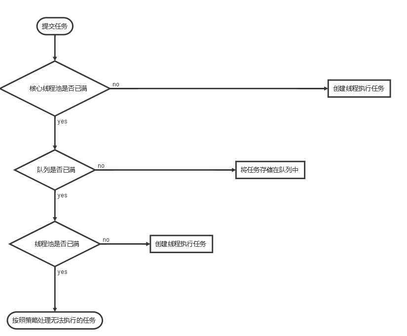
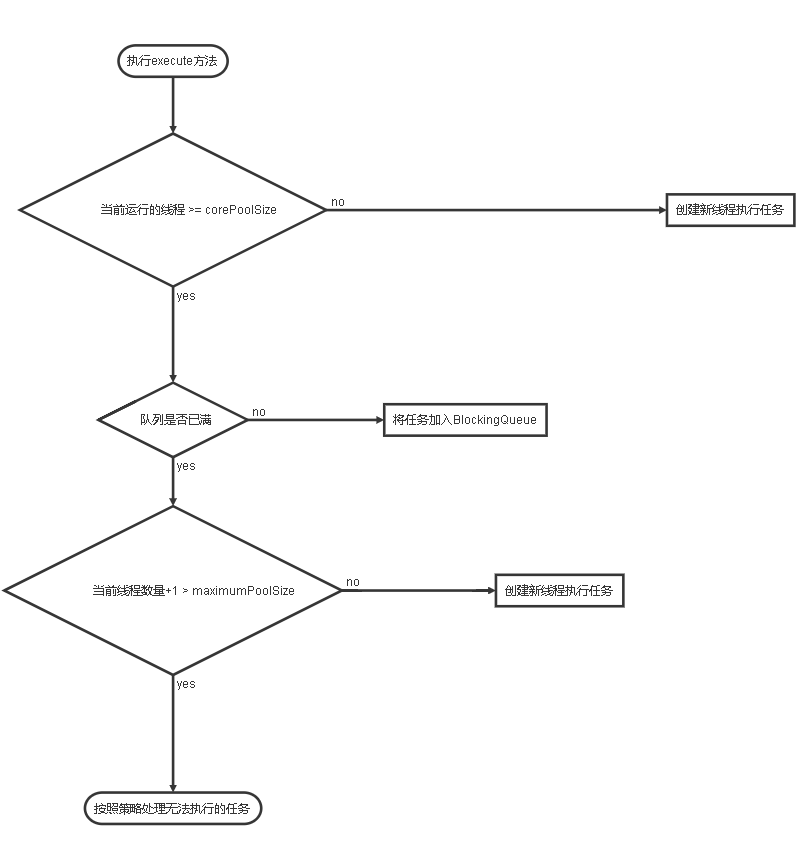
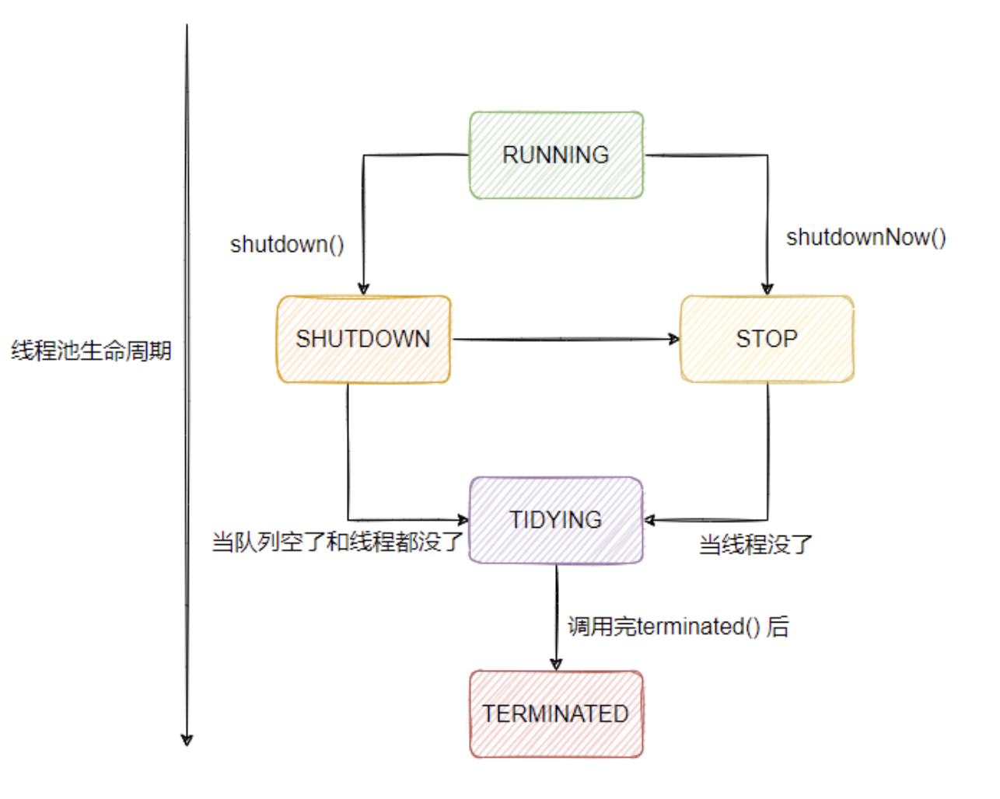

# 阻塞队列（BlockingQueue）

阻塞队列是一个**支持两个附加操作的队列**，这两个操作指：支持**阻塞的<u>插入</u>和<u>移除</u>**:

* 阻塞的插入：当队列满的时候，队列会阻塞插入元素的线程（利用AQS做同步），直到队列不满
* 阻塞的移除：当队列为空的时候，获取元素的线程会等待队列非空。

**阻塞队列常用于生产消费的场景，作为生产者存放元素，消费者获取元素的容器**

> [关于队列，阻塞队列的更多信息](../java集合/collection/queue/introduction.md)

# 1.线程池

## 1.1简介(起因+特点)

使用线程池的原因，在上文中我们说到了使用多线程的好处，以及给性能带来的提升，但是如果服务端程序每接到任务就创建一个线程然后执行，执行完销毁，这在普通请求量的情况下是不会有特别大的问题的。

**如果面对成千上万的请求，这时候就会创建有成千上万的线程随之创建，销毁，这不是一个好的选择，因为线程的创建和销毁都是比较消耗系统资源的，而且带来了频繁的线程间上下文切换（这也是比较影响性能的）。**

> 1. 线程是一个重资源，它的创建和销毁都需要使用到系统调用，这是需要进行从用户态到内核态，内核态再到用户态这样的操作的，这也是一个代价较大的操作，并且线程也是需要占用内存的（我们知道我们每个线程都有自己的私有空间）
> 2. 我们需要知道cpu是有限的，而cpu进行线程调度的时候也是存在开销的，也就是说线程数越多切换的频率越高，可能会造成切换带来的开销远大于，多线程对cpu的更好的利用带来的好处
>    1. 需要保存一个线程的执行上下文便于切回来的时候继续执行
>    2. 需要失效高速缓存等
>
> 所以线程数量需要得到控制，并且尽量能够复用，减少频繁的创建销毁

线程池技术很好的解决了这样的问题，它预先创建一定数量的线程，线程的创建不是由用户控制，而是线程池内部机制控制，在这个前提下，重复使用固定或若干数量的线程来完成任务。这样做的好处是：

* 实现了线程的复用
* 消除了线程的频繁创建和销毁带来的系统资源开销
* 面对过量任务的提交能够平缓的控制执行（流量控制）

## 1.2.原理

### 1.2.1 处理流程



判断任务队列是否已满其实是调用阻塞队列的， `public boolean offer(E e) ` 方法尝试在核心线程满了的情况下，往任务队列中添加任务（无界阻塞队列，总是能成功，有界阻塞队列在，满员情况下会失败），失败就会去根据最大线程数继续创建线程

### 1.2.2 工作线程&闲置策略实现

线程池创建线程时，会将线程封装成工作线程 `Worker` ,` Worker` 在执行完任务之后会循环获取工作队列(BlockingQueue)中的任务来执行。我们看一下`Worker的run()方法,以及工作线程取任务的方法`:

```java
public void run() {
    runWorker(this);
}

final void runWorker(Worker w) {
        Thread wt = Thread.currentThread();
        Runnable task = w.firstTask;
        w.firstTask = null;
        w.unlock(); // 允许中断
        boolean completedAbruptly = true;
        try {
          // getTask() 去 BlockingQueue 获取任务来执行
            while (task != null || (task = getTask()) != null) {
                w.lock();
                // 如果线程池停止，则确保线程中断;
                // 如果没有，检查确保线程不中断. 
                // 这需要在第二种情况下重新检查。在清除中断时立即退出
                if ((runStateAtLeast(ctl.get(), STOP) ||
                     (Thread.interrupted() &&
                      runStateAtLeast(ctl.get(), STOP))) &&
                    !wt.isInterrupted())
                    wt.interrupt();
                try {
                    beforeExecute(wt, task);
                    Throwable thrown = null;
                    try {
                        task.run();// 执行任务
                    } catch (RuntimeException x) {
                        thrown = x; throw x;
                    } catch (Error x) {
                        thrown = x; throw x;
                    } catch (Throwable x) {
                        thrown = x; throw new Error(x);
                    } finally {
                        afterExecute(task, thrown);
                    }
                } finally {
                    task = null;
                    w.completedTasks++;
                    w.unlock();
                }
            }
            completedAbruptly = false;
        } finally {
            processWorkerExit(w, completedAbruptly);
        }
}

private Runnable getTask() {
    boolean timedOut = false; // Did the last poll() time out?

    for (;;) {
        int c = ctl.get();
        int rs = runStateOf(c);

        // Check if queue empty only if necessary.
        if (rs >= SHUTDOWN && (rs >= STOP || workQueue.isEmpty())) {
            decrementWorkerCount();
            return null;
        }
		
        int wc = workerCountOf(c);// 获取当前工作线程数量

        // allowCoreThreadTimeOut 值标识的是，删除闲置线程的策略是否应用到核心线程
        // allowCoreThreadTimeOut = true or 当前工作线程数量 > 核心线程数量，启动删除闲置线程的策略
        boolean timed = allowCoreThreadTimeOut || wc > corePoolSize;
		// timedOut 标识该线程是否闲置
        if ( ( wc > maximumPoolSize || (timed && timedOut ) )
            && ( wc > 1 || workQueue.isEmpty() ) ) {
            if (compareAndDecrementWorkerCount(c))// 减少当前工作线程的数量，该接口返回后，会由processWorkerExit 方法去销毁工作线程
                return null;
            continue;
        }
		// 使用任务队列的 poll(keepAliveTime, TimeUnit.NANOSECONDS) 方法，如果keepAliveTime时间内未获取到任务，那就是该线程闲置keepAliveTime这么长时间没有任务可做了，需要销毁线程 timedOut 标识为true
        try {
            Runnable r = timed ?
                workQueue.poll(keepAliveTime, TimeUnit.NANOSECONDS) :
                workQueue.take();
            if (r != null)
                return r;
            timedOut = true;
        } catch (InterruptedException retry) {
            timedOut = false;
        }
    }
}
```

## 1.3 线程池的使用

###  1.3.1 线程池的创建（ThreadPoolExecutor）

我们可以通过 `ThreadPoolExecutor` 提供的几个构造方法去创建线程池，由于最终调用的都是一个方法，这里我们就介绍这个最主要的方法：

```java
public ThreadPoolExecutor(int corePoolSize,
                          int maximumPoolSize,
                          long keepAliveTime,
                          TimeUnit unit,
                          BlockingQueue<Runnable> workQueue,
                          ThreadFactory threadFactory,
                          RejectedExecutionHandler handler){
                           
  ........
    
                          }
```

* `int corePoolSize ` : 线程池的基本线程数量大小，当有任务提交的时候（详细流程在16.3.1节），只要当前线程数量<corePoolSize，那就会创建一个新的工作线程来执行任务。

* `int maximumPoolSize `: 线程池最大工作线程数量，如果workQueue队列满了（前提肯定是当前线程池工作线程数量>=corePoolSize）,这时候线程池会创建新的工作线程来执行任务，**注意：如果下面的参数workQueue使用的是无界队列（也就是队列不会满）那么这个参数自然就没有作用了**

* `long keepAliveTime `: 当前有多于` corePoolSize` 的线程，则这些多出的线程在空闲时间超过 `keepAliveTime` 时将会终止，**如果每个任务的执行时间比较短，可以调大时间提高线程的利用率**，

  **默认情况下，保持活动策略只作用于核心线程以外的线程。但是只要 keepAliveTime 值大于 0，调用`allowCoreThreadTimeOut(true) ` 方法也可将此超时策略应用于核心线程，通常应该在使用该池前主动调用此方法。**

  原理是底层代码使用了，阻塞队列得`E poll(long timeout, TimeUnit unit)    throws InterruptedException` 这个方法，如果任务队列中超过该时间没有任务的话，那就重线程池得workers队列中移除该线程

* `TimeUnit unit` : 这个参数就是上面参数的时间单位了：

  * TimeUnit .DAYS(天)；
  * TimeUnit .HOURS(小时);
  * TimeUnit .MINUTES(分钟)
  * TimeUnit .SECONDS(秒)
  * TimeUnit .MILLISECONDS(毫秒=1/1000 秒)
  * TimeUnit .MICROSECONDS(微秒=1/1000 毫秒）
  * TimeUnit .NANOSECONDS（纳秒=1/1000 微秒)

* `BlockingQueue<Runnable> workQueue` : 任务队列，用于保存等待执行的任务的阻塞队列，可选择的有

  * `ArrayBlockingQueue`
  * `LinkedBlockingQueue`
  * `SynchronousQueue`
  * `PriorityBlockingQueue`
  * 等等

  更多队列以及使用这些队列的优缺点请看 [关于队列中的阻塞队列的更多信息](../java集合/collection/queue/introduction.md)

* `ThreadFactory threadFactory`: 线程的创建工厂，建议使用 ，因为在调优或则排查问题的时候，可以很好的监控到对应的线程的状态。

* `RejectedExecutionHandler handler` : 当线程池的线程数量达到最大，队列也满了的时候，这时候这个参数就起作用了，默认是使用`Abortpolicy`,jdk 1.5 中线程池框架提供了4种策略：

  * `DiscardPolicy `: 当线程池的线程数量达到最大，队列也满了的时候，如果有新任务进来，不处理直接丢弃。
  
  * `Abortpolicy` : 当线程池的线程数量达到最大，队列也满了的时候，如果有新任务进来，直接抛出异常
  
  * `CallerRunsPolicy` : 当线程池的线程数量达到最大，队列也满了的时候，如果有新任务进来，只使用调用者所在的线程来运行任务
  
  * `DiscardOldestPolicy` : 当线程池的线程数量达到最大，队列也满了的时候，如果有新任务进来，丢弃队列中头部的一个任务()，并`execute`当前任务
  
    ```
    e.getQueue().poll();
    e.execute(r);
    ```
  
    

### 1.3.2 向线程池提交任务

方式分别为：

* `void execute(Runnable runnable)` : 该方法提交不需要返回值的任务

后面的这几个方法都会被包装成`FutureTask`

* `<T> Future<T> submit(Callable<T> task)` : 

  ```java
  public <T> Future<T> submit(Callable<T> task) {
      if (task == null) throw new NullPointerException();
      RunnableFuture<T> ftask = newTaskFor(task);
      execute(ftask);
      return ftask;
  }
  ```

* `<T> Future<T> submit(Runnable task, T result)` : 

  ```java
  public <T> Future<T> submit(Runnable task, T result) {
      if (task == null) throw new NullPointerException();
      RunnableFuture<T> ftask = newTaskFor(task, result);
      execute(ftask);
      return ftask;
  }
  ```

* `Future<?> submit(Runnable task)` : 

  ```java
  public Future<?> submit(Runnable task) {
      if (task == null) throw new NullPointerException();
      RunnableFuture<Void> ftask = newTaskFor(task, null);
      execute(ftask);
      return ftask;
  }
  ```


### 1.3.3  ThreadPoolExecutor 执行 execute() /submit()方法流程



注意上面的步骤中，**创建新工作线程需要获取全局锁**，`ThreadPoolExecutor` 采取上述步骤的总体设计思路，是为了在  执行`execute()`方法的时候尽可能避免获取全局锁（因为这是一个严重的性能影响点），当 `ThreadPoolExecutor`完成`corePoolSize`的预热之后，几乎所有的`execute()`方法都在执行加入`BlockingQueue`队列这一步骤，这样就避免了获取全局锁

### 1.3.4 关闭线程池

线程池的关闭有两个方法，他们原理都是遍历线程池中的工作线程，然后逐一调用线程的`interrupt`方法中断线程，下面介绍他们的分别介绍：

* `void shutdown()` :  只是将线程池设置为`shutdown`状态，然后中断所有非正在执行任务的线程，也就是说正在执行任务的线程不会立刻中断，会在执行玩任务之后，根据`shutdown`这个状态中断。

  实现原理是每一个工作队列都继承了AQS,也就是它本身具有锁的功能

  ```java
  private final class Worker
      extends AbstractQueuedSynchronizer
      implements Runnable
  {
      /**
       * This class will never be serialized, but we provide a
       * serialVersionUID to suppress a javac warning.
       */
      private static final long serialVersionUID = 6138294804551838833L;
  
      /** Thread this worker is running in.  Null if factory fails. */
      final Thread thread;
      /** Initial task to run.  Possibly null. */
      Runnable firstTask;
      /** Per-thread task counter */
      volatile long completedTasks;
  
      /**
       * Creates with given first task and thread from ThreadFactory.
       * @param firstTask the first task (null if none)
       */
      Worker(Runnable firstTask) {
          setState(-1); // inhibit interrupts until runWorker
          this.firstTask = firstTask;
          this.thread = getThreadFactory().newThread(this);
      }
  
      /** Delegates main run loop to outer runWorker  */
      public void run() {
          runWorker(this);
      }
  
      // Lock methods
      //
      // The value 0 represents the unlocked state.
      // The value 1 represents the locked state.
  
      protected boolean isHeldExclusively() {
          return getState() != 0;
      }
  
      protected boolean tryAcquire(int unused) {
          if (compareAndSetState(0, 1)) {
              setExclusiveOwnerThread(Thread.currentThread());
              return true;
          }
          return false;
      }
  
      protected boolean tryRelease(int unused) {
          setExclusiveOwnerThread(null);
          setState(0);
          return true;
      }
  
      public void lock()        { acquire(1); }
      public boolean tryLock()  { return tryAcquire(1); }
      public void unlock()      { release(1); }
      public boolean isLocked() { return isHeldExclusively(); }
      
  //     .........其他代码省略......... 
  }
  ```

  **shutdown 相关代码**

  ```java
  public void shutdown() {
      final ReentrantLock mainLock = this.mainLock;
      mainLock.lock();
      try {
          checkShutdownAccess();
          advanceRunState(SHUTDOWN);
          interruptIdleWorkers();// interrupt 在这做的
          onShutdown(); // hook for ScheduledThreadPoolExecutor 会用到这个方法
      } finally {
          mainLock.unlock();
      }
      tryTerminate();
  }
  private void interruptIdleWorkers() {
      interruptIdleWorkers(false);
  }
  private void interruptIdleWorkers(boolean onlyOne) {
      final ReentrantLock mainLock = this.mainLock;
      mainLock.lock();
      try {
          for (Worker w : workers) {
              Thread t = w.thread;
               // 从这就可以看出要interrupt,Worker 必须要尝试获取锁，而worker在执行任务的时候是不是释放锁的
              if (!t.isInterrupted() && w.tryLock()) {
                  try {
                      t.interrupt();
                  } catch (SecurityException ignore) {
                  } finally {
                      w.unlock();
                  }
              }
              if (onlyOne)
                  break;
          }
      } finally {
          mainLock.unlock();
      }
  }
  ```

  ```java
  final void runWorker(Worker w) {
      Thread wt = Thread.currentThread();
      Runnable task = w.firstTask;
      w.firstTask = null;
      w.unlock(); // allow interrupts 任务未开始允许interrupt
      boolean completedAbruptly = true;
      try {
          while (task != null || (task = getTask()) != null) {
              w.lock(); // 获取到任务要开始执行了，获取锁，不允许interrupt
              // If pool is stopping, ensure thread is interrupted;
              // if not, ensure thread is not interrupted.  This
              // requires a recheck in second case to deal with
              // shutdownNow race while clearing interrupt
              if ((runStateAtLeast(ctl.get(), STOP) ||
                   (Thread.interrupted() &&
                    runStateAtLeast(ctl.get(), STOP))) &&
                  !wt.isInterrupted())
                  wt.interrupt();
              try {
                  /* 执行前任务前要做的事，比如HadoopScheduledThreadPoolExecutor 这个是Hadoop
                   * 的一个schedule 线程池，就是继承了基础线程池，实现了该方法，基础线程池本身未对这个
                   * 方法知识做了空实现
                   */
                  beforeExecute(wt, task);
                  Throwable thrown = null;
                  try {
                      task.run();
                  } catch (RuntimeException x) {
                      thrown = x; throw x;
                  } catch (Error x) {
                      thrown = x; throw x;
                  } catch (Throwable x) {
                      thrown = x; throw new Error(x);
                  } finally {
                      afterExecute(task, thrown);
                  }
              } finally {
                  task = null;
                  w.completedTasks++;
                  w.unlock();// 任务执行完成，允许interrup
              }
          }
          completedAbruptly = false;
      } finally {
          // 没有任务处理的时候，处理worker，exit相关操作，比如销毁闲置线程
          processWorkerExit(w, completedAbruptly);
      }
  }
  ```

* ` List<Runnable> shutdownNow()` : 首先将线程池状态设置为`stop`,然后尝试停止所有正在执行或暂停任务的线程，并且返回未执行的任务的列表

只要调用上诉两个方法，调用`isShutdown()`方法返回的都是`true`

当所有的线程都关闭之后调用`isTerminated()`方法会返回`true`

## 1.4 Executor  框架详解

### 1.4.1 Executor 框架

Executor 框架有三大部分组成：

* 任务：实现`Runnable`或`Callable`接口的类

* 任务的执行：

  * 包括任务执行机制的核心接口`Executor`,它是Executor框架的基础，他将任务的提交和执行分离。
  * 以及继承自`Executor`的`ExecutorService`接口，

  Executor框架有两个关键的实现类，他们实现了`ExecutorService` 接口 :

  * `ThreadPoolExecutor` : 是线程池的核心实现类，用来执行被提交的任务。具体细节 16.3节已经做过介绍
  * `ScheduledThreadPoolExecutor` : 可以在给定的延迟后运行任务，或则定期执行任务（定时任务），他比`Timer`更加灵活且强大。

* 异步计算的结果：

  * 包括 `Future`接口
  * 实现 `Future`接口的 `FutureTask`类

### 1.4.2 ScheduledThreadPoolExecutor详解

它主要用来在给定的延迟后运行任务，或则定期执行任务（定时任务），他比`Timer`更加灵活且强大。

`ScheduledThreadPoolExecutor`线程池创建继承了父类 `ThreadPoolExecutor` 的构造方法,不过内部使用了无界队列 `DelayQueue`，因为使用了无界队列，所以自然饱和策略以及`maximumPoolSize `参数自然就没有了意义，他的线程数量最多就只能到`corePoolSize`,所以我们可以看到`Executors`工厂类创建这种类型的线程池的方法只需要传入`corePoolSize`以及 `ThreadFactory`。

**`ScheduledThreadPoolExecutor`的创建**：

* 使用他的构造方法创建
* 使用`Executors`工厂类来创建（一般都使用这个，`Executors`工厂类不止是用来创建这个的，还有很多作用，想了解的自己去看API）

**构造方法**

```java
public ScheduledThreadPoolExecutor(int corePoolSize,
                                   ThreadFactory threadFactory,
                                   RejectedExecutionHandler handler) {
    super(corePoolSize, Integer.MAX_VALUE, 0, NANOSECONDS,
          new DelayedWorkQueue(), threadFactory, handler);
}
```

**通过它的构造方法也能看出，它除了核心线程意外的线程，在没有任务的时候会被直接销毁，因为闲置时间=0. allowCoreThreadTimeOut(true) 这个方法的调用就需要谨慎选择**

**`ScheduledThreadPoolExecutor`的执行**：

* 当调用他的`scheduleAtFixedRate()`/`scheduleWithFixedDelay()`方法时，会向他的`DelayQueue`队列增添一个实现了`RunnableScheduledFuture接口的SchduleFutureTask`对象。（你传入参数之后，方法内部实例化这样的类实例）
* 线程池中的线程从`DelayQueue`中 获取`ScheduleFutureTask`，然后执行任务。

**`ScheduleFutureTask` 主要包含三个成员变量**：

* `long time`: 标识这个任务将要被执行的具体时间。
* `long sequenceNumber`: 表示这个任务被添加到`ScheduleThreadPoolExecutor`中的序号
* `long period`: 表示任务执行的间隔周期

**由于`ScheduleThreadPoolExecutor`内部使用的`内置的DelayedWorkQueue` 延迟队列存储任务，代码逻辑上和 `DelayQueue` 差不多也是使用最小堆来实现的，堆的实现代码也是一样的就不做详细的介绍的** 

* `time` 小的排在前面

* `time` 相同，就比较 `sequenceNumber`,`sequenceNumber`小的排在前面（也就是如果两个任务执行时间相同，那么先提交的优先执行）

  ```java
  public int compareTo(Delayed other) {
      if (other == this) // compare zero if same object
          return 0;
      if (other instanceof ScheduledFutureTask) {
          ScheduledFutureTask<?> x = (ScheduledFutureTask<?>)other;
          long diff = time - x.time;
          if (diff < 0)
              return -1;
          else if (diff > 0)
              return 1;
          else if (sequenceNumber < x.sequenceNumber)// time相同的 按照sequenceNumber排序
              return -1;
          else
              return 1;
      }
      long diff = getDelay(NANOSECONDS) - other.getDelay(NANOSECONDS);
      return (diff < 0) ? -1 : (diff > 0) ? 1 : 0;
  }
  ```

 **更多的其他工具后续补充**

## 1.5 线程池的监控

如果在系统中大量使用线程池，则有必要对线程池进行监控，方便在出现问题时，可以根
据线程池的使用状况快速定位问题。可以通过线程池提供的参数进行监控，在监控线程池的
时候可以使用以下属性。

* taskCount：线程池需要执行的任务数量。
* completedTaskCount：线程池在运行过程中已完成的任务数量，小于或等于taskCount。
* largestPoolSize：线程池里曾经创建过的最大线程数量。通过这个数据可以知道线程池是
  否曾经满过。如该数值等于线程池的最大大小，则表示线程池曾经满过。
* getPoolSize：线程池的线程数量。如果线程池不销毁的话，线程池里的线程不会自动销
  毁，所以这个大小只增不减。
* getActiveCount：获取活动的线程数。

通过扩展线程池进行监控。可以通过继承线程池来自定义线程池，重写线程池的 beforeExecute、afterExecute和terminated方法，也可以在任务执行前、执行后和线程池关闭前执行一些代码来进行监控。例如，监控任务的平均执行时间、最大执行时间和最小执行时间等。这几个方法在线程池里是空方法。

## 1.6 线程池参数动态调整

ThreadPoolExecutor提供了让我们动态调整线程池参数的方法

* threadPoolExecutor.setCorePoolSize(int corePoolSize); 设置核心线程数

* threadPoolExecutor.setMaximumPoolSize(int maximumPoolSize)  设置最大线程数

* threadPoolExecutor.setKeepAliveTime(long time, TimeUnit unit)  设置线程最大闲置是时间；超时之后非核心线程将被销毁；如果需要将销毁策略应用到核心线程需要调用 threadPoolExecutor.allowCoreThreadTimeOut 方法

* threadPoolExecutor.allowCoreThreadTimeOut(boolean value) 是否将闲置超时销毁策略应用到核心线程层

* threadPoolExecutor.setRejectedExecutionHandler(RejectedExecutionHandler handler)  调整拒绝策略

* threadPoolExecutor.setThreadFactory(ThreadFactory threadFactory) 调整线程工厂

  

有了这些方法我们可以通过组合配置中心的功能实现对线程的参数的动态修改：大多数时候我们由于没办法很好的评估一个业务使用的线程池的哥哥参数的实际大小而头痛，那么有着这个工具之后，我们可以结合我们对线程池的监控在线上动态调整线程池参数，而不需要去修改代码重新发布

## 1.7 合理配置线程池

前面我们知道了线程池的运行状况可监控，同时参数可以在线动态调整（热部署），不需要重启服务，下面我们来看看线程池怎么设置

**我们的任务分为：**

* **CPU密集型任务：**

  IO密集型任务线程并不是一直在执行任务，则应配 置尽可能多的线程，如2*Ncpu

* **IO密集型任务：**

  这样的任务IO等待的时间会比较长，这时候cpu的闲置情况就比较多，所以应该配置更多的线程来执行任务，更好的利用CPU 

  CPU密集型任务应配置尽可能小的线程，如配置Ncpu+1个线程的线程池。因为线程通常是不会因为IO造成的阻塞而浪费cpu资源的

* **混合型任务：**

  真实环境大多是混合型任务，但是混合型任务，我们也是有偏向性的，有的IO操作会多一些，有的cpu使用效率会更高一些，但是都是单纯的IO操作占有绝对的大头或cpu密集任务占有绝对的大头，

  这时候我们可以对其进行拆分，然后再区别对待

> 可以通过 Runtime.getRuntime().availableProcessors()方法获得当前设备的CPU个数。

**同时实际的使用中我们在设置线程池的线程数的时候需要参考**

1. **任务处理时间（avg time ）**，比如你增加了过多的线程，由于线程切换反而造成了任务处理时间增加，给到用户的体验就是延迟增加
2. **cpu 使用情况**，过高的线程虽然能承接更多的请求，但是也可能造成cpu负载过高，一般我们到每个核心80%的利用率足以，再高就需要考虑水平扩容了，避免因为cpu 超过负载导致系统挂掉
3. **内存使用情况等综合考虑**，线程数越多会占用更多内存，同时处理的任务越多也是会占用更多内存的，二我们的物理机的内存是有限的

**在了解了上面的一些基础理论经验之后，我们来看一下时间场景下我们怎么做，我说一下我这边的做法**

通常我都是针对任务的类型，IO操作比较多，还是内部的处理比较多然后来做一个基础判断，如果IO占比更多一些，我会设置2*cpu的core poll size 数量，然后max poll size = 4*cpu , 任务队列缓冲大小则简单的设置100，拒绝策略会根据业务的性质选择，如果是很核心的任务，那就让任务走到使用本身线程执行的逻辑，同时报警。其他拒绝策略我也会告警 **用来提高预警能力**

> **建议使用有界队列。有界队列能增加系统的稳定性和预警能力**

如果和核心服务的业务在上线前就会经过简单的压测，然后通过监控的一些时间点的快照（每20s）：**线程池中的线程池数量**，**活跃线程数量**，**历史最大线程数量**，**队列中任务量** ，**单个任务的平均处理时间**等来进行评估，然后**在线热修改线程池的相关配置**

**线程数量调整：**

1. **比如我们发现通常线程中长期活跃的线程数是a，那么就可以将其作为依据调整 core poll size** 

   **比如：如果出现多个监控点活跃线程数都是趋近一个值的时候我们没必要取平均选择这个范围内最大的设置即可**

2. **历史最大线程数量都没有我们初期设置的最大线程数量大，这个其实就可以不用调整**

3. **如果发现有执行到拒绝策略并告警的时候，说明我们的最大线程数设置的不够，需要调整，并且也需要去进行1的观察，调整核心线程数**

**空闲时间回收线程的调整：**

1. 比如我们通过监控发现 线程池大多数时候都是在核心线程数以内运行，然后会存在每隔20s会超过一次核心线程数的情况，这时候我们就可以将空闲回收时间设置成为20s+, 这样可以更好的利用超过的线程处理超过核心线程处理能力的任务 
2. 反之

**还有就是很重要的我们在调整了这些数据之后，我们需要观察我们的cpu, 内存，任务执行耗时等情况如**

* 如果发现因为线程数过多导致，cpu使用超过我们定义的阈值80%，那么应该采用的是水平扩容而不是简单的增加过多的线程，当然如果此时发现内存还有很多的话，也可以调整队列大小，然后减少线程数量来处理
* 同理内存也是一样的
* 执行耗时方面如果增加的耗时是在可接受范围，那么不需要做什么处理，如果耗时增加得较多，还是得考虑水平扩容

**优先级不同的任务可以使用优先级队列PriorityBlockingQueue来处理。它可以让优先级高**
**的任务先执行。**

但是使用优先级队列会遇到一个问题：如果一直有优先级高的任务提交到队列里，那么优先级低的任务可能永远不能执行。

# 后续补充

https://mp.weixin.qq.com/s/NDOx94yY06OnHjrYq2lVYw

## 线程池预热

**如果我们明确的知道我们的业务会有频繁的任务，那么我们最好直接做线程池预热，这样可以避免lazy创建造成的初期处理耗时增加问题，不然很可能在一些业务场景下我们服务重启的时候造成调用方出现超时异常**

- prestartCoreThread：启动一个核心线程
- prestartAllCoreThreads ：启动所有核心线程

## jdk 源码中线程池的ctl原子AtomicInteger的作用是

1. 低29位记录线程池中的工作的线程的数量
2. 高三位存放的是线程池当前状态

> https://mp.weixin.qq.com/s/NDOx94yY06OnHjrYq2lVYw

## 线程池有几种状态

- RUNNING：能接受新任务，并处理阻塞队列中的任务
- SHUTDOWN：不接受新任务，但是可以处理阻塞队列中的任务
- STOP：不接受新任务，并且不处理阻塞队列中的任务，并且还打断正在运行任务的线程，就是直接撂担子不干了！
- TIDYING：所有任务都终止，并且工作线程也为0，处于关闭之前的状态
- TERMINATED：已关闭。

## 线程池状态变迁



## 为什么要把任务先放在任务队列里面，而不是把线程先拉满到最大线程数？

在 tps( tasks per Second ) 并没有太多的超过我们的核心线程处理能力的时候，我们是不需要创建更多的线程的，我们上文说过，线程的创建销毁，以及线程过多都是有代价的，创建更多的线程处理任务不一定带来更高的收益

实际的使用中我们在设置线程池的线程数的时候需要参考

1. 任务处理时间（avg time ），比如你增加了过多的线程，由于线程切换反而造成了任务处理时间增加，给到用户的体验就是延迟增加
2. cpu 使用情况，过高的线程虽然能承接更多的请求，但是也可能造成cpu负载过高，一般我们到每个核心80%的利用率足以，再高就需要考虑水平扩容了，避免因为cpu 超过负载导致系统挂掉
3. 内存使用情况等综合考虑，线程数越多会占用更多内存，同时处理的任务越多也是会占用更多内存的，二我们的物理机的内存是有限的

机遇上面的三点，通常我们在IO密集型任务中一开始给到一个和

会通过线程

## 如果采用push的方式实现线程池会遇到哪些问题？


