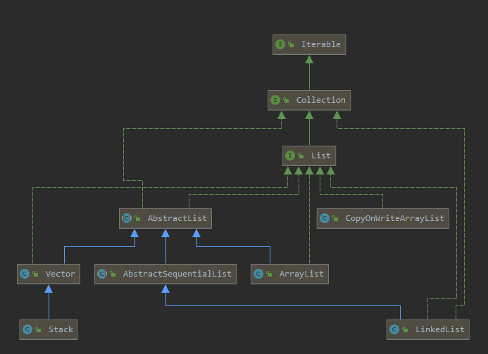

# List在java中的整体结构图

# List接口介绍

- **non thread safety** 

  - [ArrayList]：基于动态数组实现，支持随机访问。

  - [LinkedList]：基于双向链表实现，只能顺序访问，但是可以快速地在链表中间插入和删除元素。不仅如此，LinkedList 还可以用作栈、队列和双向队列。
  - [Stack]

- **thread safety**

  - [CopyOnWriteArrayList]
  - Vector：和 ArrayList 类似，但它是线程安全的。