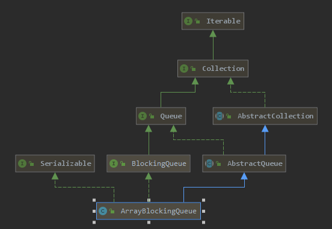

# Introduction



基于数组结构，采用循环数组的方式实现的

* **有界阻塞队列**
* **按照FIFO（先进先出）原则对元素进行处理，**
* **默认情况不保证线程公平访问队列**，构造函数`public ArrayBlockingQueue(int capacity, boolean fair)`fair 传入true**可以指定公平访问。**

阻塞队列主要的使用方法主要是 `take`,`put`,`E poll(long timeout, TimeUnit unit) `,`boolean offer(E e, long timeout, TimeUnit unit)` 这样一些方法，其中 线程池的实现中会用到我们阻塞队列的 `public boolean offer(E e) ` 尝试在核心线程满了的情况下，往任务队列中添加任务，失败就会去根据最大线程数继续创建线程

 `E poll(long timeout, TimeUnit unit) ` 方法，是我们线程池实现，闲置线程回收的基石,, 

# queue主体代码

```java
public class ArrayBlockingQueue<E> extends AbstractQueue<E>
        implements BlockingQueue<E>, java.io.Serializable {
  	/** The queued items */
    final Object[] items;

    /** items index for next take, poll, peek or remove 作为循环索引*/
    int takeIndex;

    /** items index for next put, offer, or add 作为循环索引*/
    int putIndex;

    /** Number of elements in the queue */
    int count;

    /*
     * Concurrency control uses the classic two-condition algorithm
     * found in any textbook.
     */

    /** Main lock guarding all access */
    final ReentrantLock lock;

    /** Condition for waiting takes */
    private final Condition notEmpty;

    /** Condition for waiting puts */
    private final Condition notFull;

    /**
     * Shared state for currently active iterators, or null if there
     * are known not to be any.  Allows queue operations to update
     * iterator state.
     */
    transient Itrs itrs = null;
    
    public ArrayBlockingQueue(int capacity, boolean fair) {
        if (capacity <= 0)
            throw new IllegalArgumentException();
        this.items = new Object[capacity];
        lock = new ReentrantLock(fair);
        notEmpty = lock.newCondition();
        notFull =  lock.newCondition();
    }
}
```

# take()

```java
public E take() throws InterruptedException {
    final ReentrantLock lock = this.lock;
    lock.lockInterruptibly();
    try {
        while (count == 0)
            notEmpty.await();// 队列中没数据了，阻塞等待
        return dequeue();// 获取并移除队首数据
    } finally {
        lock.unlock();
    }
}

private void enqueue(E x) {
        // assert lock.getHoldCount() == 1;
        // assert items[putIndex] == null;
        final Object[] items = this.items;
        items[putIndex] = x;// 队尾插入数据
        if (++putIndex == items.length)// putIndex 移动（循环数组）
            putIndex = 0;
        count++;// 计数+1
        notEmpty.signal();// 唤醒 take 处等待的线程
    }
```

# Put()

```java
public void put(E e) throws InterruptedException {
    checkNotNull(e);
    final ReentrantLock lock = this.lock;
    lock.lockInterruptibly();
    try {
        while (count == items.length)
            notFull.await();// 容量满了，等待
        enqueue(e);// 队尾插入数据
    } finally {
        lock.unlock();
    }
}

private E dequeue() {
    // assert lock.getHoldCount() == 1;
    // assert items[takeIndex] != null;
    final Object[] items = this.items;
    @SuppressWarnings("unchecked")
    E x = (E) items[takeIndex];//获取队首数据
    items[takeIndex] = null;// 删除队首数据
    if (++takeIndex == items.length)// takeIndex 移动（循环数组）
        takeIndex = 0;
    count--;// 计数-1
    if (itrs != null)
        itrs.elementDequeued();
    notFull.signal();// 唤醒 put 方法处被阻塞的线程
    return x;
}
```

# boolean offer(E e)

```java
public boolean offer(E e) {
    checkNotNull(e);
    final ReentrantLock lock = this.lock;
    lock.lock();
    try {
        if (count == items.length)// 队列已满，那就直接失败
            return false;
        else {
            enqueue(e);// 添加元素
            return true;
        }
    } finally {
        lock.unlock();
    }
}
```

# E poll(long timeout, TimeUnit unit) 

```java
public E poll(long timeout, TimeUnit unit) throws InterruptedException {
    long nanos = unit.toNanos(timeout);
    final ReentrantLock lock = this.lock;
    lock.lockInterruptibly();
    try {
        while (count == 0) {
            if (nanos <= 0)
                return null;
            nanos = notEmpty.awaitNanos(nanos);// 限时阻塞
        }
        return dequeue();
    } finally {
        lock.unlock();
    }
}
```

# 和 LinkedBlockingQueue 相比

**ArrayBlockingQueue的优缺点**：

* **优点**：空间预非配（有界数组，需要先指定容量大小），相比链表实现，减少了创建对象带来的性能损耗，内

  存连续，对内存的使用更友好，不容易造成内存碎片

* **相比LinkedBlockingQueue的缺点**：ArrayBlockingQueue 使用一把锁同步了所有操作，吞吐量相比 LinkedBlockingQueue 低  

**LinkedBlockingQueue优缺点**：

* **缺点**：相比来说，新增数据需要频繁的新建对象。会带来损耗，使用了双锁，也就意味着 队列的count存在 并发问题，所以要使用 AtomicInteger 来保证线程间的可见性，
* **优点**：采用双锁，实现put,take并发执行，不仅弥补了链表的创建对象的时间损耗，同时大大的提高了并发性能，相比ArrayBlockingQueue的 吞吐量更高

# ArrayBlockingQueue 可以采用双锁实现吗？

ArrayBlockingQueue 可以采用双锁实现吗？ 答案是可以，如果采用双锁实现的话需要对结构做一些修改

```java
  final Object[] items;

    /** items index for next take, poll, peek or remove */
    int takeIndex;

    /** items index for next put, offer, or add */
    int putIndex;

    /** Number of elements in the queue */
    AtomicInteger count;

    /*
     * Concurrency control uses the classic two-condition algorithm
     * found in any textbook.
     */

    /** Main lock put all access */
    final ReentrantLock putlock;
	/** Condition for waiting puts */
    private final Condition notFull;	
	
	 /** Main lock take all access */
    final ReentrantLock takelock;
    /** Condition for waiting takes */
    private final Condition notEmpty;

```

这样实现的代价

1. 代码复杂度
2. count需要使用AtomicInteger 实现，也就是 volatile + CAS 自旋 ，这个会有性能损耗
3. take 的时候要使用notFull.Singall唤醒 put操作被等待的线程的时候，需要先去获取putlock，同理put操作也是类似的，再看我们的同步队列使用场景，是生产消费模型，take 需要获取 putLock, put 需要 获取takeLock,生产消费线程数量越接近相等的情况，那么相互竞争锁的程度会越来越激烈，那么该实现相对于原来的实现，性能提升效果也就越不明显。