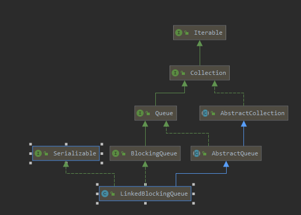

# Introduction



一个基于单链（只有next指针）链表结构实现的 **可指定阈值的有界阻塞队列，按照FIFO（先进先出）原则对元素进行处理,吞吐量通常要高于`ArrayBlockingQueue`，队列的默认长度和最大长度都是`Integer.MAX_VALUE`**

由于代码逻辑比较简单，这里节介绍一些主体的代码，以及take,put两个方法

# queue主体代码

队列节点使用next指针连接，由于是**双锁**，所以**count队列元素计数器使用了 AtomicInteger 来实现线程间的可见，以及并发安全，并且双锁的协调也是有这个字段来提供通信的。**双锁主要用来使得 take,put 这样的操作能够并行，提升队列的并发度，以提升队列的整个吞吐性能，

需要注意的是，他的 head 不存储元素，实际的元素是从head.next 开始存储的

```java
public class LinkedBlockingQueue<E> extends AbstractQueue<E>
        implements BlockingQueue<E>, java.io.Serializable {
    
    static class Node<E> {
        E item;

        /**
         * One of:
         * - the real successor Node
         * - this Node, meaning the successor is head.next
         * - null, meaning there is no successor (this is the last node)
         */
        Node<E> next;

        Node(E x) { item = x; }
	}
    
    
     /** The capacity bound, or Integer.MAX_VALUE if none */
    private final int capacity;

    /** Current number of elements */
    private final AtomicInteger count = new AtomicInteger();

    /**
     * Head of linked list.
     * Invariant: head.item == null
     */
    transient Node<E> head;

    /**
     * Tail of linked list.
     * Invariant: last.next == null
     */
    private transient Node<E> last;

    /** Lock held by take, poll, etc */
    private final ReentrantLock takeLock = new ReentrantLock();

    /** Wait queue for waiting takes */
    private final Condition notEmpty = takeLock.newCondition();

    /** Lock held by put, offer, etc */
    private final ReentrantLock putLock = new ReentrantLock();

    /** Wait queue for waiting puts */
    private final Condition notFull = putLock.newCondition();

    /**
     * Signals a waiting take. Called only from put/offer (which do not
     * otherwise ordinarily lock takeLock.)
     */
    private void signalNotEmpty() {
        final ReentrantLock takeLock = this.takeLock;
        takeLock.lock();
        try {
            notEmpty.signal();
        } finally {
            takeLock.unlock();
        }
    }

    /**
     * Signals a waiting put. Called only from take/poll.
     */
    private void signalNotFull() {
        final ReentrantLock putLock = this.putLock;
        putLock.lock();
        try {
            notFull.signal();
        } finally {
            putLock.unlock();
        }
    }

    /**
     * Links node at end of queue.
     *
     * @param node the node
     */
    private void enqueue(Node<E> node) {
        // assert putLock.isHeldByCurrentThread();
        // assert last.next == null;
        last = last.next = node;// 将新节点加入到队列尾部
    }

    /**
     * Removes a node from head of queue.
     *
     * @return the node
     */
    private E dequeue() {
        // assert takeLock.isHeldByCurrentThread();
        // assert head.item == null;
        // 需要注意的是 head 并不存储值，所以队首的节点值实在 head.next中
        Node<E> h = head;
        Node<E> first = h.next;
        h.next = h; // help GC
        head = first;
        E x = first.item;// 获取值
        first.item = null;// 移除队首
        return x;
    }

    /**
     * Locks to prevent both puts and takes.
     */
    void fullyLock() {
        putLock.lock();
        takeLock.lock();
    }

    /**
     * Unlocks to allow both puts and takes.
     */
    void fullyUnlock() {
        takeLock.unlock();
        putLock.unlock();
    }
    
}
```

# take

```java
public E take() throws InterruptedException {
    E x;
    int c = -1;
    // 双锁间的协调主要就是通过这个值来进行通信，什么时候需要阻塞
    final AtomicInteger count = this.count;
    final ReentrantLock takeLock = this.takeLock;
    takeLock.lockInterruptibly();// 获取 take lock
    try {
        while (count.get() == 0) {
            notEmpty.await();// 队列空，需要阻塞等待
        }
        x = dequeue();// 获取并移除队首元素
        c = count.getAndDecrement();
        if (c > 1)
            notEmpty.signal();
    } finally {
        takeLock.unlock();
    }
    if (c == capacity)// 队列中有空位可以插入数据了，唤醒被阻塞的put线程
        signalNotFull();
    return x;
}
```

# put

```java
public void put(E e) throws InterruptedException {
    if (e == null) throw new NullPointerException();
    // Note: convention in all put/take/etc is to preset local var
    // holding count negative to indicate failure unless set.
    int c = -1;
    Node<E> node = new Node<E>(e);
    final ReentrantLock putLock = this.putLock;
    // 双锁间的协调主要就是通过这个值来进行通信，什么时候需要阻塞
    final AtomicInteger count = this.count;
    putLock.lockInterruptibly();// 获取 put lock
    try {
        while (count.get() == capacity) {
            notFull.await();// 队列满，需要阻塞等待
        }
        enqueue(node);
        c = count.getAndIncrement();
        if (c + 1 < capacity)
            notFull.signal();// 队列未满，唤醒等待队列中的节点
    } finally {
        putLock.unlock();
    }
    if (c == 0)
        signalNotEmpty();// 队列中有元素了，唤醒take处被阻塞等待的线程
}
```

# boolean offer(E e)

```java
public boolean offer(E e) {
    if (e == null) throw new NullPointerException();
    final AtomicInteger count = this.count;
    if (count.get() == capacity)// 容量满了
        return false;
    int c = -1;
    Node<E> node = new Node<E>(e);
    final ReentrantLock putLock = this.putLock;
    putLock.lock();
    try {
        if (count.get() < capacity) {// 容量未满
            enqueue(node);
            c = count.getAndIncrement();
            if (c + 1 < capacity)
                notFull.signal();
        }
    } finally {
        putLock.unlock();
    }
    if (c == 0)
        signalNotEmpty();
    return c >= 0;
}
```