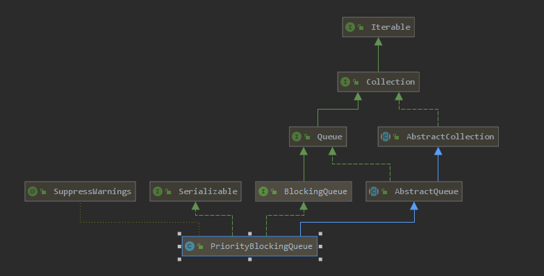

# Introduction



**一个支持优先级的无界阻塞队列**，默认情况下元素采取自然顺序，也可以自定义类实现`compareTo()`方法来指定元素的排序顺序。或则初始化该队列的时候（一般使用匿名内部类）指定构造参数`Comparator`来对元素进行排序。**不能保证同优先级元素的顺序,由于是无界的所以`put`不会被阻塞，使用无界队列在使用线程池的时候，最大线程数就是一个不会生效的值**

数据结构用的堆的实现方式，和 [PriorityQueue](../non-thread-safety/PriorityQueue.md)是一样的不过就是加上了锁，关于这个数据结构的实现请看 [PriorityQueue](../non-thread-safety/PriorityQueue.md)，里面的实现都很简单这里我们就大致看一下就好了

# 源码

```java
	/**
     * Default array capacity.
     */
    private static final int DEFAULT_INITIAL_CAPACITY = 11;

    /**
     * The maximum size of array to allocate.
     */
    private static final int MAX_ARRAY_SIZE = Integer.MAX_VALUE - 8;

    /**
     * Priority queue represented as a balanced binary heap: the two
     */
    private transient Object[] queue;

    /**
     * The number of elements in the priority queue.
     */
    private transient int size;

    /**
     * The comparator, or null if priority queue uses elements'
     * natural ordering.
     * 比较器
     */
    private transient Comparator<? super E> comparator;

    /**
     * Lock used for all public operations
     */
    private final ReentrantLock lock;

    /**
     * Condition for blocking when empty
     */
    private final Condition notEmpty;

    /**
     * Spinlock for allocation, acquired via CAS.  扩容的时候用到
     */
    private transient volatile int allocationSpinLock;
```

put

```java
public void put(E e) {
    offer(e); // never need to block
}
    
public boolean offer(E e) {
    if (e == null)
        throw new NullPointerException();
    final ReentrantLock lock = this.lock;
    lock.lock();
    int n, cap;
    Object[] array;
    while ((n = size) >= (cap = (array = queue).length))
        tryGrow(array, cap);
    try {
        Comparator<? super E> cmp = comparator;
        if (cmp == null)
            siftUpComparable(n, e, array);
        else
            siftUpUsingComparator(n, e, array, cmp);
        size = n + 1;
        notEmpty.signal();
    } finally {
        lock.unlock();
    }
    return true;
}

private static <T> void siftUpComparable(int k, T x, Object[] array) {
  Comparable<? super T> key = (Comparable<? super T>) x;
  while (k > 0) {
    int parent = (k - 1) >>> 1;
    Object e = array[parent];
    if (key.compareTo((T) e) >= 0)
      break;
    array[k] = e;
    k = parent;
  }
  array[k] = key;
}

private static <T> void siftUpUsingComparator(int k, T x, Object[] array,
                                              Comparator<? super T> cmp) {
  while (k > 0) {
    int parent = (k - 1) >>> 1; 
    Object e = array[parent];
    if (cmp.compare(x, (T) e) >= 0)
      break;
    array[k] = e;
    k = parent;
  }
  array[k] = x;
}

```

take

```java
public E take() throws InterruptedException {
    final ReentrantLock lock = this.lock;
    lock.lockInterruptibly();
    E result;
    try {
        while ( (result = dequeue()) == null)
            notEmpty.await();// 阻塞
    } finally {
        lock.unlock();
    }
    return result;
}

private E dequeue() {
    int n = size - 1;
    if (n < 0)
        return null;
    else {
        Object[] array = queue;
        E result = (E) array[0];
        E x = (E) array[n];
        array[n] = null;
        Comparator<? super E> cmp = comparator;
        if (cmp == null)
            siftDownComparable(0, x, array, n);
        else
            siftDownUsingComparator(0, x, array, n, cmp);
        size = n;
        return result;
    }
}

private static <T> void siftDownComparable(int k, T x, Object[] array,
                                               int n) {
  if (n > 0) {
    Comparable<? super T> key = (Comparable<? super T>)x;
    int half = n >>> 1;           // loop while a non-leaf
    while (k < half) {
      int child = (k << 1) + 1; // assume left child is least
      Object c = array[child];
      int right = child + 1;
      if (right < n &&
          ((Comparable<? super T>) c).compareTo((T) array[right]) > 0)
        c = array[child = right];
      if (key.compareTo((T) c) <= 0)
        break;
      array[k] = c;
      k = child;
    }
    array[k] = key;
  }
}

private static <T> void siftDownUsingComparator(int k, T x, Object[] array,
                                                int n,
                                                Comparator<? super T> cmp) {
    if (n > 0) {
        int half = n >>> 1;
        while (k < half) {
            int child = (k << 1) + 1;
            Object c = array[child];
            int right = child + 1;
            if (right < n && cmp.compare((T) c, (T) array[right]) > 0)
                c = array[child = right];
            if (cmp.compare(x, (T) c) <= 0)
                break;
            array[k] = c;
            k = child;
        }
        array[k] = x;
    }
}

```

