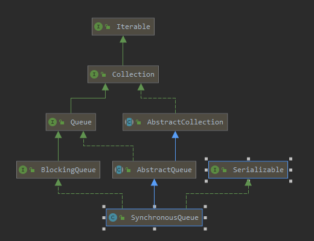

# Introduction



**是一个不存储元素的阻塞队列，因为每一个put操作都必须等待一个take操作，否则不能继续增添元素**

SynchronousQueue有两个版本的Transferer实现，一种为**公平交易类型**，一种为**非公平交易类型**，公平交易类型的实现类为TransferQueue，它使用队列来作为交易媒介，请求交易的线程总是先尝试跟队列头部的线程进行交易，如果失败再将请求的线程添加到队列尾部，而非公平类型的实现类为TransferStack，它使用一个stack来作为交易媒介，请求交易的线程总是试图与栈顶线程进行交易，失败则添加到栈顶。所以SynchronousQueue就是使用队列和栈两种数据结构来模拟公平交易和非公平交易的  **默认使用非公分访问的实现**

因为它的特性所以它能用的接口节下面这几个，其他接口都相当于空实现，返回一个默认值

| 接口介绍                                                     |
| ------------------------------------------------------------ |
| `offer(E e)`  如果另一个线程正在等待接收，则将指定的元素插入到此队列中。 |
| `offer(E e,  long timeout, TimeUnit unit)`  将指定的元素插入到此队列中，如果需要，等待另一个线程接收到的指定等待时间。 |
| `poll()`  如果另一个线程正在使一个元素可用，则检索并删除此队列的头。 |
| `poll(long timeout,  TimeUnit unit)`  检索并删除此队列的头，如果需要等待指定的等待时间，另一个线程插入它。 |
| `put(E e)`  将指定的元素添加到此队列，等待另一个线程接收它。 |
| `take()`  检索并删除此队列的头，等待另一个线程插入它。       |

# source code 实现

## 内部核心接口

`SynchronousQueue`使用了一个关键的方法来转移数据（从生产者线程转移到消费者线程）

```java
abstract static class Transferer<E> {
    /**
     * Performs a put or take.
     *
     * @param e if non-null, the item to be handed to a consumer;
     *          if null, requests that transfer return an item
     *          offered by producer.
     * @param timed if this operation should timeout
     * @param nanos the timeout, in nanoseconds
     * @return if non-null, the item provided or received; if null,
     *         the operation failed due to timeout or interrupt --
     *         the caller can distinguish which of these occurred
     *         by checking Thread.interrupted.
     */
    abstract E transfer(E e, boolean timed, long nanos);
}
```

## 构造方法

**从构造方法可以看出 `SynchronousQueue`拥有公平模式的实现类`TransferQueue`，和非公平模式的实现类`TransferStack` 他们都实现了 `Transferer`接口**

```java
public SynchronousQueue() {
    this(false);
}
public SynchronousQueue(boolean fair) {
    transferer = fair ? new TransferQueue<E>() : new TransferStack<E>();
}
```

## 内部重要字段

```java
/** The number of CPUs, for spin control */
static final int NCPUS = Runtime.getRuntime().availableProcessors();

/**
 * 超时等待的时候（调用那两个超时等待的方法会用到这个值），如果cpu<2个核心，那就跳过自旋等待的过程，直接park
 * 线程 cpu>=2的时候 自旋 32次
 */
static final int maxTimedSpins = (NCPUS < 2) ? 0 : 32;

/**
 * 非超时阻塞的情况下使用这个值，和 maxTimedSpins 一样的CPU<2，跳过自旋直接park,cpu>=2的时候，自旋
 * maxTimedSpins * 16 也就是 32 * 16 次
 * 
 */
static final int maxUntimedSpins = maxTimedSpins * 16;

/**
 * 超时等待的要求是，至少需要 >1000nanos, 才会使用 LockSupport.parkNanos(this, nanos);方法park 线
 * 程
 */
static final long spinForTimeoutThreshold = 1000L;
```

## TransferQueue

```java
/** Dual Queue */
static final class TransferQueue<E> extends Transferer<E> {
    /*
     * This extends Scherer-Scott dual queue algorithm, differing,
     * among other ways, by using modes within nodes rather than
     * marked pointers. The algorithm is a little simpler than
     * that for stacks because fulfillers do not need explicit
     * nodes, and matching is done by CAS'ing QNode.item field
     * from non-null to null (for put) or vice versa (for take).
     */

    /** Node class for TransferQueue. */
    static final class QNode {
        volatile QNode next;    // next node in queue 链表指针
        volatile Object item;   // CAS'ed to or from null 
        volatile Thread waiter; // to control park/unpark
        final boolean isData; // 表示是数据节点，用于和head区分开来，head 一直是一个没有值的 QNode

        QNode(Object item, boolean isData) {
            this.item = item;
            this.isData = isData;
        }
		// CAS 的方式修改 next 指针（也就是 reference）
        boolean casNext(QNode cmp, QNode val) {
            return next == cmp &&
                UNSAFE.compareAndSwapObject(this, nextOffset, cmp, val);
        }
		// CAS 方式修改 item 指针（也就是 reference）
        boolean casItem(Object cmp, Object val) {
            return item == cmp &&
                UNSAFE.compareAndSwapObject(this, itemOffset, cmp, val);
        }

        /**
         * Tries to cancel by CAS'ing ref to this as item.
         * 通过 CAS 的方式将数据节点的 item 指针指向自身 用来描述数据是 canceled 状态(线程被interrrupted or time out)
         */
        void tryCancel(Object cmp) {
            UNSAFE.compareAndSwapObject(this, itemOffset, cmp, this);
        }

        boolean isCancelled() {
            return item == this;
        }

        /**
         * Returns true if this node is known to be off the queue
         * because its next pointer has been forgotten due to
         * an advanceHead operation.
         */
        boolean isOffList() {
            return next == this;
        }

        // Unsafe mechanics
        private static final sun.misc.Unsafe UNSAFE;
        private static final long itemOffset;
        private static final long nextOffset;

        static {
            try {
                UNSAFE = sun.misc.Unsafe.getUnsafe();
                Class<?> k = QNode.class;
                itemOffset = UNSAFE.objectFieldOffset
                    (k.getDeclaredField("item"));
                nextOffset = UNSAFE.objectFieldOffset
                    (k.getDeclaredField("next"));
            } catch (Exception e) {
                throw new Error(e);
            }
        }
    }
	
    /**
 	 *  这是一个非常典型的 queue , 它有如下的特点
 	 *  1. 整个队列有 head, tail 两个节点
 	 *  2. 队列初始化时会有个 dummy 节点
 	 *  3. 这个队列的头节点是个 dummy 节点/ 或 哨兵节点, 所以操作的总是队列中的第二个节点(AQS的设计中也
 	 *  是这也)
	 */
    
    /** Head of queue */
    transient volatile QNode head;
    /** Tail of queue */
    transient volatile QNode tail;
    /**
     * Reference to a cancelled node that might not yet have been
     * unlinked from queue because it was the last inserted node
     * when it was cancelled.
     */
    /**
 	 * 对应 中断或超时的 前继节点,这个节点存在的意义是标记, 它的下个节点要删除
 	 * 何时使用:
 	 *      当你要删除 节点 node, 若节点 node 是队列的末尾, 则开始用这个节点,
 	 * 为什么呢？
 	 *      大家知道 删除一个节点 直接 A.CASNext(B, B.next) 就可以,但是当节点 B 是整个队列中的末尾
 	 * 	元素时,
 	 *      一个线程删除节点B, 一个线程在节点B之后插入节点 这样操作容易致使插入的节点丢失, 这个cleanMe很
 	 * 	 像 ConcurrentSkipListMap 中的 删除添加的 marker 节点, 他们都是起着相同的作用
	 */
    transient volatile QNode cleanMe;

    TransferQueue() {
        QNode h = new QNode(null, false); // initialize to dummy node.
        head = h;
        tail = h;
    }

    /**
 	 * 推进 head 节点,将 老节点的 oldNode.next = this, help gc,
	 */
    void advanceHead(QNode h, QNode nh) {
        if (h == head &&
            UNSAFE.compareAndSwapObject(this, headOffset, h, nh))
            h.next = h; // forget old next
    }

    /**
     * Tries to cas nt as new tail.
     * 修改尾节点
     */
    void advanceTail(QNode t, QNode nt) {
        if (tail == t)// tail ！= t可能时被别的线程推动这个动作了，存在这种情况是因为transfer方法的逻辑
            UNSAFE.compareAndSwapObject(this, tailOffset, t, nt);
    }

    /**
     * Tries to CAS cleanMe slot.
     * CAS 设置 cleamMe 节点
     */
    boolean casCleanMe(QNode cmp, QNode val) {
        return cleanMe == cmp &&
            UNSAFE.compareAndSwapObject(this, cleanMeOffset, cmp, val);
    }

    /**
     * Puts or takes an item.
     */
    @SuppressWarnings("unchecked")
    E transfer(E e, boolean timed, long nanos) {
        QNode s = null; // constructed/reused as needed
        boolean isData = (e != null); // isData = true 指的生产者，isData = false 消费者
		/*
         * 这个 producer / consumer 的主方法, 主要分为两种情况
     	 *
     	    
     	 */
        for (;;) {
            QNode t = tail;
            QNode h = head;
            // 数据未初始化,continue 重试
            if (t == null || h == null)         // saw uninitialized value 
                continue;                       // spin
			/*
			 * 若队列为空 / 队列中的尾节点和自己的类型相同, 则添加 node到队列中, 直到timeout
     	 	 * /interrupt/其他类型的线程与之匹配，怎么理解呢，也就是说如果一开始先消费者，那么后续能加入
     	 	 * 队列的都会是消费者，来一个生产者就会走else逻辑直到队列中消费者处理完，队列空了之后又看消费
     	 	 * 者先还是生产者先wait进队列，谁先，那么谁走 if里面的逻辑
    	     *  
			 */ 
            if (h == t || t.isData == isData) { // empty or same-mode
                QNode tn = t.next;
                if (t != tail)// tail 可能被别的线程推动了，也就是别的线程抢先一步将数据加入到队列靠前位置
                    continue;
                if (tn != null) {               // 别的线程给队列新加了一个节点，但是还有推动tail,这边帮助推动一下
                    advanceTail(t, tn);
                    continue;
                }
                if (timed && nanos <= 0)        // can't wait poll()如果进入这个逻辑方法直接返回null,offer(E e)走入这个逻辑，总是返回false,只有在一开始链表中存在线程take等待中的时候，走外层的else分支的逻辑，才能返回true。
                    return null;
                if (s == null) 
                    s = new QNode(e, isData);   // 新建队列节点
                if (!t.casNext(null, s))        // CAS 修改tail.next=s, 失败说明被别的线程抢先了，需要重新循环然后插入到队列中
                    continue;
                advanceTail(t, s);              // 移动tail指针
                /* 线程等待的方法，可能返回的数据，可能是消费者需要的数据，通过else逻辑生产者写进去的；
                 * 也可能是生产者被唤醒后返回的null值，因为数据已经被消费者在else逻辑中取走 
                 * 也可能是超时/ Interrupted 返回节点本身状态就是 cancelled,这种情况不区分生产者还
                 * 是消费者，这时需要 clean(t,s)
                 */
                Object x = awaitFulfill(s, e, timed, nanos);
                if (x == s) {// 超时/中断的情况                   
                    clean(t, s);
                    return null;
                }
                if (!s.isOffList()) {           // 节点从queue中被移除了
                    advanceHead(t, s);          // 如果刚好是head 移动一下位置
                    if (x != null)              // and forget fields
                        s.item = s;
                    s.waiter = null;
                }
                return (x != null) ? (E)x : e;// 生产者被唤醒返回null，消费者被唤醒返回取到的值

            } else {                           
                /* 生产者，消费者都可能进入这个逻辑
                 * 		生产者过来，为等待中的消费者节点的item写入数据。移动头节点到下一个节点，以及唤醒
                 * 节点线程
                 * 
                 * 		消费者过来，取得等待中的生产者节点的item数据同时将item设置为null, 移动头节点到
                 * 下一个节点以及唤醒节点线程
                 * 
                 */ 
                QNode m = h.next;               // 每次都是从头节点下一个节点处理数据
                if (t != tail || m == null || h != head)
                    continue;                   // head,tail 被其他线程修改，重来
                /* isData == (x != null) ： 
                 * 1.消费者过来m是生产者节点，isData=false;x=null,数据被其他消费者抢先了，向前推进移
                 * 除匹配到的节点，重新尝试获取队列中生产者的数据; x!=null，判断 x == m 如果是true, 
                 * 证明该生产者超时/中断了向前推进移除匹配到的节点，重新尝试获取队列中生产者的数据;如果是
                 * false, CAS尝试修改该节点数据为null,可能多个线程会CAS竞争，成功获取到数据的，向前推
                 * 进移除匹配到的节点，唤醒该生产者节点的线程，返回获取到的数据;失败的向前推进移除匹配到的
                 * 节点 重新尝试获取队列中生产者的数据 
                 * 
                 * 2.生产者过来m是消费者节点，isData=true;x!=null 数据被其他消费者抢先了向前推进移除
                 * 匹配到的节点,重新尝试给消费者传递数据 ; x==null,判断x == m 如果是true 那么消费者
                 * 节点超时/中断了向前推进移除匹配到的节点 重新尝试给消费者传递数据，如果是 false 生产
                 * 者CAS尝试将数据传递给该消费者节点，如果失败向前推进移除匹配到的节点,重新尝试给消费者传
                 * 递数据；如果成功向前推进移除匹配到的节点，唤醒该消费者节点，返回自己生产的这个值
                 */ 
                Object x = m.item;
                if (isData == (x != null) ||
                    x == m ||                   // m cancelled
                    !m.casItem(x, e)) {         // lost CAS
                    advanceHead(h, m);          // dequeue and retry
                    continue;
                }

                advanceHead(h, m);              // successfully fulfilled
                LockSupport.unpark(m.waiter);
                return (x != null) ? (E)x : e;
            }
        }
    }

    /**
     * Spins/blocks until node s is fulfilled.
     *
     * @return matched item, or s if cancelled
     */
    Object awaitFulfill(QNode s, E e, boolean timed, long nanos) {
        /* Same idea as TransferStack.awaitFulfill */
        final long deadline = timed ? System.nanoTime() + nanos : 0L;
        Thread w = Thread.currentThread();// 获取当前的线程
        // 如果s节点是队列中第一个节点，那么可以先经过一定自旋次数 maxTimedSpins / maxUntimedSpins，不必直接被park，如果不是，那就不进行自旋尝试，需要注意的是如果 CPU<2的时候 maxTimedSpins/maxUntimedSpins =0，也就是不进行任何自旋尝试
        int spins = ((head.next == s) ?
                     (timed ? maxTimedSpins : maxUntimedSpins) : 0);
        for (;;) {
            if (w.isInterrupted())// 线程被中断
                s.tryCancel(e);// 修改 item 指向自身
            Object x = s.item;
            if (x != e)// 这个判断是为了处理，被类似take的线程取数据后，s.item会被修改成null,或则tryCancel修改成指向自身的引用的时候，就会直接返回，也就是 return matched item, or s if cancelled
                return x;
            if (timed) {
                nanos = deadline - System.nanoTime();
                if (nanos <= 0L) {// 超时后修改 item 指向自身
                    s.tryCancel(e);
                    continue;
                }
            }
            if (spins > 0)// 自旋次数不为0，先进自旋尝试
                --spins;
            else if (s.waiter == null)
                s.waiter = w;
            else if (!timed)
                LockSupport.park(this);
            else if (nanos > spinForTimeoutThreshold)
                LockSupport.parkNanos(this, nanos);
        }
    }

    /**
     * Gets rid of cancelled node s with original predecessor pred.
     */
    void clean(QNode pred, QNode s) {
        s.waiter = null; // forget thread
        /*
         * At any given time, exactly one node on list cannot be
         * deleted -- the last inserted node. To accommodate this,
         * if we cannot delete s, we save its predecessor as
         * "cleanMe", deleting the previously saved version
         * first. At least one of node s or the node previously
         * saved can always be deleted, so this always terminates.
         */
        while (pred.next == s) { // Return early if already unlinked
            QNode h = head;
            QNode hn = h.next;   // Absorb cancelled first node as head
            if (hn != null && hn.isCancelled()) {
                advanceHead(h, hn);
                continue;
            }
            QNode t = tail;      // Ensure consistent read for tail
            if (t == h)
                return;
            QNode tn = t.next;
            if (t != tail)// tail 被别的线程移动了
                continue;
            if (tn != null) {// 帮助移动tail
                advanceTail(t, tn);
                continue;
            }
            if (s != t) {        // If not tail, try to unsplice
                QNode sn = s.next;
                // 修改 pred.casNext(s, sn)，将s节点从queue中去掉
                if (sn == s || pred.casNext(s, sn))
                    return;
            }
            QNode dp = cleanMe;
            if (dp != null) {    // Try unlinking previous cancelled node
                QNode d = dp.next;
                QNode dn;
                if (d == null ||               // d is gone or
                    d == dp ||                 // d is off list or
                    !d.isCancelled() ||        // d not cancelled or
                    (d != t &&                 // d not tail and
                     (dn = d.next) != null &&  //   has successor
                     dn != d &&                //   that is on list
                     dp.casNext(d, dn)))       // d unspliced
                    casCleanMe(dp, null);
                if (dp == pred)
                    return;      // s is already saved node
            } else if (casCleanMe(null, pred))
                return;          // Postpone cleaning s
        }
    }

    private static final sun.misc.Unsafe UNSAFE;
    private static final long headOffset;
    private static final long tailOffset;
    private static final long cleanMeOffset;
    static {
        try {
            UNSAFE = sun.misc.Unsafe.getUnsafe();
            Class<?> k = TransferQueue.class;
            headOffset = UNSAFE.objectFieldOffset
                (k.getDeclaredField("head"));
            tailOffset = UNSAFE.objectFieldOffset
                (k.getDeclaredField("tail"));
            cleanMeOffset = UNSAFE.objectFieldOffset
                (k.getDeclaredField("cleanMe"));
        } catch (Exception e) {
            throw new Error(e);
        }
    }
}
```

## TransferStack

```java
/** Dual stack */
static final class TransferStack<E> extends Transferer<E> {
    /*
     * This extends Scherer-Scott dual stack algorithm, differing,
     * among other ways, by using "covering" nodes rather than
     * bit-marked pointers: Fulfilling operations push on marker
     * nodes (with FULFILLING bit set in mode) to reserve a spot
     * to match a waiting node.
     */

    /* Modes for SNodes, ORed together in node fields */
    /** Node represents an unfulfilled consumer */
    static final int REQUEST    = 0;
    /** Node represents an unfulfilled producer */
    static final int DATA       = 1;
    /** Node is fulfilling another unfulfilled DATA or REQUEST */
    static final int FULFILLING = 2;

    /** Returns true if m has fulfilling bit set. */
    static boolean isFulfilling(int m) { return (m & FULFILLING) != 0; }

    /** Node class for TransferStacks. */
    static final class SNode {
        volatile SNode next;        // next node in stack
        volatile SNode match;       // the node matched to this
        volatile Thread waiter;     // to control park/unpark
        Object item;                // data; or null for REQUESTs
        int mode;
        // Note: item and mode fields don't need to be volatile
        // since they are always written before, and read after,
        // other volatile/atomic operations.

        SNode(Object item) {
            this.item = item;
        }

        boolean casNext(SNode cmp, SNode val) {
            return cmp == next &&
                UNSAFE.compareAndSwapObject(this, nextOffset, cmp, val);
        }

        /**
         * Tries to match node s to this node, if so, waking up thread.
         * Fulfillers call tryMatch to identify their waiters.
         * Waiters block until they have been matched.
         *
         * @param s the node to match
         * @return true if successfully matched to s
         */
        boolean tryMatch(SNode s) {
            if (match == null &&
                UNSAFE.compareAndSwapObject(this, matchOffset, null, s)) {
                Thread w = waiter;
                if (w != null) {    // waiters need at most one unpark
                    waiter = null;
                    LockSupport.unpark(w);
                }
                return true;
            }
            return match == s;
        }

        /**
         * Tries to cancel a wait by matching node to itself.
         */
        void tryCancel() {
            UNSAFE.compareAndSwapObject(this, matchOffset, null, this);
        }

        boolean isCancelled() {
            return match == this;
        }

        // Unsafe mechanics
        private static final sun.misc.Unsafe UNSAFE;
        private static final long matchOffset;
        private static final long nextOffset;

        static {
            try {
                UNSAFE = sun.misc.Unsafe.getUnsafe();
                Class<?> k = SNode.class;
                matchOffset = UNSAFE.objectFieldOffset
                    (k.getDeclaredField("match"));
                nextOffset = UNSAFE.objectFieldOffset
                    (k.getDeclaredField("next"));
            } catch (Exception e) {
                throw new Error(e);
            }
        }
    }

    /** The head (top) of the stack */
    volatile SNode head;

    boolean casHead(SNode h, SNode nh) {
        return h == head &&
            UNSAFE.compareAndSwapObject(this, headOffset, h, nh);
    }

    /**
     * Creates or resets fields of a node. Called only from transfer
     * where the node to push on stack is lazily created and
     * reused when possible to help reduce intervals between reads
     * and CASes of head and to avoid surges of garbage when CASes
     * to push nodes fail due to contention.
     */
    static SNode snode(SNode s, Object e, SNode next, int mode) {
        if (s == null) s = new SNode(e);
        s.mode = mode;
        s.next = next;
        return s;
    }

    /**
     * Puts or takes an item.
     */
    @SuppressWarnings("unchecked")
    E transfer(E e, boolean timed, long nanos) {
        /*
         * Basic algorithm is to loop trying one of three actions:
         *
         * 1. If apparently empty or already containing nodes of same
         *    mode, try to push node on stack and wait for a match,
         *    returning it, or null if cancelled.
         *
         * 2. If apparently containing node of complementary mode,
         *    try to push a fulfilling node on to stack, match
         *    with corresponding waiting node, pop both from
         *    stack, and return matched item. The matching or
         *    unlinking might not actually be necessary because of
         *    other threads performing action 3:
         *
         * 3. If top of stack already holds another fulfilling node,
         *    help it out by doing its match and/or pop
         *    operations, and then continue. The code for helping
         *    is essentially the same as for fulfilling, except
         *    that it doesn't return the item.
         */

        SNode s = null; // constructed/reused as needed
        int mode = (e == null) ? REQUEST : DATA;

        for (;;) {
            SNode h = head;
            if (h == null || h.mode == mode) {  // empty or same-mode
                if (timed && nanos <= 0) {      // can't wait
                    if (h != null && h.isCancelled())
                        casHead(h, h.next);     // pop cancelled node
                    else
                        return null;
                } else if (casHead(h, s = snode(s, e, h, mode))) {
                    SNode m = awaitFulfill(s, timed, nanos);
                    if (m == s) {               // wait was cancelled
                        clean(s);
                        return null;
                    }
                    if ((h = head) != null && h.next == s)
                        casHead(h, s.next);     // help s's fulfiller
                    return (E) ((mode == REQUEST) ? m.item : s.item);
                }
            } else if (!isFulfilling(h.mode)) { // try to fulfill
                if (h.isCancelled())            // already cancelled
                    casHead(h, h.next);         // pop and retry
                else if (casHead(h, s=snode(s, e, h, FULFILLING|mode))) {
                    for (;;) { // loop until matched or waiters disappear
                        SNode m = s.next;       // m is s's match
                        if (m == null) {        // all waiters are gone
                            casHead(s, null);   // pop fulfill node
                            s = null;           // use new node next time
                            break;              // restart main loop
                        }
                        SNode mn = m.next;
                        if (m.tryMatch(s)) {
                            casHead(s, mn);     // pop both s and m
                            return (E) ((mode == REQUEST) ? m.item : s.item);
                        } else                  // lost match
                            s.casNext(m, mn);   // help unlink
                    }
                }
            } else {                            // help a fulfiller
                SNode m = h.next;               // m is h's match
                if (m == null)                  // waiter is gone
                    casHead(h, null);           // pop fulfilling node
                else {
                    SNode mn = m.next;
                    if (m.tryMatch(h))          // help match
                        casHead(h, mn);         // pop both h and m
                    else                        // lost match
                        h.casNext(m, mn);       // help unlink
                }
            }
        }
    }

    /**
     * Spins/blocks until node s is matched by a fulfill operation.
     *
     * @param s the waiting node
     * @param timed true if timed wait
     * @param nanos timeout value
     * @return matched node, or s if cancelled
     */
    SNode awaitFulfill(SNode s, boolean timed, long nanos) {
        /*
         * When a node/thread is about to block, it sets its waiter
         * field and then rechecks state at least one more time
         * before actually parking, thus covering race vs
         * fulfiller noticing that waiter is non-null so should be
         * woken.
         *
         * When invoked by nodes that appear at the point of call
         * to be at the head of the stack, calls to park are
         * preceded by spins to avoid blocking when producers and
         * consumers are arriving very close in time.  This can
         * happen enough to bother only on multiprocessors.
         *
         * The order of checks for returning out of main loop
         * reflects fact that interrupts have precedence over
         * normal returns, which have precedence over
         * timeouts. (So, on timeout, one last check for match is
         * done before giving up.) Except that calls from untimed
         * SynchronousQueue.{poll/offer} don't check interrupts
         * and don't wait at all, so are trapped in transfer
         * method rather than calling awaitFulfill.
         */
        final long deadline = timed ? System.nanoTime() + nanos : 0L;
        Thread w = Thread.currentThread();
        int spins = (shouldSpin(s) ?
                     (timed ? maxTimedSpins : maxUntimedSpins) : 0);
        for (;;) {
            if (w.isInterrupted())
                s.tryCancel();
            SNode m = s.match;
            if (m != null)
                return m;
            if (timed) {
                nanos = deadline - System.nanoTime();
                if (nanos <= 0L) {
                    s.tryCancel();
                    continue;
                }
            }
            if (spins > 0)
                spins = shouldSpin(s) ? (spins-1) : 0;
            else if (s.waiter == null)
                s.waiter = w; // establish waiter so can park next iter
            else if (!timed)
                LockSupport.park(this);
            else if (nanos > spinForTimeoutThreshold)
                LockSupport.parkNanos(this, nanos);
        }
    }

    /**
     * Returns true if node s is at head or there is an active
     * fulfiller.
     */
    boolean shouldSpin(SNode s) {
        SNode h = head;
        return (h == s || h == null || isFulfilling(h.mode));
    }

    /**
     * Unlinks s from the stack.
     */
    void clean(SNode s) {
        s.item = null;   // forget item
        s.waiter = null; // forget thread

        /*
         * At worst we may need to traverse entire stack to unlink
         * s. If there are multiple concurrent calls to clean, we
         * might not see s if another thread has already removed
         * it. But we can stop when we see any node known to
         * follow s. We use s.next unless it too is cancelled, in
         * which case we try the node one past. We don't check any
         * further because we don't want to doubly traverse just to
         * find sentinel.
         */

        SNode past = s.next;
        if (past != null && past.isCancelled())
            past = past.next;

        // Absorb cancelled nodes at head
        SNode p;
        while ((p = head) != null && p != past && p.isCancelled())
            casHead(p, p.next);

        // Unsplice embedded nodes
        while (p != null && p != past) {
            SNode n = p.next;
            if (n != null && n.isCancelled())
                p.casNext(n, n.next);
            else
                p = n;
        }
    }

    // Unsafe mechanics
    private static final sun.misc.Unsafe UNSAFE;
    private static final long headOffset;
    static {
        try {
            UNSAFE = sun.misc.Unsafe.getUnsafe();
            Class<?> k = TransferStack.class;
            headOffset = UNSAFE.objectFieldOffset
                (k.getDeclaredField("head"));
        } catch (Exception e) {
            throw new Error(e);
        }
    }
}
```

# 在java线程池中使用SynchronousQueue

在线程池中使用SynchronousQueue非常容易造成线程的不断创建，直到线程池指定的最大线程数的限制，特别是在这个最大线程数数值较大的时候，更是会造成OOM,或则大量线程创建，竞争CPU的时间片，造成严重的性能影响。线程池核心线程创建完了之后，判断任务队列是否已满使用的是队列的 offer方法 。SynchronousQueue的offer方法要返回true,只有在有线程在`take`,`poll(long timeout,  TimeUnit unit)`  的情况下，才能返回true,也就是说核心线程都在处理任务的过程中，没有任何核心线程在等待一个 offer 操作的情况下，就一定会去创建新的线程执行任务（不超过最大线程数的情况下），这就意味着使用 SynchronousQueue ， 在线程忙碌执行任务的过程中，非常容易不断创建新的线程

线程池添加任务的方法：

```java
public void execute(Runnable command) {
    if (command == null)
        throw new NullPointerException();
    int c = ctl.get();
    if (workerCountOf(c) < corePoolSize) {// 工作线程小于核心线程，创建线程执行任务
        if (addWorker(command, true))
            return;
        c = ctl.get();
    }
    if (isRunning(c) && workQueue.offer(command)) {// 核心线程已满，往任务队列中添加任务
        int recheck = ctl.get();
        if (! isRunning(recheck) && remove(command))
            reject(command);
        else if (workerCountOf(recheck) == 0)
            addWorker(null, false);
    }
    else if (!addWorker(command, false))// 添加任务失败，创建非核心线程
        reject(command);
}
```

线程并发情况下，只有先有在take等待的线程的情况下，SynchronousQueue 的 offer才会返回true,因为offer是非阻塞的，如果没有take等待的线程，它就不会进入到等待的Queue中（链表/栈）。

在先准备好 take等待的线程的情况下，所有offer都返回了true

```java
    public static void main(String[] args) {
        SynchronousQueue<Integer> integers = new SynchronousQueue<>();
//   非公平模式     SynchronousQueue<Integer> integers = new SynchronousQueue<>(false);
        CyclicBarrier cyclicBarrier = new CyclicBarrier(25);
        for (int i = 0; i < 25; i++) {
            int finalI = i;
            Thread thread2 = new Thread(() -> {
                Integer poll = null;
                try {
                    poll = integers.take();
                } catch (InterruptedException e) {
                    e.printStackTrace();
                }
                System.out.println(Thread.currentThread().getName() + " poll value = " + poll);
            });
            thread2.setName("consumer-"+i);
            thread2.start();
            Thread thread = new Thread(() -> {
                try {
                    cyclicBarrier.await();
                } catch (InterruptedException | BrokenBarrierException e) {
                    e.printStackTrace();
                }
                boolean offer = integers.offer(finalI);
                System.out.println(Thread.currentThread().getName() + " offer stat = " + offer);
            });
            thread.setName("provider-"+i);
            thread.start();

        }
    }
```

take 准备不足的情况下，部分offer会失败

```java
 public static void main(String[] args) {
        SynchronousQueue<Integer> integers = new SynchronousQueue<>();
//   非公平模式     SynchronousQueue<Integer> integers = new SynchronousQueue<>(false);
        CyclicBarrier cyclicBarrier = new CyclicBarrier(25);
        for (int i = 0; i < 25; i++) {
            int finalI = i;
            if (i % 5 != 0) {
                Thread thread2 = new Thread(() -> {
                    Integer poll = null;
                    try {
                        poll = integers.take();
                    } catch (InterruptedException e) {
                        e.printStackTrace();
                    }
                    System.out.println(Thread.currentThread().getName() + " poll value = " + poll);
                });
                thread2.setName("consumer-" + i);
                thread2.start();
            }
            Thread thread = new Thread(() -> {
                try {
                    cyclicBarrier.await();
                } catch (InterruptedException | BrokenBarrierException e) {
                    e.printStackTrace();
                }
                boolean offer = integers.offer(finalI);
                System.out.println(Thread.currentThread().getName() + " offer stat = " + offer);
            });
            thread.setName("provider-" + i);
            thread.start();
        }
    }
```