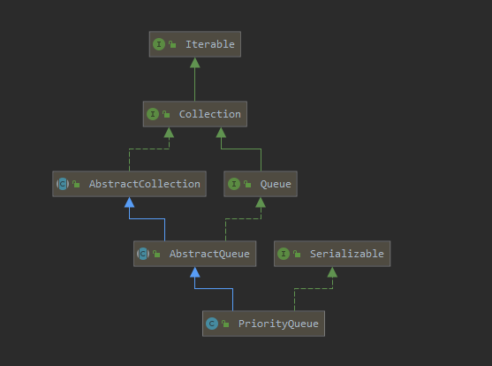

# Introduction

`PriorityQueue` 是最小堆的一个实现，使用它的实例类需要实现 `Comparable` 接口 ， 或则我们自定义一个比较器 `Comparator ` 来对比存入它当中的元素的大小关系，基于此我们只需要颠倒这个大小关系，也可以用它构造最大堆（颠倒大小关系，使用最小堆的方式构建出最大堆）

例如 ： 

如果我们想获得最大堆，那么在 按照正常 o1>o2  返回 >0, o1=o2  返回 0, o1<o2  返回 <0,用来使用最小堆没问题，但是要用 `PriorityQueue` 实现最大堆的话，我们就要颠倒这个关系 o1>o2  返回 <0, o1=o2  返回 0, o1<o2  返回 >0.这样就能得到一个最大堆

关于最大堆，最小堆的 以及`PriorityQueue ` 源码 可以看 [heap](../../../../../Data-Structure/heap.md)

