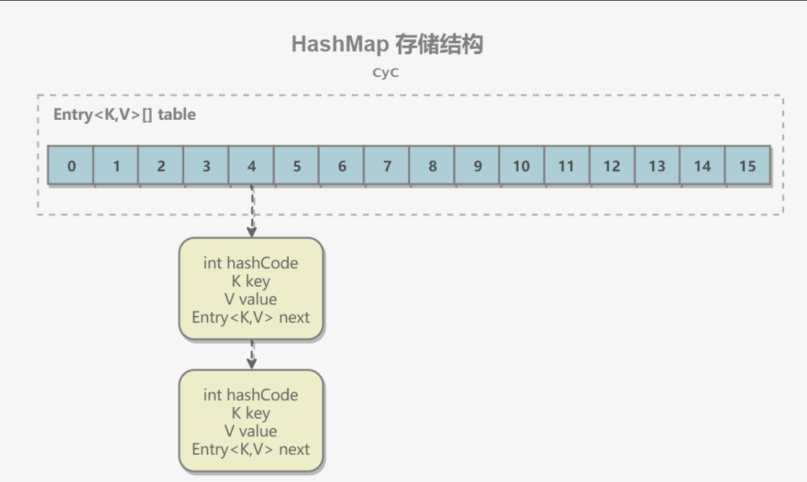
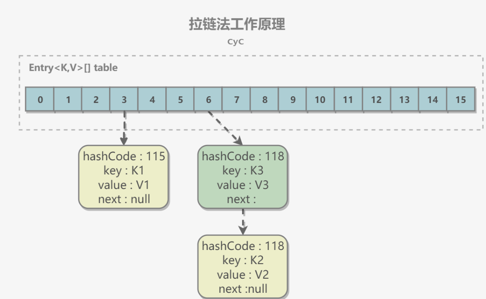
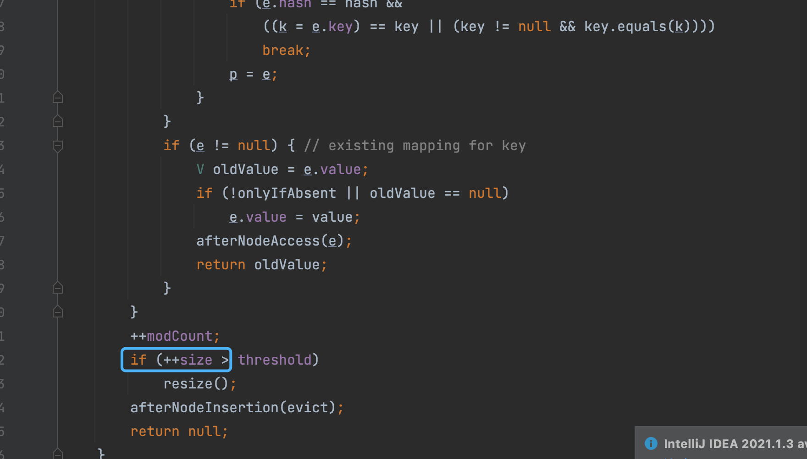
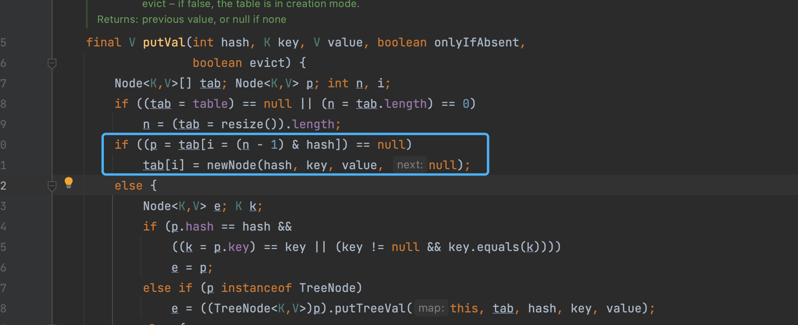

# HashMap

## 1. JDK1.7 版本

### 1.1 存储结构

内部包含了一个 Entry 类型的数组 table。Entry 存储着键值对。它包含了四个字段，从 next 字段我们可以看出 Entry 是一个链表。即数组中的每个位置被当成一个桶，一个桶存放一个链表。HashMap 使用拉链法来解决冲突，同一个链表中存放哈希值和散列桶取模运算结果相同的 Entry。



```java
transient Entry[] table;
static class Entry<K,V> implements Map.Entry<K,V> {
    final K key;
    V value;
    Entry<K,V> next;
    int hash;

    Entry(int h, K k, V v, Entry<K,V> n) {
        value = v;
        next = n;
        key = k;
        hash = h;
    }

    public final K getKey() {
        return key;
    }

    public final V getValue() {
        return value;
    }

    public final V setValue(V newValue) {
        V oldValue = value;
        value = newValue;
        return oldValue;
    }

    public final boolean equals(Object o) {
        if (!(o instanceof Map.Entry))
            return false;
        Map.Entry e = (Map.Entry)o;
        Object k1 = getKey();
        Object k2 = e.getKey();
        if (k1 == k2 || (k1 != null && k1.equals(k2))) {
            Object v1 = getValue();
            Object v2 = e.getValue();
            if (v1 == v2 || (v1 != null && v1.equals(v2)))
                return true;
        }
        return false;
    }

    public final int hashCode() {
        return Objects.hashCode(getKey()) ^ Objects.hashCode(getValue());
    }

    public final String toString() {
        return getKey() + "=" + getValue();
    }
}
```

### 1.2 拉链法的工作原理

```java
HashMap<String, String> map = new HashMap<>();
map.put("K1", "V1");
map.put("K2", "V2");
map.put("K3", "V3");
```

- 新建一个 HashMap，默认大小为 16；
- 插入 <K1,V1> 键值对，先计算 K1 的 hashCode 为 115，使用除留余数法得到所在的桶下标 115%16=3。
- 插入 <K2,V2> 键值对，先计算 K2 的 hashCode 为 118，使用除留余数法得到所在的桶下标 118%16=6。
- 插入 <K3,V3> 键值对，先计算 K3 的 hashCode 为 118，使用除留余数法得到所在的桶下标 118%16=6，插在 <K2,V2> 前面。

应该注意到链表的插入是以头插法方式进行的，例如上面的 <K3,V3> 不是插在 <K2,V2> 后面，而是插入在链表头部。

查找需要分成两步进行：

- 计算键值对所在的桶；
- 在链表上顺序查找，时间复杂度显然和链表的长度成正比。




### 1.3. put 操作

```java
public V put(K key, V value) {
    if (table == EMPTY_TABLE) {
        inflateTable(threshold);
    }
    // 键为 null 单独处理
    if (key == null)
        return putForNullKey(value);
    int hash = hash(key);
    // 确定桶下标
    int i = indexFor(hash, table.length);
    // 先找出是否已经存在键为 key 的键值对，如果存在的话就更新这个键值对的值为 value
    for (Entry<K,V> e = table[i]; e != null; e = e.next) {
        Object k;
        if (e.hash == hash && ((k = e.key) == key || key.equals(k))) {
            V oldValue = e.value;
            e.value = value;
            e.recordAccess(this);
            return oldValue;
        }
    }

    modCount++;
    // 插入新键值对（头插法）
    addEntry(hash, key, value, i);
    return null;
}
```

HashMap 允许插入键为 null 的键值对。但是因为无法调用 null 的 hashCode() 方法，也就无法确定该键值对的桶下标，只能通过强制指定一个桶下标来存放。HashMap 使用第 0 个桶存放键为 null 的键值对。

```java
private V putForNullKey(V value) {
    for (Entry<K,V> e = table[0]; e != null; e = e.next) {
        if (e.key == null) {
            V oldValue = e.value;
            e.value = value;
            e.recordAccess(this);
            return oldValue;
        }
    }
    modCount++;
    addEntry(0, null, value, 0);
    return null;
}
```

使用链表的头插法，也就是新的键值对插在链表的头部，而不是链表的尾部。

```java
void addEntry(int hash, K key, V value, int bucketIndex) {
    if ((size >= threshold) && (null != table[bucketIndex])) {
        resize(2 * table.length);
        hash = (null != key) ? hash(key) : 0;
        bucketIndex = indexFor(hash, table.length);
    }

    createEntry(hash, key, value, bucketIndex);
}

void createEntry(int hash, K key, V value, int bucketIndex) {
    Entry<K,V> e = table[bucketIndex];
    // 头插法，链表头部指向新的键值对
    table[bucketIndex] = new Entry<>(hash, key, value, e);
    size++;
}
Entry(int h, K k, V v, Entry<K,V> n) {
    value = v;
    next = n;
    key = k;
    hash = h;
}
```

### 1.4. 确定桶下标

很多操作都需要先确定一个键值对所在的桶下标。

```java
int hash = hash(key);
int i = indexFor(hash, table.length);
```

**4.1 计算 hash 值**

```java
final int hash(Object k) {
    int h = hashSeed;
    if (0 != h && k instanceof String) {
        return sun.misc.Hashing.stringHash32((String) k);
    }

    h ^= k.hashCode();

    // This function ensures that hashCodes that differ only by
    // constant multiples at each bit position have a bounded
    // number of collisions (approximately 8 at default load factor).
    h ^= (h >>> 20) ^ (h >>> 12);
    return h ^ (h >>> 7) ^ (h >>> 4);
}
public final int hashCode() {
    return Objects.hashCode(key) ^ Objects.hashCode(value);
}
```

**4.2 取模**

令 x = 1<<4，即 x 为 2 的 4 次方，它具有以下性质：

```
x   : 00010000
x-1 : 00001111
```

令一个数 y 与 x-1 做与运算，可以去除 y 位级表示的第 4 位以上数：

```
y       : 10110010
x-1     : 00001111
y&(x-1) : 00000010
```

这个性质和 y 对 x 取模效果是一样的：

```
y   : 10110010
x   : 00010000
y%x : 00000010
```

**我们知道，位运算的代价比求模运算小的多，因此在进行这种计算时用位运算的话能带来更高的性能。**

确定桶下标的最后一步是将 key 的 hash 值对桶个数取模：hash%capacity，**如果能保证 capacity 为 2 的 n 次方，那么就可以将这个操作转换为位运算。**

```java
static int indexFor(int h, int length) {
    return h & (length-1);
}
```

### 1.5. 扩容-基本原理

#### 扩容条件

设 HashMap 的 table 长度为 M，需要存储的键值对数量为 N，如果哈希函数满足均匀性的要求，那么每条链表的长度大约为 N/M，因此查找的复杂度为 O(N/M)。

为了让查找的成本降低，应该使 N/M 尽可能小，因此需要保证 M 尽可能大，也就是说 table 要尽可能大。HashMap 采用动态扩容来根据当前的 N 值来调整 M 值，使得空间效率和时间效率都能得到保证。

**当存储的数据的size > 负载因子指定的数量的时候就回触发扩容**

和扩容相关的参数主要有：capacity、size、threshold 和 load_factor。

| 参数       | 含义                                                         |
| ---------- | ------------------------------------------------------------ |
| capacity   | table 的容量大小，默认为 16。需要注意的是 capacity 必须保证为 2 的 n 次方。 |
| size       | 键值对数量。                                                 |
| threshold  | size 的临界值，当 size 大于等于 threshold 就必须进行扩容操作。 |
| loadFactor | 装载因子，table 能够使用的比例，threshold = (int)(capacity* loadFactor)。 |

#### 扩容过程

```java
static final int DEFAULT_INITIAL_CAPACITY = 16;

static final int MAXIMUM_CAPACITY = 1 << 30;

static final float DEFAULT_LOAD_FACTOR = 0.75f;

transient Entry[] table;

transient int size;

int threshold;

final float loadFactor;

transient int modCount;
```

从下面的添加元素代码中可以看出，当需要扩容时，令 capacity 为原来的两倍。

```java
void addEntry(int hash, K key, V value, int bucketIndex) {
    Entry<K,V> e = table[bucketIndex];
    table[bucketIndex] = new Entry<>(hash, key, value, e);
    if (size++ >= threshold)
        resize(2 * table.length);
}
```

扩容使用 resize() 实现，需要注意的是，扩容操作同样需要把 oldTable 的所有键值对重新插入 newTable 中，因此这一步是很费时的。

```java
void resize(int newCapacity) {
    Entry[] oldTable = table;
    int oldCapacity = oldTable.length;
    if (oldCapacity == MAXIMUM_CAPACITY) {
        threshold = Integer.MAX_VALUE;
        return;
    }
    Entry[] newTable = new Entry[newCapacity];
    transfer(newTable);
    table = newTable;
    threshold = (int)(newCapacity * loadFactor);
}

void transfer(Entry[] newTable) {
    Entry[] src = table;
    int newCapacity = newTable.length;
    for (int j = 0; j < src.length; j++) {
        Entry<K,V> e = src[j];
        if (e != null) {
            src[j] = null;
            do {
                Entry<K,V> next = e.next;
                int i = indexFor(e.hash, newCapacity);
                e.next = newTable[i];
                newTable[i] = e;
                e = next;
            } while (e != null);
        }
    }
}
```

### 1.6. 扩容-重新计算桶下标

在进行扩容时，需要把键值对重新计算桶下标，从而放到对应的桶上。在前面提到，HashMap 使用 hash%capacity 来确定桶下标。HashMap capacity 为 2 的 n 次方这一特点能够极大降低重新计算桶下标操作的复杂度。

假设原数组长度 capacity 为 16，扩容之后 new capacity 为 32：

```
capacity     : 00010000
new capacity : 00100000
```

对于一个 Key，它的哈希值 hash 在第 5 位：

- 第 5 位为 0，那么 hash%00010000 = hash%00100000，桶位置和原来一致；
- 第 5 位为 1，hash%00010000 = hash%00100000 + 16，二进制的第5位刚好=16，所以它在桶中的位置是原位置 + 16。

1.7. 计算数组容量

HashMap 构造函数允许用户传入的容量不是 2 的 n 次方，因为它可以自动地将传入的容量转换为 2 的 n 次方。

先考虑如何求一个数的掩码，对于 10010000，它的掩码为 11111111，可以使用以下方法得到：

```
mask |= mask >> 1    11011000
mask |= mask >> 2    11111110
mask |= mask >> 4    11111111
```

mask+1 是大于原始数字的最小的 2 的 n 次方。

```
num     10010000
mask+1 100000000
```

以下是 HashMap 中计算数组容量的代码：

```java
static final int tableSizeFor(int cap) {
    int n = cap - 1;
    n |= n >>> 1;
    n |= n >>> 2;
    n |= n >>> 4;
    n |= n >>> 8;
    n |= n >>> 16;
    return (n < 0) ? 1 : (n >= MAXIMUM_CAPACITY) ? MAXIMUM_CAPACITY : n + 1;
}
```

### 1.8 并发下使用会存在什么不安全问题

1. 扩容的时候使用的头插法导致链表的元素顺序颠倒，在并发的时候会会形成环（造成死循环）**1.8采用了尾巴插发解决了该问题**

2. 不可见性：

   1. 容器的size 由于不可见性在修改的时候会存在并非安全问题

      

3. 同时写数据，数据消失

   **两个不同的key同时写入，都分配到了一个为null的桶，这时候只会写成功一个，另一个会丢失**

   

#### 总结

所以在并发的情况，发生扩容时，可能会产生循环链表，在执行get的时候，会触发死循环，引起CPU的100%问题，所以一定要避免在并发环境下使用HashMap。

曾经有人把这个问题报给了Sun，不过Sun不认为这是一个bug，因为在HashMap本来就不支持多线程使用，要并发就用ConcurrentHashmap。

## 2. JDK 1.8 变化

* **从 JDK 1.8 开始，一个桶存储的链表长度大于等于 8 时，且数组长度大于等于64的时候会将链表转换为红黑树。**
* **链表的插入也变成了尾部插入**
* **rehash 的时候如果链表中元素被移动到相同的位置，那么它们的位置不会像1.7那样发生倒置，也不会在并发情况下行程环状链表导致死循环**


> [每天都在用 Map，这些核心技术你知道吗？](https://aijishu.com/a/1060000000098781)
>
> https://juejin.im/post/5a66a08d5188253dc3321da0
>
> 

