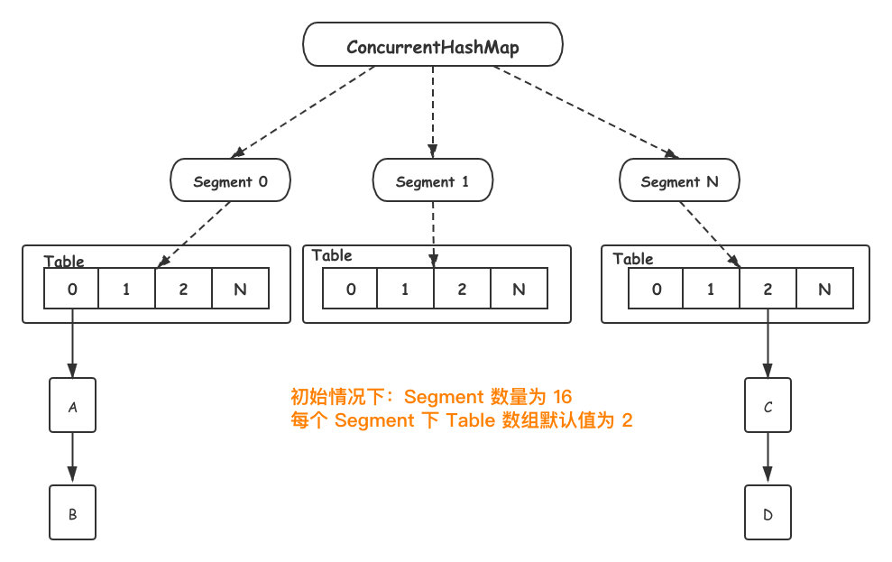
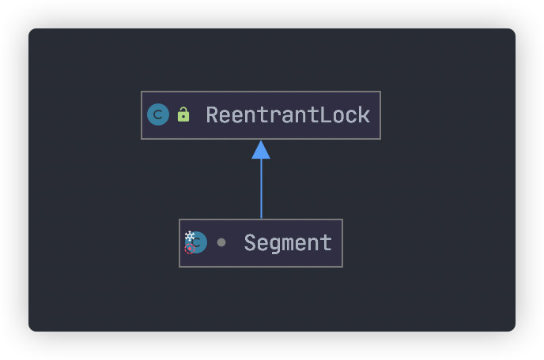
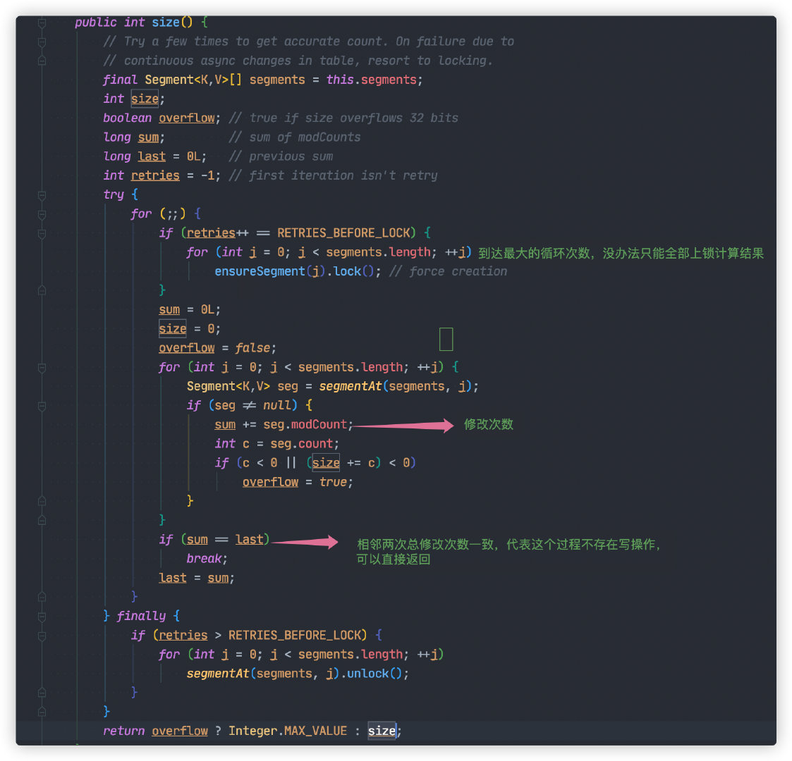
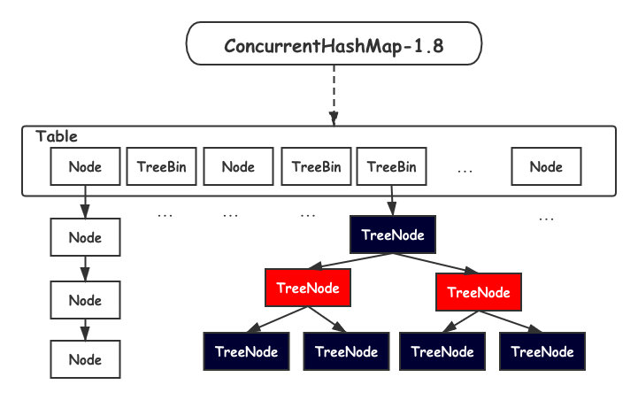
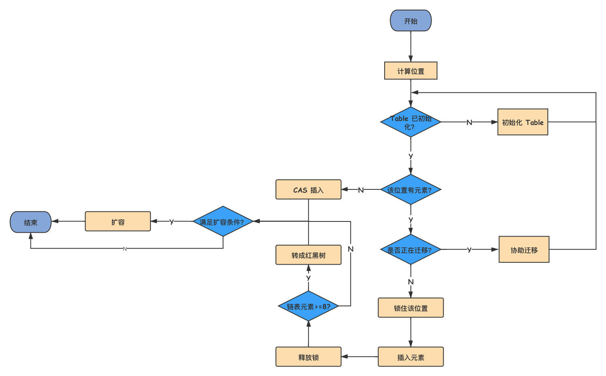
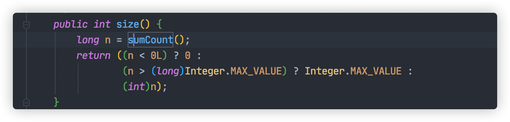
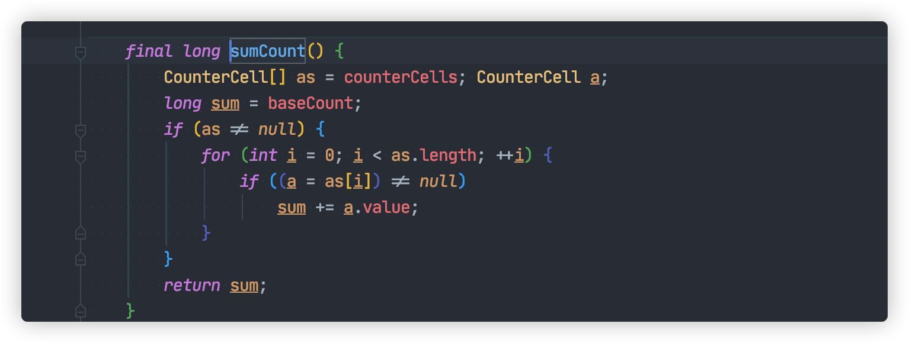

## ConcurrentHashMap

既然多线程共享一把锁，导致性能下降。那么设想一下我们是不是多搞几把锁，分流线程，减少锁冲突，提高并发度。

`ConcurrentHashMap` 正是使用这种方法，不但保证并发过程数据安全，又保证一定的效率。

### JDK1.7

JDK1.7 `ConcurrentHashMap` 数据结构如下所示:



`Segament` 是一个`ConcurrentHashMap`内部类，底层结构与 `HashMap` 一致。另外`Segament` 继承自 `ReentrantLock`，类图如下:



当新元素加入 `ConcurrentHashMap` 时，首先根据 key hash 值找到相应的 `Segament`。接着直接对 `Segament` 上锁，若获取成功，后续操作步骤如同 `HashMap`。

由于锁的存在，`Segament` 内部操作都是并发安全，同时由于其他 `Segament` 未被占用，因此可以支持 **concurrencyLevel** 个线程安全的并发读写。**默认并发度是16**

```java
static final int DEFAULT_CONCURRENCY_LEVEL = 16;
```

**size 统计问题**

虽然 `ConcurrentHashMap` 引入分段锁解决多线程并发的问题，但是同时引入新的复杂度，导致计算 `ConcurrentHashMap` 元素数量将会变得复杂。

由于 `ConcurrentHashMap` 元素实际分布在 `Segament` 中，为了统计实际数量，只能遍历 `Segament`数组求和。

为了数据的准确性，这个过程过我们需要锁住所有的 `Segament`，计算结束之后，再依次解锁。不过这样做，将会导致写操作被阻塞，一定程度降低 `ConcurrentHashMap`性能。

所以这里对 `ConcurrentHashMap#size` 统计方法进行一定的优化。



`Segment` 每次被修改（写入，删除）,都会对 `modCount`（更新次数）加 1。只要相邻两次计算获取所有的 `Segment` `modCount` 总和一致，则代表两次计算过程并无写入或删除，可以直接返回统计数量。

如果三次计算结果都不一致，那没办法只能对所有 `Segment` 加锁，重新计算结果。

这里需要注意的是，这里求得 **size** 数量不能做到 100% 准确。这是因为最后依次对 `Segment` 解锁后，可能会有其他线程进入写入操作。这样就导致返回时的数量与实际数不一致。

不过这也能被接受，总不能因为为了统计元素停止所有元素的写入操作。

**性能问题**

想象一种极端情况的，所有写入都落在同一个 `Segment`中，这就导致`ConcurrentHashMap` 退化成 `SynchronizedMap`，共同抢一把锁。

### JDK1.8 改进方案

JDK1.8 之后，`ConcurrentHashMap` 取消了分段锁的设计细化锁的粒度进一步减少了锁冲突的发生。另外也引入红黑树的结构，进一步提高查找效率。

数据结构如下所示：



`Table` 数组的中每一个 `Node` 我们都可以看做一把锁，这就避免了 `Segament` 退化问题。

另外一旦 `ConcurrentHashMap` 扩容， `Table` 数组元素变多，锁的数量也会变多，并发度也会提高。

总的来说，JDK1.8 使用 CAS 方法加 `synchronized` 方式，保证并发安全。

```java
transient volatile Node<K,V>[] table;
```

#### 初始化

```java
// 这构造函数里，什么都不干
public ConcurrentHashMap() {
}

public ConcurrentHashMap(int initialCapacity) {
    if (initialCapacity < 0)
        throw new IllegalArgumentException();
    int cap = ((initialCapacity >= (MAXIMUM_CAPACITY >>> 1)) ?
               MAXIMUM_CAPACITY :
               tableSizeFor(initialCapacity + (initialCapacity >>> 1) + 1));
    this.sizeCtl = cap;
}
```

这个初始化方法有点意思，通过提供初始容量，计算了 `sizeCtl，sizeCtl = 【 (1.5 * initialCapacity + 1)`，然后向上取最近的 2 的 n 次方】。如 initialCapacity 为 10，那么得到 sizeCtl 为 16，如果 initialCapacity 为 11，得到 sizeCtl 为 32。

**sizeCtl 这个属性使用的场景很多，不过只要跟着文章的思路来，就不会被它搞晕了。**

如果你爱折腾，也可以看下另一个有三个参数的构造方法，这里我就不说了，大部分时候，我们会使用无参构造函数进行实例化，我们也按照这个思路来进行源码分析吧。

#### put 过程分析



仔细地一行一行代码看下去：

```java
public V put(K key, V value) {
    return putVal(key, value, false);
}

final V putVal(K key, V value, boolean onlyIfAbsent) {
    if (key == null || value == null) throw new NullPointerException();
    // 得到 hash 值
    int hash = spread(key.hashCode());
    // 用于记录相应链表的长度
    int binCount = 0;
    for (Node<K,V>[] tab = table;;) {
        Node<K,V> f; int n, i, fh;
        // 如果数组"空"，进行数组初始化
        if (tab == null || (n = tab.length) == 0)
            // 初始化数组，后面会详细介绍
            tab = initTable();

        // 找该 hash 值对应的数组下标，得到第一个节点 f
        else if ((f = tabAt(tab, i = (n - 1) & hash)) == null) {
            // 如果数组该位置为空，
            //    用一次 CAS 操作将这个新值放入其中即可，这个 put 操作差不多就结束了，可以拉到最后面了
            //          如果 CAS 失败，那就是有并发操作，进到下一个循环就好了
            if (casTabAt(tab, i, null,
                         new Node<K,V>(hash, key, value, null)))
                break;                   // no lock when adding to empty bin
        }
        // hash 居然可以等于 MOVED，这个需要到后面才能看明白，不过从名字上也能猜到，肯定是因为在扩容
        else if ((fh = f.hash) == MOVED)
            // 帮助数据迁移，这个等到看完数据迁移部分的介绍后，再理解这个就很简单了
            tab = helpTransfer(tab, f);

        else { // 到这里就是说，f 是该位置的头结点，而且不为空

            V oldVal = null;
            // 获取数组该位置的头结点的监视器锁
            synchronized (f) {
                if (tabAt(tab, i) == f) {
                    if (fh >= 0) { // 头结点的 hash 值大于 0，说明是链表
                        // 用于累加，记录链表的长度
                        binCount = 1;
                        // 遍历链表
                        for (Node<K,V> e = f;; ++binCount) {
                            K ek;
                            // 如果发现了"相等"的 key，判断是否要进行值覆盖，然后也就可以 break 了
                            if (e.hash == hash &&
                                ((ek = e.key) == key ||
                                 (ek != null && key.equals(ek)))) {
                                oldVal = e.val;
                                if (!onlyIfAbsent)
                                    e.val = value;
                                break;
                            }
                            // 到了链表的最末端，将这个新值放到链表的最后面
                            Node<K,V> pred = e;
                            if ((e = e.next) == null) {
                                pred.next = new Node<K,V>(hash, key,
                                                          value, null);
                                break;
                            }
                        }
                    }
                    else if (f instanceof TreeBin) { // 红黑树
                        Node<K,V> p;
                        binCount = 2;
                        // 调用红黑树的插值方法插入新节点
                        if ((p = ((TreeBin<K,V>)f).putTreeVal(hash, key,
                                                       value)) != null) {
                            oldVal = p.val;
                            if (!onlyIfAbsent)
                                p.val = value;
                        }
                    }
                }
            }
            // binCount != 0 说明上面在做链表操作
            if (binCount != 0) {
                // 判断是否要将链表转换为红黑树，临界值和 HashMap 一样，也是 8
                if (binCount >= TREEIFY_THRESHOLD)
                    // 这个方法和 HashMap 中稍微有一点点不同，那就是它不是一定会进行红黑树转换，
                    // 如果当前数组的长度小于 64，那么会选择进行数组扩容，而不是转换为红黑树
                    //    具体源码我们就不看了，扩容部分后面说
                    treeifyBin(tab, i);
                if (oldVal != null)
                    return oldVal;
                break;
            }
        }
    }
    // 这个方法内部会做是否扩容的判断
    addCount(1L, binCount);
    return null;
}

private final void addCount(long x, int check) {
  CounterCell[] as; long b, s;
  if ((as = counterCells) != null ||
      !U.compareAndSwapLong(this, BASECOUNT, b = baseCount, s = b + x)) {
    CounterCell a; long v; int m;
    boolean uncontended = true;
    if (as == null || (m = as.length - 1) < 0 ||
        (a = as[ThreadLocalRandom.getProbe() & m]) == null ||
        !(uncontended =
          U.compareAndSwapLong(a, CELLVALUE, v = a.value, v + x))) {
      // U.compareAndSwapLong(a, CELLVALUE, v = a.value, v + x) 增加计数
      fullAddCount(x, uncontended);
      return;
    }
    if (check <= 1)
      return;
    s = sumCount(); // 获取当前容器中元素的总量
  }
  if (check >= 0) {
    Node<K,V>[] tab, nt; int n, sc;
    // s >= sizeCtl 也就是超过负载了，需要扩容，sizeCtl在表未初始化的时候hash表的总容量也是容器的总容量，后续就会变成负载因子指定的扩容limit,
    while (s >= (long)(sc = sizeCtl) && (tab = table) != null &&
           (n = tab.length) < MAXIMUM_CAPACITY) {
      int rs = resizeStamp(n);
      if (sc < 0) { // 其他线程已经开始执行扩容了
        if ((sc >>> RESIZE_STAMP_SHIFT) != rs || sc == rs + 1 ||
            sc == rs + MAX_RESIZERS || (nt = nextTable) == null ||
            transferIndex <= 0)
          break;
        if (U.compareAndSwapInt(this, SIZECTL, sc, sc + 1))
          // 辅助扩容
          transfer(tab, nt);
      }
      else if (U.compareAndSwapInt(this, SIZECTL, sc,
                                   (rs << RESIZE_STAMP_SHIFT) + 2))
        // 开始扩容
        transfer(tab, null);
      s = sumCount();
    }
  }
}

```

put 的主流程看完了，但是至少留下了几个问题，第一个是初始化，第二个是扩容，第三个是帮助数据迁移，这些我们都会在后面进行一一介绍。

#### 初始化数组：initTable

这个比较简单，主要就是初始化一个**合适大小**的数组，然后会设置 sizeCtl。

初始化方法中的并发问题是通过对 sizeCtl 进行一个 CAS 操作来控制的。

```java
private final Node<K,V>[] initTable() {
    Node<K,V>[] tab; int sc;
    while ((tab = table) == null || tab.length == 0) {
        // 初始化的"功劳"被其他线程"抢去"了
        if ((sc = sizeCtl) < 0)
            Thread.yield(); // lost initialization race; just spin
        // CAS 一下，将 sizeCtl (应该是 size control的缩写) 设置为 -1，代表抢到了锁
        else if (U.compareAndSwapInt(this, SIZECTL, sc, -1)) {
            try {
                if ((tab = table) == null || tab.length == 0) {
                    // DEFAULT_CAPACITY 默认初始容量是 16
                    int n = (sc > 0) ? sc : DEFAULT_CAPACITY;
                    // 初始化数组，长度为 16 或初始化时提供的长度
                    Node<K,V>[] nt = (Node<K,V>[])new Node<?,?>[n];
                    // 将这个数组赋值给 table，table 是 volatile 的
                    table = tab = nt;
                    // 如果 n 为 16 的话，那么这里 sc = 12
                    // 其实就是 0.75 * n
                    sc = n - (n >>> 2);
                }
            } finally {
                // 设置 sizeCtl 为 sc，我们就当是 12 吧
                sizeCtl = sc;
            }
            break;
        }
    }
    return tab;
}
```

#### 链表转红黑树: treeifyBin

前面我们在 put 源码分析也说过，treeifyBin 不一定就会进行红黑树转换，也可能是仅仅做数组扩容。我们还是进行源码分析吧。

```java
private final void treeifyBin(Node<K,V>[] tab, int index) {
    Node<K,V> b; int n, sc;
    if (tab != null) {
        // MIN_TREEIFY_CAPACITY 为 64
        // 所以，如果数组长度小于 64 的时候，其实也就是 32 或者 16 或者更小的时候，会进行数组扩容
        if ((n = tab.length) < MIN_TREEIFY_CAPACITY)
            // 后面我们再详细分析这个方法
            tryPresize(n << 1);
        // b 是头结点
        else if ((b = tabAt(tab, index)) != null && b.hash >= 0) {
            // 加锁
            synchronized (b) {

                if (tabAt(tab, index) == b) {
                    // 下面就是遍历链表，建立一颗红黑树
                    TreeNode<K,V> hd = null, tl = null;
                    for (Node<K,V> e = b; e != null; e = e.next) {
                        TreeNode<K,V> p =
                            new TreeNode<K,V>(e.hash, e.key, e.val,
                                              null, null);
                        if ((p.prev = tl) == null)
                            hd = p;
                        else
                            tl.next = p;
                        tl = p;
                    }
                    // 将红黑树设置到数组相应位置中 红黑叔的实际链接过程代码在TreeBin
                    setTabAt(tab, index, new TreeBin<K,V>(hd));
                }
            }
        }
    }
}
```

#### 扩容：tryPresize

**什么时候触发扩容？**

1. **在树化的时候会先去判断数组的长度是否小于64，就执行数组扩容**
2. **数组中总节点数大于阈值(数组长度的0.75倍)**

如果说 `Java8 ConcurrentHashMap` 的源码不简单，那么说的就是**扩容操作和迁移操作**。

这个方法要完完全全看懂还需要看之后的 `transfer` 方法，读者应该提前知道这点。

这里的扩容也是做翻倍扩容的，扩容后数组容量为原来的 2 倍。

```java
// 首先要说明的是，方法参数 size 传进来的时候就已经翻了倍了
private final void tryPresize(int size) {
    // c：size 的 1.5 倍，再加 1，再往上取最近的 2 的 n 次方。
    int c = (size >= (MAXIMUM_CAPACITY >>> 1)) ? MAXIMUM_CAPACITY :
        tableSizeFor(size + (size >>> 1) + 1);
    int sc;
    while ((sc = sizeCtl) >= 0) {
        Node<K,V>[] tab = table; int n;

        // 这个 if 分支和之前说的初始化数组的代码基本上是一样的，在这里，我们可以不用管这块代码
        if (tab == null || (n = tab.length) == 0) {
            n = (sc > c) ? sc : c;
            if (U.compareAndSwapInt(this, SIZECTL, sc, -1)) {
                try {
                    if (table == tab) {
                        @SuppressWarnings("unchecked")
                        Node<K,V>[] nt = (Node<K,V>[])new Node<?,?>[n];
                        table = nt;
                        sc = n - (n >>> 2); // 0.75 * n
                    }
                } finally {
                    sizeCtl = sc;
                }
            }
        }
        else if (c <= sc || n >= MAXIMUM_CAPACITY)
            break;
        else if (tab == table) {
            // 我没看懂 rs 的真正含义是什么，不过也关系不大
            int rs = resizeStamp(n);

            if (sc < 0) {
                Node<K,V>[] nt;
                if ((sc >>> RESIZE_STAMP_SHIFT) != rs || sc == rs + 1 ||
                    sc == rs + MAX_RESIZERS || (nt = nextTable) == null ||
                    transferIndex <= 0)
                    break;
                // 2. 用 CAS 将 sizeCtl 加 1，然后执行 transfer 方法
                //    此时 nextTab 不为 null
                if (U.compareAndSwapInt(this, SIZECTL, sc, sc + 1))
                    transfer(tab, nt);
            }
            // 1. 将 sizeCtl 设置为 (rs << RESIZE_STAMP_SHIFT) + 2)
            //     我是没看懂这个值真正的意义是什么？不过可以计算出来的是，结果是一个比较大的负数
            //  调用 transfer 方法，此时 nextTab 参数为 null
            else if (U.compareAndSwapInt(this, SIZECTL, sc,
                                         (rs << RESIZE_STAMP_SHIFT) + 2))
                transfer(tab, null);
        }
    }
}
```

这个方法的核心在于 sizeCtl 值的操作，首先将其设置为一个负数，然后执行 transfer(tab, null)，再下一个循环将 sizeCtl 加 1，并执行 transfer(tab, nt)，之后可能是继续 sizeCtl 加 1，并执行 transfer(tab, nt)。

所以，可能的操作就是执行 `1 次 transfer(tab, null) + 多次 transfer(tab, nt)`，这里怎么结束循环的需要看完 transfer 源码才清楚。

#### 数据迁移：transfer

下面这个方法有点长，将原来的 tab 数组的元素迁移到新的 nextTab 数组中。

虽然我们之前说的 tryPresize 方法中多次调用 transfer 不涉及多线程，但是这个 transfer 方法可以在其他地方被调用，典型地，我们之前在说 put 方法的时候就说过了，请往上看 put 方法，是不是有个地方调用了 helpTransfer 方法，helpTransfer 方法会调用 transfer 方法的。

此方法支持多线程执行，外围调用此方法的时候，会保证第一个发起数据迁移的线程，nextTab 参数为 null，之后再调用此方法的时候，nextTab 不会为 null。

阅读源码之前，先要理解并发操作的机制。原数组长度为 n，所以我们有 n 个迁移任务，让每个线程每次负责一个小任务是最简单的，每做完一个任务再检测是否有其他没做完的任务，帮助迁移就可以了，而 Doug Lea 使用了一个 stride，简单理解就是步长，每个线程每次负责迁移其中的一部分，如每次迁移 16 个小任务。所以，我们就需要一个全局的调度者来安排哪个线程执行哪几个任务，这个就是属性 transferIndex 的作用。

第一个发起数据迁移的线程会将 transferIndex 指向原数组最后的位置，然后从后往前的 stride 个任务属于第一个线程，然后将 transferIndex 指向新的位置，再往前的 stride 个任务属于第二个线程，依此类推。当然，这里说的第二个线程不是真的一定指代了第二个线程，也可以是同一个线程，这个读者应该能理解吧。其实就是将一个大的迁移任务分为了一个个任务包。

```java
private final void transfer(Node<K,V>[] tab, Node<K,V>[] nextTab) {
    int n = tab.length, stride;

    // stride 在单核下直接等于 n，多核模式下为 (n>>>3)/NCPU，不过有一个最小值规定是 16
    // stride 可以理解为”步长“，有 n 个位置是需要进行迁移的，
    //   将这 n 个任务分为多个任务包，每个任务包有 stride 个任务
    if ((stride = (NCPU > 1) ? (n >>> 3) / NCPU : n) < MIN_TRANSFER_STRIDE)
        stride = MIN_TRANSFER_STRIDE; // subdivide range

    // 如果 nextTab 为 null，先进行一次初始化
    //    前面我们说了，外围会保证第一个发起迁移的线程调用此方法时，参数 nextTab 为 null
    //       之后参与迁移的线程调用此方法时，nextTab 不会为 null
    if (nextTab == null) {
        try {
            // 容量翻倍
            Node<K,V>[] nt = (Node<K,V>[])new Node<?,?>[n << 1];
            nextTab = nt;
        } catch (Throwable ex) {      // try to cope with OOME
            sizeCtl = Integer.MAX_VALUE;
            return;
        }
        // nextTable 是 ConcurrentHashMap 中的属性
        nextTable = nextTab;
        // transferIndex 也是 ConcurrentHashMap 的属性，用于控制迁移的位置
        transferIndex = n;
    }

    int nextn = nextTab.length;

    // ForwardingNode 翻译过来就是正在被迁移的 Node
    // 这个构造方法会生成一个Node，key、value 和 next 都为 null，关键是 hash 为 MOVED
    // 后面我们会看到，原数组中位置 i 处的节点完成迁移工作后，
    //    就会将位置 i 处设置为这个 ForwardingNode，用来告诉其他线程该位置已经处理过了
    //    所以它其实相当于是一个标志。
    ForwardingNode<K,V> fwd = new ForwardingNode<K,V>(nextTab);


    // advance 指的是做完了一个位置的迁移工作，可以准备做下一个位置的了
    boolean advance = true;
    boolean finishing = false; // to ensure sweep before committing nextTab

    /*
     * 下面这个 for 循环，最难理解的在前面，而要看懂它们，应该先看懂后面的，然后再倒回来看
     * 
     */

    // i 是位置索引，bound 是边界，注意是从后往前
    for (int i = 0, bound = 0;;) {
        Node<K,V> f; int fh;

        // 下面这个 while 真的是不好理解
        // advance 为 true 表示可以进行下一个stride的迁移了
        //   简单理解结局：i 指向了 transferIndex，bound 指向了 transferIndex-stride
        while (advance) {
            int nextIndex, nextBound;
            if (--i >= bound || finishing)
                advance = false;

            // 将 transferIndex 值赋给 nextIndex
            // 这里 transferIndex 一旦小于等于 0，说明原数组的所有位置都有相应的线程去处理了
            else if ((nextIndex = transferIndex) <= 0) {
                i = -1;
                advance = false;
            }
            else if (U.compareAndSwapInt
                     (this, TRANSFERINDEX, nextIndex,
                      nextBound = (nextIndex > stride ?
                                   nextIndex - stride : 0))) {
                // 看括号中的代码，nextBound 是这次迁移任务的边界，注意，是从后往前
                bound = nextBound;
                i = nextIndex - 1;
                advance = false;
            }
        }
        if (i < 0 || i >= n || i + n >= nextn) {
            int sc;
            if (finishing) {
                // 所有的迁移操作已经完成
                nextTable = null;
                // 将新的 nextTab 赋值给 table 属性，完成迁移
                table = nextTab;
                // 重新计算 sizeCtl：n 是原数组长度，所以 sizeCtl 得出的值将是新数组长度的 0.75 倍
                sizeCtl = (n << 1) - (n >>> 1);
                return;
            }

            // 之前我们说过，sizeCtl 在迁移前会设置为 (rs << RESIZE_STAMP_SHIFT) + 2
            // 然后，每有一个线程参与迁移就会将 sizeCtl 加 1，
            // 这里使用 CAS 操作对 sizeCtl 进行减 1，代表做完了属于自己的任务
            if (U.compareAndSwapInt(this, SIZECTL, sc = sizeCtl, sc - 1)) {
                // 任务结束，方法退出
                if ((sc - 2) != resizeStamp(n) << RESIZE_STAMP_SHIFT)
                    return;

                // 到这里，说明 (sc - 2) == resizeStamp(n) << RESIZE_STAMP_SHIFT，
                // 也就是说，所有的迁移任务都做完了，也就会进入到上面的 if(finishing){} 分支了
                finishing = advance = true;
                i = n; // recheck before commit
            }
        }
        // 如果位置 i 处是空的，没有任何节点，那么放入刚刚初始化的 ForwardingNode ”空节点“
        else if ((f = tabAt(tab, i)) == null)
            advance = casTabAt(tab, i, null, fwd);  // 该位置处是一个 ForwardingNode，代表该位置已经有线程在处理迁移
        else if ((fh = f.hash) == MOVED)
            advance = true; // already processed
        else {
            // 对数组该位置处的结点加锁，开始处理数组该位置处的迁移工作
            synchronized (f) {
                if (tabAt(tab, i) == f) {
                    Node<K,V> ln, hn;
                    // 头结点的 hash 大于 0，说明是链表的 Node 节点
                    if (fh >= 0) {
                        // 下面这一块和 Java7 中的 ConcurrentHashMap 迁移是差不多的，
                        // 需要将链表一分为二，
                        //   找到原链表中的 lastRun，然后 lastRun 及其之后的节点是一起进行迁移的
                        //   lastRun 之前的节点需要进行克隆，然后分到两个链表中
                        int runBit = fh & n;
                        Node<K,V> lastRun = f;
                        for (Node<K,V> p = f.next; p != null; p = p.next) {
                            int b = p.hash & n;
                            if (b != runBit) {
                                runBit = b;
                                lastRun = p;
                            }
                        }
                        if (runBit == 0) {
                            ln = lastRun;
                            hn = null;
                        }
                        else {
                            hn = lastRun;
                            ln = null;
                        }
                        for (Node<K,V> p = f; p != lastRun; p = p.next) {
                            int ph = p.hash; K pk = p.key; V pv = p.val;
                            if ((ph & n) == 0)
                                ln = new Node<K,V>(ph, pk, pv, ln);
                            else
                                hn = new Node<K,V>(ph, pk, pv, hn);
                        }
                        // 其中的一个链表放在新数组的位置 i
                        setTabAt(nextTab, i, ln);
                        // 另一个链表放在新数组的位置 i+n
                        setTabAt(nextTab, i + n, hn);
                        // 将原数组该位置处设置为 fwd，代表该位置已经处理完毕，
                        //    其他线程一旦看到该位置的 hash 值为 MOVED，就不会进行迁移了
                        setTabAt(tab, i, fwd);
                        // advance 设置为 true，代表该位置已经迁移完毕
                        advance = true;
                    }
                    else if (f instanceof TreeBin) {
                        // 红黑树的迁移
                        TreeBin<K,V> t = (TreeBin<K,V>)f;
                        TreeNode<K,V> lo = null, loTail = null;
                        TreeNode<K,V> hi = null, hiTail = null;
                        int lc = 0, hc = 0;
                        for (Node<K,V> e = t.first; e != null; e = e.next) {
                            int h = e.hash;
                            TreeNode<K,V> p = new TreeNode<K,V>
                                (h, e.key, e.val, null, null);
                            if ((h & n) == 0) {
                                if ((p.prev = loTail) == null)
                                    lo = p;
                                else
                                    loTail.next = p;
                                loTail = p;
                                ++lc;
                            }
                            else {
                                if ((p.prev = hiTail) == null)
                                    hi = p;
                                else
                                    hiTail.next = p;
                                hiTail = p;
                                ++hc;
                            }
                        }
                        // 如果一分为二后，节点数少于 8，那么将红黑树转换回链表
                        ln = (lc <= UNTREEIFY_THRESHOLD) ? untreeify(lo) :
                            (hc != 0) ? new TreeBin<K,V>(lo) : t;
                        hn = (hc <= UNTREEIFY_THRESHOLD) ? untreeify(hi) :
                            (lc != 0) ? new TreeBin<K,V>(hi) : t;

                        // 将 ln 放置在新数组的位置 i
                        setTabAt(nextTab, i, ln);
                        // 将 hn 放置在新数组的位置 i+n
                        setTabAt(nextTab, i + n, hn);
                        // 将原数组该位置处设置为 fwd，代表该位置已经处理完毕，
                        //    其他线程一旦看到该位置的 hash 值为 MOVED，就不会进行迁移了
                        setTabAt(tab, i, fwd);
                        // advance 设置为 true，代表该位置已经迁移完毕
                        advance = true;
                    }
                }
            }
        }
    }
}
```

说到底，transfer 这个方法并没有实现所有的迁移任务，每次调用这个方法只实现了 transferIndex 往前 stride 个位置的迁移工作，其他的需要由外围来控制。

这个时候，再回去仔细看 tryPresize 方法可能就会更加清晰一些了。

#### get 过程分析(不需要使用锁)

**get利用了 volatile 来保证了数据的可见性** 

get 方法从来都是最简单的，这里也不例外：

1、计算 hash 值
2、根据 hash 值找到数组对应位置: (n - 1) & h
3、根据该位置处结点性质进行相应查找

- 如果该位置为 null，那么直接返回 null 就可以了
- 如果该位置处的节点刚好就是我们需要的，返回该节点的值即可
- 如果该位置节点的 hash 值小于 0，说明正在扩容，或者是红黑树，后面我们再介绍 find 方法
- 如果以上 3 条都不满足，那就是链表，进行遍历比对即可

```java
public V get(Object key) {
    Node<K,V>[] tab; Node<K,V> e, p; int n, eh; K ek;
    int h = spread(key.hashCode());
    if ((tab = table) != null && (n = tab.length) > 0 &&
        (e = tabAt(tab, (n - 1) & h)) != null) {
        // 判断头结点是否就是我们需要的节点
        if ((eh = e.hash) == h) {
            if ((ek = e.key) == key || (ek != null && key.equals(ek)))
                return e.val;
        }
        // 如果头结点的 hash 小于 0，说明 正在扩容，或者该位置是红黑树
        else if (eh < 0)
            // 参考 ForwardingNode.find(int h, Object k) 和 TreeBin.find(int h, Object k)
            return (p = e.find(h, key)) != null ? p.val : null;

        // 遍历链表
        while ((e = e.next) != null) {
            if (e.hash == h &&
                ((ek = e.key) == key || (ek != null && key.equals(ek))))
                return e.val;
        }
    }
    return null;
}
```

简单说一句，此方法的大部分内容都很简单，只有正好碰到扩容的情况，ForwardingNode.find(int h, Object k) 稍微复杂一些，不过在了解了数据迁移的过程后，这个也就不难了，所以限于篇幅这里也不展开说了。

**因为只有在原来的table 的相同位置的数据已经迁移完成，oldTable的`i`位置的数据都迁移nextTable中，oldTable的`i`位置才会替换成 ForwardingNode， ForwardingNode的find 是在 nextTable 中查询数据，所以查询是不需要锁的,基于数据volatile的可见性即可**

**size 方法优化**

JDK1.8 `ConcurrentHashMap#size` 统计方法还是比较简单的：



这个方法我们需要知道两个重要变量：

- `baseCount`
- `CounterCell[] counterCells`

`baseCount` 记录元素数量的，每次元素元素变更之后，将会使用 `CAS`方式更新该值。

如果多个线程并发增加新元素，`baseCount` 更新冲突，将会启用 `CounterCell`，通过使用 `CAS` 方式将总数更新到 `counterCells` 数组对应的位置，减少竞争。

如果 `CAS` 更新 `counterCells` 数组某个位置出现多次失败，这表明多个线程在使用这个位置。此时将会通过扩容 `counterCells`方式，再次减少冲突。

通过上面的努力，统计元素总数就变得非常简单，只要计算 `baseCount` 与 `counterCells`总和，整个过程都不需要加锁。

仔细回味一下，`counterCells` 也是通过类似分段锁思想，减少多线程竞争。


## ConcurrentHashMap 哪些保证的是哪些操作的线程安全

1. put 保证了对hash表的桶的操作，以及挂链的操作是并发安全的，不会出现并发put,n个hash相等的key，最后只插入成功<n个key ，保证容量计数的准确性

2. 同理remove.....

## ConcurrentHashMap一定线程安全吗？

不是的，并发安全集合类就和我们的DB一样的，如果我们多线程采取读改写操作的话，也会出现数据安全问题，比如我们的ConcurrentHashMap

```java
public class CHMDemo {
    public static void main(String[] args) throws InterruptedException {
        ConcurrentHashMap<String, Integer> map = new ConcurrentHashMap<String,Integer>();
        map.put("key", 1);
        ExecutorService executorService = Executors.newFixedThreadPool(100);
        for (int i = 0; i < 1000; i++) {
            executorService.execute(new Runnable() {
                @Override
                public void run() {// 这里做读改写操作
                    int key = map.get("key") + 1; //step 1
                    map.put("key", key);//step 2
                }
            });
        }
        Thread.sleep(3000); //模拟等待执行结束
        System.out.println("------" + map.get("key") + "------");
        executorService.shutdown();
    }
}
```

读和读是可以并行的，那么就会读取到相同的值，修改，然后写入就发生了数据不一致问题。

这里解决的方法是 我们可以用原子类

```java
public class CHMDemo {
    public static void main(String[] args) throws InterruptedException {
        ConcurrentHashMap<String, AtomicInteger> map = new ConcurrentHashMap<String,AtomicInteger>();
        AtomicInteger integer = new AtomicInteger(1);
        map.put("key", integer);
        ExecutorService executorService = Executors.newFixedThreadPool(100);
        for (int i = 0; i < 1000; i++) {
            executorService.execute(new Runnable() {
                @Override
                public void run() {// 读改写
                    map.get("key").incrementAndGet();
                }
            });
        }// 都改写
        Thread.sleep(3000); //模拟等待执行结束
        System.out.println("------" + map.get("key") + "------");
        executorService.shutdown();
    }
}
```

> 作者：深夜里的程序猿
> 链接：https://juejin.im/post/5cb846a85188253772753d36
> 来源：掘金
> 著作权归作者所有。商业转载请联系作者获得授权，非商业转载请注明出处。

## 分段锁实战应用

`ConcurrentHashMap` 通过使用分段锁的设计方式，降低锁的粒度，提高并发度。我们可以借鉴这种设计，解决某些**热点数据**更新问题。

举个例子，假如现在我们有一个支付系统，用户每次支付成功，商家的账户余额就会相应的增加。

当大促的时候，非常多用户同时支付，同一个商家账户余额会被并发更新。

数据库层面为了保证数据安全，每次更新时将会使用行锁。同时并发更新的情况，只有一个线程才能获取锁，更新数据，其他线程只能等待锁释放。这就很有可能导致其他线程余额更新操作耗时过长，甚至事务超时，余额更新失败的。

这就是一个典型的**热点数据**更新问题。

这个问题实际原因是因为多线程并发抢夺**行锁**导致，那如果有多把行锁，是不是就可以降低锁冲突了那？

没错，这里我们借鉴 `ConcurrentHashMap` 分段锁的设计，在商家的账户的下创建多个**影子账户**。

然后每次更新余额，随机选择某个**影子账户**进行相应的更新。

理论上**影子账户**可以创建无数个，这就代表我们可以无限提高并发的能力。

架构设计中引入新的方案，就代表会引入新的复杂度，我们一定要将这些问题考虑清楚，综合权衡设计。

引入影子账户虽然解决热点数据的问题，但是商户总余额统计就变得很麻烦，我们必须统计所有子账户的余额。

另外实际的业务场景，商家余额不只是会增加，还有可能的进行相应的扣减。这就有可能产生商户总余额是足够的，但是选中的影子账户的余额却不足。可以采用收款和支付拆分，支付测做预存设定好金额做数据预拆分放到一个容器中，一个个取出来去发钱即可，当然还有一些其他场景可能需要一些其他特殊的设计

## 总结

1. 不要一提到多线程环境，就直接使用 `ConcurrentHashMap`。如果仅仅使用 `Map` 当做全局变量，而这个变量初始加载之后，从此数据不再变动的场景下。建议使用不变集合类 `Collections#unmodifiableMap`,或者使用 Guava 的 `ImmutableMap`。不变集合的好处在于，可以有效防止其他线程偷偷修改，从而引发一些业务问题。

2. `ConcurrentHashMap` 分段锁的经典思想，我们可以应用在**热点更新**的场景，提高更新效率。
3. 不是说并发安全的容器就一定安全了，使用不当还是会存在不安全的情况