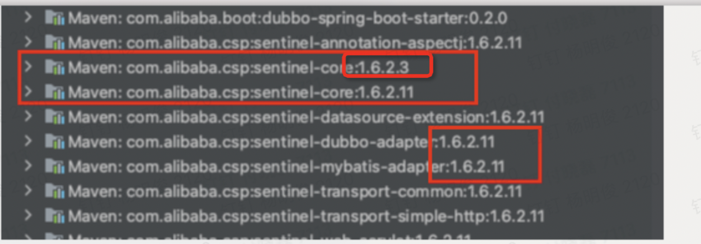

# nested exception is java.lang.NoClassDefFoundError: com/alibaba/csp/sentinel/slots/block/DelegateBlockException

java.lang.NoClassDefFoundError 是因为Java虚拟机在编译时能找到合适的类，而在运行时不能找到合适的类导致的错误，遇到这种情况需要去查看对应的包的版本是否又问题

比如

Sentinel-core 就存在两个版本就会导致找不到对应的执行类的问题
