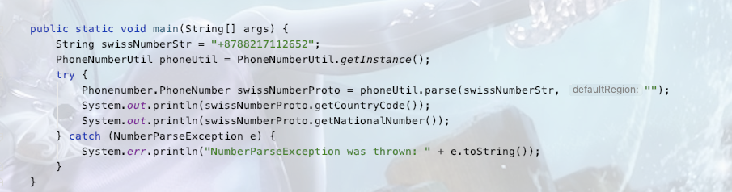

git地址： https://github.com/google/libphonenumber




规则是只需要逐步进行区号匹配——从最小位数的区号逐级向下，只要能够匹配上下面区号串中的区号段，那么这就是这段号码的区号，剩下的就是除了区号之外的号码

区号串：

```
{1:["US","AG","AI","AS","BB","BM","BS","CA","DM","DO","GD","GU","JM","KN","KY","LC","MP","MS","PR","SX","TC","TT","VC","VG","VI"],7:["RU","KZ"],20:["EG"],27:["ZA"],30:["GR"],31:["NL"],32:["BE"],33:["FR"],34:["ES"],36:["HU"],39:["IT","VA"],40:["RO"],41:["CH"],43:["AT"],44:["GB","GG","IM","JE"],45:["DK"],46:["SE"],47:["NO","SJ"],48:["PL"],49:["DE"],51:["PE"],52:["MX"],53:["CU"],54:["AR"],55:["BR"],56:["CL"],57:["CO"],58:["VE"],60:["MY"],61:["AU","CC","CX"],62:["ID"],63:["PH"],64:["NZ"],65:["SG"],66:["TH"],590:["GP","BL","MF"],591:["BO"],592:["GY"],81:["JP"],593:["EC"],82:["KR"],594:["GF"],595:["PY"],84:["VN"],596:["MQ"],597:["SR"],86:["CN"],598:["UY"],599:["CW","BQ"],90:["TR"],91:["IN"],92:["PK"],93:["AF"],94:["LK"],95:["MM"],98:["IR"],670:["TL"],672:["NF"],673:["BN"],674:["NR"],675:["PG"],676:["TO"],677:["SB"],678:["VU"],679:["FJ"],680:["PW"],681:["WF"],682:["CK"],683:["NU"],685:["WS"],686:["KI"],687:["NC"],688:["TV"],689:["PF"],690:["TK"],691:["FM"],692:["MH"],211:["SS"],212:["MA","EH"],213:["DZ"],216:["TN"],218:["LY"],220:["GM"],221:["SN"],222:["MR"],223:["ML"],224:["GN"],225:["CI"],226:["BF"],227:["NE"],228:["TG"],229:["BJ"],230:["MU"],231:["LR"],232:["SL"],233:["GH"],234:["NG"],235:["TD"],236:["CF"],237:["CM"],238:["CV"],239:["ST"],240:["GQ"],241:["GA"],242:["CG"],243:["CD"],244:["AO"],245:["GW"],246:["IO"],247:["AC"],248:["SC"],249:["SD"],250:["RW"],251:["ET"],252:["SO"],253:["DJ"],254:["KE"],255:["TZ"],256:["UG"],257:["BI"],258:["MZ"],260:["ZM"],261:["MG"],262:["RE","YT"],263:["ZW"],264:["NA"],265:["MW"],266:["LS"],267:["BW"],268:["SZ"],269:["KM"],800:["001"],290:["SH","TA"],291:["ER"],808:["001"],297:["AW"],298:["FO"],299:["GL"],850:["KP"],852:["HK"],853:["MO"],855:["KH"],856:["LA"],350:["GI"],351:["PT"],352:["LU"],353:["IE"],354:["IS"],355:["AL"],356:["MT"],357:["CY"],358:["FI","AX"],870:["001"],359:["BG"],878:["001"],880:["BD"],881:["001"],370:["LT"],882:["001"],371:["LV"],883:["001"],372:["EE"],373:["MD"],374:["AM"],886:["TW"],375:["BY"],376:["AD"],888:["001"],377:["MC"],378:["SM"],380:["UA"],381:["RS"],382:["ME"],383:["XK"],385:["HR"],386:["SI"],387:["BA"],389:["MK"],420:["CZ"],421:["SK"],423:["LI"],960:["MV"],961:["LB"],962:["JO"],963:["SY"],964:["IQ"],965:["KW"],966:["SA"],967:["YE"],968:["OM"],970:["PS"],971:["AE"],972:["IL"],973:["BH"],974:["QA"],975:["BT"],976:["MN"],977:["NP"],979:["001"],992:["TJ"],993:["TM"],994:["AZ"],995:["GE"],996:["KG"],998:["UZ"],500:["FK"],501:["BZ"],502:["GT"],503:["SV"],504:["HN"],505:["NI"],506:["CR"],507:["PA"],508:["PM"],509:["HT"]}
```

