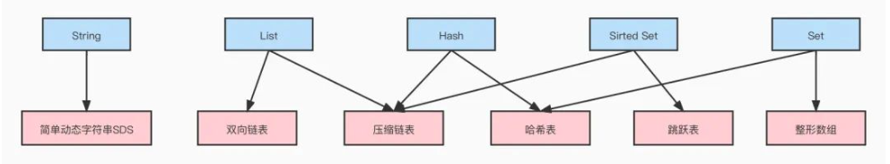
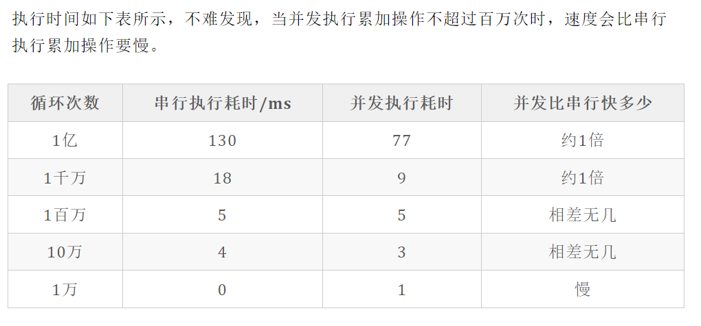
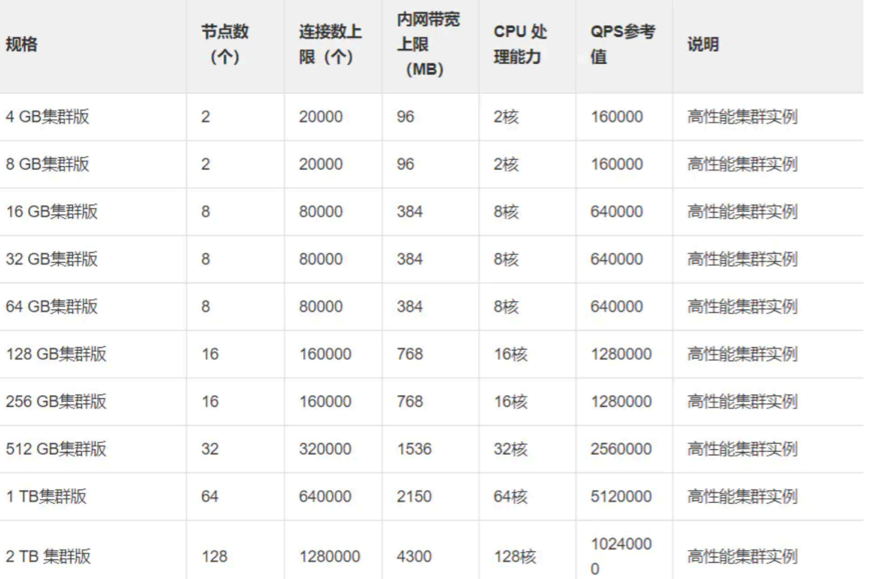

redis 6.0 新特性 开始支持 多线程（使用多线程 批量解析read请求，write请求，解析之后的指令还是原来的redis 线程执行，性能提升了2倍）

redis相关博客：值得一看

1. https://mp.weixin.qq.com/s/vXBFscXqDcXS_VaIERplMQ
2. https://mp.weixin.qq.com/s/aOiadiWG2nNaZowmoDQPMQ

# redis为什么这么快

https://mp.weixin.qq.com/s/KtzvawDnQQwhfjnCoXpcMQ

1. 数据都在内存中

2. 高效的数据结构，整体的数据的存储结构使用了hash表：通过key集权hash值，并计算在数组中的位置，而数组的随机访问效率是O(1). 就算hash冲突形成的链表也不会很长，达到限制后会做rehash 扩展数组的大小。这样就能保证key的查询的整体的效率是O(N) 的。除此之外value的数据也是一些很优秀的结构：

   

   value的底层数据结构详解：[redis-design&implementation.md](redis-design&implementation.md)

   **这里需要说明一下的是 List结构在 redis 3.2 版本以后使用的时候 quickList 的数据结构，这是一个糅合了双端链表+zipList 的数据结构。**

   

   **有人会问，redis的hash表是采用链地址法处理hash冲突的，那么必然会存在链表结构。如果储存的数据量越来越大，hash冲突就会越来越严重，导致链表变得很长让查询效率降低。这里redis会根据负载因子（hashtable.used/hashtable.size）>1 / > 5的时候就会自动扩容，绝大多数在>1 的时候扩容。redis的hashtable.size = hashtable的数组部分的长度。**

   **我们由知道hash表的数组部分是2的n次方的数量级。 那如果是一个256的数组的hash表。意味著存储256个元素的时候就会被扩容。且 redi采用的hash算法的散列性是足够好的，这就保证了链表的长度不会太长。即使在特殊情况（redis在执行BGSAVE/BGREWRITEAOF 这样的命令的时候）>5 时才扩容，因为hash算法的散列性非常好。所以这个链表也不会很长。还是能保证查询的时间复杂度是O(n). 而且redis的链表是头插法，更加能保证热点数据的访问效率** 

3. 单线程处理命令IO以及命令。（**<u>2核心</u>  <u>4G内存</u> <u>20000连接上限</u> *<u>就能支持16W的QPS</u>***）

   单线程在一定量级之下的效率是高于多线程的。因为多线程存在线程的上下文切换这个是较为耗时的操作。

   

   我们可以看到O(1) 级别的 累加操作的在100W次以内的耗时，多线程并不优于单线程，并且数量级越低单线程更快。

   而 redis 所支持的是10W级别的吞吐量。虽说不完全是O(1)级别的操作，但这个量级显然单线程会更好。

   

4. 使用多路复用IO高效处理大量链接：我们通过第三点之后，单线程并不是限制redis性能的瓶颈，要确保在单线程下redis的性能能够提高到他想要的标准。redis采用了多路复用IO。多路复用IO在大量链接的场景中是优于阻塞IO的。它能够实现在单线程下监听多链接的IO事件并处理，提高这些IO的实践的处理性能。如果使用阻塞IO的话这里发生会一个IO阻塞之后其他IO只能等待，这势必会影响IO时间的处理性能。

   

# HyperLoglog解决统计问题

https://mp.weixin.qq.com/s/9dtGe3d_mbbxW5FpVPDNow

## 慢查询日志

## redis 事务

## 监视器

## 持久化

* https://mp.weixin.qq.com/s/O_qDco6-Dasu3RomWIK_Ig
* 

# redis 缓存淘汰（回收）策略：

> https://mp.weixin.qq.com/s/-caMTrOXQu-o0O44e6I9dQ

当达到maxmemory限制的时候Redis会使用的行为由 Redis的maxmemory-policy配置指令来进行配置。

以下的策略是可用的:

* **针对设置过期时间的key(这种key在redis内部一个过期集合中会有指向它们的索引)**

  * **volatile-lru**: 尝试回收最少使用的键（LRU）使得新添加的数据有空间存放。
  * **volatile-lfu：**尝试回收最近访问次次数最少的键（LFU）使得新添加的数据有空间存放。
  * **volatile-random**: 回收随机的键使得新添加的数据有空间存放使得新添加的数据有空间存放。
  * **volatile-ttl**: 回收在过期集合的键，并且优先回收存活时间（TTL）较短的键,使得新添加的数据有空间存放。

* **针对所有key**

  - **allkeys-lru**: 尝试回收最少使用的键（LRU），使得新添加的数据有空间存放。

  - **allkeys-random**: 回收随机的键使得新添加的数据有空间存放。
  - **allkeys-lfu：**尝试回收最近访问次次数最少的键（LFU）使得新添加的数据有空间存放。

* **不做处理**

  * **noeviction**:拒绝所有写入操作（大部分的写入指令，但DEL和几个例外），返回一个错误"(error) OOM command not allowed when used memory"

## 策略选择

LRU 算法（Least Recently Used，最近最少使用）：淘汰很久没被访问过的数据，以最近一次访问时间作为参考

> #### Redis 改进后的 LRU 算法
>
> 在 `Redis` 当中，并没有采用传统的 `LRU` 算法，因为传统的 `LRU` 算法存在 `2` 个问题：
>
> - 需要额外的空间进行存储。
> - 可能存在某些 `key` 值使用很频繁，但是最近没被使用，从而被 `LRU` 算法删除。
>
> 为了避免以上 `2` 个问题，`Redis` 当中对传统的 `LRU` 算法进行了改造，**通过抽样的方式进行删除**。
>
> 配置文件中提供了一个属性 `maxmemory_samples 5`，默认值就是 `5`，表示随机抽取 `5` 个 `key` 值，然后对这 `5` 个 `key` 值按照 `LRU` 算法进行删除
>
> 

LFU 算法（Least Frequently Used，最不经常使用）：淘汰最近一段时间被访问次数最少的数据，以次数作为参考

需要指出的是 ： LRU 算法或者 TTL 算法都是不是很精确算法，而是一个近似的算法。 Redis 不会通过对全部的键值对进行比较来确定最精确的时间值，从而确定删除哪个键值对 ， 因为这将消耗太多的时间 ， 导致回收垃圾执行的时间太长 ， 造成服务停顿.

当存在热点数据时，LRU的效率很好，但偶发性的、周期性的批量操作会导致LRU命中率急剧下降，缓存污染情况比较严重。这时使用LFU可能更好点

根据自身业务类型，配置好maxmemory-policy(默认是noeviction)，推荐使用volatile-lru。

# redis 失效缓存删除策略：

* 定时删除：会定时清理失效缓存，整个清理时间会控制在一个范围（避免占用过多cpu资源）
* 惰性删除：每当一个key被访问的时候，检查他是否过期，如果过期则进行删除

# redis中的缓存失效，内存回收还需要注意

由于redis 底层是存在对象共享机制的，也就是说 一个value，可能被多个key引用。在回收的时候，比如过期回收，key可以回收，但是value 只是做他的引用次数-1，当value 引用次数=0的时候才能删除

# redis 的线程模型

单线程 Reactor 模型

# 如果使用redis 实现延迟消息队列

**方案一：**

使用sortedset，想要执行时间的时间戳作为score，消息内容作为key调用zadd来生产消息，消费者用zrangebyscore指令获取N秒之前的数据轮询进行处理。

1. 比如 当前是 2023-09-11 17:52 30s 要延时5s,  score = 2023-09-11 17:52 35s 存入 sortedset. 然后调用 zrangebyscore zset (currentTime currentTime+5s  查询0到当前时间+5s内的数据，加上 WITHSCORES 条件 这样可以获取到我们的 score数据用于时间的对比。最好再加上 limit 条件，避免因为一个故障导致一段时间没有消费，导致的该命令查询的数据过大，导致比较大的延时以及占用过大的带宽等问题,其实可以使用 luna 脚本，因为返回的数据是排好序的，所以我们可以从前往后筛选出可使用的数据，计数获得 coount 然后再调用  ZPOPMIN key [count] 就可以获取这些数据并移除这些数据，然后客户端拿到这个数据消费即可。因为 luna 脚本是原子的。并且 redis单线程，这样可以避免分布式场景下多台机器同时消费导致的重复问题。

   **这种实现方式避免会增加redis的一定的性能消耗。**

2. 还有一个方式不用 luna脚本，加锁，在获取到数据并且处理完成之后，执行 ZPOPMIN key [count] 移除 set中这些元素，然后释放锁. 这个实现方式需要在为消费完成 数据前，不断的给锁续期保证锁不会应为这个问题而失效。其实性能不一定能比 luna脚本好。

   这里不加锁如果采用幂等的方式处理消息会有问题，因为我们还有一个删除的动作，那么你没法确定他应该多少数据

3. 分布式的每台机器都 pop 一些数据在自己的内存中，自旋检查知道可以执行的时候处理任务，处理完之后在继续 pop.

   优点：不会存在没有必要的 redis 检查耗时。

   缺点：机器会又一定自旋等待直到任务可执行的损耗，其次机器宕机会丢失这批数据

4. 单台机器处理任务。那就不存在需要同步多台机器的问题了。

   按照方案2来做机器，需要加锁。

5. 通过对数据做分片，也就是对拆分成 key1,key2,key3..... 这样的结构(类似 一个个的队列)。

   然后发送消息的时候根据这个结构将数据分到不同的key上。然后发送端同时需要监听一个key的结构数据的变更 channel / 使用 zk. 这样在 key有增加的时候，能够感知到这个的变化。

   然后消费端：我们首先需要选出一个 leader, 然后由leader 来分配这些队列。然后通过 zk 通知所有关注这个分配的consumer.

   然后consumer 根据自己分配到的队列 按照 方案4的方法消费数据。

   怎么选出这个leader呢？

   所有consumer在启动的时候

   1. 注册监听一个 consumerUpdate 的节点的子节点（临时节点）的创建/删除等事件 Event1。
   2. 监听 consumerRebalance 修改/创建事件 Event2
   3. 同时需要在 consumerUpdate 创建自己所属的子节点。

   当监听到这个事件Event1的时候, 所有 consumer 都能触发 Event1 ，然后在一个 consumerLeader 节点下，创建有序节点。谁是有序节点中最小的那就是leader. 选出leader之后 leader开始做 rebalance.

   leader 从consumerUpdate 下获取所有的 consumer节点，然后获取所有的 队列，然后去分配。分配完成之后。将结果存放到

   consumerRebalance 节点下，consumer Event2触发，获取分配后的结果。然后消费数据处理。

   当有 consumer 掉线后。会再次触发 Event1 选出最小的节点做 leader. leader 根据 consumerUpdate 原来的分配结果再次做 rebalence.， 修改 consumerUpdate 触发 Event2。消费完自己已经拿到的消息，然后再根据自己新分配的节点决定应该拉哪些队列的数据。 有新的cosumer节点进入同样的触发之前的流程

   

方案二：

可以直接使用 [redis stream](https://www.runoob.com/redis/redis-stream.html) 他本身就是redis 提供的MQ模型，不支持延迟消息，但是支持ack. 使用后的消息删除等 ， 由于需要实现延迟队列，需要在消息的vlaue中增加过期时间，这样在消费（XREVRANGE 命令）的时候拉去到数据检查是否到期，如果到期直接处理，然后删除数据，日过未到期丢弃任务，消费消息逻辑继续忙寻

# redis  集群模式

https://mp.weixin.qq.com/s?__biz=Mzg5MzU2NDgyNw==&mid=2247487143&idx=1&sn=b095c730e2180d7461c6c0aaa55f495f&source=41#wechat_redirect

这篇文章讲解很详细 ： https://blog.csdn.net/xupeiyan/article/details/122942421

元数据管理补充：使用的 Gossip 协议来完成信息收敛

集群通信补充 Gossip 协议：

1. https://wenku.baidu.com/view/7735ad0b4873f242336c1eb91a37f111f1850d3a.html
2. https://wenku.baidu.com/view/0b9bec475bfafab069dc5022aaea998fcc2240ff.html?rec_flag=default&fr=Recommend_RelativeDoc-100212,100225,90190,80166,80139,80163,110192,80237-search_rec_append-7735ad0b4873f242336c1eb91a37f111f1850d3a&sxts=1650762189731

熵：https://baike.baidu.com/item/%E7%86%B5/19190273?fr=aladdin

Gossip 中也使用熵来描述该集群的混乱程度（数据不一致程度），所以**反熵**说的就是降低节点间的数据不一致程度的操作

Gossip 协议的优点：

1. 去中心化，容错信高（因为信息有冗余），单机负载比广播的方式低（但是整个集群总的信息发送次数会超过广播的方式）

Gossip 协议的缺点：

1. 由于它不是广播式的进行通信，所以使用该协议进行状态同步（数据同步）它的最终一致收敛较慢

   > 实际使用。Gossip 协议的时候我们不回完全按照Gossip 协议中的方式执行，比如如果采用反墒的方式实现 Gossip 为了实现较为快速的收敛，不会按照协议中的完全随机选择节点的方式来执行，而是可能通过实现一个环状联路来处理，比如1. A->B->C->A-B  或则2. A<->B <->C<->D<->A<->B ，2 这种方式需要双向同步通信成本会更高，但是并没有减少需要同步的次数，所以在采用这种环形操作的时候 方式1更好

# redis cluster 动态数据迁移过程

* https://blog.csdn.net/shijinghan1126/article/details/108256089

* slot的迁移流程

  1. 对目标节点发送 cluster setslot importing 命令，让目标节点准备导入槽的数据。
  2. 对源节点发送 cluster setslot migrating 命令，让源节点准备迁出槽的数据。
  3. 源节点循环执行 cluster getkeysinslot 命令，获取count个属于槽slot的键。
  4. 在源节点上执行 migrate “” 0 keys <keys…> 命令，把获取的键通过流水线（pipeline）机制批量迁移到目标节点。
  5. 重复执行步骤3和步骤4直到槽下所有的键值数据迁移到目标节点。
  6. 向集群内所有主节点发送cluster setslot node 命令，通知槽分配给目标节点。为了保证槽节点映射变更及时传播，需要遍历发送给所有主节点更新被迁移的槽指向新节点。（通过Gossip协议江同步完成的信息跟新到集群中以及client）

  **总结** 数据迁移过程中是一个渐进迁移的过程，每次使用 migrate 命令迁移一部分

  因为migrate命令是同步阻塞的，因此不会存在一个key正在被迁移又同时被读写的情况，但由于一个slot下可能有部分key被迁移完成，部分key正在等待迁移的情况，因此如果读写的key所属的slot正在被迁移，redis-cluster做如下处理：

  1. 客户端根据本地slots缓存发送命令到源节点，如果存在键对象则直接指向并返回结果给客户端。
     如果key对象不存在，但key所在的slot属于本节点，则可能存在于目标节点，这时源节点会回复ASK重定向异常。例如如：（error） 重定向  ASK :。
  2. 客户端从ASK重定向异常提取出目标节点的信息，发送asking命令到目标节点打开客户端连接标识，再执行key命令。如果存在则执行，不存在则返回不存在信息。
  3. 如果key所在的slot不属于本节点，则返回MOVE重定向。格式如下：（error）MOVE ASK :。
  4. 客户端从MOVE ASK重定向异常提取出目标节点信息，发送asking命令到目标节点打开客户端连接标识，再执行键命令。如果存在则执行，不存在则返回不存在信息

# Redis client 怎么感知集群变更的

实际应用中，可以在客户端缓存 Slot 与 Redis 节点的映射关系，当接收到 MOVED 响应时修改缓存中的映射关系。如此，基于保存的映射关系，请求时会直接发送到正确的节点上，从而减少一次交互，提升效率。 

# sentinel 选举

https://blog.csdn.net/weixin_38071106/article/details/88033764

https://blog.csdn.net/zizhilianqiu/article/details/106295490

https://mp.weixin.qq.com/s?__biz=Mzg5MzU2NDgyNw==&mid=2247487143&idx=1&sn=b095c730e2180d7461c6c0aaa55f495f&source=41#wechat_redirect

多个 Sentinel 进程（progress）， 这些进程使用**流言协议（gossip protocols)**来接收关于主服务器是否下线的信息， 并使用投票协议（[Raft](https://blog.csdn.net/yangmengjiao_/article/details/120191314)）来决定哪一台sentin执行自动故障迁移

也是由于使用的是 gossip protocols 所以使得sentinel lader 的选举会更快速（因为有时间差）

**关于Sentinel数量问题的认识**
Sentinel系统的目的就是为了保证高可用，一个肯定不行，然后由于使用的是Raft协议，所以需要基数个节点，所以最少三个节点 尽量保证选举的时候majority的出现。 

# redis 选用跳表不使用红黑树的原因

* 新增 和修改， 跳表，红黑树时间复杂度差不多
* 删， 跳表，红黑树时间复杂度也差不多
* **最大的区别**
  * 在于范围查询，调表就要简单很多，而红黑树需要中序遍历
  * 跳表的代码实现比红黑树好懂，好写，因为简单所以可读性好，不易出错
  * 跳表更灵活，可通过改变索引构建策略，有效平衡执行效率和内存消耗

> https://www.toutiao.com/article/7003231554520597000/?app=news_article&timestamp=1651452851&use_new_style=1&req_id=202205020854110101351541400AD63B7C&group_id=7003231554520597000&wxshare_count=1&tt_from=weixin&utm_source=weixin&utm_medium=toutiao_android&utm_campaign=client_share&share_token=b82a53ac-fbeb-475c-aff9-7fa0b0f67ac2

# Redis常见性能问题和解决方案？

1. Master 最好不要做任何持久化工作，包括内存快照和 AOF 日志文件，特别是不要启用内存快照做持久化。
2. 如果数据比较关键，某个 Slave 开启 AOF 备份数据，策略为每秒同步一次。
3. 为了主从复制的速度和连接的稳定性，Slave 和 Master 最好在同一个局域网内。
4. 尽量避免在压力较大的主库上增加从库数量。
5. Master 调用 BGREWRITEAOF 重写 AOF 文件，AOF 在重写的时候会占大量的 CPU 和内存资源，导致服务 load 过高，出现短暂服务暂停现象。
6. 为了 Master 的稳定性，主从复制不要用图状结构，用单向链表结构更稳定，即主从关系为：Master<–Slave1<–Slave2<–Slave3…，这样的结构也方便解决单点故障问题，实现 Slave 对 Master 的替换，也即，如果 Master 挂了，可以立马启用 Slave1 做 Master，其他不变。

# redis和memcached的区别

1. redis  相比memcached 虽然都是key -value 模型的NOSQL，但是redis的value支持更多的数据模型:list,set,sortset,hash表,string,   memcached 仅支持简单的key-value 存储，不支持复杂的数据结构
2. memcached 没有原生的集群模式，而是依靠client完成分片写入，redis 支持 cluster模式
3. Redis 服务节点之间支持互相通信，memcached 虽然也支持集群但是它仅仅是简单的做数据分片，节点间无法互相通信
4. redis 数据支持持久话（RDB,ROF）,memcached 不支持也就是说机器挂了就挂了数据无法恢复
5. redis 使用的单线程 Reator 模型，memcached 使用的是多线程IO复用的网络模型

> memcached是多线程的，非阻塞IO复用网络模型，分为 listener主线程 和 worker子线程，listener线程监听网络连接，接受请求后将连接描述字pipe传递给worker（一般的高复用都是这种处理方式），进行读写IO，网络层使用的libevent封装的事件库，多线程模型可以发挥多核作用，但是也引入了cache coherency 和 锁的问题,比如：memcached最常用的stats命令，实际memcached所有的操作都要对这个全局变量加锁，进行计数等工作，这会带来性能损耗。

# redis 事务

1. Multi开启事务
2. Exec执行事务块内命令
3. Discard 取消事务
4. Watch 监视一个或多个key，如果事务执行前key被改动，事务将打断

## redis事务特性

https://mikechen.cc/21267.html

1. 所有命令都将会被串行化的顺序执行，**事务执行期间，Redis不会再为其它客户端的请求提供任何服务，从而保证了事物中的所有命令被原子的执行**
2. **不保证原子性** ：Redis事务中如果有某一条命令执行失败，其后的命令仍然会被继续执行, 没有回滚。
3. 队列中的命令没有提交之前不会被实际执行，因为事务提交前任何指令都不会被实际执行。