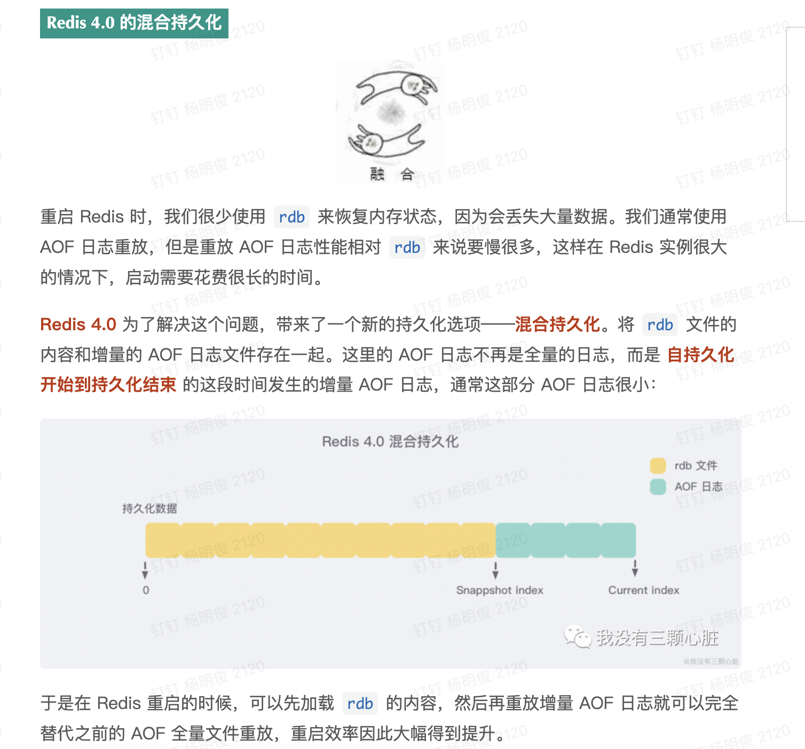

redis 6.0 新特性 开始支持 多线程（使用多线程 批量解析read请求，write请求，解析之后的指令还是原来的redis 线程执行，性能提升了2倍）

redis相关博客：值得一看

1. https://mp.weixin.qq.com/s/vXBFscXqDcXS_VaIERplMQ
2. https://mp.weixin.qq.com/s/aOiadiWG2nNaZowmoDQPMQ

# redis为什么这么快

https://mp.weixin.qq.com/s/KtzvawDnQQwhfjnCoXpcMQ

# HyperLoglog解决统计问题

https://mp.weixin.qq.com/s/9dtGe3d_mbbxW5FpVPDNow

## 慢查询日志

## redis 事务

## 监视器

## 持久化

* https://mp.weixin.qq.com/s/O_qDco6-Dasu3RomWIK_Ig
* 

# redis 缓存淘汰（回收）策略：

> https://mp.weixin.qq.com/s/-caMTrOXQu-o0O44e6I9dQ

当达到maxmemory限制的时候Redis会使用的行为由 Redis的maxmemory-policy配置指令来进行配置。

以下的策略是可用的:

* **针对设置过期时间的key(这种key在redis内部一个过期集合中会有指向它们的索引)**

  * **volatile-lru**: 尝试回收最少使用的键（LRU）使得新添加的数据有空间存放。
  * **volatile-lfu：**尝试回收最近访问次次数最少的键（LFU）使得新添加的数据有空间存放。
  * **volatile-random**: 回收随机的键使得新添加的数据有空间存放使得新添加的数据有空间存放。
  * **volatile-ttl**: 回收在过期集合的键，并且优先回收存活时间（TTL）较短的键,使得新添加的数据有空间存放。

* **针对所有key**

  - **allkeys-lru**: 尝试回收最少使用的键（LRU），使得新添加的数据有空间存放。

  - **allkeys-random**: 回收随机的键使得新添加的数据有空间存放。
  - **allkeys-lfu：**尝试回收最近访问次次数最少的键（LFU）使得新添加的数据有空间存放。

* **不做处理**

  * **noeviction**:拒绝所有写入操作（大部分的写入指令，但DEL和几个例外），返回一个错误"(error) OOM command not allowed when used memory"

## 策略选择

LRU 算法（Least Recently Used，最近最少使用）：淘汰很久没被访问过的数据，以最近一次访问时间作为参考

> #### Redis 改进后的 LRU 算法
>
> 在 `Redis` 当中，并没有采用传统的 `LRU` 算法，因为传统的 `LRU` 算法存在 `2` 个问题：
>
> - 需要额外的空间进行存储。
> - 可能存在某些 `key` 值使用很频繁，但是最近没被使用，从而被 `LRU` 算法删除。
>
> 为了避免以上 `2` 个问题，`Redis` 当中对传统的 `LRU` 算法进行了改造，**通过抽样的方式进行删除**。
>
> 配置文件中提供了一个属性 `maxmemory_samples 5`，默认值就是 `5`，表示随机抽取 `5` 个 `key` 值，然后对这 `5` 个 `key` 值按照 `LRU` 算法进行删除
>
> 

LFU 算法（Least Frequently Used，最不经常使用）：淘汰最近一段时间被访问次数最少的数据，以次数作为参考

需要指出的是 ： LRU 算法或者 TTL 算法都是不是很精确算法，而是一个近似的算法。 Redis 不会通过对全部的键值对进行比较来确定最精确的时间值，从而确定删除哪个键值对 ， 因为这将消耗太多的时间 ， 导致回收垃圾执行的时间太长 ， 造成服务停顿.

当存在热点数据时，LRU的效率很好，但偶发性的、周期性的批量操作会导致LRU命中率急剧下降，缓存污染情况比较严重。这时使用LFU可能更好点

根据自身业务类型，配置好maxmemory-policy(默认是noeviction)，推荐使用volatile-lru。

# redis 失效缓存删除策略：

* 定时删除：会定时清理失效缓存，整个清理时间会控制在一个范围（避免占用过多cpu资源）
* 惰性删除：每当一个key被访问的时候，检查他是否过期，如果过期则进行删除

# redis中的缓存失效，内存回收还需要注意

由于redis 底层是存在对象共享机制的，也就是说 一个value，可能被多个key引用。在回收的时候，比如过期回收，key可以回收，但是value 只是做他的引用次数-1，当value 引用次数=0的时候才能删除

# redis 的线程模型

单线程 Reactor 模型

# 如果使用redis 实现延迟消息队列

**方案一：**

使用sortedset，拿时间戳作为score，topic 作为为key，消息内容（消息投，消息体）作为value ， 延迟时间作为 score，消费者用**zrangebyscore**指令获取N秒之前的数据轮询进行处理。

使用中注意的问题

1. 通常我们会使用多个consumer 进行消息消费，这时候就会遇到一个问题，如果多个消费者同时的拉去消息，很难控制他们不拉去到相同的消息，这样我们也会给我们带来大量的重复且并发的消息同步，幂等处理问题。这时候你会想到如果只有一个consumer不就没有这样的问题了吗，是的一个consumer确实不会有这种需要处理同步的问题，但是如果只有一个consumer，机器挂了怎么办，消息大量积压在一个 key中

   如果我们把消费分配到多个key中呢？比如一个topic 的消息我们分配到 topic1,topic2,topic3,topic4 这样就可以有四个consumer了，这样做的好处是某一个consumer挂了还有其他consumer在消费，可以大量消息积压。这时候我们只需要及时重启/选出新的consumer即可，并且我们还可以通过配置增加分区，增加consumer等，这些可以参考kafka的rebalance 设计，只需要有一个类似配置中心的来做通知即可

2. 处理完的数据，需要移除，避免处理大量重复数据

方案二：

可以直接使用 [redis stream](https://www.runoob.com/redis/redis-stream.html) 他本身就是redis 提供的MQ模型，不知不支持延迟消息，但是支持ack. 使用后的消息删除等 ， 由于需要实现延迟队列，需要在消息的vlaue中增加过期时间，这样在消费（XREVRANGE 命令）的时候拉去到数据检查是否到期，如果到期直接处理，然后删除数据，日过未到期丢弃任务，消费消费继续忙寻

# redis  集群模式

https://mp.weixin.qq.com/s?__biz=Mzg5MzU2NDgyNw==&mid=2247487143&idx=1&sn=b095c730e2180d7461c6c0aaa55f495f&source=41#wechat_redirect

元数据管理补充：可以采用类似 zookeeper 这样的中间件来集中管理元信息

集群通信补充 Gossip 协议：

1. https://wenku.baidu.com/view/7735ad0b4873f242336c1eb91a37f111f1850d3a.html
2. https://wenku.baidu.com/view/0b9bec475bfafab069dc5022aaea998fcc2240ff.html?rec_flag=default&fr=Recommend_RelativeDoc-100212,100225,90190,80166,80139,80163,110192,80237-search_rec_append-7735ad0b4873f242336c1eb91a37f111f1850d3a&sxts=1650762189731

熵：https://baike.baidu.com/item/%E7%86%B5/19190273?fr=aladdin

Gossip 中也使用熵来描述该集群的混乱程度（数据不一致程度），所以**反熵**说的就是降低节点间的数据不一致程度的操作

Gossip 协议的优点：

1. 去中心化，容错信高（因为信息有冗余），单机负载比广播的方式低（但是整个集群总的信息发送次数会超过广播的方式）

Gossip 协议的缺点：

1. 由于它不是广播式的进行通信，所以使用该协议进行状态同步（数据同步）它的最终一致收敛较慢

   > 实际使用。Gossip 协议的时候我们不回完全按照Gossip 协议中的方式执行，比如如果采用反墒的方式实现 Gossip 为了实现较为快速的收敛，不会按照协议中的完全随机选择节点的方式来执行，而是可能通过实现一个环状联路来处理，比如1. A->B->C->A-B  或则2. A<->B <->C<->D<->A<->B ，2这种方式需要双向同步通信成本会更高，但是并没有减少需要同步的次数，所以在采用这种环形操作的时候 方式1更好

# sentinel 选举

https://blog.csdn.net/weixin_38071106/article/details/88033764

https://blog.csdn.net/zizhilianqiu/article/details/106295490

https://mp.weixin.qq.com/s?__biz=Mzg5MzU2NDgyNw==&mid=2247487143&idx=1&sn=b095c730e2180d7461c6c0aaa55f495f&source=41#wechat_redirect

多个 Sentinel 进程（progress）， 这些进程使用**流言协议（gossip protocols)**来接收关于主服务器是否下线的信息， 并使用投票协议（[Raft](https://blog.csdn.net/yangmengjiao_/article/details/120191314)）来决定哪一台sentin执行自动故障迁移

也是由于使用的是 gossip protocols 所以使得sentinel lader 的选举会更快速（因为有时间差）

**关于Sentinel数量问题的认识**
Sentinel系统的目的就是为了保证高可用，一个肯定不行，然后由于使用的是Raft协议，所以需要基数个节点，所以最少三个节点 尽量保证选举的时候majority的出现。

# redis和memcached的区别

1. redis  相比memcached 虽然都是key -value 模型的NOSQL，但是redis的value支持更多的数据模型:list,set,sortset,hash表,string,   memcached 仅支持简单的key-value 存储，不支持复杂的数据结构
2. memcached 没有原生的集群模式，而是依靠client完成分片写入，redis 支持 cluster模式
3. Redis 服务节点之间支持互相通信，memcached 虽然也支持集群但是它仅仅是简单的做数据分片，节点间无法互相通信
4. redis 数据支持持久话（RDB,ROF）,memcached 不支持也就是说机器挂了就挂了数据无法恢复
5. redis 使用的单线程 Reator 模型，memcached 使用的是多线程IO复用的网络模型

> memcached是多线程的，非阻塞IO复用网络模型，分为 listener主线程 和 worker子线程，listener线程监听网络连接，接受请求后将连接描述字pipe传递给worker（一般的高复用都是这种处理方式），进行读写IO，网络层使用的libevent封装的事件库，多线程模型可以发挥多核作用，但是也引入了cache coherency 和 锁的问题,比如：memcached最常用的stats命令，实际memcached所有的操作都要对这个全局变量加锁，进行计数等工作，这会带来性能损耗。