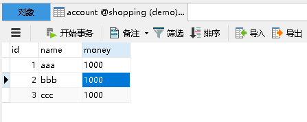
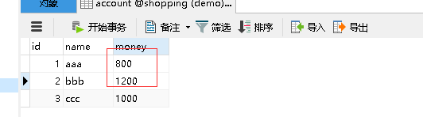
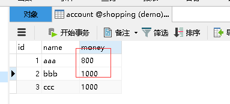
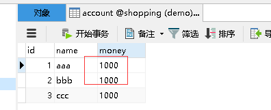

# 事务需要遵循的原则：ACID

- `Automicity`  原子性 ：事务要么被全部执行，要么全不被执行。如果事务下的子事务全部提交成功，则所有数据库操作被提交，否则应该进行事务回滚。

  **计算机中很多地方（比如编程中）都需要一些保证原子性的实现，一个需要执行完所有的操作才有意义的操作集合，就可以实现成原子性的**

- `Consistency `一致性：事务应该确保数据库状态从一个一致状态转变为另一个一致性状态

  计算机中很多地方（比如编程（多线程）中，cpu工作机制中（多指令并行）需要保证最后的结果是这些所有操作时候的最终结果…..）
  简单的例子：现在有6个人 每人有一个账号，他们之间会相互转账，这样就组成了一个小的数据系统，那么什么事一致性呢？这是个人定义的，比如这几个人账号的总金额不变，那就是一致的，反之不一致。 再比如 现在数据时分布式存储的，有一个数据在几个地方都保存了，那么任何时候这几个地方的数据都必须相同，这也是一致性。

- `Isolation` 隔离性：事务相互间不能被影响(多线程中一些情况也是需要实现隔离性的)

- `Durabillity` 持久性：事务一旦提交之后将他对数据库的操作应该是永久性的，即便出现其他故障，事务处理结果也应不被影响。

# 1. 在spring 中事务管理的顶层接口

* `PlatformTransactionManager` : 事务管理 的最顶层的接口

```java
public interface PlatformTransactionManager {

    TransactionStatus getTransaction(TransactionDefinition definition) throws TransactionException;

    void commit(TransactionStatus status) throws TransactionException;

    void rollback(TransactionStatus status) throws TransactionException;
}
```

* `TransactionDefinition`: 事务的一些定义信息的顶层接口（事务传播行为，事务隔离级别，事务超时，事务只读），不理解隔离级别的读者可以看后文中的基本概念补充这一章节

```java
public interface TransactionDefinition {
    // 事务传播行为
    int PROPAGATION_REQUIRED = 0;
    int PROPAGATION_SUPPORTS = 1;
    int PROPAGATION_MANDATORY = 2;
    int PROPAGATION_REQUIRES_NEW = 3;
    int PROPAGATION_NOT_SUPPORTED = 4;
    int PROPAGATION_NEVER = 5;
    int PROPAGATION_NESTED = 6;
    // 隔离级别
    int ISOLATION_DEFAULT = -1;// 数据库级别是什么这个就是什么
    int ISOLATION_READ_UNCOMMITTED = 1;// read uncommit
    int ISOLATION_READ_COMMITTED = 2;/// read commit
    int ISOLATION_REPEATABLE_READ = 4;// repeatable read
    int ISOLATION_SERIALIZABLE = 8;// serializable
    int TIMEOUT_DEFAULT = -1;
	// 获取事务的传播属性
    int getPropagationBehavior();
	// 获取事务的隔离级别
    int getIsolationLevel();
    //
    int getTimeout();
    // 判断是否是只读
    boolean isReadOnly();

    @Nullable
    String getName();
}
```

* `TransactionStatus`：为事务代码提供了一种简单的方法来控制事务执行以及查询事务的状态。它们对于所有事务`API`都是通用的：

```java
public interface TransactionStatus extends TransactionExecution, SavepointManager, Flushable {

    @Override
    boolean isNewTransaction();// 是否是一个新的事务

    boolean hasSavepoint();// 是否有保存点
	
    // 将一个事务标识为不可提交的。在调用完setRollbackOnly()后只能被回滚，在大多数情况下，事务管理器会检测到这一点，在它发现事务要提交时会立刻结束事务。
    // 调用完setRollbackOnly()后，数据库可以继续执行select，但不允许执行update语句，因为事务只可以进行读取操作，任何修改都不会被提交。
    @Override
    void setRollbackOnly();
	// setRollbackOnly() 执行后 这个isRollbackOnly()方法会fanhuitrue
    @Override
    boolean isRollbackOnly();

    void flush();

    @Override
    boolean isCompleted();// 事务是否完成
}
```

`void setRollbackOnly()` 方法的作用可以看[PROPAGATION_NESTED的demo的验证防范3](#3.2.3.3 外层方法开启事务的情况下)

# 2. 接口实现类的选择

在了解了上面的内容之后，我们知道那只是对应的接口，那么我们在使用中应该怎么去使用对应的实现类呢（当然你也可以基于spring的接口，自定义实现类）

`PlatformTransactionManager`  的实现类的选择我们通常需要了解它的工厂环境，比如：

* 用`JDBC/myBatis `持久化数据时:  我们要选择 `org.springframework.jdbc.datasource.DataSourceTransactionManager`

* 使用`Hibernate`持久化数据时: 我们要选择 `org.springframework.orm.hibernate3.HibernateTransactionManager`

* 使用`JTA`来实现管理事务：我们要选择 `org.springframework.transaction.jta.JtaTransactionManager`

  **当事务跨越多个资源是需要使用这个 `JTA`**

* 使用` JPA` 进行持久化：我们要选择 `org.springframework.orm.jpa.JpaTransactionManager`

* 持久化机制是`Jdo` 的时候：我们要选择 `org.springframework.jdo.JdoTransactionManager`

别的情况下，选择对应的实现就可以了。

# 3. 基本概念补充

## 3. 隔离级别

- `Serializable` (序列化，串行化) : 串行执行 可避免脏读，不可重复读，幻读的发生。它是最高的事务隔离级别，同事花费的代价也是很大的，性能很低，一般很少使用。

- `Repeatable read` (重复读) :一个事务开始读取这条数据，那么别的事务就不能对其进行修改。 可以解决不可重复读和脏读，不能避免幻读，**但是`mysql`中的 `mvcc `可以避免幻读,这样就不需要升级隔离级别了**

- `Read committed` (读已提交): 一个事物要等另一个事务提交之后才能读取 可避免脏读 

- `Read uncommitted`(读未提交) 

  **mysql 默认是 `REPEATABLE-READ` 重复读**

## 3.2 事务传播行为

* 第一类：外围事务开启的情况下，被这一类修饰的方法会加入到外围方法的事务中。

| 事务传播行为类型      | 说明                                                         |
| --------------------- | ------------------------------------------------------------ |
| PROPAGATION_REQUIRED  | 1.  在外围方法未开启事务的情况下`Propagation.REQUIRED`修饰的内部方法会使用自己的事务，且事务相互独立，互不干扰。<br/>2. 在外围方法开启事务的情况下`Propagation.REQUIRED`修饰的内部方法会加入到外围方法的事务中，所有`Propagation.REQUIRED`修饰的内部方法和外围方法均属于同一事务，只要一个方法异常，整个事务均回滚 |
| PROPAGATION_SUPPORTS  | 1. 在外围方法未开启事务的情况下，`Propagation.SUPPORTS`修饰的方法，以非事务的方式执行<br/>2. 在外围方法开启事务的情况下`Propagation.SUPPORTS`修饰的内部方法会加入到外围方法的事务中，所有`Propagation.SUPPORTS`修饰的内部方法和外围方法均属于同一事务，只要一个方法异常，整个事务均回滚<br/>也就是说完全以外围方法为主 |
| PROPAGATION_MANDATORY | 1.  如果当前没有事务，就抛出异常。<br/>2.  同上              |

* 第二类：被这一类修饰的方法不管外围方法是否有事务，都开启自己的独立的事务，且内部方法之间、内部方法和外部方法事务均相互独立，互不干扰。

| 事务传播行为类型          | 说明                                                         |
| ------------------------- | ------------------------------------------------------------ |
| PROPAGATION_REQUIRES_NEW  | 不管外围方法是否开启事务，`Propagation.REQUIRES_NEW`修饰的内部方法都会单独开启自己的独立事务，且与外部方法事务独立，内部方法之间、内部方法和外部方法事务均相互独立，互不干扰。 |
| PROPAGATION_NOT_SUPPORTED | 不管外围方法是否开启事务都以非事务方式执行操作（也就是不支持事务） |
| PROPAGATION_NEVER         | 以非事务方式执行<br/>如果外围方法存在事务，则抛出异常。      |
* 第三类：

| 事务传播行为类型   | 说明                                                         |
| ------------------ | ------------------------------------------------------------ |
| PROPAGATION_NESTED | 1.如果外围方法存在事务，`Propagation.NESTED`修饰的内部方法属于外部事务的子事务，外围主事务回滚，子事务一定回滚，而内部子事务可以单独回滚（[详细实例](#3.2.3 PROPAGATION_NESTED)）而不影响外围主事务和其他子事务（前提是单独try-catch这个子事务。且不设置`TransactionAspectSupport.currentTransactionStatus().setRollbackOnly(); `）<br/>2.如果外围方法没有事务，则执行与PROPAGATION_REQUIRED类似的效果。 |

**事务的传播行为，主要看内层方法的事务传播行为是什么样的，它决定了怎么去传播**

**下面我们主要看一下每一类的第一种类型的详细介绍，别的都相似，可以自己去测试**

### 3.2.1 PROPAGATION_REQUIRED

* 在外围方法未开启事务的情况下`Propagation.REQUIRED`修饰的内部方法会使用自己的事务，且事务相互独立，互不干扰。
* 在外围方法开启事务的情况下`Propagation.REQUIRED`修饰的内部方法会加入到外围方法的事务中，所有`Propagation.REQUIRED`修饰的内部方法和外围方法均属于同一事务，只要一个方法异常，整个事务均回滚

#### 3.2.1.1 前置代码

**请不要太过在意这个的事务类的结构定义，只是为了测试**

数据表：



Repository 层的方法：我们给相应的方法都加上 `PROPAGATION_REQUIRED`

```java
@Repository("accountDao")
public class AccounDaoImp implements AccountDao {

    @Resource
    private JdbcTemplate jdbcTemplate;

    @Override
    @Transactional(propagation = Propagation.REQUIRED, rollbackFor = {Exception.class})
    public void outMoney(String account, Double money) {
        String sql = " update account set money = money - ? where name = ? ";
        jdbcTemplate.update(sql, money, account);
    }

    @Override
    @Transactional(propagation = Propagation.REQUIRED, rollbackFor = {Exception.class})
    public void inMoney(String account, Double money) {
        String sql = " update account set money = money + ? where name = ? ";
        jdbcTemplate.update(sql, money, account);
    }

    @Override
    @Transactional(propagation = Propagation.REQUIRED, rollbackFor = {Exception.class})
    public void inMoneyThrowException(String account, Double money) {
        String sql = " update account set money = money + ? where name = ? ";
        jdbcTemplate.update(sql, money, account);
        throw new RuntimeException(" 我发生异常了 ");
    }
}
```

测试调用的方法：

```java
@RunWith(SpringJUnit4ClassRunner.class)
@ContextConfiguration("classpath:applicationContext4.xml")
public class TestDemoAllByAnnotation {

    @Resource(name = "accountService")
    private AccountService accountService;

    @Test
    public void test1() {
        accountService.transfer("aaa","bbb",200.0);
    }
}
```


#### 3.2.1.2 外层方法没有事务的情况下

验证方法1：

```java
@Service("accountService")
public class AccountServiceImp implements AccountService {

    @Resource(name = "accountDao")
    private AccountDao accountDao;

    public void setAccountDao(AccountDao accountDao) {
        this.accountDao = accountDao;
    }

    @Override
    //@Transactional(rollbackFor = {Exception.class}) 外层方法没有事务
    public void transfer(String outAccount, String inAccount, Double money) {
        accountDao.outMoney(outAccount,money);
        accountDao.inMoney(inAccount,money);
      // 看一下外层方法抛出异常对两个内层方法的事务是否有影响
        int a =  1 / 0 ;
    }
}
```

验证方法2：

```java
@Service("accountService")
public class AccountServiceImp implements AccountService {
		
  	// 省略部分代码
  
    @Override
    //@Transactional(rollbackFor = {Exception.class}) 外层方法没有事务
    public void transfer(String outAccount, String inAccount, Double money) {
        accountDao.outMoney(outAccount,money);
      // 看一下内层方法抛出异常对两个内层方法的事务是否有影响
        accountDao.inMoneyThrowException(inAccount,money);
    }
}
```

**执行方法前的数据都是一样的**

执行方法1的结果：



**两个方法正常执行，并且事务被提交**

执行方法2的结果：



**抛出异常的方法的事务回滚了**


**结论：通过这两个方法我们证明了在外围方法未开启事务的情况下`Propagation.REQUIRED`修饰的内部方法会使用自己的事务，且事务相互独立，互不干扰。。**

#### 3.2.1.3 外层方法开启事务的情况下

验证方法1：外层方法异常

```java
@Service("accountService")
public class AccountServiceImp implements AccountService {
	
		// 省略部分代码
  
    @Override
    @Transactional(rollbackFor = {Exception.class})
    public void transfer(String outAccount, String inAccount, Double money) {
        accountDao.outMoney(outAccount,money);
        accountDao.inMoney(inAccount,money);
      // 看看外层开启事务的情况下，外层抛出异常的执行情况
        int a =  1 / 0 ; 
    }
}
```

验证方法2：内层方法异常

```java
@Service("accountService")
public class AccountServiceImp implements AccountService {
	
		// 省略部分代码
  
    @Override
    @Transactional(rollbackFor = {Exception.class})
    public void transfer(String outAccount, String inAccount, Double money) {
        accountDao.outMoney(outAccount,money);
      // 看看外层开启事务的情况下，内层方法抛出异常的执行情况
        accountDao.inMoneyThrowException(inAccount,money);
    }
}
```

验证方法3：内层方法异常，外层捕获异常

```java
@Service("accountService")
public class AccountServiceImp implements AccountService {
	
		// 省略部分代码
    
		@Override
    @Transactional(rollbackFor = {Exception.class})
    public void transfer(String outAccount, String inAccount, Double money) {
        accountDao.outMoney(outAccount,money);
        try {
            accountDao.inMoneyThrowException(inAccount,money);
        }catch (RuntimeException e){
            System.out.println("----------------- 捕获到异常 ------------------");
        }
    }
}

```

**执行方法前的数据都是一样的**

执行方法1的结果：



**数据没有任何变化，事务回滚了所有操作**

执行方法2的结果：


**数据也没有任何变化，事务回滚了所有操作**

执行方法3的结果：


控制台输出：

```
----------------- 捕获到异常 ------------------
```

**异常被正常捕获**

**数据也没有任何变化，即使外层不活了异常但是事务还是回滚了所有操作**


**结论：以上试验结果我们证明在外围方法开启事务的情况下Propagation.REQUIRED修饰的内部方法会加入到外围方法的事务中，所有Propagation.REQUIRED修饰的内部方法和外围方法均属于同一事务，只要一个方法异常，整个事务均回滚。**

### 3.2.2 PROPAGATION_REQUIRES_NEW

* 不管外围方法是否开启事务，`Propagation.REQUIRES_NEW`修饰的内部方法都会单独开启自己的独立事务，且与外部方法事务也独立，内部方法之间、内部方法和外部方法事务均相互独立，互不干扰。

#### 3.2.2.1 前置代码

Repository 层的方法：我们给相应的方法都加上 `PROPAGATION_REQUIRES_NEW`

```java
@Repository("accountDao")
public class AccounDaoImp implements AccountDao {

    @Resource
    private JdbcTemplate jdbcTemplate;

    @Override
    @Transactional(propagation = Propagation.REQUIRES_NEW, rollbackFor = {Exception.class})
    public void outMoney(String account, Double money) {
        String sql = " update account set money = money - ? where name = ? ";
        jdbcTemplate.update(sql, money, account);
    }

    @Override
    @Transactional(propagation = Propagation.REQUIRES_NEW, rollbackFor = {Exception.class})
    public void inMoney(String account, Double money) {
        String sql = " update account set money = money + ? where name = ? ";
        jdbcTemplate.update(sql, money, account);
    }

    @Override
    @Transactional(propagation = Propagation.REQUIRES_NEW, rollbackFor = {Exception.class})
    public void inMoneyThrowException(String account, Double money) {
        String sql = " update account set money = money + ? where name = ? ";
        jdbcTemplate.update(sql, money, account);
        throw new RuntimeException(" 我发生异常了 ");
    }
}
```


#### 3.2.2.2 外层方法没有事务的情况下

验证方法1：

```java
@Service("accountService")
public class AccountServiceImp implements AccountService {

    @Resource(name = "accountDao")
    private AccountDao accountDao;

    public void setAccountDao(AccountDao accountDao) {
        this.accountDao = accountDao;
    }

    @Override
    //@Transactional(rollbackFor = {Exception.class}) 外层方法没有事务
    public void transfer(String outAccount, String inAccount, Double money) {
        accountDao.outMoney(outAccount,money);
        accountDao.inMoney(inAccount,money);
      // 看一下外层方法抛出异常对两个内层方法的事务是否有影响
        int a =  1 / 0 ;
    }
}
```

验证方法2：

```java
@Service("accountService")
public class AccountServiceImp implements AccountService {
		
  	// 省略部分代码
  
    @Override
    //@Transactional(rollbackFor = {Exception.class}) 外层方法没有事务
    public void transfer(String outAccount, String inAccount, Double money) {
        accountDao.outMoney(outAccount,money);
      // 看一下内层方法抛出异常对两个内层方法的事务是否有影响
        accountDao.inMoneyThrowException(inAccount,money);
    }
}
```

**执行方法前的数据都是一样的**

执行方法1的结果：


**两个方法正常执行，并且事务被提交**

执行方法2的结果：


**抛出异常的方法的事务回滚了**

**结论：通过这两个方法我们证明了在外围方法未开启事务的情况下`Propagation.REQUIRES_NEW`修饰的内部方法会使用自己的事务，且事务相互独立，互不干扰。。**

#### 3.2.2.3 外层方法开启事务的情况下

验证方法1：外层方法异常

```java
@Service("accountService")
public class AccountServiceImp implements AccountService {
	
		// 省略部分代码
  
    @Override
    @Transactional(rollbackFor = {Exception.class})
    public void transfer(String outAccount, String inAccount, Double money) {
        accountDao.outMoney(outAccount,money);
        accountDao.inMoney(inAccount,money);
      // 看看外层开启事务的情况下，外层抛出异常的执行情况
        int a =  1 / 0 ; 
    }
}
```

验证方法2：内层方法异常

```java
@Service("accountService")
public class AccountServiceImp implements AccountService {
	
		// 省略部分代码
  
    @Override
    @Transactional(rollbackFor = {Exception.class})
    public void transfer(String outAccount, String inAccount, Double money) {
        accountDao.outMoney(outAccount,money);
      // 看看外层开启事务的情况下，内层方法抛出异常的执行情况
        accountDao.inMoneyThrowException(inAccount,money);
    }
}
```

验证方法3：内层方法异常，外层捕获异常

```java
@Service("accountService")
public class AccountServiceImp implements AccountService {
	
		// 省略部分代码
    
		@Override
    @Transactional(rollbackFor = {Exception.class})
    public void transfer(String outAccount, String inAccount, Double money) {
        accountDao.outMoney(outAccount,money);
        try {
            accountDao.inMoneyThrowException(inAccount,money);
        }catch (RuntimeException e){
            System.out.println("----------------- 捕获到异常 ------------------");
        }
    }
}

```

执行方法1的结果：


**两个方法正常执行，并且事务被提交**

执行方法2的结果：


**抛出异常的方法的事务回滚了**

执行方法3的结果：


控制台输出：

```
----------------- 捕获到异常 ------------------
```

**异常被正常捕获**

**抛出异常的方法的事务回滚了**


**结论：在外围方法开启事务的情况下Propagation.REQUIRES_NEW修饰的内部方法依然会单独开启独立事务，且与外部方法事务也独立，内部方法之间、内部方法和外部方法事务均相互独立，互不干扰。**

### 3.2.3 PROPAGATION_NESTED

* 如果外围方法存在事务，`Propagation.NESTED`修饰的内部方法属于外部事务的子事务，外围主事务回滚，子事务一定回滚，而内部子事务可以单独回滚（例子见下文）而不影响外围主事务和其他子事务

* 如果外围方法没有事务，则执行与PROPAGATION_REQUIRED类似的效果。

  > 也可以看看这个 https://www.jianshu.com/p/f89771cae115

#### 3.2.3.1 前置代码

Repository 层的方法：我们给相应的方法都加上 `PROPAGATION_REQUIRES_NEW`

```java
@Repository("accountDao")
public class AccounDaoImp implements AccountDao {

    @Resource
    private JdbcTemplate jdbcTemplate;

    @Override
    @Transactional(propagation = Propagation.NESTED, rollbackFor = {Exception.class})
    public void outMoney(String account, Double money) {
        String sql = " update account set money = money - ? where name = ? ";
        jdbcTemplate.update(sql, money, account);
    }

    @Override
    @Transactional(propagation = Propagation.NESTED, rollbackFor = {Exception.class})
    public void inMoney(String account, Double money) {
        String sql = " update account set money = money + ? where name = ? ";
        jdbcTemplate.update(sql, money, account);
    }

    @Override
    @Transactional(propagation = Propagation.NESTED, rollbackFor = {Exception.class})
    public void inMoneyThrowException(String account, Double money) {
        String sql = " update account set money = money + ? where name = ? ";
        jdbcTemplate.update(sql, money, account);
        throw new RuntimeException(" 我发生异常了 ");
    }
}
```


#### 3.2.3.2 外层方法没有事务的情况下

| 事务传播行为类型   | 说明                                                         |
| ------------------ | ------------------------------------------------------------ |
| PROPAGATION_NESTED | 1.如果外围方法存在事务，`Propagation.NESTED`修饰的内部方法属于外部事务的子事务，外围主事务回滚，子事务一定回滚，而内部子事务可以单独回滚（[详细实例](#PROPAGATION_NESTED)）而不影响外围主事务和其他子事务<br/>2.如果外围方法没有事务，则执行与PROPAGATION_REQUIRED类似的效果。 |

验证方法1：

```java
@Service("accountService")
public class AccountServiceImp implements AccountService {

    @Resource(name = "accountDao")
    private AccountDao accountDao;

    public void setAccountDao(AccountDao accountDao) {
        this.accountDao = accountDao;
    }

    @Override
    //@Transactional(rollbackFor = {Exception.class}) 外层方法没有事务
    public void transfer(String outAccount, String inAccount, Double money) {
        accountDao.outMoney(outAccount,money);
        accountDao.inMoney(inAccount,money);
      // 看一下外层方法抛出异常对两个内层方法的事务是否有影响
        int a =  1 / 0 ;
    }
}
```

**执行方法前的数据都是一样的**

执行方法1的结果：


**证明内层方法的事务不会受到外层的影响**

验证方法2：

```java
@Service("accountService")
public class AccountServiceImp implements AccountService {
		
  	// 省略部分代码
  
    @Override
    //@Transactional(rollbackFor = {Exception.class}) 外层方法没有事务
    public void transfer(String outAccount, String inAccount, Double money) {
        accountDao.outMoney(outAccount,money);
      // 看一下内层方法抛出异常对两个内层方法的事务是否有影响
        accountDao.inMoneyThrowException(inAccount,money);
    }
}
```

**两个方法正常执行，并且事务被提交**

执行方法2的结果：


**抛出异常的方法的事务回滚了**

**结论：通过这两个方法我们证明了在外围方法未开启事务的情况下`Propagation.NESTED`和`Propagation.REQUIRED`作用相同，修饰的内部方法会使用自己的事务，且事务相互独立，互不干扰。。**

#### 3.2.3.3 外层方法开启事务的情况下

**验证方法1**：外层方法异常

```java
@Service("accountService")
public class AccountServiceImp implements AccountService {
	
		// 省略部分代码
  
    @Override
    @Transactional(rollbackFor = {Exception.class})
    public void transfer(String outAccount, String inAccount, Double money) {
        accountDao.outMoney(outAccount,money);
        accountDao.inMoney(inAccount,money);
      // 看看外层开启事务的情况下，外层抛出异常的执行情况
        int a =  1 / 0 ; 
    }
}
```

执行方法1的结果：


**外部方法异常回滚，内部方法也全部回滚**

**验证方法2**：内层方法异常

```java
@Service("accountService")
public class AccountServiceImp implements AccountService {
	
		// 省略部分代码
  
    @Override
    @Transactional(rollbackFor = {Exception.class})
    public void transfer(String outAccount, String inAccount, Double money) {
        accountDao.outMoney(outAccount,money);
      // 看看外层开启事务的情况下，内层方法抛出异常的执行情况
        accountDao.inMoneyThrowException(inAccount,money);
    }
}
```

执行方法2的结果：


**抛出异常的方法的事务回滚了，由于外部方法没有捕获该内部方法异常，所以全部回滚了**

**验证方法3**：内层方法异常，外层捕获异常

```java
@Service("accountService")
public class AccountServiceImp implements AccountService {
	
		// 省略部分代码
    
		@Override
    @Transactional(rollbackFor = {Exception.class})
    public void transfer(String outAccount, String inAccount, Double money) {
        accountDao.outMoney(outAccount,money);
        try {
            accountDao.inMoneyThrowException(inAccount,money);
        }catch (RuntimeException e){
            System.out.println("----------------- 捕获到异常 ------------------");
        }
    }
}

```

执行方法3的结果：


控制台输出：

```
----------------- 捕获到异常 ------------------
```

**内部方法异常被外部方法正常捕获**

**抛出异常的方法的事务回滚了**

**如果此时我们希望外部的方法在捕获内部方法异常后，能够感知这个异常去做回滚可以在catch中使用下面这段代码**

```
TransactionAspectSupport.currentTransactionStatus().setRollbackOnly(); 
```

**验证方法4**：内层方法异常，外层捕获异常

```java
@Service("accountService")
public class AccountServiceImp implements AccountService {
	
		// 省略部分代码
    
		@Override
    @Transactional(rollbackFor = {Exception.class})
    public void transfer(String outAccount, String inAccount, Double money) {
        accountDao.outMoney(outAccount,money);
        try {
            accountDao.inMoneyThrowException(inAccount,money);
        }catch (RuntimeException e){
            System.out.println("----------------- 捕获到异常 ------------------");
        }
      // 验证只回滚子事务
      	accountDao.inMoney(inAccount,money);
    }
}
```

执行方法4的结果：


控制台输出：

```
----------------- 捕获到异常 ------------------
```

**内部方法异常被外部方法正常捕获**

**抛出异常的方法的事务回滚了**

**但是由于异常被正常捕获，外部方法继续执行，后续的执行事务被正常提交**


**结论：以上试验结果我们证明在外围方法开启事务的情况下`Propagation.NESTED`修饰的内部方法属于外部事务的子事务，外围主事务回滚，子事务一定回滚，而内部子事务可以单独回滚而不影响外围主事务和其他子事务（前提是单独try-catch这个子事务。且不设置 `TransactionAspectSupport.currentTransactionStatus().setRollbackOnly(); `）**。

# 4. 声明式事务管理

## 4.1  配置代理的方式

```xml
<?xml version="1.0" encoding="UTF-8"?>
<beans xmlns="http://www.springframework.org/schema/beans"
       xmlns:xsi="http://www.w3.org/2001/XMLSchema-instance"
       xmlns:context="http://www.springframework.org/schema/context"
       xmlns:aop="http://www.springframework.org/schema/aop"
       xsi:schemaLocation="http://www.springframework.org/schema/beans http://www.springframework.org/schema/beans/spring-beans.xsd
       http://www.springframework.org/schema/context http://www.springframework.org/schema/context/spring-context.xsd
       http://www.springframework.org/schema/aop http://www.springframework.org/schema/aop/spring-aop.xsd">
    <!--<context:component-scan base-package="com.stu" />-->

    <context:property-placeholder location="classpath:jdbc.properties"/>

    <bean id="dataSource" class="com.mchange.v2.c3p0.ComboPooledDataSource">
        <property name="driverClass" value="${jdbc.driverClass}"/>
        <property name="jdbcUrl" value="${jdbc.url}"/>
        <property name="user" value="${jdbc.username}"/>
        <property name="password" value="${jdbc.password}"/>
    </bean>

    <!--service-->
    <bean id="accountService" class="com.stu.service.imp.AccountServiceImp">
        <property name="accountDao" ref="accountDao"/>
    </bean>

    <!--dao层-->
    <bean id="accountDao" class="com.stu.dao.imp.AccounDaoImp">
        <property name="dataSource" ref="dataSource"/>
    </bean>

    <!-- 事务管理类 -->
    <bean id="transactionManager" class="org.springframework.jdbc.datasource.DataSourceTransactionManager">
        <property name="dataSource" ref="dataSource"/>
    </bean>

    <!-- 配置service 层代理 -->
    <bean id="accountServiceProxy" class="org.springframework.transaction.interceptor.TransactionProxyFactoryBean">
        <!--配置目标对象-->
        <property name="target" ref="accountService"/>
        <!--注入事务管理器-->
        <property name="transactionManager" ref="transactionManager"/>
        <!-- 注入事务的属性 -->
        <property name="transactionAttributes" >
            <!-- 下面的配置 查看  TransactionProxyFactoryBean 的源码 就可以看到配置-->
            <props>
                <!--格式  key是方法，可以使用通配符 *-->
                <!-- prop 内是value的值，使用 ， 号分割，按顺序是
                    1. PROPAGATION 事务的传播行为
                    2. ISOLATION 事务的隔离级别
                    3. ReadOnly 只读（不能进行任何修改操作）
                    4. +Exception  发生哪一类的异常，我们照常提交
                    5. -Exception  发生哪一类的异常，回滚事务
                    -->
                <prop key="transfer">PROPAGATION_REQUIRED</prop>
                <!--
                    <prop key="transfer">PROPAGATION_REQUIRED,
+java.lang.ArithmeticException</prop>
                    这样写了 可以发现即使发生上述的异常 ，但是异常发生前的 数据库操作，被提交了
                    -->
            </props>
        </property>
    </bean>

</beans>
```

## 4.2 aop 的方式

```xml
<?xml version="1.0" encoding="UTF-8"?>
<beans xmlns="http://www.springframework.org/schema/beans"
       xmlns:xsi="http://www.w3.org/2001/XMLSchema-instance"
       xmlns:context="http://www.springframework.org/schema/context"
       xmlns:aop="http://www.springframework.org/schema/aop"
       xmlns:tx="http://www.springframework.org/schema/tx"
       xsi:schemaLocation="http://www.springframework.org/schema/beans http://www.springframework.org/schema/beans/spring-beans.xsd
       http://www.springframework.org/schema/context http://www.springframework.org/schema/context/spring-context.xsd
       http://www.springframework.org/schema/aop http://www.springframework.org/schema/aop/spring-aop.xsd
       http://www.springframework.org/schema/tx  http://www.springframework.org/schema/tx/spring-tx.xsd">
    <!--<context:component-scan base-package="com.stu" />-->

    <context:property-placeholder location="classpath:jdbc.properties"/>

    <bean id="dataSource" class="com.mchange.v2.c3p0.ComboPooledDataSource">
        <property name="driverClass" value="${jdbc.driverClass}"/>
        <property name="jdbcUrl" value="${jdbc.url}"/>
        <property name="user" value="${jdbc.username}"/>
        <property name="password" value="${jdbc.password}"/>
    </bean>

    <!--service-->
    <bean id="accountService" class="com.stu.service.imp.AccountServiceImp">
        <property name="accountDao" ref="accountDao"/>
    </bean>

    <!--dao层-->
    <bean id="accountDao" class="com.stu.dao.imp.AccounDaoImp">
        <property name="dataSource" ref="dataSource"/>
    </bean>

    <!-- 事务管理类 -->
    <bean id="transactionManager" class="org.springframework.jdbc.datasource.DataSourceTransactionManager">
        <property name="dataSource" ref="dataSource"/>
    </bean>

    <!-- 配置事务的advice transaction-manager="" 不写默认就是 transaction-manager="transactionManager" -->
    <tx:advice id="testAdvice" transaction-manager="transactionManager">
        <!-- 配置事务相关的属性 -->
        <tx:attributes>
            <!-- prop 内是value的值，使用 ， 号分割，按顺序是
                    1. propagation 事务的传播行为
                    2. isolation 事务的隔离级别
                    3. read-only 只读（不能进行任何修改操作）
                    4. rollback-for  发生哪一类的异常，回滚事务
                    5. no-rollback-for  发生哪一类的异常，我们照常提交
                    6. timeout 超时配置
                    -->
            <tx:method name="trans*" propagation="REQUIRED" rollback-for="java.lang.ArithmeticException"/>
        </tx:attributes>
    </tx:advice>
    <!-- 配置切面-->
    <aop:config>
        <aop:advisor advice-ref="testAdvice" pointcut="execution(* com.stu.service.interf.AccountService+.*(..))" />
    </aop:config>
</beans>
```

## 4.3 @Transactional 注解的方式

**可以作用于接口、接口方法、类以及类方法上**

**使用这个注解需要注意要使用 `<tx:annotation-driven/>`元素打开事务行为**。

**Spring团队建议您使用注释仅注释具体类（以及具体类的方法）`@Transactional`，而不是注释接口或接口方法，因为那样只有在使用基于接口的代理时它才会生效**。

**@Transactional `注解应该只被应用到 `public` 方法上，这是由` Spring AOP `的本质决定的。如果你在 `protected`、`private `或者默认可见性的方法上使用` @Transactional `注解，这将被忽略，也不会抛出任何异常**。

```xml
<?xml version="1.0" encoding="UTF-8"?>
<beans xmlns="http://www.springframework.org/schema/beans"
       xmlns:xsi="http://www.w3.org/2001/XMLSchema-instance"
       xmlns:context="http://www.springframework.org/schema/context"
       xmlns:aop="http://www.springframework.org/schema/aop"
       xmlns:tx="http://www.springframework.org/schema/tx"
       xsi:schemaLocation="http://www.springframework.org/schema/beans http://www.springframework.org/schema/beans/spring-beans.xsd
       http://www.springframework.org/schema/context http://www.springframework.org/schema/context/spring-context.xsd
       http://www.springframework.org/schema/aop http://www.springframework.org/schema/aop/spring-aop.xsd
       http://www.springframework.org/schema/tx
       http://www.springframework.org/schema/tx/spring-tx.xsd">
    <!--<context:component-scan base-package="com.stu" />-->

    <context:property-placeholder location="classpath:jdbc.properties"/>
    
    <bean id="dataSource" class="com.mchange.v2.c3p0.ComboPooledDataSource">
        <property name="driverClass" value="${jdbc.driverClass}"/>
        <property name="jdbcUrl" value="${jdbc.url}"/>
        <property name="user" value="${jdbc.username}"/>
        <property name="password" value="${jdbc.password}"/>
    </bean>

    <!--service-->
    <bean id="accountService" class="com.annotation.service.imp.AccountServiceImp">
        <property name="accountDao" ref="accountDao"/>
    </bean>

    <!--dao层-->
    <bean id="accountDao" class="com.annotation.dao.imp.AccounDaoImp">
        <property name="dataSource" ref="dataSource"/>
    </bean>

    <!-- 事务管理类 -->
    <bean id="transactionManager" class="org.springframework.jdbc.datasource.DataSourceTransactionManager">
        <property name="dataSource" ref="dataSource"/>
    </bean>

    <!-- 开启注解事务 -->
    <tx:annotation-driven transaction-manager="transactionManager"/>

</beans>
```

然后在你想管理的类上，或则方法上加上这个注解

### 作用于类上

比如：该类的所有 public 方法将都具有该类型的事务属性 protected`、`private `或者默认可见性的方法上使用` @Transactional `注解，这将被忽略，也不会抛出任何异常。

```java
@Transactional(propagation = Propagation.REQUIRED,rollbackFor = {Exception.class})
public class AccountServiceImp implements AccountService {

    private AccountDao accountDao;

    public void setAccountDao(AccountDao accountDao) {
        this.accountDao = accountDao;
    }

    @Override
    public void transfer(String outAccount, String inAccount, Double money) {
        accountDao.outMoney(outAccount,money);
        int a =  1 / 0 ;
        accountDao.inMoney(inAccount,money);
    }
}
```

### 作用于方法

`@Transactional `注解应该只被应用到 `public` 方法上，这是由` Spring AOP `的本质决定的。如果你在 `protected`、`private `或者默认可见性的方法上使用` @Transactional `注解，这将被忽略，也不会抛出任何异常。

```java
public class AccountServiceImp implements AccountService {

    private AccountDao accountDao;

    public void setAccountDao(AccountDao accountDao) {
        this.accountDao = accountDao;
    }

    @Override
  @Transactional(propagation = Propagation.REQUIRED,rollbackFor = {Exception.class})
    public void transfer(String outAccount, String inAccount, Double money) {
        accountDao.outMoney(outAccount,money);
        int a =  1 / 0 ;
        accountDao.inMoney(inAccount,money);
    }
}
```

## 4.4 `@EnableTransactionManagement`

我们可以使用基于注解驱动的方式来使用`spring`，并且使用`@EnableTransactionManagement` 代替 `<tx:annotation-driven />`，使用 `@ComponentScan(basePackages ="com.all_by_annotation")`替换 `<context:component-scan base-package="com.all_by_annotation" />`

配置类

```java
package com.all_by_annotation.config.jdbc;

import com.mchange.v2.c3p0.ComboPooledDataSource;
import org.springframework.beans.factory.annotation.Value;
import org.springframework.context.annotation.Bean;
import org.springframework.context.annotation.ComponentScan;
import org.springframework.context.annotation.Configuration;
import org.springframework.context.annotation.PropertySource;
import org.springframework.jdbc.core.JdbcTemplate;
import org.springframework.jdbc.datasource.DataSourceTransactionManager;
import org.springframework.transaction.annotation.EnableTransactionManagement;

import javax.annotation.Resource;
import javax.sql.DataSource;
import java.beans.PropertyVetoException;

/**
 * @author N_J
 * @Configuration 标注这是一个配置类
 * @EnableTransactionManagement 开启基于注解的事务管理 等效与<tx:annotation-driven .../>
 * @ComponentScan(basePackages ="com.all_by_annotation") 等效于 <context:component-scan base-package="com.all_by_annotation" />
 * @PropertySource("classpath:jdbc.properties") 指定资源文件，这个properties文件会加载到Spring的Environment中
 */
@Configuration
@EnableTransactionManagement
@ComponentScan(basePackages ="com.all_by_annotation")
@PropertySource("classpath:jdbc.properties")
public class JdbcConfig {

    @Value("${jdbc.driverClass}")
    private String driverClass;

    @Value("${jdbc.username}")
    private String userName;

    @Value("${jdbc.password}")
    private String passWord;

    @Value("${jdbc.url}")
    private String jdbcUrl;

    @Bean("dataSource")
    public ComboPooledDataSource getComboPooledDataSource() throws PropertyVetoException {
        ComboPooledDataSource comboPooledDataSource = new ComboPooledDataSource();
        comboPooledDataSource.setDriverClass(driverClass);
        comboPooledDataSource.setJdbcUrl(jdbcUrl);
        comboPooledDataSource.setUser(userName);
        comboPooledDataSource.setPassword(passWord);
        return comboPooledDataSource;
    }

    @Bean("transactionManager")
    public DataSourceTransactionManager getTransactionManager(DataSource dataSource) {
        DataSourceTransactionManager transactionManager = new DataSourceTransactionManager();
        transactionManager.setDataSource(dataSource);
        return transactionManager;
    }

   @Bean
   public JdbcTemplate getJdbcTemplate(DataSource dataSource){
       return new JdbcTemplate(dataSource);
   }
}

```

需要进行事务管理的方法可以这样使用了

```java
@Service("accountService")
public class AccountServiceImp implements AccountService {

    @Resource(name = "accountDao")
    private AccountDao accountDao;

    public void setAccountDao(AccountDao accountDao) {
        this.accountDao = accountDao;
    }

    @Override
    @Transactional(rollbackFor = {Exception.class})
    public void transfer(String outAccount, String inAccount, Double money) {
        accountDao.outMoney(outAccount, money);
        accountDao.inMoney(inAccount, money);
    }
}
```

测试类

```java
package com.stu;


import com.all_by_annotation.service.interf.AccountService;
import org.junit.Test;
import org.junit.runner.RunWith;
import org.springframework.jdbc.datasource.DataSourceTransactionManager;
import org.springframework.test.context.ContextConfiguration;
import org.springframework.test.context.junit4.SpringJUnit4ClassRunner;

import javax.annotation.Resource;

@RunWith(SpringJUnit4ClassRunner.class)
@ContextConfiguration(classes = {com.all_by_annotation.config.jdbc.JdbcConfig.class})
public class TestDemoAllByAnnotation {

    @Resource(name = "accountService")
    private AccountService accountService;

    @Test
    public void test1() {
        accountService.transfer("aaa","bbb",200.0);
        }
}
```


更多内容可以查看spring官网的详情：https://docs.spring.io/spring/docs/5.1.2.RELEASE/spring-framework-reference/data-access.html#transaction-declarative-annotations

> https://www.jianshu.com/p/7c6d4dbbe8fc