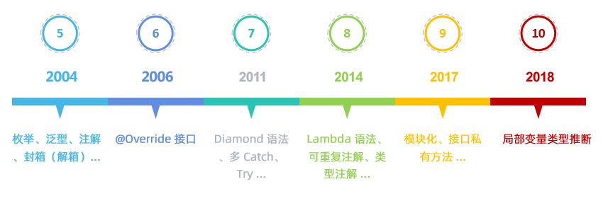

> 来自极客时间 ——小马哥的课程
>
> gitbub地址： https://github.com/geektime-geekbang/geekbang-lessons

# 1. 特性总览

## 1.1 核心特性（core）

* IoC 容器（IoC Container） 
* Spring 事件（Events） 
* 资源管理（Resources）
* 国际化（i18n）
* 校验（Validation）
* 数据绑定（Data Binding） 
* 类型装换（Type Conversion）
* Spring 表达式（Spring Express Language）SpEL
* 面向切面编程（AOP）

## 1.2 数据访问（Data access）

* JDBC
* 事务抽象 Transactions
* DAO Support
* O/R Mapping
  * JPA 实现之一 hibernate
* XML Marshalling

## 1.3 Web 技术

### 1.3.1 Web Servlet

* Spring MVC
* WebSocket
* SockJS
* STOMP Messaging

### 1.3.2 Web Reactive

* Spring WebFlux
* WebClient
* WebSocket

## 1.4 测试 Testing

* Mock Objects
* TestContext Framework
* Spring MVC Test
* WebTestClient

## 1.5 技术整合 Integration  

* 远程调用 （Remoting)
  * RMI
  * Hessian
  * Dubbo 可以基于 Hessian ，当然也可以基于其他协议
  * Thrift
  * .....
* java 消息服务 （JMS）

  * ActiveMQ
* 本地调度 （Scheduling）
* 本地任务 （Tasks）
* 缓存抽象 （Caching）

* java 管理扩展 （JMX）: 系统监控方面，偏向于运维侧

* Java 邮件客户端 (Email)

* Java 连接架构 （JCA）

# 2 版本特性

## 2.1 JAVA 版本依赖与支持

 

## 2.2 模块化设计 （Modular）

这个从 spring github 代码仓库库就可以很明显的看出来了 。 github库 https://github.com/spring-projects/spring-framework

| 模块名                                                       | 模块名                                                       |
| ------------------------------------------------------------ | ------------------------------------------------------------ |
| [spring-context](https://github.com/spring-projects/spring-framework/tree/master/spring-context) 事件驱动、注解驱动，模块驱动等 | [spring-jcl](https://github.com/spring-projects/spring-framework/tree/master/spring-jcl) |
| [spring-core ](https://github.com/spring-projects/spring-framework/tree/master/spring-core) Spring 基础API 模块，如资源管理，泛型处理 | [spring-jms](https://github.com/spring-projects/spring-framework/tree/master/spring-jms) |
| [spring-beans](https://github.com/spring-projects/spring-framework/tree/master/spring-beans) SpringBean 相关，如依赖查找，依赖注入 | [spring-messaging](https://github.com/spring-projects/spring-framework/tree/master/spring-messaging) |
| [spring-aop](https://github.com/spring-projects/spring-framework/tree/master/spring-aop) SpringAOP 处理，如动态代理，AOP 字节码提升 | [spring-orm](https://github.com/spring-projects/spring-framework/tree/master/spring-orm) |
| [spring-expression](https://github.com/spring-projects/spring-framework/tree/master/spring-expression) Spring 表达式语言模块 | [spring-oxm](https://github.com/spring-projects/spring-framework/tree/master/spring-oxm) |
| [spring-aspects](https://github.com/spring-projects/spring-framework/tree/master/spring-aspects) | [spring-tx](https://github.com/spring-projects/spring-framework/tree/master/spring-tx) |
| [spring-context-support](https://github.com/spring-projects/spring-framework/tree/master/spring-context-support) | [spring-web](https://github.com/spring-projects/spring-framework/tree/master/spring-web) |
| [spring-context-indexer](https://github.com/spring-projects/spring-framework/tree/master/spring-context-indexer) | [spring-webflux](https://github.com/spring-projects/spring-framework/tree/master/spring-webflux) |
| [spring-instrument](https://github.com/spring-projects/spring-framework/tree/master/spring-instrument) | [spring-webmvc](https://github.com/spring-projects/spring-framework/tree/master/spring-webmvc) |
| [spring-jdbc](https://github.com/spring-projects/spring-framework/tree/master/spring-jdbc) | [spring-websocket](https://github.com/spring-projects/spring-framework/tree/master/spring-websocket) |
| [spring-test](https://github.com/spring-projects/spring-framework/tree/master/spring-test) |                                                              |

 

## 2.3 Spring 对 java 语法特性的支持

### 2.3.1 JAVA 语法变化

 

### 2.3.2 java 5

| 语法特性                 | Spring 版本支持 | 代表性实现                 |
| ------------------------ | --------------- | -------------------------- |
| 注解 （Annnotation）     | 1.2+            | @Transactional             |
| 枚举（Enumeration）      | 1.2 +           | Propagation                |
| for-each 语法            | 3.0 +           | AbstractApplicationContext |
| 自动拆装箱（AutoBoxing） | 3.0 +           |                            |
| 泛型（Generic）          | 3.0 +           | ApplicationListener        |

### 2.3.3 java 6

| 语法特性      | Spring 版本支持 | 代表性实现 |
| ------------- | --------------- | ---------- |
| 接口@Override | 4.0+            |            |
|               |                 |            |

### 2.3.4 java 7

| 语法特性                | Spring 版本支持 | 代表性实现                  |
| ----------------------- | --------------- | --------------------------- |
| Diamond 语法            | 5.0 +           | DefaultListableBeanFactory  |
| try-with-resources 语法 | 5.0 +           | ResourceBundleMessageSource |

### 2.3.5 java 8

| 语法特性    | Spring 版本支持 | 代表性实现                    |
| ----------- | --------------- | ----------------------------- |
| Lambda 语法 | 5.0 +           | PropertyEditorRegistrySupport |
|             |                 |                               |

## 2.4 spring 对 JDK API的实践

需要说明的是，下面的列举的不是完整的，jdk 除了下面的还有其他的API,spring 也有对应的实现

### 2.4.1 jdk 核心API

 

### 2.4.2 java 5 以前的 API

| API 类型                  | Spring 版本支持 | 代表性实现                 |
| ------------------------- | --------------- | -------------------------- |
| 反射（Reflection）        | 1.0 +           | MethodMatcher              |
| java Beans                | 1.0 +           | CachedIntrospectionResults |
| 动态代理（dynamic proxy） | 1.0 +           | JdkDynamicAopProxy         |

### 2.4.3 java 5 API

| API 类型                    | Spring 版本支持 | 代表性实现                 |
| --------------------------- | --------------- | -------------------------- |
| XML 处理（DOM,SAX,StAX...） | 1.0 +           | XmlBeanDefinitionReader    |
| Java 管理扩展（JMX）        | 1.2 +           | @ManagedResource           |
| Instrumentation             | 2.0 +           | InstrumentationSavingAgent |
| 并发框架（J.U.C）           | 3.0 +           | ThreadPoolTaskScheduler    |
| 格式化（Formatter）         | 3.0 +           | DateFormatter              |

### 2.4.4 java 6 API

| API 类型                       | Spring 版本支持 | 代表性实现                        |
| ------------------------------ | --------------- | --------------------------------- |
| JDBC 4.0（JSR 221              | 1.0 +           | JdbcTemplate                      |
| Common Annotations（JSR 250 ） | 2.5 +           | CommonAnnotationBeanPostProcessor |
| JAXB 2.0（JSR 222)             | 3.0 +           | Jaxb2Marshaller                   |
| Scripting in JVM（JSR 223）    | 4.2 +           | StandardScriptFactory             |
| 可插拔注解处理API（JSR 269）   | 5.0 +           | @Indexed                          |
| Java Compiler API（JSR 199)    | 5.0 +           | TestCompiler（单元测试）          |

Scripting in JVM 就包括了很多脚本语言了，groovy,javascript,buby ......

### 2.4.5 java 7 API

| API 类型                  | Spring 版本支持 | 代表性实现              |
| ------------------------- | --------------- | ----------------------- |
| Fork/Join 框架（JSR 166） | 3.1 +           | ForkJoinPoolFactoryBean |
| NIO 2（JSR 203）          | 4.0 +           | PathResource            |

### 2.4.6 java 8 APi

| API 类型                     | Spring 版本支持 | 代表性实现                           |
| ---------------------------- | --------------- | ------------------------------------ |
| Date and Time API（JSR 310)  | 4.0 +           | DateTimeContext                      |
| 可重复Annotations（JSR 337） | 4.0 +           | @PropertySources                     |
| Stream API（JSR 335）        | 4.2 +           | StreamConverter                      |
| CompletableFuture（J.U.C）   | 4.2 +           | CompletableToListenableFutureAdapter |

## 2.5 Spring 对 java EE 的整合

### 2.5.1 Java web 技术相关

| JSR 规范                  | Spring 支持版本 | 代表实现                          |
| ------------------------- | --------------- | --------------------------------- |
| Servlet + JSP(JSR 035）   | 1.0 +           | DispatcherServlet                 |
| JSTL(JSR 052)             | 1.0 +           | JstlView                          |
| JavaServer Faces(JSR 127) | 1.1 +           | FacesContextUtils                 |
| Portlet(JSR 168)          | 2.0 -4.2        | DispatcherPortlet                 |
| SOAP(JSR 067)             | 2.5 +           | SoapFaultException                |
| WebServices(JSR 109)      | 2.5 +           | CommonAnnotationBeanPostProcessor |
| WebSocket(JSR 356)        | 4.0 +           | WebSocketHandler                  |

### 2.5.2 java EE 数据存储相关

| JSR 规范                   | Spring 支持版本 | 代表实现              |
| -------------------------- | --------------- | --------------------- |
| JDO(JSR 12)                | 1.0 -4.2        | JdoTemplate           |
| JTA(JSR 907)               | 1.0 +           | JtaTransactionManager |
| JPA(EJB 3.0 JSR 220的成员) | 2.0 +           | JpaTransactionManager |
| Java Caching API(JSR 107)  | 3.2 +           | JCacheCache           |

### 2.5.3 Java EE bean 相关

| JSR 规范                               | Spring 支持版本 | 代表实现                             |
| -------------------------------------- | --------------- | ------------------------------------ |
| JMS(JSR 914)                           | 1.1 +           | JmsTemplate                          |
| EJB 2.0 (JSR 19)                       | 1.0 +           | AbstractStatefulSessionBean          |
| Dependency Injection for Java(JSR 330) | 2.5 +           | AutowiredAnnotationBeanPostProcessor |
| Bean Validation(JSR 303)               | 3.0 +           | LocalValidatorFactoryBean            |

# 3. spring 编程模型

 

## 3.1 面向对象编程

### 3.1.1 Aware 接口

这个接口主要用来标识，一个jave bean 有资格通过接口的方法实现，使用 callback-style method 的方式从spring 容器中获取一些什么东西的功能，典型实现比如 `ApplicationContextAware`接口 ，通过实现这个接口的方法我们可以获得 `ApplicationContext`

```java
/**
 * A marker superinterface indicating that a bean is eligible to be notified by the
 * Spring container of a particular framework object through a callback-style method.
 * The actual method signature is determined by individual subinterfaces but should
 * typically consist of just one void-returning method that accepts a single argument.
 *
 * <p>Note that merely implementing {@link Aware} provides no default functionality.
 * Rather, processing must be done explicitly, for example in a
 * {@link org.springframework.beans.factory.config.BeanPostProcessor}.
 * Refer to {@link org.springframework.context.support.ApplicationContextAwareProcessor}
 * for an example of processing specific {@code *Aware} interface callbacks.
 *
 * @author Chris Beams
 * @author Juergen Hoeller
 * @since 3.1
 */
public interface Aware {

}
```

下面这个接口正如它名字定义的一样，适用于获取对应的实体的

| 接口                           | 功能                      |
| ------------------------------ | ------------------------- |
| ApplicationContextAware        | 获取 ApplicationContext   |
| ApplicationEventPublisherAware | ApplicationEventPublisher |
| BeanClassLoaderAware           | BeanClassLoader           |
| BeanFactoryAware               | BeanFactory               |
| ServletConfigAware             | ServletConfig             |
| ServletContextAware            | ServletContext            |
| ..............                 |                           |

### 3.1.2  BeanPostProcessor

```java
/* @author Juergen Hoeller
 * @author Sam Brannen
 * @since 10.10.2003
 * @see InstantiationAwareBeanPostProcessor
 * @see DestructionAwareBeanPostProcessor
 * @see ConfigurableBeanFactory#addBeanPostProcessor
 * @see BeanFactoryPostProcessor
 */
public interface BeanPostProcessor {

   /**
    * Apply this {@code BeanPostProcessor} to the given new bean instance <i>before</i> any bean
    * initialization callbacks (like InitializingBean's {@code afterPropertiesSet}
    * or a custom init-method). The bean will already be populated with property values.
    * The returned bean instance may be a wrapper around the original.
    * <p>The default implementation returns the given {@code bean} as-is.
    * @param bean the new bean instance
    * @param beanName the name of the bean
    * @return the bean instance to use, either the original or a wrapped one;
    * if {@code null}, no subsequent BeanPostProcessors will be invoked
    * @throws org.springframework.beans.BeansException in case of errors
    * @see org.springframework.beans.factory.InitializingBean#afterPropertiesSet
    */
   @Nullable
   default Object postProcessBeforeInitialization(Object bean, String beanName) throws BeansException {
      return bean;
   }

   /**
    * Apply this {@code BeanPostProcessor} to the given new bean instance <i>after</i> any bean
    * initialization callbacks (like InitializingBean's {@code afterPropertiesSet}
    * or a custom init-method). The bean will already be populated with property values.
    * The returned bean instance may be a wrapper around the original.
    * <p>In case of a FactoryBean, this callback will be invoked for both the FactoryBean
    * instance and the objects created by the FactoryBean (as of Spring 2.0). The
    * post-processor can decide whether to apply to either the FactoryBean or created
    * objects or both through corresponding {@code bean instanceof FactoryBean} checks.
    * <p>This callback will also be invoked after a short-circuiting triggered by a
    * {@link InstantiationAwareBeanPostProcessor#postProcessBeforeInstantiation} method,
    * in contrast to all other {@code BeanPostProcessor} callbacks.
    * <p>The default implementation returns the given {@code bean} as-is.
    * @param bean the new bean instance
    * @param beanName the name of the bean
    * @return the bean instance to use, either the original or a wrapped one;
    * if {@code null}, no subsequent BeanPostProcessors will be invoked
    * @throws org.springframework.beans.BeansException in case of errors
    * @see org.springframework.beans.factory.InitializingBean#afterPropertiesSet
    * @see org.springframework.beans.factory.FactoryBean
    */
   @Nullable
   default Object postProcessAfterInitialization(Object bean, String beanName) throws BeansException {
      return bean;
   }

}
```

| 方法                            | 说明                                                         |
| ------------------------------- | ------------------------------------------------------------ |
| postProcessBeforeInitialization | 实例化、依赖注入完毕， 在调用显示的init-method之前完成一些定制的初始化任务 |
| postProcessAfterInitialization  | 实例化、依赖注入、init-method方法执行完毕时执行              |

# 4. 核心价值


# 5. 重新认识IOC 

## 5.1 IOC 发展简史

### 什么是IOC ？

IOC（inversion of control） 它更多的是一种软件开发过程中的思想，相较于我们传统的控制流，IOC是将这个过程反转过来了，优点是我们我们不必再去关心这个bean的创建过程，不管是new,还是依赖的注入都不用关心，只需要做好关系配置就可以了，这样的集中管理让系统可维护性更强，重用性更强，也更便于测试，同时将类之间的关系变成了松耦合关系，因为这样的关系都交给了我们的容器（管理中心）去处理。

### IOC简史

• 1983年，Richard E. Sweet 在《The Mesa Programming Environment》中提出“Hollywood Principle”（好莱坞原则） 

• 1988年，Ralph E. Johnson & Brian Foote 在《Designing Reusable Classes》中提出“Inversion of control”（控制反转） 

• 1996年，Michael Mattsson 在《Object-Oriented Frameworks, A survey of methodological issues》中将“Inversion of control”命名为“Hollywood principle” 

• 2004年，Martin Fowler 在《Inversion of Control Containers and the Dependency Injection pattern》中提出了自己对IoC 以及DI 的理解 

• 2005年，Martin Fowler 在《InversionOfControl》对IoC 做出进一步的说

## 5.2 IOC 主要实现策略

维基百科（https://en.wikipedia.org/wiki/Inversion_of_control） 

Implementation techniques 小节的定义： “ In object - oriented programming, there are several basic techniques to implement inversion of control. These are: **在面向对象编程中，有几种基本的技术可以实现控制反转。**

* Using a service locator pattern （ java EE 中定位的一种模式 通常使用JNDI技术获取javaEE组件（EJB / DataSource））
* Using dependency injection, for example（依赖注入） 
  * Constructor injection （构造器注入）
  * Parameter injection （参数注入）
  * Setter injection（set方法注入）
  * Interface injection （接口注入）
* Using a contextualized lookup  （上下文依赖查询）
* Using template method design pattern （模板方法设计模式)
* Using strategy design pattern (策略模式)

## 5.3 IOC 的职责

* don't call us , we'll call you
* 依赖处理
  * 依赖查找
  * 依赖注入
* 生命周期管理
  * 容器
  * 托管资源的管理（java beans 或其他资源（比如事件））
* 配置
  * 容器
  * 外部化配置
  * 托管资源的管理（java beans 或其他资源（比如事件））

## 5.4 IOC 的一些实现

* Java SE
  * java beans （java 1.2 就引入了）
  * java  ServiceLoader SPI （1.6  引入）
  * JNDI (java Naming and Directory interface) java Naming and Directory 接口 帮助我们查找资源
* java EE
  * EJB 
  * Servlet 
* 开源矿建
  * Apache Avalon
  * PicoContainer
  * Google Guide (国外除了spring 意外比较流行的框架)
  * Spring Framework （最流行的框架）

## 5.5 传统 IOC 容器的实现

### 5.5.1 Java beans

特性

* 依赖查找
* 依赖注入
* 生命周期管理
* 配置元信息
* 事件
* 资源管理
* 持久化
* 自定义

 规范 

* JavaBeans：https://www.oracle.com/technetwork/java/javase/tech/index-jsp-138795.html 
* BeanContext：https://docs.oracle.com/javase/8/docs/technotes/guides/beans/spec/beancontext.html

### 5.5.2 依赖查询 对比 依赖注入

 

# 6. Spring IOC 概述

## 6.1 Spring IOC 依赖查找

* 根据 name 查找

  * 实时查找

  * 延迟查找 （不是lazy-init 的延迟bean）

    * ObjectFactory

      ```xml
      <bean id="user" class="org.geekbang.thinking.in.spring.ioc.overview.domain.User">
          <property name="id" value="1"/>
          <property name="name" value="小马哥"/>
      </bean>
      <bean id="objectFactory" class="org.springframework.beans.factory.config.ObjectFactoryCreatingFactoryBean">
          <property name="targetBeanName" value="user"/>
      </bean>
      ```

      ```java
      private static void lookupInLazy(BeanFactory beanFactory) {
          ObjectFactory<User> objectFactory = (ObjectFactory<User>) beanFactory.getBean("objectFactory");
          User user = objectFactory.getObject();
          System.out.println("延迟查找：" + user);
      }
      ```

* 根据 bean type 查找

  * 单个 bean 
  * 集合 bean

* 根据 bean name & type 查找

* 根据 java 注解查找

  * 单个 bean 
  * 集合 bean

## 6.2 Spring IOC 依赖注入

* 根据Bean 名称注入
* 根据Bean 类型注入
  * 单个Bean 对象
  * 集合Bean 对象
* 注入容器內建Bean 对象
* 注入非Bean 对象
* 注入类型
  * 实时注入
  * 延迟注入

## 6.3 Spring IOC 依赖来源

* 自定义Bean
* 容器內建Bean 对象
* 容器內建依赖

## 6.4 Spring IOC 配置元信息管理

* Bean 定义配置
  * 基于XML 文件
  * 基于Properties 文件
  * 基于Java 注解
  * 基于Java API（专题讨论） 
*  IoC 容器配置 
  *  基于XML 文件 
  * 基于Java 注解 
  * 基于Java API （专题讨论） 
* 外部化属性配置
  *  基于Java 注解

## 6.5 Spring IOC 容器

* BeanFactory 和ApplicationContext 谁才是Spring IoC 容器？
  * BeanFactory 是Spring 底层IoC 容器
  * ApplicationContext 是具备应用特性的BeanFactory 超集 ,它实现 beanFactory功能的方式是通过组合了的实现示例来达成（虽然ApplicationContext 实现了BeanFactory接口，但是实际的同能是通过组合beanFactory实例来实现的）

## 6.6 Spring 应用上下文（context）

*  ApplicationContext 除了IoC 容器角色，还有提供： 
  * 面向切面（AOP）
  * 配置元信息（Configuration Metadata）
  * 资源管理（Resources）
  * 事件（Events）
  * 国际化（i18n）
  * 注解（Annotations）
  * Environment 抽象（Environment Abstraction）

## 6.7 使用 Spring IOC 容器

* BeanFactory 是Spring 底层IoC 容器
* ApplicationContext 是具备应用特性的BeanFactory 超集

## 6.8 Spring IOC 容器的生命周期

* 启动
* 运行
* 停止

# 7. Spring Bean 基础

## 7.1 定义Spring Bean 

* 什么是BeanDefinition？ 

  BeanDefinition 是Spring Framework 中定义Bean 的配置元信息接口，包含： 
  * Bean 的类名
  * Bean 行为配置元素，如作用域、自动绑定的模式，生命周期回调等
  * 其他Bean 引用，又可称作合作者（collaborators）或者依赖（dependencies）
  * 配置设置，比如Bean 属性（Properties）

## 7.2 BeanDefinition 元信息 

| 属性（Property）         | 说明 Class                                   |
| ------------------------ | -------------------------------------------- |
| Bean                     | 全类名，必须是具体类，不能用抽象类或接口     |
| Name                     | Bean 的名称或者ID                            |
| Scope                    | Bean 的作用域（如：singleton、prototype 等） |
| Constructor arguments    | Bean 构造器参数（用于依赖注入）              |
| Properties               | Bean 属性设置（用于依赖注入）                |
| Autowiring mode          | Bean 自动绑定模式（如：通过名称byName）      |
| Lazy initialization mode | Bean 延迟初始化模式（延迟和非延迟）          |
| Initialization method    | Bean 初始化回调方法名称                      |
| Destruction method       | Bean 销毁回调方法名称                        |

BeanDefinition 的构建？

* 通常是通过XMl进行配置
* 当然也可以通过API
  * 通过BeanDefinitionBuilder
  * 通过AbstractBeanDefinition 以及派生类

## 7.3 命名Spring Bean 

## 7.4 Spring Bean 的别名 

## 7.5 注册Spring Bean 

## 7.6 实例化Spring Bean 

## 7.7 初始化Spring Bean 

## 7.8 延迟初始化Spring Bean 

## 7.9 销毁Spring Bean 

## 7.10 垃圾回收Spring Bean 

## 7.11 面试题精选


# spring 资源管理