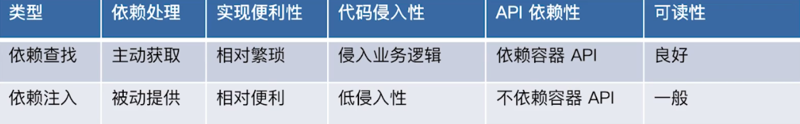

# 什么是 spring framework?

spring  是一个被广泛运用的开源的java开发框架，它提供了一个完整的编程或配置的一个现代化的基于java的企业级应用

它的核心要素是它提供了一个易用的编程模型，并且它具有很大的弹性（比如我们可以基于配置（XML,properties...）,也可以基于注解等等方式去使用他的IOC功能；在比如它提供了模块化支持，我们需要使用什么功能只需要引入对应依赖就好，比如jdbc,test... , 需要什么功能就可以使用对应的@EnableXXX注解开启对应功能，比如@EnableCaching,@EnableTransactionManagement,@EnableAsync等等），可以帮助你快速开发企业级java应用。

# spring framework有哪些核心模块

spring-context : 事件驱动(比如`ApplicationEvent`)、注解驱动（比如`@ConponentScan`），模块驱动（比如`@EnableCaching`）等 （**其中context模块又是依赖下面的core,beans,aop,expression，来提供这些包提供的功能**）

spring-core：Spring 基础API 模块，如资源管理，泛型处理 等

spring-beans：SpringBean 相关，如依赖查找，依赖注入

spring-aop : SpringAOP 处理，如动态代理，AOP 字节码提升 

spring-expression：Spring 表达式语言模块

# spring framework 的优势和不足？

# 什么是IOC ?

简单地说，IoC 是反转控制，类似于好莱坞原则，主要有依赖查找 和 依赖注入实现

# 依赖查找和依赖注入的区别？

依赖查找是主动或手动的依赖查找方式（拉的动作），通常需要依赖容器或标准API 实现。而依赖注入则是手动或自动依赖绑定的方式（推的动作），无需依赖特定的容器和 API

 

# Spring 的IoC 容器有什么优势？

* 典型的IoC 管理：依赖查找和依赖注入 
* AOP 抽象 
* 事务抽象 
* 事件机制 
* SPI 扩展 
* 强大的第三方整合 
  * spring Data
    * jdbc
    * jpa
    * LDAP : [Object-Directory Mapping](https://docs.spring.io/spring-ldap/docs/current/reference/#odm).
    * redis
    * mongoDB
    * 等等
  * jms ： java jms 标准消息服务整个
  * spring messaging ： 为了整个第三方消息服务
  * oxm ： 对象和XMl的映射
  * AOP :
  * 等等
* 易测试性 
  * spring - test
* 更好的面向对象