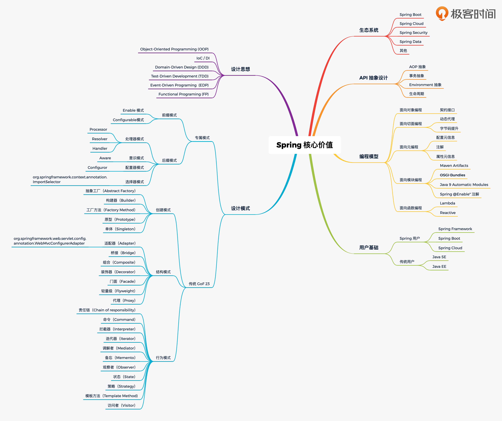

* 核心特性（core）

  * IOC容器
  * spring 事件（events）
  * 资源管理
  * 国际化
  * 校验
  * 数据绑定
  * 类型转换
  * SpEL
  * AOP

* 数据访问（Data access）

  * JDBC
  * Transactions
  * DAO Support
  * O/R Mapping
    * JPA 实现之一 hibernate
  * XML Marshalling

* Web Servlet

  * Spring MVC
  * WebSocket
  * SockJS
  * STOMP Messaging

* Web Reactive

  * Spring WebFlux
  * WebClient
  * WebSocket

* Testing

  * Mock Objects
  * TestContext Framework
  * Spring MVC Test
  * WebTestClient

* Integration  

  * 远程调用 （Remoting)
    * RMI
    * Hessian
    * Dubbo 可以基于 Hessian ，当然也可以基于其他协议
    * Thrift
    * .....
  * java 消息服务 （JMS）
    
    * ActiveMQ
  * 本地调度 （Scheduling）
  * 本地任务 （Tasks）
  * 缓存抽象 （Caching）
* java 管理扩展 （JMX）: 系统监控方面，偏向于运维侧
  
* Email
  
* JCA 
  
    