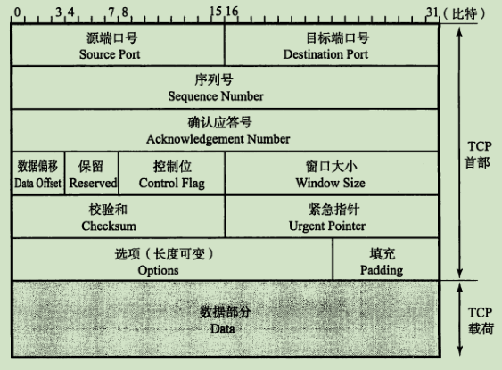

# TCP/IP

**计算机网络各种协议详解** ： http://www.52im.net/topic-tcpipvol1.html

**是一个在传输层的面向链接的可靠的字节流协议,它依赖的是网络层的 IP协议 **

https://baijiahao.baidu.com/s?id=1679150230832085964&wfr=spider&for=pc

https://blog.csdn.net/qq_22121229/article/details/103132948

TCP/IP分层（4层）从上到下：应用层、传输层、网络层、数据链路层。

**下层向上层提供能力，上层利用下层的能力提供更高的抽象**。

**链路层**，也称**网络接口层**，包括操作系统的设备驱动程序和网卡，它们一起处理与传输媒介（光纤等）的物理接口细节。链路层处理数据在媒介上的传输，以及主机与网卡、光纤等打交道的细节。因为与硬件相关，所以需要借助系统的驱动程序，链路层协议就是定义这些细节的，比如怎么把数据从网卡发送到光纤，采用什么格式编码等，它解决的数据在媒介上表示、流动的问题。

**网络层**，也就是IP层，负责处理IP datagram在网络中的传输，IP层传输的是IP datagram，借助路由表，把IP datagram从网络的一端传输到另一端，简而言之：**IP实现包的路由传输**，IP协议和路由器工作在网络层。

**传输层**，提供**端到端之间的通信**，包括提供面向连接和高可靠性的TCP，以及无连接不可靠的UDP。貌似TCP更好，但实际不是这样，UDP因为不需要建连开销，所以更快，应用得也很广，比如新一代互联网协议HTTP3.0就从TCP转向UDP，应根据适应场景选择传输层协议。

**应用层**，跟应用相关，不同应用解决不同问题，需要不同的应用层协议。

传输控制协议 TCP（Transmission Control Protocol）是面向连接的，提供可靠交付，有流量控制，拥塞控制，提供全双工通信，面向字节流（把应用层传下来的报文看成字节流，把字节流组织成大小不等的数据块），每一条 TCP 连接只能是点对点的（一对一）。

**TCP之所以可靠，**

* **包括了它的连接建立和断开的过程提供了可靠性（三次握手，四次挥手）**
* **以及数据传输提高了可靠性（每一个数据包都要再收到接收端发送的ack确认，才能继续数据传输，可以避免数据在网络传输中丢失的问题）** 关于这个的详细机制可以看[滑动窗口机制](http://c.biancheng.net/view/6427.html)

# TCP 首部信息

- **序号** ：长度位32位，用于对字节流进行编号，例如序号为 301，表示第一个字节的编号为 301，如果携带的数据长度为 100 字节，那么下一个报文段的序号应为 401。

- **确认应答号** ：期望收到的下一个报文段的序号。例如 B 正确收到 A 发送来的一个报文段，序号为 501，携带的数据长度为 200 字节，因此 B 期望下一个报文段的序号为 701，B 发送给 A 的确认报文段中确认号就为 701。

- **数据偏移** ：该字段表示TCP所传输的数据部分应该从TCP包的哪个位开始，当然也可以把它看做TCP首部的长度。该字段长4位，单位为4字节（32位）。

- **保留字段**：该字段主要是为了以后扩展时使用，其长度为4位，一般设置为0，但即使收到的包在该字段不为0，此包也不会被丢弃。

- **控制位** 字段长为8位，每一个从左到至右分别为CWR，ECE，URG，ACK，PSH、RST、SYN、FIN。这些控制标志也叫作控制位。当它们对应位上的值为1时，具体含义如

  - **SYN**：用于建立连接。SYN为1表示希望建立连接，并在其序列号的字段进行序列号初始值的设定。

    当 SYN=1，ACK=0 时表示这是一个连接请求报文段。若对方同意建立连接，则响应报文中 SYN=1，ACK=1。

  - **FIN**：用该位为1时，表示今后不会再有数据发送，希望断开连接。当通信结束希望断开连接时，通信双方的主机之间就可以相互交换FIN位置为1的TCP段。每个主机又对对方的FIN包进行确认应答以后就可以断开连接。不过，主机收到FIN设置为1的TCP端以后不必马上回复一个FIN包，而是可以等到缓冲区中所有数据都已成功发送而被自动删除之后再发。

  - **ACK**：当 ACK=1 时确认号字段有效，否则无效。TCP 规定除了最初建立时的SYN包之外，在连接建立后所有传送的报文段都必须把 ACK 置 1。

  - **CWR**：CWR标志与后面的ECE标志用于IP首部的ECN字段。ECE标志为1时，则通知对方将拥塞窗口变小。

  - **ECE**(ECN-Echo):ECE标志表示ECN-Echo。置为1会通知通信的对方：从对方到这边的网络有拥塞。在收到数据包的IP首部中ECN为1时将TCP首部中的ECE设置为1。

  - **URG**(Urgent Flag):该为为1时，表示包中有需要紧急处理的数据。对于需要紧急处理的数据，会在后面的紧急指针中再进行解释。

  - **PSH**(Push Flag):该位为1时，表示需要将受到的数据立即传输给上层的应用。PSH为0时，则不需要立即上层而是先进行缓存。

  - **RST**(Reset Flag):该位为1时表示TCP连接中出现异常必须强制断开连接。例如，一个没有被使用的端口即使发来连接请求，也无法通行。此时就可以返回一个RST设置为1的包。此外，程序宕掉或切断电源等原因导致主机重启的情况下，由于所有的连接信息将全部被初始化，所以原有的TCP通行也将不能继续进行。这种情况下，如果通信对方发送一个设置为1的RST包，就会强制断开连接。

* **窗口size** ：该字段为16位，用于通知从相同TCP首部的确认应答号所指位置开始能够接收的数据大小（8位字节）。TCP不允许发送超过此处所示大小的数据。不过，如果窗口为0，则表示可以发送窗口探测，以了解最新的窗口大小。但这个数据必须是1个字节。窗口值作为接收方让发送方设置其发送窗口的依据。之所以要有这个限制，是因为接收方的数据缓存空间是有限的。

* **TCP的校验和**与UDP相似，却别在于TCP的校验和无法关闭。TCP和UDP一样在计算校验和的时候使用TCP伪首部。这个伪首部如图：

   

  为了让其全长为16位的整数倍，需要在数据部分的最后填充0。首先将TCP校验和字段设置为0.然后以16位为单位进行1的补码和计算，再将它们的总和的1的补码和放入校验和字段。接收端在收到TCP数据段以后，从IP首部获取IP地址信息构造TCP伪首部，再进行校验和计算。由于校验和字段里保存着除本字段以外其他部分的和的补码值，因此如果计算校验和字段在内的所有数据的16位和以后，得出的结果是“16位全部为1 ”，说明收到的数据是正确的。

* **紧急指针**：该字段长为16位。只有在URG控制位为1时有效。该字段的数值表示本报文中的紧急数据的指针。正确来讲，从数据部分的首位到紧急指针所指示的位置为止为紧急数据。因此也可以说紧急指针指出了紧急数据的末尾在报文段中的位置。如何处理紧急数据属于应用的问题。一般在暂时中断通信，或中断通信的情况下使用。例如在Web浏览器中点击停止按钮，或者使用TELNET输入Ctrl+C时都会有URG为1的包。此外，紧急指针也用左表示数据流分段的标志。

* **选项**：选项字段用于提高TCP的传输性能。因为根据数据偏移（首部长度）进行控制，所以其长度最大为40字节。另外，选项字段尽量调整其为32位的整数倍。具有代表性的选项部分：

类型2的MSS选项用于在建立连接时决定最大段长度的情况。这选项用于大部分操作系统。

类型3的窗口扩大，是一个用来改善TCP吞吐量的选项。TCP首部中窗口字段只有16位。因此在TCP包的往返时间（RTT）内，只能发送最大64K字节的数据。如果采用了该选项，窗口的最大值可以扩展到1G字节。因此，即使在一个RTT较长的网络环境中，也能达到较高的吞吐量。

# 三次握手

1. 启动服务端，然后服务端主动监听某个端口，处于LISTEN（监听）状态
2. 第⼀次握手，客户端向服务端发送请求连接包文，报文首部 SYN 标志位为 1，同时设置序列号 seq=x（随机数）；发出后，客户端进⼊SYN_SENT（ SYN 报文不携带数据）
3. 第⼆次握手，服务端收到客户端的请求后，需要进行确认，将响应报文中ACK标志位设置为1，将确认号 ack 设置为第⼀步请求序列号 seq+1(ack=x+1)，将SYN标志位设置为 1，即 SYN+ACK 包，包序号 seq=y，服务端进入 SYN_RCVD 状态
4. 第三次握手，客户端收到来自服务端的 SYN+ACK 包，发送⼀个 ACK 确认包，ACK=1，seq=x+1（第⼀步的序号x递增），ack=y+1（序号为y及之前的数据已收到，期待收到序号y+1之后的数据）

## 三次握手的原因

**三次握手**能让**Server**和**Client**都确认双⽅发送和接收正常

1. **第⼀次握⼿**：Client什么都不能确认，**Server**确认自己**接收正常，对方发送正常**

2. **第⼆次握⼿**：**Client**确认了**自己发送和接收正常**，**对方发送和接收正常**。**Server**确认了**自己接收正常，对方发送正常**

3. **第三次握⼿**：Client确认了⾃⼰发送和接收正常，对⽅发送和接收正常。**Server**端确了自己**发送和接收正常**，**对方发送和接收正常*

**⼆次握⼿可以吗？**

不可以，因为Server端⽆法确认⾃⼰发送正常和对⽅接收正常

**四次握⼿可以吗？**

当然可以，但是没必要。保证Server和Client都正常发送和接收就可以了

## 在三次握手过程中可能产生的问题- 队列溢出（syns queue和 accept queue）

https://www.cnblogs.com/kukuxjx/p/17539820.html

在三次握手的过程中，有2个重要的队列，**syns queue（半连接队列）**和**accept queue（全连接队列）**

1. 在第一次握手的时候会将socket存储到 **c 队列**
2. 在第三次握手的时候 server端才会将 socket从 **syns queue** 转移到 **accept queue**

**队列移除通常有两种情况：**

1.  syncs queue : 队列不够用

   在 tcp 建立连接的 3 路握手过程中，当服务端收到最初的 SYN 请求时，会检查应用程序的 syn_backlog 队列是否已满。若已满，通常行为是丢弃此 SYN 包。若未满，会再检查应用程序的 backlog 队列是否已满。若已满并且系统根据历史记录判断该应用程序不会较快消耗连接时，则丢弃此 SYN 包。如果启用 tcp_syncookies 则在检查到 syn_backlog 队列已满时，不丢弃该 SYN 包，而改用 syncookie 技术进行 3 路握手。

   > **警告：**使用 syncookie 进行握手时，因为该技术挪用了 tcp_options 字段空间，会强制关闭 tcp 高级流控技术而退化成原始 tcp 模式。此模式会导致 封包 丢失时 对端 要等待 MSL 时间来发现丢包事件并重试，以及关闭连接时 TIME_WAIT 状态保持 2MSL 时间。该技术应该仅用于保护 syn_flood 攻击。如果在正常服务器环境中服务器负载较重导致 syn_backlog 和 backlog 队列满时，应优化 服务端应用程序 的 负载能力，加大应用程序 backlog 值。不过，所幸该参数是自动值，仅在 syn_backlog 队列满时才会触发 (在队列恢复可用时此行为关闭)。

2. accept queue ： 在第三次握手成功后，会从 syncs queue 中找到对应的半连接移动到 accept queue 中，如果这个队列满了就会拒绝。拒绝策略由服务端的 **tcp_abort_on_overflow  配置控制**

   * tcp_abort_on_overflow为0：全连接队列满时，server端扔掉client发过来的ack，那么client会重新发送ack，直到超时，这时客户端就会看到 connection timeout 的错误
   * tcp_abort_on_overflow为1：全连接队列满时，server端发送⼀个reset包给client，这时客户端就会看到connection reset 的错误, 表示废掉这个握手过程和这个连接

### syncs queue 溢出的排查方法

很遗憾，TCP 半连接队列长度的长度，没有像全连接队列那样可以用 ss 命令查看。

但是我们可以抓住 TCP 半连接的特点，就是服务端处于 `SYN_RECV` 状态的 TCP 连接，就是在 TCP 半连接队列。

于是，我们可以使用如下命令计算当前 TCP 半连接队列长度：

但是其实我们配置的 tcp_max_syn_backlog = 512， 所以这个长度限制不是完全由 tcp_max_syn_backlog  决定的

在 linux 2.6.32 版本中： 

* 如果「当前半连接队列」**没超过**「理论半连接队列最大值」，但是**超过** max_syn_backlog - (max_syn_backlog >> 2)，那么处于 SYN_RECV 状态的最大个数就是 max_syn_backlog - (max_syn_backlog >> 2)；
* 如果「当前半连接队列」**超过**「理论半连接队列最大值」，那么处于 SYN_RECV 状态的最大个数就是「理论半连接队列最大值」；

**理论半连接队列最大值**

* 当 max_syn_backlog > min(somaxconn, backlog) 时， 半连接队列最大值 max_qlen_log = min(somaxconn, backlog) * 2;
* 当 max_syn_backlog < min(somaxconn, backlog) 时， 半连接队列最大值 max_qlen_log = max_syn_backlog * 2;

### accept queue 溢出的排查方法

**我们可以通过 netstat 或者 ss 命令查看socket信息**

1. 当**socket处于 LISTEN 状态**时，**Send-Q**为 **accept queue**的最大长度，**Recv-Q为accept queue中等待应用程序 accept() 的 socket数目**

   **在服务端使用 ss -lnt 可以查看TCP状态是 LISTEN 状态的 信息**

   

   - Recv-Q：当前全连接队列的大小，也就是当前已完成三次握手并等待服务端 `accept()` 的 TCP 连接个数；
   - Send-Q：当前全连接最大队列长度，上面的输出结果说明监听 8088 端口的 TCP 服务进程，最大全连接长度为 128；

   如果这个 socket处于 LISTEN 状态，高并发场景可能 **accept queue 队列会不够用**，这个时候client端就可能收到 **connection reset / connection timeout** 的异常，这个取决于服务端机器的 **tcp_abort_on_overflow 的配置（上文中有）**  

   

   **当超过了 TCP 最大全连接队列，服务端则会丢掉后续进来的 TCP 连接**，丢掉的 TCP 连接的个数会被统计起来，我们可以使用 `netstat -s` 命令来查看：

   

   上面看到的 41150 times ，表示全连接队列溢出的次数，注意这个是累计值。可以隔几秒钟执行下，如果这个数字一直在增加的话肯定全连接队列偶尔满了。

   

   **如何设置 syncs queue 和 accept queue 的大小**

   1. sync queue 队列⻓度由 /proc/sys/net/ipv4/tcp_max_syn_backlog 指定

   2. accept queue 队列⻓度 为 min(somaxconn, backlog)

   3. somaxconn 的值可以在配置⽂件/proc/sys/net/core/somaxconn中直接修改 是 Linux 内核的参数，默认值是 128

   4. backlog 的值是在创建socket时传⼊的 : 比如java中默认是 50  , Nginx 默认值是 511

      

   

   

   **了解上面啊的信息之后，我们当发现客户端请求的 RT过高，但是服务端的耗时，cpu，线程状态等正常的时候，我们可以看看 connection timeout 和 connection reset 是否过多，如果定位到，首先修改机器的tcp_abort_on_overflow =1 ，这样可以确切的通过 connection reset 这个异常信息来进一步确认（因为 connection timeout 不一定是 accept queue 慢了才会返回的异常信息）。然后再通过 ss -lnt / netstat -lnt 查看服务端的 accept queue 是否满了。如果是的话，可以增加这个队列的大小。 **

   > 通常来说只有你肯定会有accept queue 异常的时候才设置为1
   >
   > 因为设置 0 ，再并发不高的时候，客户端的重试是有机会连接成功的。

2. 当**socket处于 ESTABLISHED 状态**时，**Send-Q**与**Recv-Q分别表示 socket发送缓冲区 与 接收缓冲区数据大小**

   **在服务端使用 ss -nt / netstat -nt 可以查看TCP状态是 ESTABLISHED 状态的 信息**

   

   - Recv-Q：已收到但未被应用进程读取的字节数；
   - Send-Q：已发送但未收到确认的字节数；

当我们通过tcp发送数据的时候，数据并不是直接通过网络发送完就完事了，而是先将数据发送到发送缓冲区，然后再发送到对方的接收缓冲区。当相应的数据返回ack后才会从发送缓冲区中删除（这里涉及到滑动窗口协议，有兴趣的小伙伴可以参考⼀下其他书籍）当发送缓冲区满时，发送端将会阻塞，不能发送数据。如果接收端⼀直不读取数据，不发送ack，也会导致发送方无法发送数据

**所以当请求处理比较慢时，可以看⼀下 Send-Q 和 Recv-Q 是否有大量积压** ： 通过上文提到的 ss / netstat  在接收请求的服务端/客户端查询 socket 的信息，同时通过它的状态判断以及 Send-Q 和 Recv-Q 判断是否有问题

### 总结一下（如果发生服务端正常，但是客户端请求耗时高，获取获取链接超时的问题）

那么可以先看是否是  accept queue 溢出，如果不是在确认是否是 syncs queue 溢出（可能是遭到了 syncs 攻击（只做第一次握手，暂用syncs queue 空间））

# 四次挥手

描述不讨论序号和确认号，因为序号和确认号的规则比较简单。并且不讨论 ACK，因为 ACK 在连接建立之后都为 1。

**这一过程由客户端或服务端任一方执行close来触发。**

- A 发送连接释放报文，FIN=1。

- B 收到之后发出ACK确认，确认序号为收到的序号加1,和SYN一样，一个FIN报文将占用一个序号。

  此时 TCP 属于半关闭状态，因为是A发起的所以他能直接知道并控制不在向B发送数据，此时B也会控制不在继续有新的传输数据任务发起但是B可能还有正在传输的数据所以这时候会进行最后的数据传输，将B中未传输完成的数据传输完成

- 在上一步传输完成之后，B 发送连接释放报文 FIN=1；

- A 收到后发出ack确认，进入 TIME-WAIT 状态，等待 2 MSL（最大报文存活时间）后释放连接。

- B 收到 A 的确认后释放连接

为什么需要四次？

1. 如果只有一次，A告诉B说断开吧，然后A就把链接关闭了，会发生生么？B还有数据没传完，就都丢失了

2. 如果只有两次，A告诉B说断开吧，这时候A不断，他等B回复他，那么会遇到什么问题呢？

   如果B在数据位传输完成前回复A,A关闭了数据丢失，B没办法告诉A你等多久就把链接关了吧，因为数据传输是受到网络环境影响的，时间说多了。链接卡在那浪费资源，少了数据会丢失，所以B没法再受到消息后直接回复说你等多久就把链接关了，

   那如果不回复，等数据传输完了再回复呢？数据传输要多久呢？A应该等你多久呢，就像我们找一个人支持一样，你不可能无限期等下去，你会重复发消息给他确认

   **并且这时候内核不能再接收该链接的新的数据了**

3. 那我们再加一次，三次

   1. 这次B受到消息后，先回复收到了，你等我处理完成我告诉你
   2. 然后这时候B就可以在处理完成数据之后告诉A可以关闭了,然后B吧自己链接关闭了

   看着挺完美的，会不会有问题？如果B告诉A可以关闭的这个消息丢失了？那么A的链接就无法关闭，就会一再值那浪费了。

   所以我们B需要确认A确实收到了消息，他需要A回复的，为了避免A一直等他，所以需要第四次（收到A的回复），同时为了避免A一直等待的问题，A他在这过程也会设置一个等待时间

**为什么客户端在第四次挥手后还会等待 2MSL？**

等待 2MSL 是因为保证服务端接收到了 ACK 报文，因为网络是复杂了，很有可能 ACK 报文丢失了，如果服务端没接收到 ACK 报文的话，会重新发送 FIN 报文，只有当客户端等待了 2MSL 都没有收到重发的 FIN 报文时就表示服务端是正常收到了 ACK 报文，那么这个时候客户端就可以关闭了。

**结合上图虽然协议上是说FIN-Wait1是需要一直等待的，但是在实际操作中，资源是有限的，所以在linux中FIN-Wait1是会有超时设计的**

这样设计还有一个原因：有效避免了有针对性截获ACK或者不发送ACK而导致的DDoS 

TIME-wait 是为了等待网络中残余的数据（有可能会有），处于TIME_WAIT状态的socket在等待两倍的MSL时间以后（之所以是两倍的MSL，是由于MSL是一个数据报在网络中单向发出到认定丢失的时间，一个数据报有可能在发送图中或是其响应过程中成为残余数据报，确认一个数据报及其响应的丢弃的需要两倍的MSL），将会转变为CLOSED状态。这就意味着，一个成功建立的连接，必然使得先前网络中残余的数据报都丢失了。 

https://blog.csdn.net/lianhunqianr1/article/details/118919500

https://blog.csdn.net/baidu_38432732/article/details/81289274