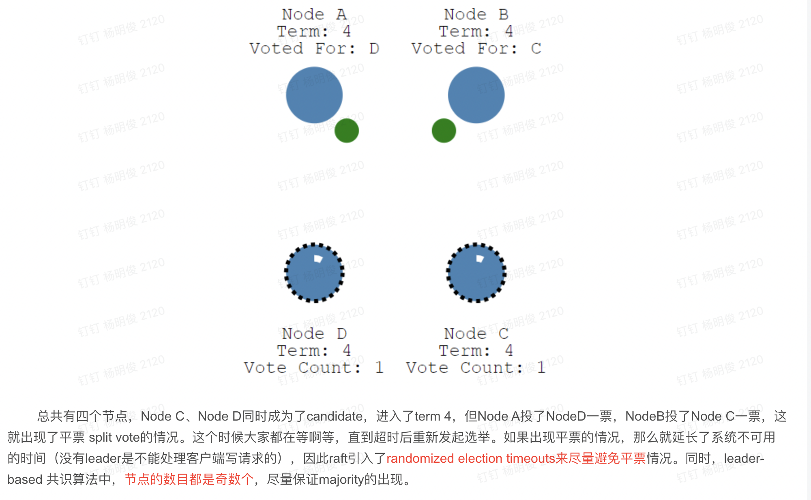
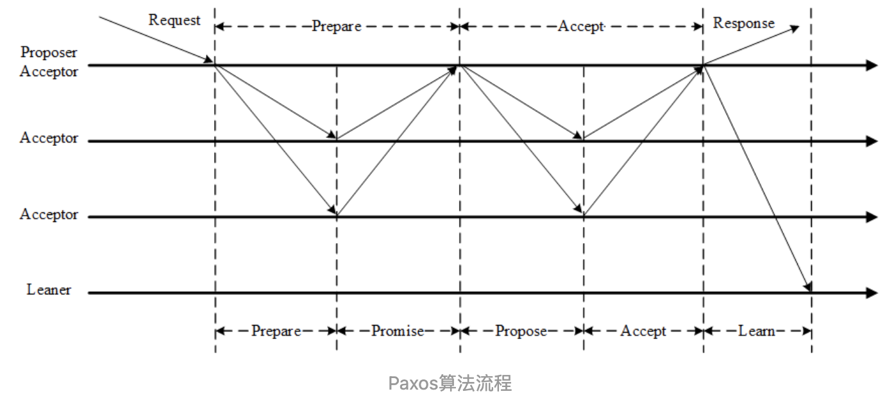
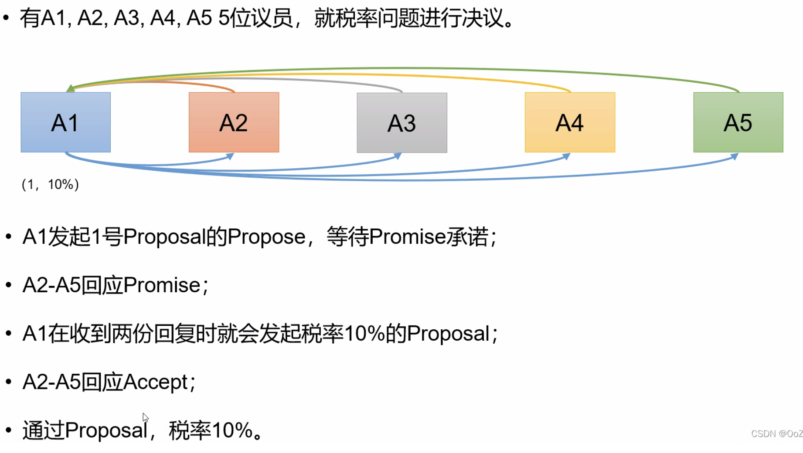
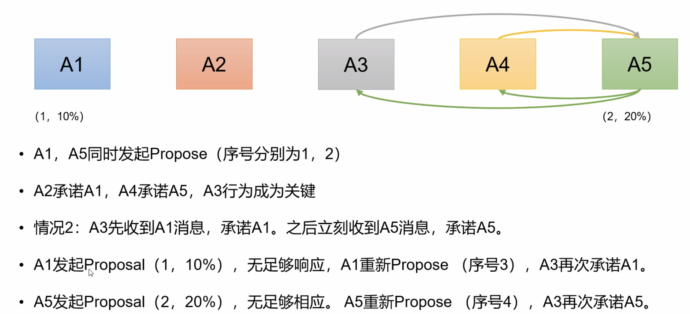
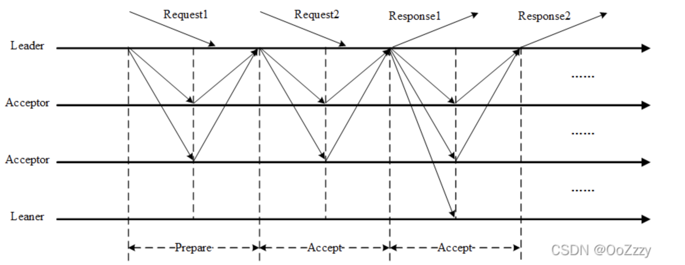
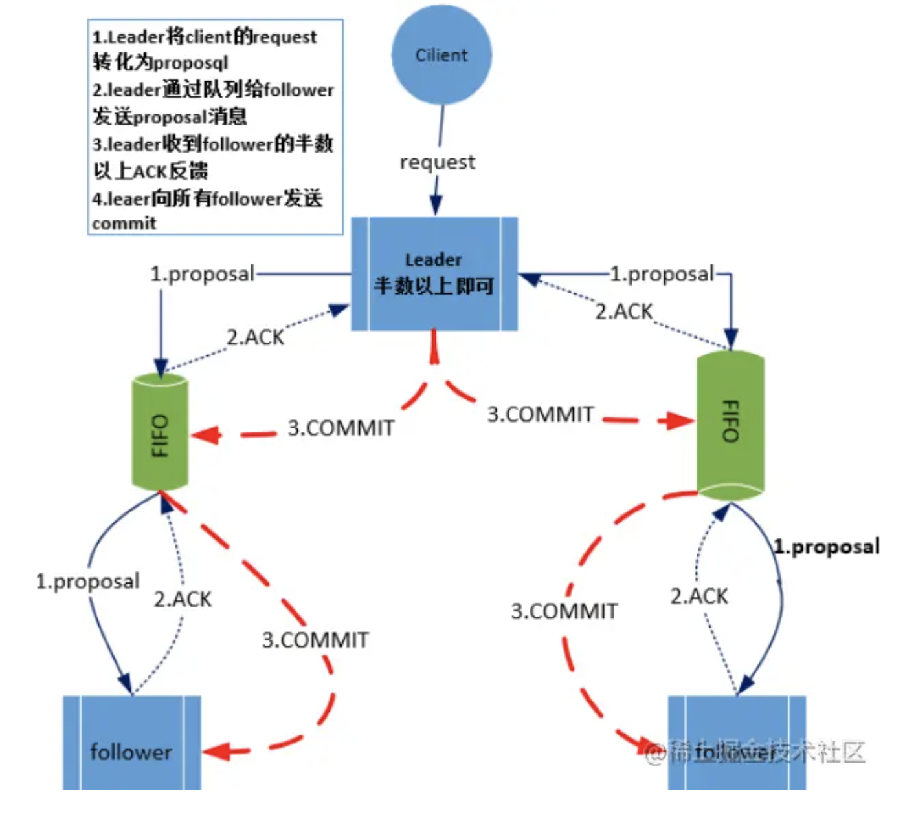

https://wenku.baidu.com/view/50b954cce309581b6bd97f19227916888586b974.html

# Gossip 协议（AP协议）

https://wenku.baidu.com/view/7735ad0b4873f242336c1eb91a37f111f1850d3a.html?_wkts_=1697799751212


https://wenku.baidu.com/view/0b9bec475bfafab069dc5022aaea998fcc2240ff.html?rec_flag=default&fr=Recommend_RelativeDoc-100212%2C100225%2C90190%2C80166%2C80139%2C80163%2C110192%2C80237-search_rec_append-7735ad0b4873f242336c1eb91a37f111f1850d3a&sxts=1650762189731&_wkts_=1697800162215

# Raft （CP）

https://blog.csdn.net/yangmengjiao_/article/details/120191314

动画演示：http://thesecretlivesofdata.com/raft/

## **节点的状态：**

1. follower
2. candidate
3. leader

## **选举过程**

**在 Raft 中，有两个超时设置可以控制选举。**

1. 首先是election timeout: 选举超时是指follower 成为 candidate 的等待时间。选举超时随机设定为 150ms 至 300ms。
2. heartbeat timeout

普通节点在election timeout超时后，follower 将成为 candidate，并开始新的选举任期... candidate 会先给自己投一票。然后candidate 向其他节点请求投票。如果接收节点(follower节点)尚未在这一术语中投票，则它将投票给该candidate, 该follower节点会重置其election timeout。

如果该candidate节点获取了多数节点的投票(过半节点的投票，要求获得多数票保证了每届只能选出一位领导人)那么他会成为 leader。 领导者开始向其追随者发送 Append Entries 信息。这些信息的发送间隔由heartbeat timeout指定。然后，followers会回复每条 Append Entries 信息（要求follower同步leader的状态信息），并重置自己的election timeout。 这一任期将持续到follower停止接受心跳并成为candidate为止. 让我们停止leader，看着会发生什么：由于follower 收不到leader的心跳信息（append entries），那么他们的election timeout超时之后，他们会变成candidate. 选举代数+1. 开始新一轮的选举重复上面的选举流程。

**Raft的平票问题：**

如果两个节点同时成为candidate请求其他节点投票，可能会发生这个问题。这时候需要发起下一次选举(选举代数+1)，raft通过使用随机timeout 的方式来实现发生平票问题后的选举过程只会有一个节点发起请求投票的操作。



### **上文中的投票需要注意**

1. 要获取一个节点的投票必须满足 candidate的数据比该节点数据的offset（term，log index）大 .
2. 投票只会投一次先到先得(也就是说如果再一轮选举中，有多个candidate. 那么follower节点指挥投票一次)
3. 由于我们的选举需要过半机制来满足，所以集群的节点数通常需要是基数个

## 选举成功之后

### 状态同步（日志复制）。

选出leader后，我们需要将对系统的所有更改复制到所有节点。这是通过使用与心跳相同的 *Append Entries* message 来实现的。

并且后续的所有数据也需要先请求 leader 节点。然后数据会先存在 leader节点的日志中，作为一个未提交的条目。然后再下一次心跳消息中会发送 *Append Entries* message（它同时也是一个心跳消息） 给到 followers 节点。leader等待大多数节点写入条目之后(从心跳请求的响应信息中得知)该条目会在leader节点上提交. 并返回信息给到 client端，数据写入成功。 然后leader会让followers 提交他们日志中的该条目。导致集群的状态达成一致。

### 脑裂问题

因为有过办机制的保护：我们分区中要吗有一个leader. 要吗没有leader. 并且写操作只有一个分区可能能正常运行，并在恢复后保证集群的一致性。要吗没有任何分区能够完成写操作。基于此自然避免了脑裂残生的多leader导致的数据最终不一致的问题。


比如我们存在一个 5个节点的集群 A, B ,C, D, E 。 A 是leader， 当前任期 是1.  现在产生了网络分区。比如分成了两个网络

AB , CDE 。 那么CED 会在 election timwout 之后选举出一个新的leader . 比如是 C， 当前任期+1了也就是2.

这时候我们存在两个leader. client 就可能会将数据修改的请求发送到两个 leader. 但是由于我们的数据修改也是需要多数节点确认的。AB的分区就无法满足过半的节点同步，也就是说AB分区无法完成数据的commit的。但是CDE是可以完成的。再网络分区恢复之后。A将会看到一个更高的任期。它将会自己下台，并同步CDE的数据使得集群数据一致。

如果分区变成 A, BCDE. 其实也是一样的。

如果分区再多一下是三个分区。 A, B , CED ; AB, CD, E 这样的形势。 A,B, CDE 和上面的情况是一样的。 AB,CD,E 这种会整个集群**写操作不可用**。因为没有任何一个分区能够满足过半的要求。


## 和paxso , zab 的不同是 

1. 投票只会投一次先到先得
2. 要获取到投票必须满足 candidate的数据比它所通知的节点数据的offset（term，log index）大
2. 发起通知的节点需要使用一个随机的time out , 避免在偶数节点下出现活锁问题（所以我们通常是要弄基数个节点）

# paxso

## Paxos算法简介

Paxos算法是一种基于消息传递且具有高容错性的一致性算法

Paxos解决的问题是如何正确快速在一个分布式系统 中对某个状态（数据）达成一致。

## Paxos算法流程

在一个Paxos算法系统中, 所有节点分为3类: **Propersor提议者**, **Accepter接受者**, **Learner学习者**

* Proposer: 提出提案 (Proposal)。Proposal信息包括提案编号 (Proposal ID) 和提议的值 (Value)。
* Acceptor：参与决策，回应Proposers的提案。收到Proposal后可以接受提案，若Proposal获得多数Acceptors的接受，则称该Proposal被批准。
* Learner：不参与决策，从Proposers/Acceptors学习最新达成一致的提案（Value）。

**一个完整的Paxos算法分为3个阶段:**

1. Prepare准备阶段

   Proposer向Acceptors发出Prepare请求，Acceptors针对收到的Prepare请求进行Promise承诺。

2. Accept阶段

   Proposer收到多数Acceptors承诺的Promise后，向Acceptors发出Propose请求，Acceptors针对收到的Propose请求进行Accept处理。

3. Learn阶段

   Proposer在收到多数Acceptors的Accept之后，标志着本次Accept成功，决议形成，将形成的决议发送给所有Learners。



**Paxos算法流程中的每条消息描述如下：**

1. Prepare:  Proposer生成全局唯一且递增的Proposal ID(可使用时间戳加Server ID)，向所有Acceptors发送Prepare请求，这里无需携带提案内容，只携带Proposal ID即可。
2. Promise: Acceptors收到Prepare请求后，做出“两个承诺，一个应答”。

**两个承诺：**

* **不再接受Proposal ID小于等于（注意：这里是<= ）当前请求的Prepare请求。**

* **不再接受Proposal ID小于（注意：这里是< ）当前请求的Propose请求。**

**一个应答：**

**不违背以前作出的承诺下，回复已经Accept过的提案中Proposal ID最大的那个提案的Value和Proposal ID，没有则返回空值。**

3. Propose: Proposer 收到多数Acceptors的Promise应答后，从应答中选择Proposal ID最大的提案的Value，作为本次要发起的提案。如果所有应答的提案Value均为空值，则可以自己随意决定提案Value。然后携带当前Proposal ID，向所有Acceptors发送Propose请求。
4. Accept: Acceptor收到Propose请求后，在不违背自己之前作出的承诺下，接受并持久化当前Proposal ID和提案Value。
5. Learn: Proposer收到多数Acceptors的Accept后，决议形成，将形成的决议发送给所有Learners。




**这时候由于 A3 同意了 A5 的 prepare ，因为两个承诺的原因，它会拒绝 A1的proposal (因为A1的proposal此时的序号为1<A3当前承诺的最大id 2 ) 这时候A5会成功**

## 活锁问题

回顾两个承诺之一，Acceptor不再应答Proposal ID小于等于当前请求的Prepare请求。意味着需要应答Proposal ID大于当前请求的Prepare请求。

两个Proposers交替Prepare成功，而Accept失败，形成活锁（Livelock）。



**这种情况就很尴尬了，由于A3承诺A5.导致A1的proposal（1，10%）没有足够的响应，所以他会重新增加序号，prepare，这时候A5才开始发起proposal（2，20%），很明显会被拒绝，然后这样循环往复，就会导致一直选不出一个最终状态**

这种情况是很极端的情况了，从概率上来说很难碰到，但是拉长时间那就是一定会碰到的

## 总结

paxos协议要完成分布式一致性同步的核心是

1. 分布式的递增的一致性id （全局递增的）
2. 两个承诺一个应答

> ————————————————
> 版权声明：本文为CSDN博主「OoZzzy」的原创文章，遵循CC 4.0 BY-SA版权协议，转载请附上原文出处链接及本声明。
> 原文链接：https://blog.csdn.net/qq_43141726/article/details/123021972

# Multi-Paxos算法

原始的Paxos算法（Basic Paxos）只能对一个值形成决议，决议的形成至少需要两次网络来回，在高并发情况下可能需要更多的网络来回，极端情况下甚至可能形成活锁。如果想连续确定多个值，Basic Paxos搞不定了。因此Basic Paxos几乎只是用来做理论研究，并不直接应用在实际工程中。

实际应用中几乎都需要连续确定多个值，而且希望能有更高的效率。Multi-Paxos正是为解决此问题而提出。Multi-Paxos基于Basic Paxos做了两点改进：

1. 针对每一个要确定的值，运行一次Paxos算法实例（Instance），形成决议。每一个Paxos实例使用唯一的Instance ID标识。
2. 在所有Proposers中选举一个Leader，由Leader唯一地提交Proposal给Acceptors进行表决。这样没有Proposer竞争，解决了活锁问题。在系统中仅有一个Leader进行Value提交的情况下，Prepare阶段就可以跳过，从而将两阶段变为一阶段，提高效率。



**Multi-Paxos首先需要选举Leader，Leader的确定也是一次决议的形成，所以可执行一次Basic Paxos实例来选举出一个Leader。**选出Leader之后只能由Leader提交Proposal，在Leader宕机之后服务临时不可用，需要重新选举Leader继续服务。在系统中仅有一个Leader进行Proposal提交的情况下，Prepare阶段可以跳过。

Multi-Paxos通过改变Prepare阶段的作用范围至后面Leader提交的所有实例，从而使得Leader的连续提交只需要执行一次Prepare阶段，后续只需要执行Accept阶段，将两阶段变为一阶段，提高了效率。为了区分连续提交的多个实例，每个实例使用一个Instance ID标识，Instance ID由Leader本地递增生成即可。

Multi-Paxos允许有多个自认为是Leader的节点并发提交Proposal而不影响其安全性，这样的场景即退化为Basic Paxos。

Chubby和Boxwood均使用Multi-Paxos。ZooKeeper使用的Zab也是Multi-Paxos的变形。

# zab

原文链接：https://blog.csdn.net/weixin_42653522/article/details/120341626

## **Zab 协议原理:**

每个leader都需要经历三个阶段：发现（选举），同步，广播

目的是通过选举leader以中心化的方式来管理数据的写入，然后采用广播同步，崩溃恢复及时同步的方式保证主备数据的最终一致性，实现一个高可用的分布式主备数据系统

在 Zookeeper 中只有一个 Leader，并且只有 Leader **可以处理外部客户端的事务请求，并将其转换成一个事务 Proposal（写操作），然后 Leader 服务器再将事务 Proposal 操作的数据同步到所有 Follower（数据广播/数据复制）。**

**Zookeeper 采用 Zab 协议的核心就是只要有一台服务器提交了 Proposal，就要确保所有服务器最终都能正确提交 Proposal，这也是 CAP/BASE 最终实现一致性的体现。**

## Zab 模式

Zab 协议有支持两种模式：一种是原子广播模式，另一种是崩溃恢复模式。

### 广播模式

Zookeeper 中广播消息步骤：



客户端发起一个写操作请求

1. Leader 服务器处理客户端请求后将请求转换为 Proposal，同时为每个 Proposal 分配一个全局唯一 ID，即 ZXID
2. Leader 服务器与每个 Follower 之间都有一个队列，Leader 将消息发送到该队列
3. Follower 机器从队列中取出消息处理完（写入本地事务日志中）后，向 Leader 服务器发送 ACK 确认
4. Leader 服务器收到半数以上的 Follower 的 ACK 后，即认为可以发送 Commit
5. Leader 向所有的 Follower 服务器发送 Commit 消息

zab 协议的核心就是你要有一台服务器commit了proposal，就要确保所有服务器最终都commit该proposal

leader 服务器与每个leader之间都有一个单独的队列用来同步消息，follower自己去拉取消息处理。 这样可以避免使用同步的方式造成阻塞影响性能

### 崩溃恢复模式

一旦 Leader 服务器出现崩溃或者由于网络原因导致 Leader 服务器失去了与过半 Follower 的联系，那么就会进入崩溃恢复模式。

Zookeeper 集群中为保证任何数据的写入能够顺序执行，只能是 Leader 服务器接收写请求，其他服务器接收到客户端的写请求，也会转发至 Leader 服务器进行处理。

**Zab 协议崩溃恢复需满足以下2个请求：**

1. 确保已经被 Leader commit的 proposal 必须最终被所有的 Follower 服务器commit
2. 确保已经被 Leader 提出但没有被commit的 Proposal 被丢弃掉

也就是新选举的leader的数据只会包含已提交的proposal。**新选举出来的 Leader 节点中含有最高的 ZXID，所以，在 Leader 选举时，将 ZXID 作为每个 Follower 投票时的信息依据。这样做的好处是避免了 Leader 服务器检查 Proposal 的提交和丢弃工作。zixd 相同则选择 myid 最大的节点 **

**数据同步**

新的leader选举出来之后，会和follower 建立通信，并且会将他自身最大的zxid发送给其他follower节点，follower会根据该zxid 执行回退/数据同步，以保证和leader的数据一致性

**因为每轮选举结束 zxid 的高32位 epoch都会递增，然后低32位会归0 所以可以保证zxid 全局递增**


### Leader 选举算法

在 大雨 3.4.10 版本中，是TCP的FastLeaderElection完成选举的

#### myid

每个 Zookeeper 服务器，都需要在数据文件夹下创建一个名为 myid 的文件，该文件包含整个 Zookeeper 集群唯一的 ID，例如，某个 Zookeeper 集群包含三台服务器，hostname 分别为 zoo1,zoo2,zoo3，其中 myid 分别为1,2,3,则在配置文件中其 ID 与 hostname 必须一一对应，如在配置文件中，server.后面的数据即为 myid

```shell
server.1=zoo1:2888:3888
server.2=zoo2:2888:3888
server.3=zoo3:2888:3888
```

#### ZXID

类似于 RDBMS 中的事务ID，用于标识一个 Proposal ID，为了保证顺序性，ZXID 必须单调递增，因此 Zookeeper 使用一个 64 位的数来表示

1. **高 32 位是 Leader 的 epoch，从 1 开始，每次选出新的 Leader，epoch 加 1**
2. **低 32 位为该 epoch 内的序号，每次 epoch 变化，都将低 32 位的序号重置，这样保证了 ZXID 的全局递增性。**

#### 服务器状态

* Looking：不确定Leader状态，该状态下的服务器认为当前集群中没有Leader，会发起Leader选举
* Following：跟随者状态，表明当前服务器角色是Follower，并且它知道Leader是谁
* Leading：领导者状态，表明当前服务器角色是Leader，它会维护与Follower间的心跳
* Observing（类比paxos中的 learner）：观察者状态，表明当前服务器角色是Observer，与Follower唯一的不同在于不参与选举，也不参与集群写操作时的投票，follower太多leader的通信压力就会增加。多增加几个observer，协助follower处理读请求，还不用给它投票权去消耗更多资源。

#### 选票数据结构

每个服务器在进行领导选举时，会发送如下关键信息：

* logicClock 每个服务器会维护一个自增的整数，名为logicClock，它表示这是该服务器发起的第多少轮投票
* state 当前服务器的状态
* self_id 当前服务器的myid
* self_zxid 当前服务器上所保存的数据的最大zxid
* vote_id 被推举的服务器的myid
* vote_zxid 被推举的服务器上所保存的数据的最大zxid

#### 集群规模至少要 3 台机器或以上

集群规则为：2N + 1台，N > 0，即最少需要 3 台，因为 ZK 集群的机制是只要超过半数的节点正常，集群就能正常提供服务。只有在 ZK 节点挂得太多，只剩一半或不到一半节点能工作时，集群才会失效。

如以下分析所示：

3 个节点的 Cluster 可以挂掉 1 个节点（Leader 可以得到 2 票 > 1.5)

2 个节点的 Cluster 就不能挂掉任何 1 个节点了（Leader 可以得到 1 票 <= 1)

所以你知道 ZK 集群为什么至少要 3 台了吧？

#### 过半机制保证不会出现脑裂现象

选举leader 必须保证 获取的票数 > n/2 , 如果是 3个节点，就算产生了脑裂，1 : 2(一个小集群有一台服务器，另一个有两台服务器) 有两台服务器的最高是2> 1 可以选出leader， 1:1:1这种情况不会选举出leader

如果是5台服务器 需要获取的票数 > 2, 1:4 , 2:3, 1:3:1  分裂的小集群中必须至少有三台机器才能选举出leader，

所以只要有过半机制的保障选举的时候要吗没有leader，要吗只会有一个leader

#### 选举过程

https://blog.csdn.net/Tom_sensen/article/details/120819970


### 
