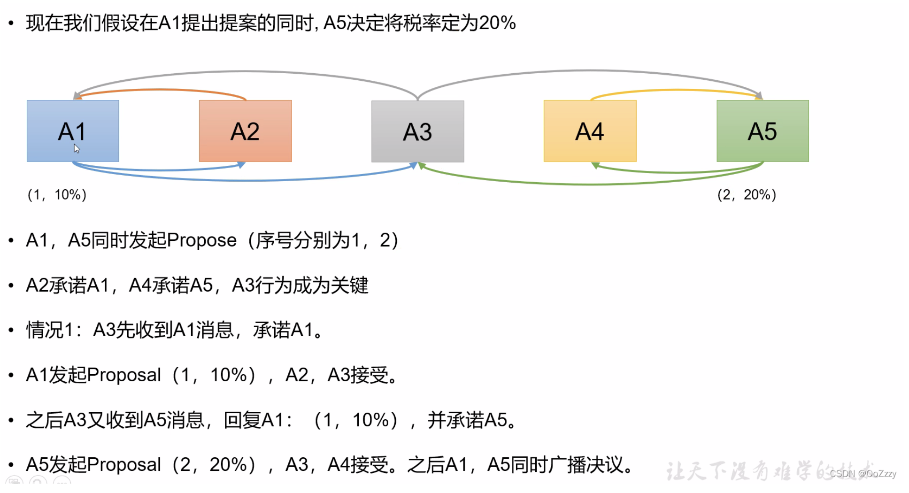

https://wenku.baidu.com/view/50b954cce309581b6bd97f19227916888586b974.html

# Raft

https://blog.csdn.net/yangmengjiao_/article/details/120191314

# paxso

## Paxos算法简介

Paxos算法是一种基于消息传递且具有高容错性的一致性算法

Paxos解决的问题是如何正确快速在一个分布式系统 中对某个状态（数据）达成一致。

## Paxos算法流程

在一个Paxos算法系统中, 所有节点分为3类: **Propersor提议者**, **Accepter接受者**, **Learner学习者**

* Proposer: 提出提案 (Proposal)。Proposal信息包括提案编号 (Proposal ID) 和提议的值 (Value)。
* Acceptor：参与决策，回应Proposers的提案。收到Proposal后可以接受提案，若Proposal获得多数Acceptors的接受，则称该Proposal被批准。
* Learner：不参与决策，从Proposers/Acceptors学习最新达成一致的提案（Value）。

**一个完整的Paxos算法分为3个阶段:**

1. Prepare准备阶段

   Proposer向Acceptors发出Prepare请求，Acceptors针对收到的Prepare请求进行Promise承诺。

2. Accept阶段

   Proposer收到多数Acceptors承诺的Promise后，向Acceptors发出Propose请求，Acceptors针对收到的Propose请求进行Accept处理。

3. Learn阶段

   Proposer在收到多数Acceptors的Accept之后，标志着本次Accept成功，决议形成，将形成的决议发送给所有Learners。


**Paxos算法流程中的每条消息描述如下：**

1. Prepare:  Proposer生成全局唯一且递增的Proposal ID(可使用时间戳加Server ID)，向所有Acceptors发送Prepare请求，这里无需携带提案内容，只携带Proposal ID即可。
2. Promise: Acceptors收到Prepare请求后，做出“两个承诺，一个应答”。

**两个承诺：**

* **不再接受Proposal ID小于等于（注意：这里是<= ）当前请求的Prepare请求。**

* **不再接受Proposal ID小于（注意：这里是< ）当前请求的Propose请求。**

**一个应答：**

**不违背以前作出的承诺下，回复已经Accept过的提案中Proposal ID最大的那个提案的Value和Proposal ID，没有则返回空值。**

3. Propose: Proposer 收到多数Acceptors的Promise应答后，从应答中选择Proposal ID最大的提案的Value，作为本次要发起的提案。如果所有应答的提案Value均为空值，则可以自己随意决定提案Value。然后携带当前Proposal ID，向所有Acceptors发送Propose请求。
4. Accept: Acceptor收到Propose请求后，在不违背自己之前作出的承诺下，接受并持久化当前Proposal ID和提案Value。
5. Learn: Proposer收到多数Acceptors的Accept后，决议形成，将形成的决议发送给所有Learners。




**这时候由于 A3 同意了 A5 的 prepare ，因为两个承诺的原因，它会拒绝 A1的proposal (因为A1的proposal此时的序号为1<A3当前承诺的最大id 2 ) 这时候A5会成功**

## 活锁问题

回顾两个承诺之一，Acceptor不再应答Proposal ID小于等于当前请求的Prepare请求。意味着需要应答Proposal ID大于当前请求的Prepare请求。

两个Proposers交替Prepare成功，而Accept失败，形成活锁（Livelock）。


**这种情况就很尴尬了，由于A3承诺A5.导致A1的proposal（1，10%）没有足够的响应，所以他会重新增加序号，prepare，这时候A5才开始发起proposal（2，20%），很明显会被拒绝，然后这样循环往复，就会导致一直选不出一个最终状态**

这种情况是很极端的情况了，从概率上来说很难碰到，但是拉长时间那就是一定会碰到的

## 总结

paxos协议要完成分布式一致性同步的核心是

1. 分布式的递增的一致性id （全局递增的）
2. 两个承诺一个应答

> ————————————————
> 版权声明：本文为CSDN博主「OoZzzy」的原创文章，遵循CC 4.0 BY-SA版权协议，转载请附上原文出处链接及本声明。
> 原文链接：https://blog.csdn.net/qq_43141726/article/details/123021972

# Multi-Paxos算法

原始的Paxos算法（Basic Paxos）只能对一个值形成决议，决议的形成至少需要两次网络来回，在高并发情况下可能需要更多的网络来回，极端情况下甚至可能形成活锁。如果想连续确定多个值，Basic Paxos搞不定了。因此Basic Paxos几乎只是用来做理论研究，并不直接应用在实际工程中。

实际应用中几乎都需要连续确定多个值，而且希望能有更高的效率。Multi-Paxos正是为解决此问题而提出。Multi-Paxos基于Basic Paxos做了两点改进：

1. 针对每一个要确定的值，运行一次Paxos算法实例（Instance），形成决议。每一个Paxos实例使用唯一的Instance ID标识。
2. 在所有Proposers中选举一个Leader，由Leader唯一地提交Proposal给Acceptors进行表决。这样没有Proposer竞争，解决了活锁问题。在系统中仅有一个Leader进行Value提交的情况下，Prepare阶段就可以跳过，从而将两阶段变为一阶段，提高效率。


**Multi-Paxos首先需要选举Leader，Leader的确定也是一次决议的形成，所以可执行一次Basic Paxos实例来选举出一个Leader。**选出Leader之后只能由Leader提交Proposal，在Leader宕机之后服务临时不可用，需要重新选举Leader继续服务。在系统中仅有一个Leader进行Proposal提交的情况下，Prepare阶段可以跳过。

Multi-Paxos通过改变Prepare阶段的作用范围至后面Leader提交的所有实例，从而使得Leader的连续提交只需要执行一次Prepare阶段，后续只需要执行Accept阶段，将两阶段变为一阶段，提高了效率。为了区分连续提交的多个实例，每个实例使用一个Instance ID标识，Instance ID由Leader本地递增生成即可。

Multi-Paxos允许有多个自认为是Leader的节点并发提交Proposal而不影响其安全性，这样的场景即退化为Basic Paxos。

Chubby和Boxwood均使用Multi-Paxos。ZooKeeper使用的Zab也是Multi-Paxos的变形。

# zab

原文链接：https://blog.csdn.net/weixin_42653522/article/details/120341626

## **Zab 协议原理:**

每个leader都需要经历三个阶段：发现（选举），同步，广播

目的是通过选举leader以中心化的方式来管理数据的写入，然后采用广播同步，崩溃恢复及时同步的方式保证主备数据的最终一致性，实现一个高可用的分布式主备数据系统

在 Zookeeper 中只有一个 Leader，并且只有 Leader **可以处理外部客户端的事务请求，并将其转换成一个事务 Proposal（写操作），然后 Leader 服务器再将事务 Proposal 操作的数据同步到所有 Follower（数据广播/数据复制）。**

**Zookeeper 采用 Zab 协议的核心就是只要有一台服务器提交了 Proposal，就要确保所有服务器最终都能正确提交 Proposal，这也是 CAP/BASE 最终实现一致性的体现。**

## Zab 模式

Zab 协议有支持两种模式：一种是原子广播模式，另一种是崩溃恢复模式。

### 广播模式

Zookeeper 中广播消息步骤：


客户端发起一个写操作请求

1. Leader 服务器处理客户端请求后将请求转换为 Proposal，同时为每个 Proposal 分配一个全局唯一 ID，即 ZXID
2. Leader 服务器与每个 Follower 之间都有一个队列，Leader 将消息发送到该队列
3. Follower 机器从队列中取出消息处理完（写入本地事务日志中）后，向 Leader 服务器发送 ACK 确认
4. Leader 服务器收到半数以上的 Follower 的 ACK 后，即认为可以发送 Commit
5. Leader 向所有的 Follower 服务器发送 Commit 消息

zab 协议的核心就是你要有一台服务器commit了proposal，就要确保所有服务器最终都commit该proposal

leader 服务器与每个leader之间都有一个单独的队列用来同步消息，follower自己去拉取消息处理。 这样可以避免使用同步的方式造成阻塞影响性能

### 崩溃恢复模式

一旦 Leader 服务器出现崩溃或者由于网络原因导致 Leader 服务器失去了与过半 Follower 的联系，那么就会进入崩溃恢复模式。

Zookeeper 集群中为保证任何数据的写入能够顺序执行，只能是 Leader 服务器接收写请求，其他服务器接收到客户端的写请求，也会转发至 Leader 服务器进行处理。

**Zab 协议崩溃恢复需满足以下2个请求：**

1. 确保已经被 Leader commit的 proposal 必须最终被所有的 Follower 服务器commit
2. 确保已经被 Leader 提出但没有被commit的 Proposal 被丢弃掉

也就是新选举的leader的数据只会包含已提交的proposal。**新选举出来的 Leader 节点中含有最高的 ZXID，所以，在 Leader 选举时，将 ZXID 作为每个 Follower 投票时的信息依据。这样做的好处是避免了 Leader 服务器检查 Proposal 的提交和丢弃工作。zixd 相同则选择 myid 最大的节点 **

**数据同步**

新的leader选举出来之后，会和follower 建立通信，并且会将他自身最大的zxid发送给其他follower节点，follower会根据该zxid 执行回退/数据同步，以保证和leader的数据一致性

**因为每轮选举结束 zxid 的高32位 epoch都会递增，然后低32位会归0 所以可以保证zxid 全局递增**


### Leader 选举算法

在 大雨 3.4.10 版本中，是TCP的FastLeaderElection完成选举的

#### myid

每个 Zookeeper 服务器，都需要在数据文件夹下创建一个名为 myid 的文件，该文件包含整个 Zookeeper 集群唯一的 ID，例如，某个 Zookeeper 集群包含三台服务器，hostname 分别为 zoo1,zoo2,zoo3，其中 myid 分别为1,2,3,则在配置文件中其 ID 与 hostname 必须一一对应，如在配置文件中，server.后面的数据即为 myid

```shell
server.1=zoo1:2888:3888
server.2=zoo2:2888:3888
server.3=zoo3:2888:3888
```

#### ZXID

类似于 RDBMS 中的事务ID，用于标识一个 Proposal ID，为了保证顺序性，ZXID 必须单调递增，因此 Zookeeper 使用一个 64 位的数来表示

1. **高 32 位是 Leader 的 epoch，从 1 开始，每次选出新的 Leader，epoch 加 1**
2. **低 32 位为该 epoch 内的序号，每次 epoch 变化，都将低 32 位的序号重置，这样保证了 ZXID 的全局递增性。**

#### 服务器状态

* Looking：不确定Leader状态，该状态下的服务器认为当前集群中没有Leader，会发起Leader选举
* Following：跟随者状态，表明当前服务器角色是Follower，并且它知道Leader是谁
* Leading：领导者状态，表明当前服务器角色是Leader，它会维护与Follower间的心跳
* Observing（类比paxos中的 learner）：观察者状态，表明当前服务器角色是Observer，与Follower唯一的不同在于不参与选举，也不参与集群写操作时的投票，follower太多leader的通信压力就会增加。多增加几个observer，协助follower处理读请求，还不用给它投票权去消耗更多资源。

#### 选票数据结构

每个服务器在进行领导选举时，会发送如下关键信息：

* logicClock 每个服务器会维护一个自增的整数，名为logicClock，它表示这是该服务器发起的第多少轮投票
* state 当前服务器的状态
* self_id 当前服务器的myid
* self_zxid 当前服务器上所保存的数据的最大zxid
* vote_id 被推举的服务器的myid
* vote_zxid 被推举的服务器上所保存的数据的最大zxid

#### 选举过程

1. server启动、恢复准备加入集群，此时都会读取本身的zxid等信息。

2. 所有server加入集群时都会推荐自己成为leader，然后将（leader id（myid）,zxid,epoch）作为广播信息到集群中所有的server，等待集群中的server返回信息。

3. 收到集群中其他服务器返回的信息，分为两类，服务器处于looking状态，或者其他状态。

   * 服务器处于looking状态首先判断逻辑时钟Epoch：
     （a） 如果接受到Epoch大于自己目前的逻辑时钟，那么更新本机的Epoch，同时clear其他服务器发送来的选举数据。然后判断是否需要更新当前自己的选举情况（开始选择的leader id是自己）。（判断规则：保存的zxid最大值和leader id来进行判断。先看数据zxid，zxid大的胜出；其次判断leader id，leader id大的胜出；然后再将自身最新的选举结果广播给其他server。）
     （b） 如果接受到的Epoch小于目前的逻辑时钟，说明对方处于一个比较低一轮的选举轮数，这时需要将自己的选举情况发送给它即可。
     （c） 如果接收到的Epoch等于目前的逻辑时钟，再根据（a）中的判断规则，将自身的最新选举结果广播给其他server。

     **同时server还要处理两种情况：**

     （a） 如果server接收到了其他所有服务器的选举信息，那么则根据这些选举信息确定自己的状态（Following，Leading），结束Looking，退出选举。
     （b） 即使没有收到所有服务器的选举信息，也可以判断一下根据以上过程之后最新的选举leader是不是得到了超过半数以上服务器的支持，如果是则尝试接受最新数据，如果没有最新数据，说明都接受了这个结果，同样也退出选举过程。

   * 服务器处于其他状态（Following，Leading）
     （a） 如果逻辑时钟Epoch相同，将该数据保存到recvset，如果所接受服务器宣称自己是leader，那么判断是不是有半数以上的服务器选举了他，如果是则设置选举状态退出选举过程。
     （b） 如果Epoch不相同，那么说明另一个选举过程中已经有了选举结果，于是将选举结果加入到out of election集合中，再根据out of election来判断是否可以结束选举，保存逻辑时钟，设置选举状态，并退出选举过程。

### 服务器数量选择

因为我们的zab协议的特性，集群中至少要有三个节点（n>=3 & n 是奇数）才能保证选举达成


