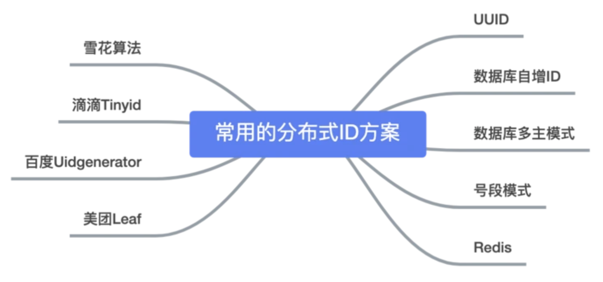
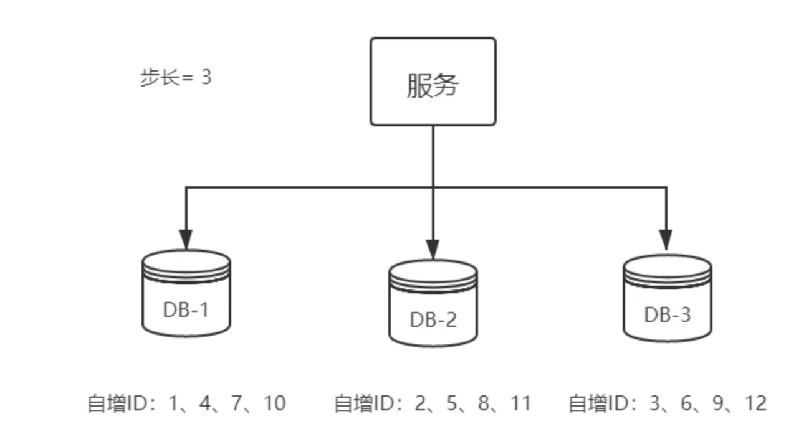
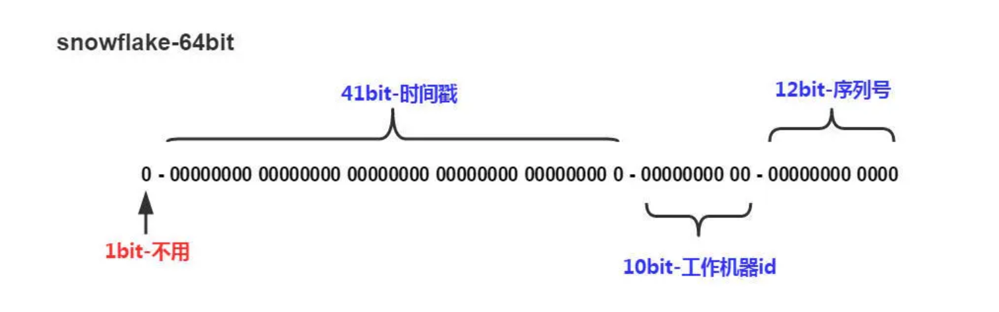

# 什么是分布式id

在分布式系统中用来标识数据的唯一ID

在我们业务数据量不大的时候，单库单表完全可以支撑现有业务，数据再大一点搞个MySQL主从同步读写分离也能对付。

但随着数据日渐增长，主从同步也扛不住了，就需要对数据库进行分库分表，但分库分表后需要有一个唯一ID来标识一条数据，数据库的自增ID显然不能满足需求；特别一点的如订单、优惠券也都需要有`唯一ID`做标识。此时一个能够生成`全局唯一ID`的系统是非常必要的。那么这个`全局唯一ID`就叫`分布式ID`。

# 那么分布式ID需要满足那些条件？

- 全局唯一：必须保证ID是全局性唯一的，基本要求
- 高性能：高可用低延时，ID生成响应要块，否则反倒会成为业务瓶颈
- 高可用：100%的可用性是骗人的，但是也要无限接近于100%的可用性
- 好接入：要秉着拿来即用的设计原则，在系统设计和实现上要尽可能的简单
- 趋势递增：最好趋势递增，这个要求就得看具体业务场景了，一般不严格要求

# 有哪些方案生成分布式ID

- UUID
- 数据库自增ID
- 数据库多主模式
- 号段模式
- Redis
- 雪花算法（SnowFlake）
- 滴滴出品（TinyID）
- 百度 （Uidgenerator）
- 美团（Leaf）



## UUID

在Java的世界里，想要得到一个具有唯一性的ID，首先被想到可能就是`UUID`，毕竟它有着全球唯一的特性。那么`UUID`可以做`分布式ID`吗？**答案是可以的，但是并不推荐！**

```java
public static void main(String[] args) { 
       String uuid = UUID.randomUUID().toString().replaceAll("-","");
       System.out.println(uuid);
 }
```

`UUID`的生成简单到只有一行代码，输出结果 `c2b8c2b9e46c47e3b30dca3b0d447718`，但UUID却并不适用于实际的业务需求。像用作订单号`UUID`这样的字符串没有丝毫的意义，看不出和订单相关的有用信息；而对于数据库来说用作业务`主键ID`，它不仅是太长还是字符串，存储性能差查询也很耗时，所以不推荐用作`分布式ID`。

**优点：**

- 生成足够简单，本地生成无网络消耗，具有唯一性

**缺点：**

- 无序的字符串，不具备趋势自增特性
- 没有具体的业务含义
- 长度过长16 字节128位，36位长度的字符串，存储以及查询对MySQL的性能消耗较大，MySQL官方明确建议主键要尽量越短越好，作为数据库主键 `UUID` 的无序性会导致数据位置频繁变动，严重影响性能。

## 数据库自增ID

基于数据库的`auto_increment`自增ID完全可以充当`分布式ID`，具体实现：需要一个单独的MySQL实例用来生成ID，建表结构如下：

```sql
CREATE DATABASE `SEQ_ID`;
CREATE TABLE SEQID.SEQUENCE_ID (
    id bigint(20) unsigned NOT NULL auto_increment, 
    value char(10) NOT NULL default '',
    PRIMARY KEY (id),
) ENGINE=MyISAM;
insert into SEQUENCE_ID(value)  VALUES ('values');
```

当我们需要一个ID的时候，向表中插入一条记录返回`主键ID`，但这种方式有一个比较致命的缺点，访问量激增时MySQL本身就是系统的瓶颈，用它来实现分布式服务风险比较大，不推荐！

**优点：**

- 实现简单，ID单调自增，数值类型查询速度快

**缺点：**

- DB单点存在宕机风险；
- 无法扛住高并发场景

## 数据库多主模式

前边说了单点数据库方式不可取，那对上边的方式做一些高可用优化，换成主从模式集群。害怕一个主节点挂掉没法用，那就做双主模式集群，也就是两个Mysql实例都能单独的生产自增ID。

那这样还会有个问题，两个MySQL实例的自增ID都从1开始，**会生成重复的ID怎么办？**

**解决方案**：设置`起始值`和`自增步长`

MySQL_1 配置：

```javascript
set @@auto_increment_offset = 1;     -- 起始值
set @@auto_increment_increment = 2;  -- 步长
```

MySQL_2 配置：

```javascript
set @@auto_increment_offset = 2;     -- 起始值
set @@auto_increment_increment = 2;  -- 步长
```

这样两个MySQL实例的自增ID分别就是：

> 1、3、5、7、9
> 2、4、6、8、10

那如果集群后的性能还是扛不住高并发咋办？就要进行MySQL扩容增加节点，这是一个比较麻烦的事。


从上图可以看出，水平扩展的数据库集群，有利于解决数据库单点压力的问题，同时为了ID生成特性，将自增步长按照机器数量来设置。

增加第三台`MySQL`实例需要人工修改一、二两台`MySQL实例`的起始值和步长，把`第三台机器的ID`起始生成位置设定在比现有`最大自增ID`的位置远一些，但必须在一、二两台`MySQL实例`ID还没有增长到`第三台MySQL实例`的`起始ID`值的时候，否则`自增ID`就要出现重复了，**必要时可能还需要停机修改**。

**优点：**

- 解决DB单点问题

**缺点：**

- 不利于后续扩容，而且实际上单个数据库自身压力还是大，依旧无法满足高并发场景。

## 号段模式

号段模式是当下分布式ID生成器的主流实现方式之一，号段模式可以理解为从数据库批量的获取自增ID，每次从数据库取出一个号段范围，例如 (1,1000] 代表1000个ID，具体的业务服务将本号段，生成1~1000的自增ID并加载到内存。表结构如下：

```sql
CREATE TABLE id_generator (
  id int(10) NOT NULL,
  max_id bigint(20) NOT NULL COMMENT '当前最大id',
  step int(20) NOT NULL COMMENT '号段的布长',
  biz_type    int(20) NOT NULL COMMENT '业务类型',
  version int(20) NOT NULL COMMENT '版本号',
  PRIMARY KEY (`id`)
) 
```

biz_type ：代表不同业务类型

max_id ：当前最大的可用id

step ：代表号段的长度

version ：是一个乐观锁，每次都更新version，保证并发时数据的正确性

| id   | biz_type | max_id | step | version |
| ---- | -------- | ------ | ---- | ------- |
| 1    | 101      | 1000   | 2000 | 0       |

等这批号段ID用完，再次向数据库申请新号段，对`max_id`字段做一次`update`操作，`update max_id= max_id + step`，update成功则说明新号段获取成功，新的号段范围是`(max_id ,max_id +step]`。

```javascript
update id_generator set max_id = #{max_id+step}, version = version + 1 where version = # {version} and biz_type = XXX
```

由于多业务端可能同时操作，所以采用版本号`version`乐观锁方式更新，这种`分布式ID`生成方式不强依赖于数据库，不会频繁的访问数据库，对数据库的压力小很多。这样多台服务器都可以在自己的内存中缓存id,性能会强很多

缺点：

1. 机器掉电等等情况会导致内存中的未使用id丢失，造成一定的id浪费，这个问题在雪花算法中也存在丢一些可用ID的问题

2. 最大的问题是引入了外部依赖，如果id耗尽但是DB挂了或者其他问题导致连不上DB那么这台机器这个功能就完全死掉了，因为我们一般是多台机器在运行，

   少量机器出问题，我们可以通过监控及时发现，扩容...手段解决，所以这个问题也不算大，

   怕的是一些所有机器都连不上了，所以可以设计一个心跳机制在不需要获取号段的时候也去尝试select做心跳检查，通过一个指标来做告警，提前发现问题

## Redis

`Redis`也同样可以实现，原理就是利用`redis`的 `incr`命令实现ID的原子性自增。

```javascript
127.0.0.1:6379> set seq_id 1     // 初始化自增ID为1
OK
127.0.0.1:6379> incr seq_id      // 增加1，并返回递增后的数值
(integer) 2
```

用`redis`实现需要注意一点，要考虑到redis持久化的问题。`redis`有两种持久化方式`RDB`和`AOF`

- `RDB`会定时打一个快照进行持久化，假如连续自增但`redis`没及时持久化，而这会Redis挂掉了，重启Redis后会出现ID重复的情况。
- `AOF`会对每条写命令进行持久化，即使`Redis`挂掉了也不会出现ID重复的情况，但由于incr命令的特殊性，会导致`Redis`重启恢复的数据时间过长。

## 雪花算法（SnowFlake）

缺点：如果机器时钟回拨可能导致id重复； 每台机器的时钟不可能完全同步有时候会出现不是全局递增的情况。

雪花算法（Snowflake）是twitter公司内部分布式项目采用的ID生成算法，开源后广受国内大厂的好评，在该算法影响下各大公司相继开发出各具特色的分布式生成器。



`Snowflake`生成的是Long类型的ID，一个Long类型占8个字节，每个字节占8比特，也就是说一个Long类型占64个比特。

Snowflake ID组成结构：`正数位`（占1比特）+ `时间戳`（占41比特）+ `机器ID`（占5比特）+ `数据中心`（占5比特）+ `自增值`（占12比特），总共64比特组成的一个Long类型。

- 第一个bit位（1bit）：Java中long的最高位是符号位代表正负，正数是0，负数是1，一般生成ID都为正数，所以默认为0。
- 时间戳部分（41bit）：毫秒级的时间，**不建议存当前时间戳，而是用（当前时间戳 - 固定开始时间戳）的差值，可以使产生的ID从更小的值开始**；41位的时间戳可以使用69年，(1L << 41) / (1000L *60* 60 *24* 365) = 69年
- 工作机器id（10bit）：也被叫做`workId`，这个可以灵活配置，机房或者机器号组合都可以。
- 序列号部分（12bit），自增值支持同一毫秒内同一个节点可以生成4096个ID

根据这个算法的逻辑，只需要将这个算法用Java语言实现出来，封装为一个工具方法，那么各个业务应用可以直接使用该工具方法来获取分布式ID，只需保证每个业务应用有自己的工作机器id即可，而不需要单独去搭建一个获取分布式ID的应用。

**Java版本的`Snowflake`算法实现：**

负数的二进制码=先取正数的源码再求得反码+1得补码

先取1的原码：00000000 00000000 00000000 00000001，得反码： 11111111 11111111 11111111 11111110，最后得补码： 11111111 11111111 11111111 11111111，即-1在计算机里用二进制表示结果。

```javascript
/**
 * Twitter的SnowFlake算法,使用SnowFlake算法生成一个整数，然后转化为62进制变成一个短地址URL
 *
 * https://github.com/beyondfengyu/SnowFlake
 */
public class SnowFlakeShortUrl {

    /**
     * 起始的时间戳
     */
    private final static long START_TIMESTAMP = 1480166465631L;

    /**
     * 每一部分占用的位数
     */
    private final static long SEQUENCE_BIT = 12;   //序列号占用的位数
    private final static long MACHINE_BIT = 5;     //机器标识占用的位数
    private final static long DATA_CENTER_BIT = 5; //数据中心占用的位数

    /**
     * 每一部分的最大值
     */
    private final static long MAX_SEQUENCE = -1L ^ (-1L << SEQUENCE_BIT);
    private final static long MAX_MACHINE_NUM = -1L ^ (-1L << MACHINE_BIT);
    private final static long MAX_DATA_CENTER_NUM = -1L ^ (-1L << DATA_CENTER_BIT);

    /**
     * 每一部分向左的位移
     */
    private final static long MACHINE_LEFT = SEQUENCE_BIT;
    private final static long DATA_CENTER_LEFT = SEQUENCE_BIT + MACHINE_BIT;
    private final static long TIMESTAMP_LEFT = DATA_CENTER_LEFT + DATA_CENTER_BIT;

    private long dataCenterId;  //数据中心
    private long machineId;     //机器标识
    private long sequence = 0L; //序列号
    private long lastTimeStamp = -1L;  //上一次时间戳

    private long getNextMill() {
        long mill = getNewTimeStamp();
        while (mill <= lastTimeStamp) {
            mill = getNewTimeStamp();
        }
        return mill;
    }

    private long getNewTimeStamp() {
        return System.currentTimeMillis();
    }

    /**
     * 根据指定的数据中心ID和机器标志ID生成指定的序列号
     *
     * @param dataCenterId 数据中心ID
     * @param machineId    机器标志ID
     */
    public SnowFlakeShortUrl(long dataCenterId, long machineId) {
        if (dataCenterId > MAX_DATA_CENTER_NUM || dataCenterId < 0) {
            throw new IllegalArgumentException("DtaCenterId can't be greater than MAX_DATA_CENTER_NUM or less than 0！");
        }
        if (machineId > MAX_MACHINE_NUM || machineId < 0) {
            throw new IllegalArgumentException("MachineId can't be greater than MAX_MACHINE_NUM or less than 0！");
        }
        this.dataCenterId = dataCenterId;
        this.machineId = machineId;
    }

    /**
     * 产生下一个ID
     *
     * @return
     */
    public synchronized long nextId() {
        long currTimeStamp = getNewTimeStamp();
        if (currTimeStamp < lastTimeStamp) {
            throw new RuntimeException("Clock moved backwards.  Refusing to generate id");
        }

        if (currTimeStamp == lastTimeStamp) {
            //相同毫秒内，序列号自增
            sequence = (sequence + 1) & MAX_SEQUENCE;
            //同一毫秒的序列数已经达到最大
            if (sequence == 0L) {
                currTimeStamp = getNextMill();
            }
        } else {
            //不同毫秒内，序列号置为0
            sequence = 0L;
        }

        lastTimeStamp = currTimeStamp;

        return (currTimeStamp - START_TIMESTAMP) << TIMESTAMP_LEFT //时间戳部分
                | dataCenterId << DATA_CENTER_LEFT       //数据中心部分
                | machineId << MACHINE_LEFT             //机器标识部分
                | sequence;                             //序列号部分
    }
    
    public static void main(String[] args) {
        SnowFlakeShortUrl snowFlake = new SnowFlakeShortUrl(2, 3);

        for (int i = 0; i < (1 << 4); i++) {
            //10进制
            System.out.println(snowFlake.nextId());
        }
    }
}
```

## 滴滴出品（TinyID）

`Tinyid`由滴滴开发，Github地址：[https://github.com/didi/tinyid](https://link.segmentfault.com/?enc=URtiSNKV3U2HxQ217EM0ow%3D%3D.QCdtkWXra9g9l%2BP3x82DVtBTIV2V8GLjthABm6C3lyA%3D)。

`Tinyid`是基于号段模式原理实现的 , 与`Leaf`如出一辙，每个服务获取一个号段（1000,2000]、（2000,3000]、（3000,4000]


`Tinyid`提供`http`和`tinyid-client`两种方式接入

##### Http方式接入

（1）导入Tinyid源码：

git clone [https://github.com/didi/tinyi...](https://link.segmentfault.com/?enc=sgYQmgY2KVPV6XThj%2FT9EA%3D%3D.%2BYYqXH%2BHT4i6SLz0ysw2MUmFCoVKrlBYuE%2B1WwuSVFJm%2B7qU11kfG0akgGiQviSg)

（2）创建数据表：

```javascript
CREATE TABLE `tiny_id_info` (
  `id` bigint(20) unsigned NOT NULL AUTO_INCREMENT COMMENT '自增主键',
  `biz_type` varchar(63) NOT NULL DEFAULT '' COMMENT '业务类型，唯一',
  `begin_id` bigint(20) NOT NULL DEFAULT '0' COMMENT '开始id，仅记录初始值，无其他含义。初始化时begin_id和max_id应相同',
  `max_id` bigint(20) NOT NULL DEFAULT '0' COMMENT '当前最大id',
  `step` int(11) DEFAULT '0' COMMENT '步长',
  `delta` int(11) NOT NULL DEFAULT '1' COMMENT '每次id增量',
  `remainder` int(11) NOT NULL DEFAULT '0' COMMENT '余数',
  `create_time` timestamp NOT NULL DEFAULT '2010-01-01 00:00:00' COMMENT '创建时间',
  `update_time` timestamp NOT NULL DEFAULT '2010-01-01 00:00:00' COMMENT '更新时间',
  `version` bigint(20) NOT NULL DEFAULT '0' COMMENT '版本号',
  PRIMARY KEY (`id`),
  UNIQUE KEY `uniq_biz_type` (`biz_type`)
) ENGINE=InnoDB AUTO_INCREMENT=1 DEFAULT CHARSET=utf8 COMMENT 'id信息表';

CREATE TABLE `tiny_id_token` (
  `id` int(11) unsigned NOT NULL AUTO_INCREMENT COMMENT '自增id',
  `token` varchar(255) NOT NULL DEFAULT '' COMMENT 'token',
  `biz_type` varchar(63) NOT NULL DEFAULT '' COMMENT '此token可访问的业务类型标识',
  `remark` varchar(255) NOT NULL DEFAULT '' COMMENT '备注',
  `create_time` timestamp NOT NULL DEFAULT '2010-01-01 00:00:00' COMMENT '创建时间',
  `update_time` timestamp NOT NULL DEFAULT '2010-01-01 00:00:00' COMMENT '更新时间',
  PRIMARY KEY (`id`)
) ENGINE=InnoDB AUTO_INCREMENT=1 DEFAULT CHARSET=utf8 COMMENT 'token信息表';

INSERT INTO `tiny_id_info` (`id`, `biz_type`, `begin_id`, `max_id`, `step`, `delta`, `remainder`, `create_time`, `update_time`, `version`)
VALUES
    (1, 'test', 1, 1, 100000, 1, 0, '2018-07-21 23:52:58', '2018-07-22 23:19:27', 1);

INSERT INTO `tiny_id_info` (`id`, `biz_type`, `begin_id`, `max_id`, `step`, `delta`, `remainder`, `create_time`, `update_time`, `version`)
VALUES
    (2, 'test_odd', 1, 1, 100000, 2, 1, '2018-07-21 23:52:58', '2018-07-23 00:39:24', 3);


INSERT INTO `tiny_id_token` (`id`, `token`, `biz_type`, `remark`, `create_time`, `update_time`)
VALUES
    (1, '0f673adf80504e2eaa552f5d791b644c', 'test', '1', '2017-12-14 16:36:46', '2017-12-14 16:36:48');

INSERT INTO `tiny_id_token` (`id`, `token`, `biz_type`, `remark`, `create_time`, `update_time`)
VALUES
    (2, '0f673adf80504e2eaa552f5d791b644c', 'test_odd', '1', '2017-12-14 16:36:46', '2017-12-14 16:36:48');
```

（3）配置数据库：

```javascript
datasource.tinyid.names=primary
datasource.tinyid.primary.driver-class-name=com.mysql.jdbc.Driver
datasource.tinyid.primary.url=jdbc:mysql://ip:port/databaseName?autoReconnect=true&useUnicode=true&characterEncoding=UTF-8
datasource.tinyid.primary.username=root
datasource.tinyid.primary.password=123456
```

（4）启动`tinyid-server`后测试

```javascript
获取分布式自增ID: http://localhost:9999/tinyid/id/nextIdSimple?bizType=test&token=0f673adf80504e2eaa552f5d791b644c'
返回结果: 3

批量获取分布式自增ID:
http://localhost:9999/tinyid/id/nextIdSimple?bizType=test&token=0f673adf80504e2eaa552f5d791b644c&batchSize=10'
返回结果:  4,5,6,7,8,9,10,11,12,13
```

##### Java客户端方式接入

重复Http方式的（2）（3）操作

引入依赖

```javascript
       <dependency>
            <groupId>com.xiaoju.uemc.tinyid</groupId>
            <artifactId>tinyid-client</artifactId>
            <version>${tinyid.version}</version>
        </dependency>
```

配置文件

```javascript
tinyid.server =localhost:9999
tinyid.token =0f673adf80504e2eaa552f5d791b644c
```

`test` 、`tinyid.token`是在数据库表中预先插入的数据，`test` 是具体业务类型，`tinyid.token`表示可访问的业务类型

9,223,372,036,854,775,807

```javascript
// 获取单个分布式自增ID
Long id =  TinyId . nextId( " test " );

// 按需批量分布式自增ID
List< Long > ids =  TinyId . nextId( " test " , 10 );
```

## 百度 （Uidgenerator）

`uid-generator`是由百度技术部开发，项目GitHub地址 [https://github.com/baidu/uid-...](https://link.segmentfault.com/?enc=kEeiNMvl3T%2FCmOs4%2BxtLzg%3D%3D.B72ErujO3rT1XfNxE4Dw4yuZQAzQ9R41juSv37Q9IhGFT05bGduvVN4aANjwfA5b)

`uid-generator`是基于`Snowflake`算法实现的，与原始的`snowflake`算法不同在于，`uid-generator`支持`自定义时间戳`、`工作机器ID`和 `序列号` 等各部分的位数，而且`uid-generator`中采用用户自定义`workId`的生成策略。

`uid-generator`需要与数据库配合使用，需要新增一个`WORKER_NODE`表。当应用启动时会向数据库表中去插入一条数据，插入成功后返回的自增ID就是该机器的`workId`数据由host，port组成。

**对于`uid-generator` ID组成结构**：

`workId`，占用了22个bit位，时间占用了28个bit位，序列号占用了13个bit位，需要注意的是，和原始的`snowflake`不太一样，时间的单位是秒，而不是毫秒，`workId`也不一样，而且同一应用每次重启就会消费一个`workId`。

> 参考文献
> [https://github.com/baidu/uid-...](https://link.segmentfault.com/?enc=GGU6svQHajMhNhgWB%2B4%2FzQ%3D%3D.nPJNPX%2FDTmtefnkx1LNxcn7UwSF8nw1T4gP7rz7aoz7BfA49LaOZdn%2BXeo%2FpDkW%2FmIsSj8jLu%2F9w2cp586IDYy32fmzaPWuPThU0aoQ40Ho%3D)

## 美团（Leaf）

`Leaf`由美团开发，github地址：[https://github.com/Meituan-Di...](https://link.segmentfault.com/?enc=Ga7SgaLqXusr8Hh3HNb4cw%3D%3D.VcR35uWUuz5KS0uM6dZJ25Apnz6ozzD%2B2cvOybZ1NfpDfjzZbvk%2FhrGukAXhEIiN)

`Leaf`同时支持号段模式和`snowflake`算法模式，可以切换使用。

##### 号段模式

先导入源码 [https://github.com/Meituan-Di...](https://link.segmentfault.com/?enc=tx0f84I%2FbUsMGmasS9KyOw%3D%3D.WqyUlise2vbFMldSGphJU7IbspqmktBzoF7KlcrFCmmqMtQFhPcrh9etftGuuqOR) ，在建一张表`leaf_alloc`

```javascript
DROP TABLE IF EXISTS `leaf_alloc`;

CREATE TABLE `leaf_alloc` (
  `biz_tag` varchar(128)  NOT NULL DEFAULT '' COMMENT '业务key',
  `max_id` bigint(20) NOT NULL DEFAULT '1' COMMENT '当前已经分配了的最大id',
  `step` int(11) NOT NULL COMMENT '初始步长，也是动态调整的最小步长',
  `description` varchar(256)  DEFAULT NULL COMMENT '业务key的描述',
  `update_time` timestamp NOT NULL DEFAULT CURRENT_TIMESTAMP ON UPDATE CURRENT_TIMESTAMP COMMENT '数据库维护的更新时间',
  PRIMARY KEY (`biz_tag`)
) ENGINE=InnoDB;
```

然后在项目中开启`号段模式`，配置对应的数据库信息，并关闭`snowflake`模式

```javascript
leaf.name=com.sankuai.leaf.opensource.test
leaf.segment.enable=true
leaf.jdbc.url=jdbc:mysql://localhost:3306/leaf_test?useUnicode=true&characterEncoding=utf8&characterSetResults=utf8
leaf.jdbc.username=root
leaf.jdbc.password=root

leaf.snowflake.enable=false
#leaf.snowflake.zk.address=
#leaf.snowflake.port=
```

启动`leaf-server` 模块的 `LeafServerApplication`项目就跑起来了

号段模式获取分布式自增ID的测试url ：http：//localhost：8080/api/segment/get/leaf-segment-test

监控号段模式：[http://localhost](https://link.segmentfault.com/?enc=CmNIMar10Rc1jHIASJ0UUA%3D%3D.8VxveYkX09b6qov1t5oTCIw%2BBHvg7%2FxA3OSwl6vrKmg%3D):8080/cache

##### snowflake模式

`Leaf`的snowflake模式依赖于`ZooKeeper`，不同于`原始snowflake`算法也主要是在`workId`的生成上，`Leaf`中`workId`是基于`ZooKeeper`的顺序Id来生成的，每个应用在使用`Leaf-snowflake`时，启动时都会都在`Zookeeper`中生成一个顺序Id，相当于一台机器对应一个顺序节点，也就是一个`workId`。

```javascript
leaf.snowflake.enable=true
leaf.snowflake.zk.address=127.0.0.1
leaf.snowflake.port=2181
```

snowflake模式获取分布式自增ID的测试url：[http://localhost](https://link.segmentfault.com/?enc=HTX9HhkVOIGAq2aF8QYzjA%3D%3D.uphSRGdqrbHQBFtk5P53EtbYG46SS6e18oWwuGPWouA%3D):8080/api/snowflake/get/test