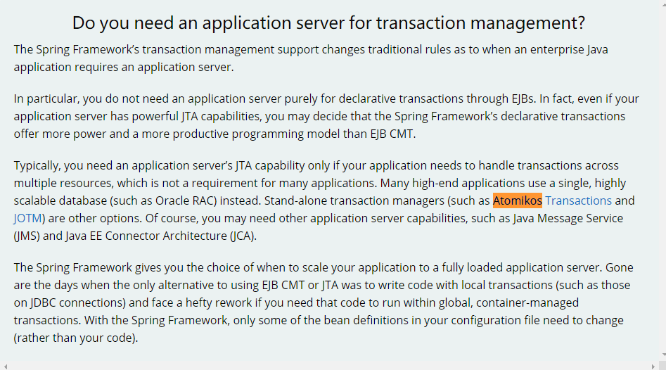
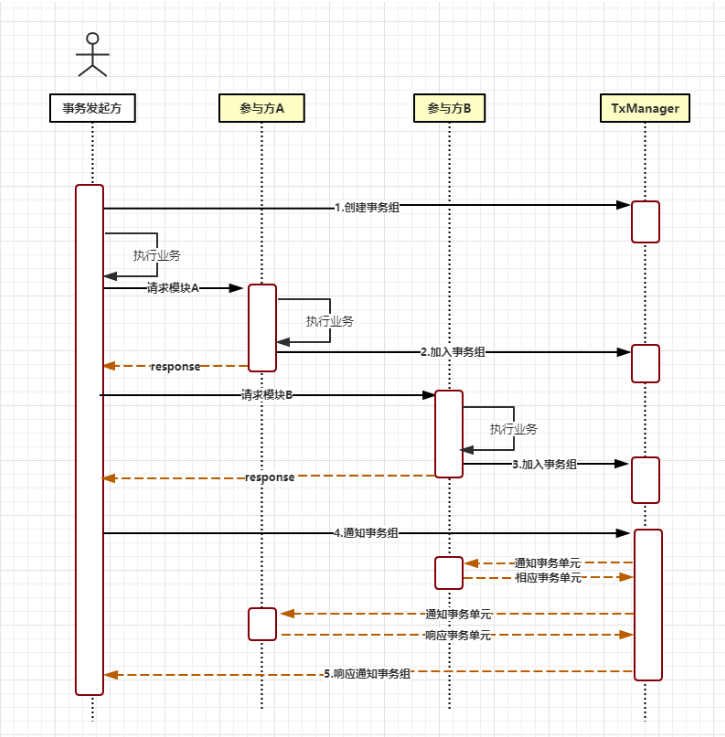

##### 分布式事务部分解决方案

* 针对多数据库事务可以使用居于XA协议的事务解决方案：采用spring 3.0以及以上版本 + Atomikos/ + JTA进行支持 （XA协议的支持，XA就是一种2pc协议）；

  > 在Java中，分布式事务主要的规范是JTA/XA。其中：JTA是Java的事务管理器规范，XA是工业标准的X/Open CAE规范，可被两阶段提交及回滚的事务资源定义。比如某数据库实现了XA规范，则不管是JTA，还是MSDTC，都可以基于同样的行为对该数据库进行事务处理。**XA协议是目前支持最广泛的一个协议**
  >
  > JTA全称为Java Transaction API，顾名思义JTA定义了一组统一的事务编程的接口，这些接口如下：
  >
  > `XAResource`：XAResource接口是对实现了X/Open CAE规范的资源管理器 (Resource Manager，数据库就是典型的资源管理器) 的抽象，它由资源适配器 (Resource Apdater) 提供实现。`XAResource`是支持事务控制的核心。
  > `Transaction`：`Transaction`接口是一个事务实例的抽象，通过它可以控制事务内多个资源的提交或者回滚。二阶段提交过程也是由`Transaction`接口的实现者来完成的。
  > `TransactionManager`：托管模式 (managed mode) 下，`TransactionManager`接口是被应用服务器调用，以控制事务的边界的。
  > `UserTransaction`：非托管模式 (non-managed mode) 下，应用程序可以通过`UserTransaction`接口控制事务的边界
  >
  > 在tomcat下是没有分布式事务的，可以借助于第三方Jotm和Automikos实现，在spring中分布式事务是通过jta（jotm，atomikos，）来进行实现。即：通过代码的方式来决定是否是分布式事务。
  >
  > 这里我们引用以下spring 官方网站的说明
  >
  > 
  >
  > 关于JTA的实现的框架有：他们都实现了TM管理多数据源事务的功能
  >
  > * Atomikos
  >   大家推荐最多的。和JOTM相比Atomikos Transactions Essentials更加稳定，它原来是商业项目，现在开源了。象MySQL一样卖服务支持的。而且论坛页比较活跃，有问题很快可以解决。
  > * JOTM
  >
  > * GeronimoTM/Jencks 官方文档比较少，不适合学习和维护。
  > * JBossTS 是一个应用在JBOSS服务器上的，肯定是一个成熟的产品，也有好的支持，详细信息可以看这里：http://www.theserverside.com/news/thread.tss?thread_id=37941
  > * Bitronix ：它是一个完全工作的XA事务管理器，提供JTA API所需的所有服务，同时尽量使代码简单，以便更容易地理解XA语义。 目前在github 上的stars 还比较少
  >
  > 等等

  **注意：该方案无法解决服务间调用的分布式事务问题**

  * 优点：严格的ACID,相对其他数据关联性高的数据的分布式事务实现，相对简单（因为spring JTA +Atomikos 可以极低的业务代码侵入性 帮你解决多资源的事务管理）
  * 缺点：
    * 实现复杂（对于使用成熟框架的人来说其实不复杂，但是对于开发这些框架的人来说确实是它的API是比较复杂的）
    * 同步阻塞：事务执行过程中，所有参与节点都是事务阻塞的。当参与者占有资源时，其他访问相关资源的进程也将处于阻塞状态。 参与者对锁资源的释放必须等到事务结束，所以与一阶段提交相比，执行同样的事务，二阶段会耗费更多时间（连接资源也会占用更长时间）。 事务执行时间的延长意味着锁资源发生冲突的概率增加，当事务并发量达到一定数量时，会出现大量事务积压甚至出现死锁，系统性能会严重下滑。

> 更多关于 XA 协议的 https://zhuanlan.zhihu.com/p/38197629
>
> JTA 规范 http://www.tianshouzhi.com/api/tutorials/distributed_transaction/385
>
> 大体的故障恢复策略 和上面连接中讲的大差不差的 JTA 规范中也是有故障恢复的

* 基于**可靠性事务消息的分布式事务方案** (适合数据关联不是特别强的，比如 下单和通知出票，就可以使用MQ解耦掉，保证通知出票一定能发送出去就好)

  关联性质强的也可以用MQ来实现，不过缺点就是实现起来比较复杂，因为我们如果单用MQ去实现消息一定被消费到，但是如果有一个服务处理错误了，并且重试失败，那么其他服务的操作怎么回滚呢？ 这就需要在增加一个MQ queue来处理需要回滚的消息，比如某一服务失败了，那就把消息发送到一个queue,然后让一个JOB去跑，消费这个消息调用对应服务的方法进行回滚（这也就是说我们需要实现两个方法，一个是实际的执行方法，一个是回滚方法，并且都需要实现幂等，有点类似于TCC模式的操作）

* 基于LCN模式

  在分析优缺点钱我们需要看一下：[lcn的事务控制原理](#lcn的事务控制原理)

  * 优点：
    * 业务代码侵入性低
    * 该模式下的事务提交与回滚是由本地事务方控制，对于数据一致性上有较高的保障。
  * 缺点：缺陷在于代理的连接需要随事务发起方一同释放连接，增加了数据库连接资源占用的时间。（和2pc的这方面缺点差不多）

* 基于TCC模式

  在分析优缺点钱我们需要看一下：[lcn的事务控制原理](#lcn的事务控制原理)

  * 优点：
    * 有无本地事务控制都可以支持，所以其使用面更广一些
  * 缺点
    * 该模式对代码的嵌入性高，要求每个业务需要写三种步骤的操作。（实现复杂）
    * 数据一致性控制几乎完全由开发者控制，对业务开发难度更高。

* 基于TXC模式的处理

  在分析优缺点前我们需要看一下：[lcn的事务控制原理](#lcn的事务控制原理)

  实现原理是在执行SQL之前，先查询SQL的影响数据，然后保存执行的SQL快照信息和创建锁（为了在分布式层面实现事务隔离性）。当需要回滚的时候就采用这些记录数据回滚数据库，目前锁实现依赖redis分布式锁控制。

  * 优点
    * 业务代码侵入性低
    * 不会占用数据库的连接资源
  * 缺点：
    * 仅限于对支持SQL方式的模块支持（局限性较大）
    * 由于每次执行SQL之前需要先查询影响数据，因此相比LCN模式消耗资源与时间要多

**[tx-lcn](https://github.com/codingapi/tx-lcn)** 框架实现了 从最初的 LCN 模式，TCC 事务的支持 

##### lcn的事务控制原理

 

**核心步骤**

- 创建事务组
  是指在事务发起方开始执行业务代码之前先调用TxManager创建事务组对象，然后拿到事务标示GroupId的过程。
- 加入事务组
  添加事务组是指参与方在执行完业务方法以后，将该模块的事务信息通知给TxManager的操作。
- 通知事务组
  是指在发起方执行完业务代码以后，将发起方执行结果状态通知给TxManager,TxManager将根据事务最终状态和事务组的信息来通知相应的参与模块提交或回滚事务，并返回结果给事务发起方。

上面的整个过程其实会存在很多问题，主要的难处理的问题存在过程4通知事务组之后的流程，我们先看一下之前的流程吧，在这部分流程中，不管是事务发起者异常，还是说参与方A,B,发生异常，还是执行过程超时都不会引发什么问题，为什么呢? 

1. 事务发起者异常，直接回滚这个就不讨论了
2. 其次参与方异常，处理可以是通过事务发起者捕获到参与者异常来进行`TM`回滚，这种方式可以通过TM同时参与者回滚，如果网络原因造成信息丢失（发送给参与者的回滚信息丢失；还是说参与者回执给TM的操作完成情况信息丢失都可以通过重试来解决，**注意：存在重试的话，方法实现就要保证幂等**），当然这里采用的一种方式是，某一个产生异常的参与者发生已成就不加入事务组，这样在回滚的时候，就不需要通过TM去通过这个异常的参与者做回滚了，可以减小一些开销。说到这里又要说到，相信你也知道了它的流程时序图中为什么不是参与者先加入事务组在执行业务操作了，而是先执行业务操作，最后在决定是否加入事务组。

3. 参与者执行超时，相信在微服务间调用这个是肯定需要处理的问题了，通常服务间接口调用我们会设置超时时间，如果参与者发生超时，可以当作是异常处理，发起回滚处理

   * 这时候参与者如果在TM收到执行回滚操作前

     * 参与者发生异常，什么都不用做；
     * 如果参与者执行完了，调用加入事务组的方法，那么TM可以把它加入到事务组，然后接收到回滚操作通知，正常执行回滚就可以了；

     * 如果参与者没有发生异常还在超时处理业务逻辑中，那么不需要采取任何操作，因为TM这时候也发现不了参与者；

   * 如果在执行回滚操作期间

     * 参与者发生异常，什么都不用做；

     * 如果参与者要加入事务组，那么可以直接回滚该事务，不用加入事务组了；

     * 如果参与者没有发生异常还在超时处理业务逻辑中，那么不需要采取任何操作，因为TM这时候也发现不了参与者。

最麻烦的问题存在于我们通知事务提交的过程，这个过程可能存在什么情况呢？

1. 在直接执行的时候，某一个参与者返回提交失败了，那么我们肯定需要，去回滚其他参与者的事务了，TCC模式只要调用 cancel 方法就好了（**注意我们的confirm,cancel需要做幂等实现**），TXC模式也能满足需求（在我看来TXC模式是对支持sql访问的数据库的TCC的低侵入性实现，不过目前该框架还不是很完善，这种功能不是很建议使用），LCN模式是否满足我还不太清楚（正在详细了解这个框架中）。

2. 还有一个问题就是我们的事务协调者 TM的单点问题，以及故障恢复问题，这个都可以参考2pc的故障恢复，基于WAL(先写日志)的方式来做故障恢复

> 参考：
>
> * https://houbb.github.io/2018/09/02/api-jta
>
> * [tx-lcn](https://github.com/codingapi/tx-lcn)

