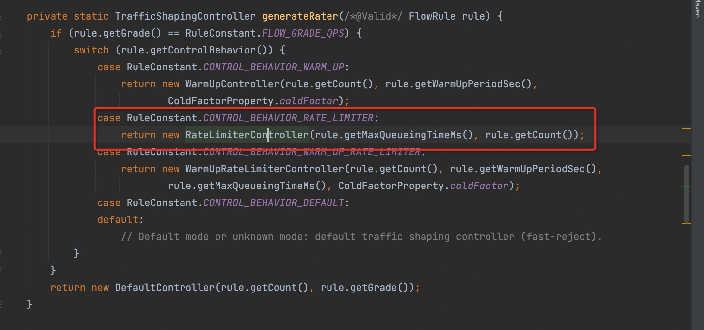
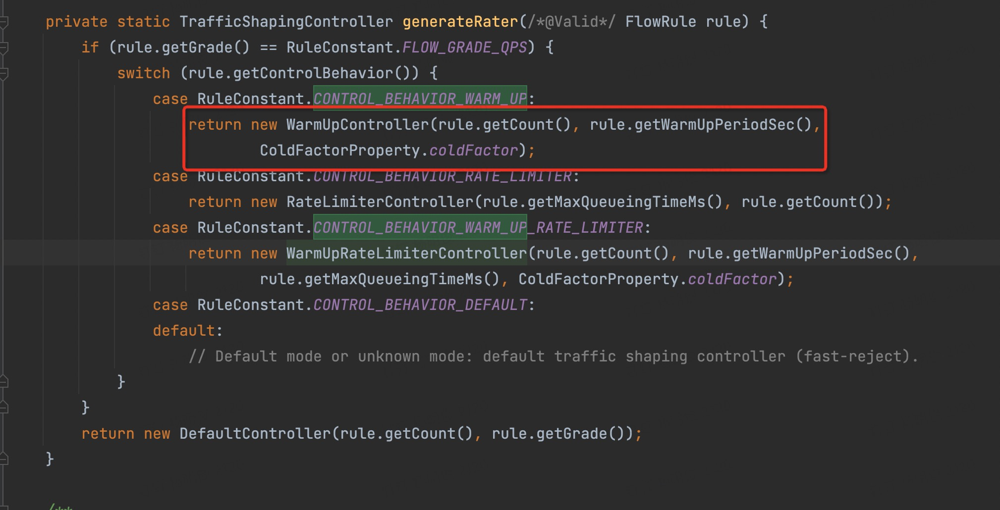
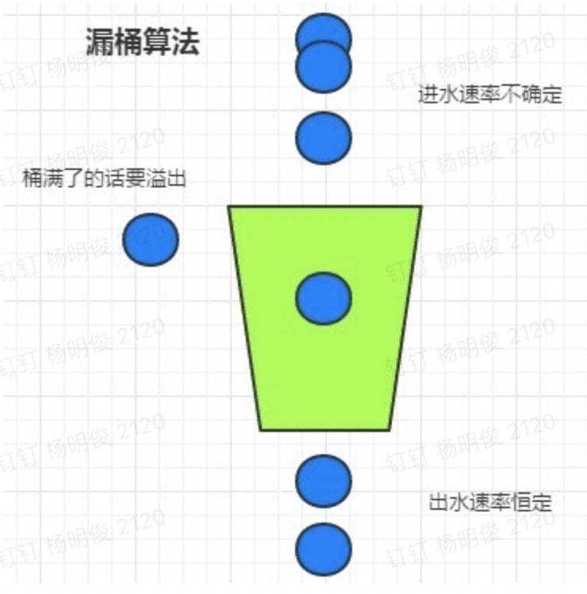
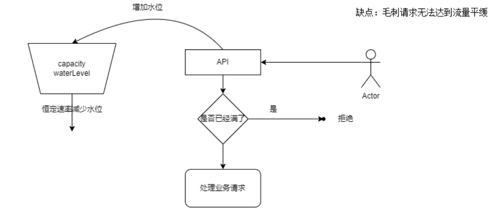
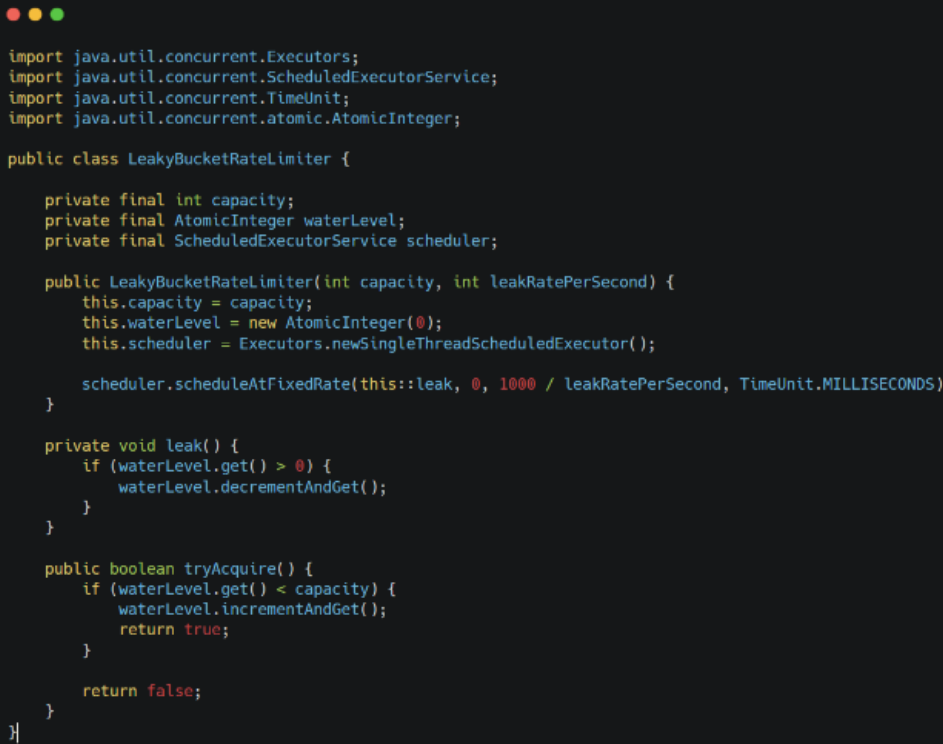

# 官方介绍文档

随着微服务的流行，服务和服务之间的稳定性变得越来越重要。Sentinel 是面向分布式服务架构的流量控制组件，主要以流量为切入点，从流量控制、熔断降级、系统自适应保护等多个维度来帮助您保障微服务的稳定性。

https://sentinelguard.io/zh-cn/docs/introduction.html

## 他的核心功能

Sentinel 是面向分布式服务架构的流量控制组件，主要以流量为切入点，从流量控制、熔断降级、系统自适应保护等多个维度来帮助我们保障微服务的稳定性。

sentinel它的核心功能主要是流量控制，熔断降级等等，这些都依赖它的数据统计（资源的流量，线程数，rt, 异常数...）,在sentinel中是使用[滑动窗口算法](#滑动窗口算法)来完成资源设置的时间窗口内的数据统计的

## 流量控制

流量控制又叫做过载保护，sentinel提供下面几种能力，功能详情可以在上文链接的官网中查看这里就不重复了，主要想聊聊他提供的功能使用到的算法：

* 直接拒绝：不需要特别的算法，根据获取的统计数据直接和规则做对比即可 采用的是 **[滑动窗口算法](#滑动窗口算法)**

* 匀速器：即是让请求以均匀的速度通过，对应的是漏桶算法 [算法代码：RateLimiterController.canPass](#漏桶算法)

  

* 冷启动：还没看懂这块代码，尴尬

  

  ```java
  /*
   * Copyright 1999-2018 Alibaba Group Holding Ltd.
   *
   * Licensed under the Apache License, Version 2.0 (the "License");
   * you may not use this file except in compliance with the License.
   * You may obtain a copy of the License at
   *
   *      http://www.apache.org/licenses/LICENSE-2.0
   *
   * Unless required by applicable law or agreed to in writing, software
   * distributed under the License is distributed on an "AS IS" BASIS,
   * WITHOUT WARRANTIES OR CONDITIONS OF ANY KIND, either express or implied.
   * See the License for the specific language governing permissions and
   * limitations under the License.
   */
  package com.alibaba.csp.sentinel.slots.block.flow.controller;
  
  import java.util.concurrent.atomic.AtomicLong;
  
  import com.alibaba.csp.sentinel.util.TimeUtil;
  import com.alibaba.csp.sentinel.node.Node;
  import com.alibaba.csp.sentinel.slots.block.flow.TrafficShapingController;
  
  /**
   * <p>
   * The principle idea comes from Guava. However, the calculation of Guava is
   * rate-based, which means that we need to translate rate to QPS.
   * </p>
   *
   * <p>
   * Requests arriving at the pulse may drag down long idle systems even though it
   * has a much larger handling capability in stable period. It usually happens in
   * scenarios that require extra time for initialization, e.g. DB establishes a connection,
   * connects to a remote service, and so on. That’s why we need “warm up”.
   * </p>
   *
   * <p>
   * Sentinel's "warm-up" implementation is based on the Guava's algorithm.
   * However, Guava’s implementation focuses on adjusting the request interval,
   * which is similar to leaky bucket. Sentinel pays more attention to
   * controlling the count of incoming requests per second without calculating its interval,
   * which resembles token bucket algorithm.
   * </p>
   *
   * <p>
   * The remaining tokens in the bucket is used to measure the system utility.
   * Suppose a system can handle b requests per second. Every second b tokens will
   * be added into the bucket until the bucket is full. And when system processes
   * a request, it takes a token from the bucket. The more tokens left in the
   * bucket, the lower the utilization of the system; when the token in the token
   * bucket is above a certain threshold, we call it in a "saturation" state.
   * </p>
   *
   * <p>
   * Base on Guava’s theory, there is a linear equation we can write this in the
   * form y = m * x + b where y (a.k.a y(x)), or qps(q)), is our expected QPS
   * given a saturated period (e.g. 3 minutes in), m is the rate of change from
   * our cold (minimum) rate to our stable (maximum) rate, x (or q) is the
   * occupied token.
   * </p>
   *
   * @author jialiang.linjl
   */
  public class WarmUpController implements TrafficShapingController {
  
      protected double count;
      private int coldFactor;
      protected int warningToken = 0;
      private int maxToken;
      protected double slope;
  
      protected AtomicLong storedTokens = new AtomicLong(0);
      protected AtomicLong lastFilledTime = new AtomicLong(0);
  
      public WarmUpController(double count, int warmUpPeriodInSec, int coldFactor) {
          construct(count, warmUpPeriodInSec, coldFactor);
      }
  
      public WarmUpController(double count, int warmUpPeriodInSec) {
          construct(count, warmUpPeriodInSec, 3);
      }
  
      private void construct(double count, int warmUpPeriodInSec, int coldFactor) {
  
          if (coldFactor <= 1) {
              throw new IllegalArgumentException("Cold factor should be larger than 1");
          }
  
          this.count = count;
  
          this.coldFactor = coldFactor;
  
          // thresholdPermits = 0.5 * warmupPeriod / stableInterval.
          // warningToken = 100;
          warningToken = (int)(warmUpPeriodInSec * count) / (coldFactor - 1);
          // / maxPermits = thresholdPermits + 2 * warmupPeriod /
          // (stableInterval + coldInterval)
          // maxToken = 200
          maxToken = warningToken + (int)(2 * warmUpPeriodInSec * count / (1.0 + coldFactor));
  
          // slope
          // slope = (coldIntervalMicros - stableIntervalMicros) / (maxPermits
          // - thresholdPermits);
          slope = (coldFactor - 1.0) / count / (maxToken - warningToken);
  
      }
  
      @Override
      public boolean canPass(Node node, int acquireCount) {
          return canPass(node, acquireCount, false);
      }
  
      @Override
      public boolean canPass(Node node, int acquireCount, boolean prioritized) {
          long passQps = (long) node.passQps();
  
          long previousQps = (long) node.previousPassQps();
          syncToken(previousQps);
  
          // 开始计算它的斜率
          // 如果进入了警戒线，开始调整他的qps
          long restToken = storedTokens.get();
          if (restToken >= warningToken) {
              long aboveToken = restToken - warningToken;
              // 消耗的速度要比warning快，但是要比慢
              // current interval = restToken*slope+1/count
              double warningQps = Math.nextUp(1.0 / (aboveToken * slope + 1.0 / count));
              if (passQps + acquireCount <= warningQps) {
                  return true;
              }
          } else {
              if (passQps + acquireCount <= count) {
                  return true;
              }
          }
  
          return false;
      }
  
      protected void syncToken(long passQps) {
          long currentTime = TimeUtil.currentTimeMillis();
          currentTime = currentTime - currentTime % 1000;
          long oldLastFillTime = lastFilledTime.get();
          if (currentTime <= oldLastFillTime) {
              return;
          }
  
          long oldValue = storedTokens.get();
          long newValue = coolDownTokens(currentTime, passQps);
  
          if (storedTokens.compareAndSet(oldValue, newValue)) {
              long currentValue = storedTokens.addAndGet(0 - passQps);
              if (currentValue < 0) {
                  storedTokens.set(0L);
              }
              lastFilledTime.set(currentTime);
          }
  
      }
  
      private long coolDownTokens(long currentTime, long passQps) {
          long oldValue = storedTokens.get();
          long newValue = oldValue;
  
          // 添加令牌的判断前提条件:
          // 当令牌的消耗程度远远低于警戒线的时候
          if (oldValue < warningToken) {
              newValue = (long)(oldValue + (currentTime - lastFilledTime.get()) * count / 1000);
          } else if (oldValue > warningToken) {
              if (passQps < (int)count / coldFactor) {
                  newValue = (long)(oldValue + (currentTime - lastFilledTime.get()) * count / 1000);
              }
          }
          return Math.min(newValue, maxToken);
      }
  
  }
  
  ```

## 熔断降级

这个比较简单，基于上层通过滑动窗口统计到的数据和熔断降级规则做比较，符合条件的走熔断降级逻辑即可，未匹配上任何条件放行

## 系统负载保护

## sentinel 的一些问题

* https://www.cnblogs.com/mrxiaobai-wen/p/14192841.html

# 算法解释

## 滑动窗口算法

滑动窗口算法的全称叫做滑动时间窗口算法，它是为了解决[计数器算法](#计数器算法)的临界值的问题出现的，比如：在TCP的网络通信协议中就是用到了该算法思想来解决网络拥堵问题。

滑动时间窗口算法在计数器算法的基础上做了优化，他将计数的区间分成了多个小窗口，每次大窗口向后滑动一个小窗口，并且保证大窗口内的流量不超出阈值

一个讲解该算法的博客文章：https://www.cnblogs.com/huansky/p/13488234.html

代码可以参考 sentinel 的窗口实现方案，该方案还兼顾了并发场景的数据统计核心代码是LeapArray，他是一个环形的滑动窗口，内存使用率较高，代码阅读入口 StatisticSlot ->查看其中一个统计方法即可： node.addPassRequest(count) 

```java
@Override
public void addPassRequest(int count) {
    super.addPassRequest(count);
    this.clusterNode.addPassRequest(count);
}
```

```java
@Override
public void addPassRequest(int count) {
    rollingCounterInSecond.addPass(count);
    rollingCounterInMinute.addPass(count);
}
```

然后就会进入到 ArrayMetric 的 addPass 方法

```java
@Override
public void addSuccess(int count) {
    WindowWrap<MetricBucket> wrap = data.currentWindow();
    wrap.value().addSuccess(count);
}
```

统计的核心就是 ArrayMetric 以及 WindowWrap

WindowWrap有几个参数：

* windowLengthInMs 拆分的小窗口时间长度
* sampleCount 小窗口的数量
* intervalInMs 滑动窗口的总长（单位ms）
* intervalInSecond 滑动窗口的总长（单位s）

几个核心方法实现了窗口的滑动，同时由于巧妙的环形设计，统计窗口中的计数只需要将所有小窗口的值加起来即可获取到窗口时间内的总值，这时候就可以直接判断是否应该拦截请求了，如果可以通过，就可以使用下面的方法来给当前时间对应的窗口叠加一次新的计数

* currentWindow 方法：用于在放行条件下选取最新的小窗口增加计数，同时窗口的滑动逻辑也在其中

* [calculateTimeIdx](#calculateTimeIdx(LeapArray)) 方法：用于currentWindow内部逻辑中帮助计算当前时间的窗口索引位置

* [calculateWindowStart](#calculateWindowStart) 方案： 用于在 currentWindow 内部逻辑中帮助计算当前时间对应的窗口的 startTime

  **calculateTimeIdx 计算到的位置的开始时间如果和 calculateWindowStart 不相等，那么证明需要滑动了，也就是更新当前索引位置的 start time 和 情况当前小窗口的计数。**

  **至于请求是否会被拦截，那就使用所有小窗口的计数总和+当前请求的的数量和 limit做对比，如果大于 limit 则拦截。反之放行** 

```java
public WindowWrap<T> currentWindow(long timeMillis) {
    if (timeMillis < 0) {
        return null;
    }
	// 计算当前时间对应的窗口索引,方法解释在下文中有
    int idx = calculateTimeIdx(timeMillis);
    // 计算当前时间对应的窗口的startTime
    long windowStart = calculateWindowStart(timeMillis);
    while (true) {
        // 获取到该idx 索引位置的小窗口
        WindowWrap<T> old = array.get(idx);
        // 如果该窗口未初始化，初始化该小窗口
        if (old == null) {
            /*
             *     B0       B1      B2    NULL      B4
             * ||_______|_______|_______|_______|_______||___
             * 200     400     600     800     1000    1200  timestamp
             *                             ^
             *                          time=888
             *            bucket is empty, so create new and update
             *
             * If the old bucket is absent, then we create a new bucket at {@code windowStart},
             * then try to update circular array via a CAS operation. Only one thread can
             * succeed to update, while other threads yield its time slice.
             */
            WindowWrap<T> window = new WindowWrap<T>(windowLengthInMs, windowStart, newEmptyBucket(timeMillis));
            // cas 的方式将其添加到循环数组中
            if (array.compareAndSet(idx, null, window)) {
                // Successfully updated, return the created bucket.
                return window;
            } else {
                // Contention failed, the thread will yield its time slice to wait for bucket available.
                // 如果因为此时发生了并发竞争，放弃cpu资源等待while 循环逻辑下一次重新执行
                Thread.yield();
            }
        } else if (windowStart == old.windowStart()) {

            /*
             *     B0       B1      B2     B3      B4
             * ||_______|_______|_______|_______|_______||___
             * 200     400     600     800     1000    1200  timestamp
             *                             ^
             *                          time=888
             *            startTime of Bucket 3: 800, so it's up-to-date
             *
             * If current {@code windowStart} is equal to the start timestamp of old bucket,
             * that means the time is within the bucket, so directly return the bucket.
             */
             // 如果索引位置的小窗口已初始化，并且starttime 和 当前时间计算得到的相等，那么说明当前时间输入该小窗口的范围内所以可以直接使用该小窗口
            return old;
        } else if (windowStart > old.windowStart()) {
            /*
             *   (old)
             *             B0       B1      B2    NULL      B4
             * |_______||_______|_______|_______|_______|_______||___
             * ...    1200     1400    1600    1800    2000    2200  timestamp
             *                              ^
             *                           time=1676
             *          startTime of Bucket 2: 400, deprecated, should be reset
             *
             * If the start timestamp of old bucket is behind provided time, that means
             * the bucket is deprecated. We have to reset the bucket to current {@code windowStart}.
             * Note that the reset and clean-up operations are hard to be atomic,
             * so we need a update lock to guarantee the correctness of bucket update.
             *
             * The update lock is conditional (tiny scope) and will take effect only when
             * bucket is deprecated, so in most cases it won't lead to performance loss.
             */
             // 如果索引位置的小窗口已初始化，但是 old.starttime 小于当前时间计算得到的startTime，说明当前时间对应的窗口应该更新了（也就是窗口应该滑动了）
            if (updateLock.tryLock()) {
                try {
                    // Successfully get the update lock, now we reset the bucket.
                    return resetWindowTo(old, windowStart);
                } finally {
                    updateLock.unlock();
                }
            } else {
                // Contention failed, the thread will yield its time slice to wait for bucket available.
                Thread.yield();
            }
        } else if (windowStart < old.windowStart()) {
            // Should not go through here, as the provided time is already behind.
            // 这种场景比本不可能出现，应该时间不可能向前走，除非获取当前时间的工具出错了（操作系统提供的）
            return new WindowWrap<T>(windowLengthInMs, windowStart, newEmptyBucket(timeMillis));
        }
    }
}


```

### calculateTimeIdx(LeapArray)

```java
// 计算当前时间对应的窗口索引
private int calculateTimeIdx(/*@Valid*/ long timeMillis) {
	/*
	*     B0       B1      B2    NULL      B4
	* ||_______|_______|_______|_______|_______||___
	* 200     400     600     800     1000    1200  timestamp
	*/
  // 假如我们窗口总大小是 600ms,分了三个小窗口 windowLengthInMs = 200ms
  // 0 / 200 = 0
  // 100 / 200 = 0
  // 101 / 200 = 0
  // 200 / 200 = 1
  // 399 / 200 = 1
  // 400 / 200 = 2
  // 600 / 200 = 3 , 3 % 3 = 0 ,也就是需要放在0这个位置，此时滑动窗口也就滑动了
  long timeId = timeMillis / windowLengthInMs;
  // Calculate current index so we can map the timestamp to the leap array.
  return (int)(timeId % array.length());
}
```

### calculateWindowStart

```java
// 计算当前时间对应的窗口的startTime
protected long calculateWindowStart(/*@Valid*/ long timeMillis) {
  /**
     * 如何知道一个小窗口的startTimeMillis呢 ？假如我们窗口总大小是 600ms,分了三个小窗口    
     * windowLengthInMs = 200ms ， 我们可以先枚举一些例子：
   	 * timeMillis=0 ； = 0 - 0 % 200 = 0 ，  它应该是放在 0 - 200 这个窗口中的
	 * timeMillis=111 ； = 111 - 111 % 200 = 0 ， 他也是放在 0 - 200 这个窗口中的
	 * timeMillis=200 ； = 200 - 200 % 200 = 200 ， 他也是放在 200 - 400 这个窗口中的
 	 * timeMillis=600 ； = 600 - 600 % 200 = 600 ， 他也是放在 600 - 800 这个窗口中的
 	 * 规律已经很明显了，但是我们一般不回算 endTime, 因为这是一个循环数组，它真实的情况应该可能是下面这样 
 	 * 的:
 	 *      B0       B1      B2    NULL      B4
	 *  |_______|_______|_______|_______|_______|
	 * 1200     400     600     800     1000    
	 */
  return timeMillis - timeMillis % windowLengthInMs;
}
```

该算法还有一种实现方式，本质思想是转换概念，将原本问题的通过确定时间范围去进行次数限制。转换成先确定次数大小，然后再来进行时间限制。这种方式由于需要记录每一次请求的time 实现起来会更费内存一些，而上面一种实现方式消耗更多的是拆分的窗口数量的内存

[滑动窗口算法（另一种实现方式）](滑动窗口算法.md)

## 计数器算法

计数器算法是我们限流算法中最简单也是最容易实现的算法。比如我们要限制1分钟内调用不超过1000次，我们可以这样设计，定义2个变量，一个是访问次数count，一个是记录访问次数计算的开始时间startTime，如果记录时间和当前时间比较大于1分钟，则重新计时(startTime = currentTime)，如果在一分钟以内，我们把访问次数加一(count++)。

上代码：

```java
private volatile long startTime;
private volatile int count;
private static final long duringTime = 60 * 1000L ;
private static final int limit = 1000L ;

public boolean canExecute(){
  long currentTime = System.currentTimeMills();
  if(currentTime - duringTime >= startTime){
    	count = 0;
      startTime = currentTime;
    	reture true;
  }
  count++
  if(count > limit){
    return false;
  }
  return true;
}
```

**它的缺点：**简单易于实现确实很不错，不过也存在着一个明显的缺点：“时间零界点”问题，比如在 0-58秒的时候都没有收到请求，然后到了59秒的时候来了500个请求，然后下一个一分钟的开始的一秒又来了501个请求，这种场景就明显不符合我们一分钟内限流1000的要求了，因为这种情况很可能导致我们的系统崩溃（我们限流的设置是为了保护系统的处理能力是在它的承载范围之内）

## 漏桶算法

算法思想：当有请求到来时先放到木桶中，worker以固定的速度从木桶中取出请求进行相应。如果木桶已经满了，直接返回请求频率超限的错误码或者页面。

**漏桶算法能够强行限制数据的传输速率（流量整形），能够达成流量平缓处理，缺点就是不能处理突发流量，会被强制限速。对有些业务场景的请求响应的使用体验会有影响**。

**适用场景：**

**流量最均匀的限流方式，一般用于流量“整形”，例如保护数据库的限流。先把对数据库的访问加入到木桶中，worker再以db能够承受的qps从木桶中取出请求，去访问数据库。不太适合电商抢购和微博出现热点事件等场景的限流（这种场景会有突发流量）。**



**这种实现方式需要借助一个线程。来实现很恒定速率**





## 令牌桶算法

和漏桶算法不同，令牌桶是为了在限制数据的**平均传输速率**的同时还允许某种程度的突发传输而设计的

go的普通的令牌痛的实现：https://github.com/kevinyan815/gocookbook/issues/27

```go
type TokenBucket struct {
   rate         int64 //固定的token放入速率, r/s
   capacity     int64 //桶的容量
   tokens       int64 //桶中当前token数量
   lastTokenSec int64 //上次向桶中放令牌的时间的时间戳，单位为秒

   lock sync.Mutex
}

func (bucket *TokenBucket) Take() bool {
   bucket.lock.Lock()
   defer bucket.lock.Unlock()

   now := time.Now().Unix()
   bucket.tokens = bucket.tokens + (now-bucket.lastTokenSec)*bucket.rate // 通过计算两次的时间差*token的放入速率获取已经添加的令牌数量
   if bucket.tokens > bucket.capacity { // 保证添加的令牌没有超过限制
      bucket.tokens = bucket.capacity
   }
   bucket.lastTokenSec = now
   if bucket.tokens > 0 {
      // 还有令牌，领取令牌
      bucket.tokens--
      return true
   } else {
      // 没有令牌,则拒绝
      return false
   }
}

func (bucket *TokenBucket) Init(rate, cap int64) {
   bucket.rate = rate
   bucket.capacity = cap
   bucket.tokens = 0
   bucket.lastTokenSec = time.Now().Unix()
}
```

java部分可以参考sentinel的漏桶算法的代码，sentinel支持的实现支持一定的等待时

```java
/*
 * Copyright 1999-2018 Alibaba Group Holding Ltd.
 *
 * Licensed under the Apache License, Version 2.0 (the "License");
 * you may not use this file except in compliance with the License.
 * You may obtain a copy of the License at
 *
 *      http://www.apache.org/licenses/LICENSE-2.0
 *
 * Unless required by applicable law or agreed to in writing, software
 * distributed under the License is distributed on an "AS IS" BASIS,
 * WITHOUT WARRANTIES OR CONDITIONS OF ANY KIND, either express or implied.
 * See the License for the specific language governing permissions and
 * limitations under the License.
 */
package com.alibaba.csp.sentinel.slots.block.flow.controller;

import java.util.concurrent.atomic.AtomicLong;

import com.alibaba.csp.sentinel.slots.block.flow.TrafficShapingController;

import com.alibaba.csp.sentinel.util.TimeUtil;
import com.alibaba.csp.sentinel.node.Node;

/**
 * @author jialiang.linjl
 */
public class RateLimiterController implements TrafficShapingController {

    private final int maxQueueingTimeMs;
    private final double count;

    private final AtomicLong latestPassedTime = new AtomicLong(-1);

    public RateLimiterController(int timeOut, double count) {
        this.maxQueueingTimeMs = timeOut;
        this.count = count;
    }

    @Override
    public boolean canPass(Node node, int acquireCount) {
        return canPass(node, acquireCount, false);
    }

    @Override
    public boolean canPass(Node node, int acquireCount, boolean prioritized) {
        // Pass when acquire count is less or equal than 0.
        if (acquireCount <= 0) {
            return true;
        }
        // Reject when count is less or equal than 0.
        // Otherwise,the costTime will be max of long and waitTime will overflow in some cases.
        if (count <= 0) {
            return false;
        }

        long currentTime = TimeUtil.currentTimeMillis();
        // Calculate the interval between every two requests.
      	// count 是qps , 1s 能生成 count个令牌，* 1000 是把单位换算成ms 
      	// acquireCount 个请求需要消耗多少ms，acquireCount/count 拿到占比，再*1000ms 就能获取到需要消耗的时间
        long costTime = Math.round(1.0 * (acquireCount) / count * 1000);

        // Expected pass time of this request.
      	// 得到上一次发放令牌的时间+当前请求数需要的令牌所需花费的时间
        long expectedTime = costTime + latestPassedTime.get();
        // currentTime 如果大于 expectedTime 说明可以能够产生这么多令牌，可以放行，窗口内的平均速率是满足 count定义的qps限制的
        if (expectedTime <= currentTime) {
            // Contention may exist here, but it's okay.
            latestPassedTime.set(currentTime); // 更新最近一次获取令牌的时间，latestPassedTime 这个是一个 atomic变量保证多线程下的可见性
            return true;
        } else {
            // Calculate the time to wait.
          // 反之计算需要等待多少时间才能获取到足够的令牌
            long waitTime = costTime + latestPassedTime.get() - TimeUtil.currentTimeMillis();
          // 对比是否超过了定义的最大等待时间
            if (waitTime > maxQueueingTimeMs) {
                return false;
            } else {
                long oldTime = latestPassedTime.addAndGet(costTime);
                try {
                    waitTime = oldTime - TimeUtil.currentTimeMillis();
                    if (waitTime > maxQueueingTimeMs) {
                        latestPassedTime.addAndGet(-costTime);
                        return false;
                    }
                    // in race condition waitTime may <= 0
                    if (waitTime > 0) {
                        Thread.sleep(waitTime);
                    }
                    return true;
                } catch (InterruptedException e) {
                }
            }
        }
        return false;
    }

}
```

