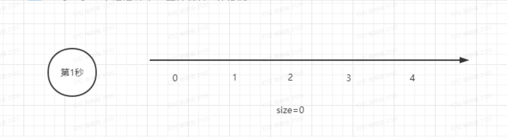
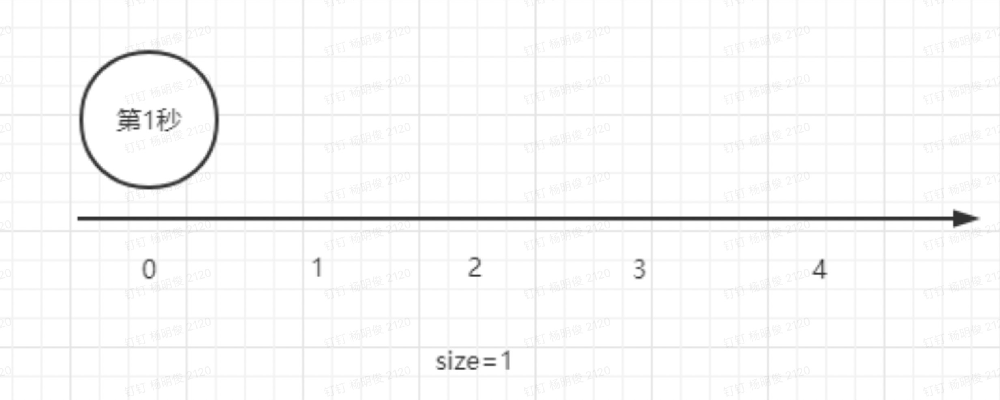
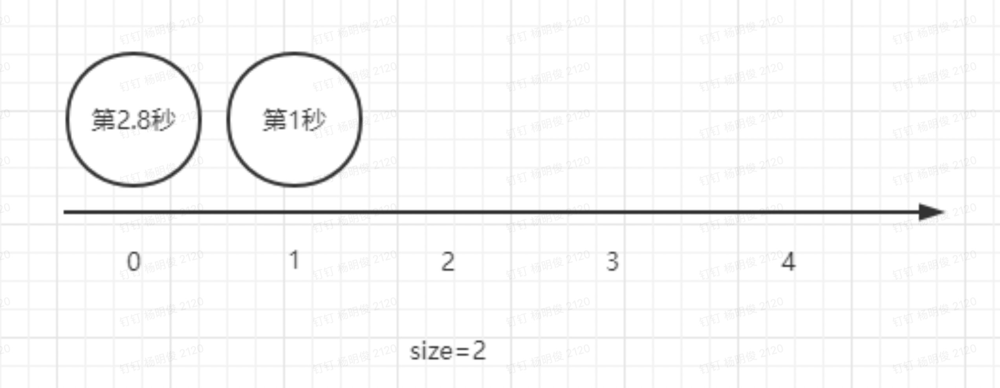
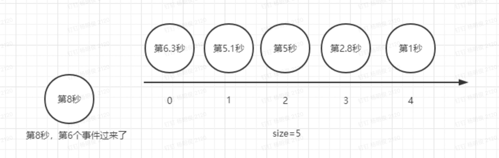
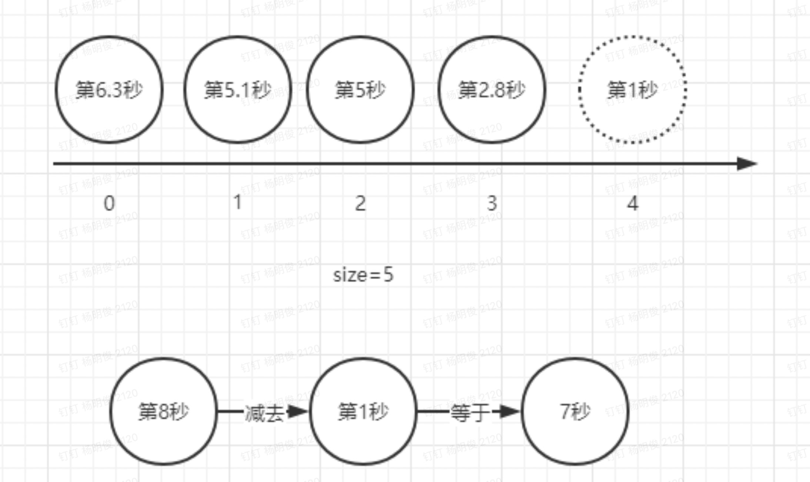
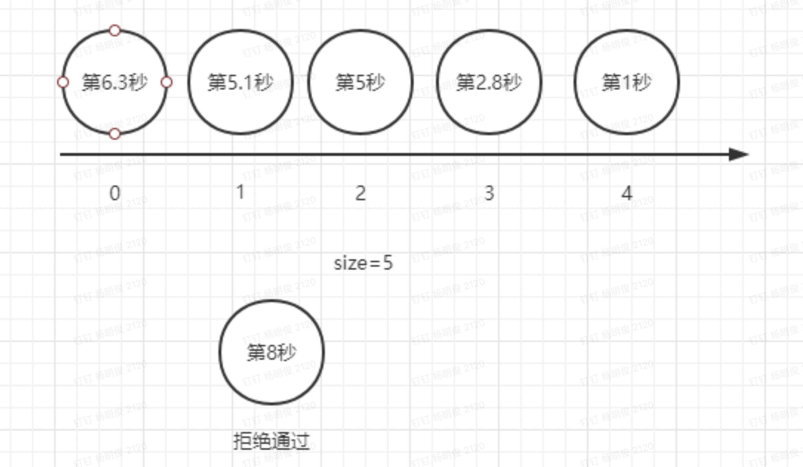
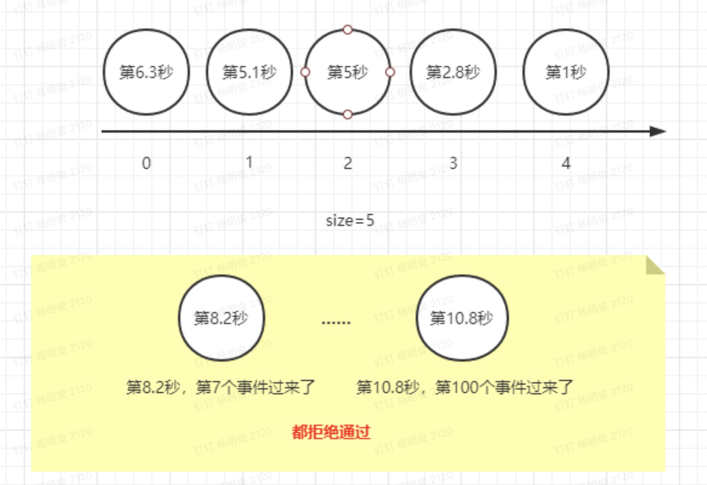
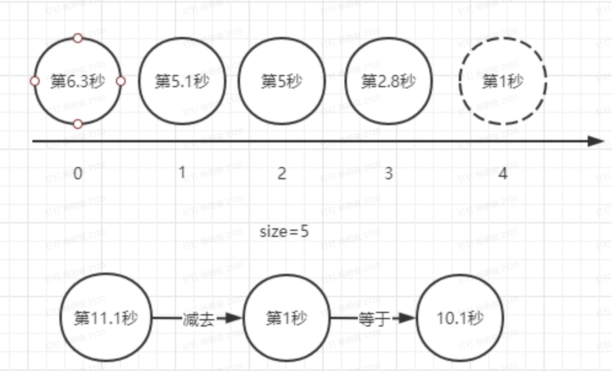
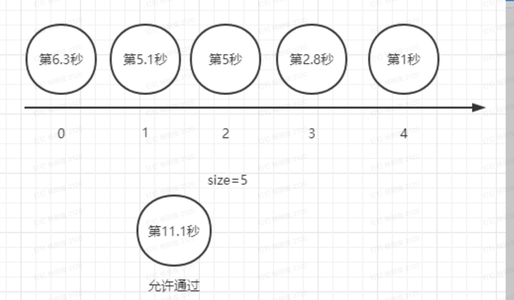
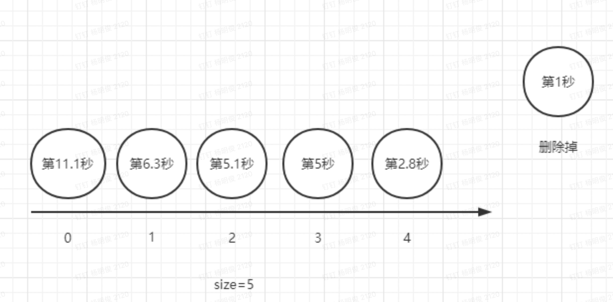

本文来源于：https://cloud.tencent.com/developer/article/1761700


本代码基于原博客java版本的GO实现 , 原文解释也比较详细 , 这里也放上原文链接:https://www.cnblogs.com/dijia478/p/13807826.html

具体解释如下 , 代码在最下面

1.10秒内通过5次 , 这条线就是队列list，当第一个事件进来，队列大小是0，时间是第1秒：



 2.因为size=0，小于5，都没有到限制的次数，完全不用考虑时间窗口，直接把这次事件的时间戳放到0的位置：



3.第2.8秒的时候，第二个事件来了。因为此时size=1，还是小于5，把这次事件的时间戳放到0的位置，原来第1秒来的事件时间戳会往后移动一格：



4.陆续的又来了3个事件，队列大小变成了5，先来的时间戳依次向后移动。此时，第6个事件来了，时间是第8秒：



5.因为size=5，不小于5，此时已经达到限制次数，以后都需要考虑时间窗口了。所以取出位置4的时间（离现在最远的时间），和第6个事件的时间戳做比较：



6.得到的差是7秒，小于时间窗口10秒，说明在10秒内，来的事件个数大于5了，所以本次不允许通过：



7.接下来即便来上100个事件，只要时间差小于等于10秒，都同上，拒绝通过：



8.第11.1秒，第101次事件过来了。因为size=5，不小于5，所以取出位置4的时间（离现在最远的时间），和第101个事件的时间戳做比较：



9.得到的差是10.1秒，大于时间窗口10秒，说明在10秒内，来的事件个数小于等于5了，所以本次允许通过：



10.删除位置4的时间（离现在最远的时间），把这次事件的时间戳放到0的位置，后面的时间戳依次向后移动：



往后再来其他事件，就是重复4-10的步骤，即可实现，在任意滑动时间窗口内，限制通过的次数

其本质思想是转换概念，将原本问题的确定时间大小，进行次数限制。转换成确定次数大小，进行时间限制。

```javascript
package utils

import "time"

var LimitQueue map[string][]int64
var ok bool

//单机时间滑动窗口限流法
func LimitFreqSingle(queueName string, count uint, timeWindow int64) bool {
    currTime := time.Now().Unix()
    if LimitQueue == nil {
        LimitQueue = make(map[string][]int64)
    }
    if _, ok = LimitQueue[queueName]; !ok {
        LimitQueue[queueName] = make([]int64, 0)
    }
    //队列未满
    if uint(len(LimitQueue[queueName])) < count {
        LimitQueue[queueName] = append(LimitQueue[queueName], currTime)
        return true
    }
    //队列满了,取出最早访问的时间
    earlyTime := LimitQueue[queueName][0]
		// 用当前时间戳 减去 最早添加的时间戳
    if currTime-earlyTime <= timeWindow {
      // 若结果小于等于timeWindow，则说明在timeWindow内，通过的次数大于count
      // 不允许通过
        return false
    } else {
      // 若结果大于timeWindow，则说明在timeWindow内，通过的次数小于等于count
      // 允许通过，并删除最早添加的时间戳，将当前时间添加到队列开始位置
        LimitQueue[queueName] = LimitQueue[queueName][1:]
        LimitQueue[queueName] = append(LimitQueue[queueName], currTime)
    }
    return true
}
```

 使用的案例:

```javascript
func limitIpFreq(c *gin.Context, timeWindow int64, count uint) bool {
    ip := c.ClientIP()
    key := "limit:" + ip
    if !utils.LimitFreqSingle(key, count, timeWindow) {
        c.JSON(200, gin.H{
            "code": 400,
            "msg":  "error Current IP frequently visited",
        })
        return false
    }
    return true
}
```

java 实现：

```java
package cn.dijia478.util;

import java.time.LocalTime;
import java.util.LinkedList;
import java.util.List;
import java.util.Map;
import java.util.Random;
import java.util.concurrent.ConcurrentHashMap;

/**
 * 滑动时间窗口限流工具
 * 本限流工具只适用于单机版，如果想要做全局限流，可以按本程序的思想，用redis的List结构去实现
 *
 * @author dijia478
 * @date 2020-10-13 10:53
 */
public class SlideWindow {

    /** 队列id和队列的映射关系，队列里面存储的是每一次通过时候的时间戳，这样可以使得程序里有多个限流队列 */
    private volatile static Map<String, List<Long>> MAP = new ConcurrentHashMap<>();

    private SlideWindow() {}

    public static void main(String[] args) throws InterruptedException {
        while (true) {
            // 任意10秒内，只允许2次通过
            System.out.println(LocalTime.now().toString() + SlideWindow.isGo("ListId", 2, 10000L));
            // 睡眠0-10秒
            Thread.sleep(1000 * new Random().nextInt(10));
        }
    }

    /**
     * 滑动时间窗口限流算法
     * 在指定时间窗口，指定限制次数内，是否允许通过
     *
     * @param listId     队列id
     * @param count      限制次数
     * @param timeWindow 时间窗口大小
     * @return 是否允许通过
     */
    public static synchronized boolean isGo(String listId, int count, long timeWindow) {
        // 获取当前时间
        long nowTime = System.currentTimeMillis();
        // 根据队列id，取出对应的限流队列，若没有则创建
        List<Long> list = MAP.computeIfAbsent(listId, k -> new LinkedList<>());
        // 如果队列还没满，则允许通过，并添加当前时间戳到队列开始位置
        if (list.size() < count) {
            list.add(0, nowTime);
            return true;
        }

        // 队列已满（达到限制次数），则获取队列中最早添加的时间戳
        Long farTime = list.get(count - 1);
        // 用当前时间戳 减去 最早添加的时间戳
        if (nowTime - farTime <= timeWindow) {
            // 若结果小于等于timeWindow，则说明在timeWindow内，通过的次数大于count
            // 不允许通过
            return false;
        } else {
            // 若结果大于timeWindow，则说明在timeWindow内，通过的次数小于等于count
            // 允许通过，并删除最早添加的时间戳，将当前时间添加到队列开始位置
            list.remove(count - 1);
            list.add(0, nowTime);
            return true;
        }
    }
}
```


redis版的分布式滑动时间窗口限流器，用lua脚本实现的方式比较好，可以去这里拿：

https://github.com/dijia478/redis-cluster-client

java.cn.dijia478.cluster.redis.RedisDAO.java

```
    /**
     * 分布式限流队列，在时间窗口内（包含该时间点），判断是否达到限流的阀值
     * 本接口实现的方法通过Lua脚本避免并发问题，性能较高。
     *
     * @param logId      日志id
     * @param key        key
     * @param count      限流阀值
     * @param timeWindow 限流时间窗口
     * @return 是否允许通过（通过即不进行限流）
     */
    Boolean slideWindowLua(String logId, String key, int count, long timeWindow);
```

这个接口的两种实现，一个jedis的客户端，一个lettuce的客户端，可以自行根据需要选择，两个实现类所在目录： 

master/src/main/java/cn/dijia478/cluster/redis/impl

