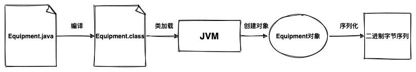
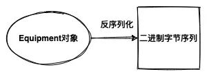

# 什么是序列化

**序列化：**把对象转化为可传输的字节序列过程

**反序列化：把字节序列还原为对象的过程**

# 为什么需要序列化？

在实际的开发中我们会遇到需要将一个对象从服务A传输到服务B的场景，比如 RPC调用

也可能会遇到需要存储一个对象的场景

这些时候我们就需要用到序列化和反序列化了，因为网络中你是不可以直接传输对象的，硬盘中你也是无法直接存储对象的

# 常见的序列化方式

1. **JDK 原生**：

   DK自带了序列化方法。只需要类实现了`Serializable`接口，就可以通过`ObjectOutputStream`类将对象变成byte[]字节数组。

   JDK 序列化会把对象类的描述信息和所有的属性以及继承的元数据都序列化为字节流，所以会导致生成的字节流相对比较大。

   另外，这种序列化方式是 JDK 自带的，因此不支持跨语言。

   简单总结一下：**JDK 原生的序列化方式生成的字节流比较大，也不支持跨语言，因此在实际项目和框架中用的都比较少。**

2. **ProtoBuf**：

   谷歌推出的，是一种语言无关、平台无关、可扩展的序列化结构数据的方法，它可用于通信协议、数据存储等。序列化后体积小，一般用于对传输性能有较高要求的系统。

3. **Hessian**

   是一个轻量级的二进制 web service 协议，主要用于传输二进制数据。在传输数据前 Hessian 支持将对象序列化成二进制流，相对于 JDK 原生序列化，Hessian序列化之后体积更小，性能更优。

4. 