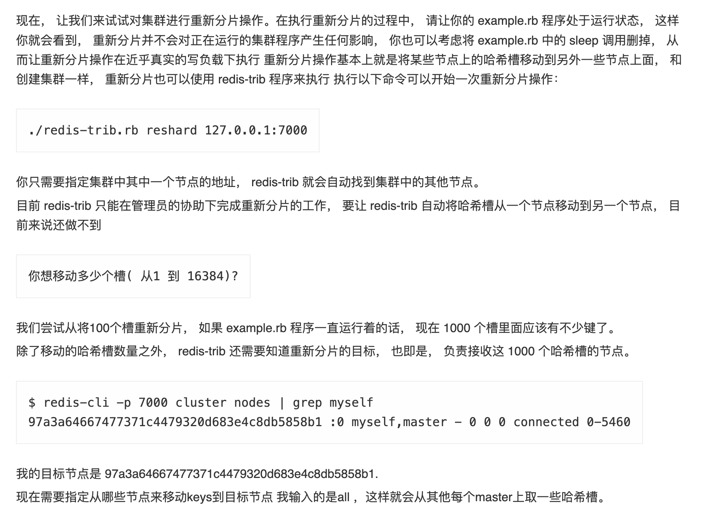

http://www.redis.cn/topics/cluster-tutorial.html

http://events.jianshu.io/p/b208804dce9c

https://www.jianshu.com/p/70ca5d2481b3

- 1.集群方案，hash slot
   Redis Cluster 通过分片的方式将整个缓存划分为 16384 个槽，每个缓存节点就相当于 Hash 环上的一个节点，接入集群时，所有实例都将均匀占有这些哈希槽，当需要查询一个 Key 是，首先根据 Key 的 hashcode 对 16384 取余来得到 Key 属于哪个槽，并映射到缓存实例上。
   把16384个槽抽象成20个哈希槽位，如果有4个节点，分配的哈希槽为0-4，5-9，10-14，15-19，当新增一个节点时，将每个节点的哈希槽的一部分取出来到第五个节点上，取出0，5，10，15形成新的节点哈希槽。删除也同理
- 2.中心化
   公司使用sentinel的形式，把sentinel当做中心来对redis进行调度
- 3.去中心化
   每个节点都保存完整的哈希槽-节点的映射表。
   这样的话，无论向那个节点发出寻找缓存的请求，都会转移到对应的节点上。

## Redis 中集群怎么重新分片（基于hash slot）

​	

# 一致性hash 和 hash slot 区别

1. 一致性hash是一个闭合的环，在计算得到key的时候它需要能够顺时针找到换上的一个节点，也就是说这些节点在环上并且是顺时针有序的，可以采用什么数据结构呢？

   **很明显的一个读多写少的场景：查找节点很平凡，节点的新增删除是一个及其低频的操作**

   **如果选数组**：确实可以通过key有序排列在数组中，但是在查找的时候你没办法利用数组的快速随机访问机制，就会导致查找节点的效率是O(n)的效率

   **hash 表：** 上面说到了我们需要一个有序的存储，所以使用hash 表是不满足要求的

   查找树：比如平衡二叉树，红黑树 ， 相比平衡二叉树肯定考虑红黑树，实现稍微复杂一些，但是相比二叉树红黑树的胃了达到平衡涉及到的节点移动会比平衡二叉树低廉一些

   那么使用红黑树的查找性能是O(logn)

2. 