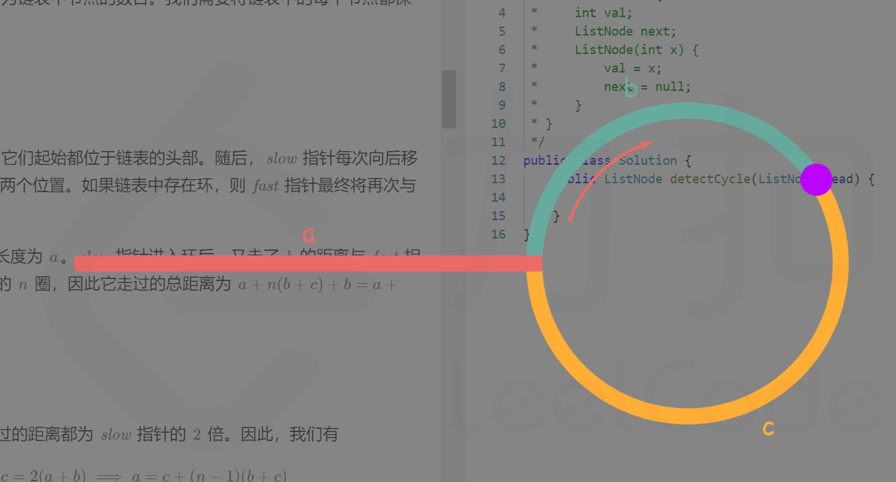

https://leetcode.cn/problems/linked-list-cycle-ii/solutions/441131/huan-xing-lian-biao-ii-by-leetcode-solution/


# 方法一：哈希表

## 思路与算法

一个非常直观的思路是：我们遍历链表中的每个节点，并将它记录下来；一旦遇到了此前遍历过的节点，就可以判定链表中存在环。借助哈希表可以很方便地实现。

**代码**

```
public class Solution {
    public ListNode detectCycle(ListNode head) {
        ListNode pos = head;
        Set<ListNode> visited = new HashSet<ListNode>();
        while (pos != null) {
            if (visited.contains(pos)) {
                return pos;
            } else {
                visited.add(pos);
            }
            pos = pos.next;
        }
        return null;
    }
}
```

## 复杂度分析

* 时间复杂度：O(N)，其中 N 为链表中节点的数目。我们恰好需要访问链表中的每一个节点。
* 空间复杂度：O(N)，其中 N 为链表中节点的数目。我们需要将链表中的每个节点都保存在哈希表当中。

# 方法二：快慢指针

## 思路与算法

我们使用两个指针，fast 与 slow。它们起始都位于链表的头部。随后，slow 指针每次向后移动一个位置，而 fast 指针向后移动两个位置。如果链表中存在环，则 fast 指针最终将再次与 slow 指针在环中相遇。

如下图所示，设链表中环外部分的长度为 a。slow 指针进入环后，又走了 b 的距离与 fast 相遇。此时，fast 指针已经走完了环的 n 圈，因此它走过的总距离为 `a+n(b+c)+b=a+(n+1)b+nc`




根据题意，任意时刻，fast 指针走过的距离都为 slow 指针的 2 倍。因此，我们有:

`a+(n+1)b+nc=2(a+b)  ⟹  a=c+(n−1)(b+c)`

有了 a=c+(n−1)(b+c)  的等量关系，我们会发现：从相遇点到入环点的距离 加上 n-1 圈的环长，恰好等于从链表头部到入环点的距离a。

也就是上面推导出来的公式 ： ` a=c+(n−1)(b+c) ` ; 

因此，当发现 slow 与 fast 相遇时，我们再额外使用一个指针 ptr 起始，它指向链表头部；随后，它和 slow 每次向后移动一个位置。最终，它们会在入环点相遇()。

**代码**

```java
public class Solution {
    public ListNode detectCycle(ListNode head) {
        if (head == null) {
            return null;
        }
        ListNode slow = head, fast = head;
        while (fast != null) {
            slow = slow.next;
            if (fast.next != null) {
                fast = fast.next.next;
            } else {
                return null;
            }
            if (fast == slow) {
                ListNode ptr = head;
                while (ptr != slow) {
                    ptr = ptr.next;
                    slow = slow.next;
                }
                return ptr;
            }
        }
        return null;
    }
}
```

## 复杂度分析

时间复杂度：O(N)，其中 N 为链表中节点的数目。在最初判断快慢指针是否相遇时，slow 指针走过的距离不会超过链表的总长度；随后寻找入环点时，走过的距离也不会超过链表的总长度。因此，总的执行时间为 O(N)+O(N)=O(N)。

空间复杂度：O(1)。我们只使用了 slow,fast,ptr 三个指针。

作者：力扣官方题解
链接：https://leetcode.cn/problems/linked-list-cycle-ii/solutions/441131/huan-xing-lian-biao-ii-by-leetcode-solution/
来源：力扣（LeetCode）
著作权归作者所有。商业转载请联系作者获得授权，非商业转载请注明出处。