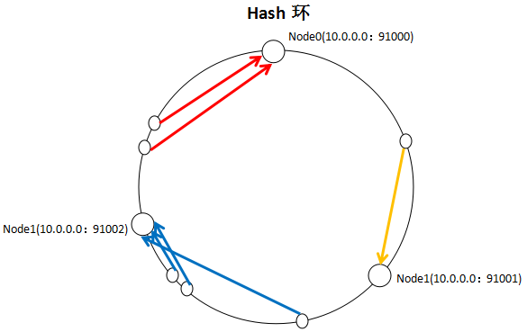
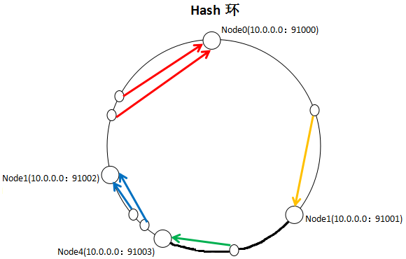
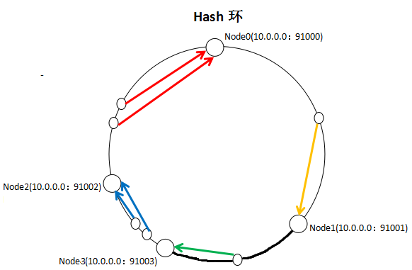
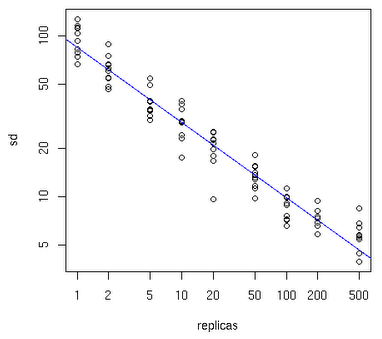

> 本文来自 https://www.cnblogs.com/markcd/p/8476237.html

## [一致性哈希算法原理分析及实现](https://www.cnblogs.com/markcd/p/8476237.html)

​    一致性哈希算法常用于负载均衡中要求资源被均匀的分布到所有节点上，并且对资源的请求能快速路由到对应的节点上。具体的举两个场景的例子：

​    1、MemCache集群，要求存储各种数据均匀的存到集群中的各个节点上，访问这些数据时能快速的路由到集群中对应存放该数据的节点上；并且要求增删节点对整个集群的影响很小，不至于有大的动荡造成整体负载的不稳定；

​    2、RPC过程中服务提供者做N个节点的集群部署，为了能在服务上维护一些业务状态，希望同一种请求每次都落到同一台服务上。

​    比如有{N0, N1, N2}三个节点，陆续有多个资源要分配到这三个节点上，如何尽可能均匀的分配到这些节点上？

​    一致性哈希算法的思路为：先构造出一个长度为232整数环，根据N0-3的节点名称的hash值（分布为[0,232-1]）放到这个环上。现在要存放资源，根据资源的Key的Hash值（也是分布为[0,232-1]）值Haaa，在环上顺时针的找到离Haaa最近（第一个大于或等于Haaa）的一个节点，就建立了资源和节点的映射关系。

​    

​    以上图片引自http://www.cnblogs.com/xrq730/p/4948707.html。

​    为什么要用环存储节点，并用hashKey顺时针寻找对应节点？

​    我们分配节点最简单的办法是取余算法，即有3个节点，资源key=5, 5%3=2，选取N2，key=3，3%3=0，选取N0。虽然简单，但有个缺点，如果节点数增加或减少，就会有大量的key不命中，造成请求压力转移，可能对系统整体有很大的影响，甚至发生宕机危险。

​    而一致性哈希算法增加或减少节点，只会引起少部分key不命中，如下图，增加一个Node4节点，只会将加粗部分的key值从Node1(10.0.0.0:91002)移到Node4(10.0.0.0:91003)，对集群影响很小。



​    以上图片引自http://www.cnblogs.com/xrq730/p/4948707.html

​    Java实现中用什么表示Hash环好呢？经对比，用TreeMap的时间复杂度是O(logN)，相对效率比较高，因为TreeMap使用了红黑树结构存储实体对象。

​    Hash算法的选择上，首先我们考虑简单的String.HashCode()方法，这个算法的缺点是，相似的字符串如N1(10.0.0.0:91001)，N2(10.0.0.0:91002)，N3(10.0.0.0:91003)，哈希值也很相近，造成的结果是节点在Hash环上分布很紧密，导致大部分Key值落到了N0上，节点资源分布不均。一般我们采用FNV1_32_HASH、KETAMA_HASH等算法，KETAMA_HASH是MemCache集群默认的实现方法，这些算法效果要好得多，会使N0，N1，N2的Hash值更均匀的分布在环上。

​    我们用KETAMA_HASH算法实现一致性哈希（无虚拟节点方式），如下代码所示：    

[](javascript:void(0);)

```
 1 package com.example.demo.arithmetic;
 2 
 3 import java.io.UnsupportedEncodingException;
 4 import java.security.MessageDigest;
 5 import java.security.NoSuchAlgorithmException;
 6 import java.util.Arrays;
 7 import java.util.Map;
 8 import java.util.TreeMap;
 9 
10 /**
11  * Created by markcd on 2018/2/28.
12  */
13 public class ConsistentHashLoadBalanceNoVirtualNode {
14 
15     private TreeMap<Long, String> realNodes = new TreeMap<>();
16     private String[] nodes;
17 
18     public ConsistentHashLoadBalanceNoVirtualNode(String[] nodes){
19         this.nodes = Arrays.copyOf(nodes, nodes.length);
20         initalization();
21     }
22 
23     /**
24      * 初始化哈希环
25      * 循环计算每个node名称的哈希值，将其放入treeMap
26      */
27     private void initalization(){
28         for (String nodeName: nodes) {
29             realNodes.put(hash(nodeName, 0), nodeName);
30         }
31     }
32 
33     /**
34      * 根据资源key选择返回相应的节点名称
35      * @param key
36      * @return 节点名称
37      */
38     public String selectNode(String key){
39         Long hashOfKey = hash(key, 0);
40         if (! realNodes.containsKey(hashOfKey)) {               
//ceilingEntry()的作用是得到比hashOfKey大的第一个Entry
41             Map.Entry<Long, String> entry = realNodes.ceilingEntry(hashOfKey);
42             if (entry != null)
43                 return entry.getValue();
44             else
45                 return nodes[0];
46         }else
47             return realNodes.get(hashOfKey);
48     }
49 
50     private Long hash(String nodeName, int number) {
51         byte[] digest = md5(nodeName);
52         return (((long) (digest[3 + number * 4] & 0xFF) << 24)
53                 | ((long) (digest[2 + number * 4] & 0xFF) << 16)
54                 | ((long) (digest[1 + number * 4] & 0xFF) << 8)
55                 | (digest[number * 4] & 0xFF))
56                 & 0xFFFFFFFFL;
57     }
58 
59     /**
60      * md5加密
61      *
62      * @param str
63      * @return
64      */
65     public byte[] md5(String str) {
66         try {
67             MessageDigest md = MessageDigest.getInstance("MD5");
68             md.reset();
69             md.update(str.getBytes("UTF-8"));
70             return md.digest();
71         } catch (NoSuchAlgorithmException e) {
72             e.printStackTrace();
73             return null;
74         } catch (UnsupportedEncodingException e) {
75             e.printStackTrace();
76             return null;
77         }
78     }
79 
80     private void printTreeNode(){
81         if (realNodes != null && ! realNodes.isEmpty()){
82             realNodes.forEach((hashKey, node) ->
83                     System.out.println(
84                             new StringBuffer(node)
85                             .append(" ==> ")
86                             .append(hashKey)
87                     )
88             );
89         }else
90             System.out.println("Cycle is Empty");
91     }
92 
93     public static void main(String[] args){
94         String[] nodes = new String[]{"192.168.2.1:8080", "192.168.2.2:8080", "192.168.2.3:8080", "192.168.2.4:8080"};
95         ConsistentHashLoadBalanceNoVirtualNode consistentHash = new ConsistentHashLoadBalanceNoVirtualNode(nodes);
96         consistentHash.printTreeNode();
97     }
98 }
```

[](javascript:void(0);)

 

​    main()方法执行结果如下，可以看到，hash值分布的距离比较开阔。

​    192.168.2.3:8080 ==> 1182102228

​    192.168.2.4:8080 ==> 1563927337

​    192.168.2.1:8080 ==> 2686712470

​    192.168.2.2:8080 ==> 3540412423

​    KETAMA_HASH解决了hash值分布不均的问题，但还存在一个问题，如下图，在没有Node3节点时，资源相对均匀的分布在{Node0,Node1,Node2}上。增加了Node3节点后，Node1到Node3节点中间的所有资源从Node2迁移到了Node3上。这样，Node0,Node1存储的资源多，Node2,Node3存储的资源少，资源分布不均匀。



​    以上图片引自http://www.cnblogs.com/xrq730/p/4948707.html

​    如何解决这个问题呢？我们引入虚拟节点概念，如将一个真实节点Node0映射成100个虚拟节点分布在Hash环上，与这100个虚拟节点根据KETAMA_HASH哈希环匹配的资源都存到真实节点Node0上。{Node0,Node1,Node2}以相同的方式拆分虚拟节点映射到Hash环上。当集群增加节点Node3时，在Hash环上增加Node3拆分的100个虚拟节点，这新增的100个虚拟节点更均匀的分布在了哈希环上，可能承担了{Node0,Node1,Node2}每个节点的部分资源，资源分布仍然保持均匀。

​    每个真实节点应该拆分成多少个虚拟节点？数量要合适才能保证负载分布的均匀，有一个大致的规律，如下图所示，Y轴表示真实节点的数目，X轴表示需拆分的虚拟节点数目：

​    

​    真实节点越少，所需阐发的虚拟节点越多，比如有10个真实节点，每个节点所需拆分的虚拟节点个数可能是100~200个，才能达到真正的负载均衡。

​    下面贴出使用了虚拟节点的算法实现：    

[](javascript:void(0);)

```
  1 package com.example.demo.arithmetic;
  2 
  3 import java.io.UnsupportedEncodingException;
  4 import java.security.MessageDigest;
  5 import java.security.NoSuchAlgorithmException;
  6 import java.util.LinkedList;
  7 import java.util.Map;
  8 import java.util.TreeMap;
  9 
 10 /**
 11  * Created by markcd on 2018/2/28.
 12  */
 13 public class ConsistentHashLoadBalance {
 14 
 15     private TreeMap<Long, String> virtualNodes = new TreeMap<>();
 16     private LinkedList<String> nodes;        //每个真实节点对应的虚拟节点数
 17     private final int replicCnt;
 18 
 19     public ConsistentHashLoadBalance(LinkedList<String> nodes, int replicCnt){
 20         this.nodes = nodes;
 21         this.replicCnt = replicCnt;
 22         initalization();
 23     }
 24 
 25     /**
 26      * 初始化哈希环
 27      * 循环计算每个node名称的哈希值，将其放入treeMap
 28      */
 29     private void initalization(){
 30         for (String nodeName: nodes) {
 31             for (int i = 0; i < replicCnt/4; i++) {
 32                 String virtualNodeName = getNodeNameByIndex(nodeName, i);
 33                 for (int j = 0; j < 4; j++) {
 34                     virtualNodes.put(hash(virtualNodeName, j), nodeName);
 35                 }
 36             }
 37         }
 38     }
 39 
 40     private String getNodeNameByIndex(String nodeName, int index){
 41         return new StringBuffer(nodeName)
 42                 .append("&&")
 43                 .append(index)
 44                 .toString();
 45     }
 46 
 47     /**
 48      * 根据资源key选择返回相应的节点名称
 49      * @param key
 50      * @return 节点名称
 51      */
 52     public String selectNode(String key){
 53         Long hashOfKey = hash(key, 0);
 54         if (! virtualNodes.containsKey(hashOfKey)) {
 55             Map.Entry<Long, String> entry = virtualNodes.ceilingEntry(hashOfKey);
 56             if (entry != null)
 57                 return entry.getValue();
 58             else
 59                 return nodes.getFirst();
 60         }else
 61             return virtualNodes.get(hashOfKey);
 62     }
 63 
 64     private Long hash(String nodeName, int number) {
 65         byte[] digest = md5(nodeName);
 66         return (((long) (digest[3 + number * 4] & 0xFF) << 24)
 67                 | ((long) (digest[2 + number * 4] & 0xFF) << 16)
 68                 | ((long) (digest[1 + number * 4] & 0xFF) << 8)
 69                 | (digest[number * 4] & 0xFF))
 70                 & 0xFFFFFFFFL;
 71     }
 72 
 73     /**
 74      * md5加密
 75      *
 76      * @param str
 77      * @return
 78      */
 79     public byte[] md5(String str) {
 80         try {
 81             MessageDigest md = MessageDigest.getInstance("MD5");
 82             md.reset();
 83             md.update(str.getBytes("UTF-8"));
 84             return md.digest();
 85         } catch (NoSuchAlgorithmException e) {
 86             e.printStackTrace();
 87             return null;
 88         } catch (UnsupportedEncodingException e) {
 89             e.printStackTrace();
 90             return null;
 91         }
 92     }
 93 
 94     public void addNode(String node){
 95         nodes.add(node);
 96         for (int i = 0; i < replicCnt/4; i++) {
 97				String virtualNodeName = getNodeNameByIndex(nodeName, i);
 98             for (int j = 0; j < 4; j++) {
 99                 virtualNodes.put(hash(virtualNodeName, j), node);
100             }
101         }
102     }
103 
104     public void removeNode(String node){
105         nodes.remove(node);
106         for (int i = 0; i < replicCnt/4; i++) {
107				String virtualNodeName = getNodeNameByIndex(nodeName, i);
108             for (int j = 0; j < 4; j++) {
109                 virtualNodes.remove(hash(virtualNodeName, j), node);
110             }
111         }
112     }
113 
114     private void printTreeNode(){
115         if (virtualNodes != null && ! virtualNodes.isEmpty()){
116             virtualNodes.forEach((hashKey, node) ->
117                     System.out.println(
118                             new StringBuffer(node)
119                                     .append(" ==> ")
120                                     .append(hashKey)
121                     )
122             );
123         }else
124             System.out.println("Cycle is Empty");
125     }
126 
127     public static void main(String[] args){
128         LinkedList<String> nodes = new LinkedList<>();
129         nodes.add("192.168.2.1:8080");
130         nodes.add("192.168.2.2:8080");
131         nodes.add("192.168.2.3:8080");
132         nodes.add("192.168.2.4:8080");
133         ConsistentHashLoadBalance consistentHash = new ConsistentHashLoadBalance(nodes, 160);
134         consistentHash.printTreeNode();
135     }
136 }
```

[](javascript:void(0);)

​     以上main方法执行的结果如下：

​     192.168.2.4:8080 ==> 18075595
​     192.168.2.1:8080 ==> 18286704
​     192.168.2.1:8080 ==> 35659769
​     192.168.2.2:8080 ==> 43448858
​     192.168.2.1:8080 ==> 44075453
​     192.168.2.3:8080 ==> 47625378
​     ........(由于内容过多，不做全部展示)

 

​    至此哈希一致性算法的原理和实现描述完毕，欢迎大家讨论，如有不当的地方欢迎大家提出异议。