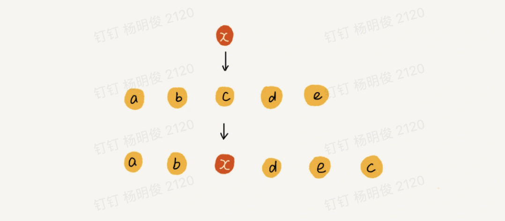
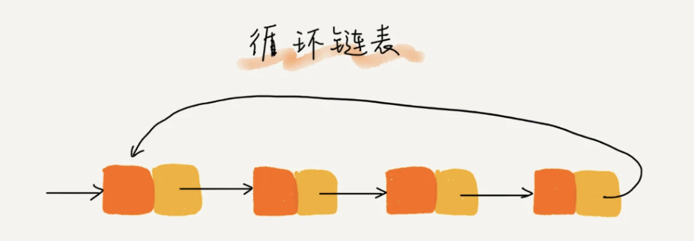

# 引言

本文包含了最常用、最基础的20个数据结构与算法以及他们的：“来历”、“特点”、“适合解决什么问题”和“实际的应用场景”。

数据结构：数组、链表、栈、队列、散列表、二叉树、堆、跳表、图、Tire树 

算法： 递归、排序、二分查找、搜索、哈希算法、贪心算法、分治算法、回溯算法、动态规划、字符串匹配算法

> ps: [复杂度分析](复杂度分析.md) 这个是数据结构与算法学习的基础中的基础，重中之重，因为只有掌握了他
>
> **学习自 极客时间王争  《数据结构与算法之美》**

怎么学 

1. 边学边练，每周花 1~2 小时集中攻关三节课涉及的数据结构和算法，全部写出来。
2. 一次学不会多看几次（书读百遍其义自现），查资料，找同学和朋友或者网络上提问的方式将问题解决
3. 多思考、多互动（可以去一些相关的博客，leetcode等地方讨论学习）。
4. 自我激励，每次学习完做一篇学习笔记。
5. 沉下心不要浮躁，先把这些基础的数据结构和算法，还有学习方法熟练掌握后，再追求更高层次。

# 数据结构

## 数组

### 简介

专业定义：数组（Array）是一种**线性表**数据结构。它用**一组连续的内存空间**，来**存储一组具有相同类型的数据**。

带着疑问往下看：为什么数组下标要从0开始

> ps: 线性表：数据排列成像一条线一样的接口，每个数据只有前后两个方向，有线性表子然后非线性表，非线性表的他们的数据之间就并不是简单的前后关系了


### 特性

**线性表+连续的内存空间存储相同类型的数据**这两个限制让数组具有了很好的**随机访问特性**，但有利也有弊，这两个限制也给数组的一些操作变得很低效，比如：在输入中删除，插入数据为了保证上面的连续性，就需要做大量的数据搬运工作

数组是如何实现随机访问的？

我们知道，计算机会给每个内存单元分配一个地址，计算机通过地址来访问内存中的数据。当计算机需要随机访问数组中的某个元素时，它会首先通过下面的寻址公式，计算出该元素存储的内存地址：

```
a[i]_address = base_address + i * data_type_size
// base_address 数组的首地址
// data_type_size 每个元素的大小
```

拿一个长度为 10 的 int 类型的数组 int[] a = new int[10]来举例。在我画的这个图中，计算机给数组 a[10]，分配了一块连续内存空间 1000～1039，其中，内存块的首地址为 base_address = 1000。


数组和链表的区别这个问题怎么回答呢？

很多人都回答说，“链表适合插入、删除，时间复杂度 O(1)；数组适合查找，查找时间复杂度为 O(1)”。

这种表述是不准确的。数组是适合查找操作，但是查找的时间复杂度并不为 O(1)。即便是排好序的数组，你用二分查找，时间复杂度也是 O(logn)。所以，正确的表述应该是，**数组支持随机访问，根据下标随机访问的时间复杂度为 O(1)。**

### **低效的“插入”和“删除”**

前面概念部分我们提到，数组为了保持内存数据的连续性，会导致插入、删除这两个操作比较低效。现在我们就来详细说一下，究竟为什么会导致低效？又有哪些改进方法呢？我们先来看插入操作。

假设数组的长度为 n，现在，如果我们需要将一个数据插入到数组中的第 k 个位置。为了把第 k 个位置腾出来，给新来的数据，我们需要将第 k～n 这部分的元素都顺序地往后挪一位。那插入操作的时间复杂度是多少呢？你可以自己先试着分析一下。

如果在数组的末尾插入元素，那就不需要移动数据了，这时的时间复杂度为 O(1)。但如果在数组的开头插入元素，那所有的数据都需要依次往后移动一位，所以最坏时间复杂度是 O(n)。 因为我们在每个位置插入元素的概率是一样的，所以平均情况时间复杂度为 (1+2+...n)/n=O(n)。

如果数组中的数据是有序的，我们在某个位置插入一个新的元素时，就必须按照刚才的方法搬移 k 之后的数据。但是，如果数组中存储的数据并没有任何规律，数组只是被当作一个存储数据的集合。在这种情况下，如果要将某个数据插入到第 k 个位置，为了避免大规模的数据搬移，我们还有一个简单的办法就是，直接将第 k 位的数据搬移到数组元素的最后，把新的元素直接放入第 k 个位置。

为了更好地理解，我们举一个例子。假设数组 a[10]中存储了如下 5 个元素：a，b，c，d，e。

我们现在需要将元素 x 插入到第 3 个位置。我们只需要将 c 放入到 a[5]，将 a[2]赋值为 x 即可。最后，数组中的元素如下： a，b，x，d，e，c。



利用这种处理技巧，在特定场景下，在第 k 个位置插入一个元素的时间复杂度就会降为 O(1)。这个处理思想在快排中也会用到，我会在排序那一节具体来讲，这里就说到这儿。

我们再来看**删除操作。**

跟插入数据类似，如果我们要删除第 k 个位置的数据，为了内存的连续性，也需要搬移数据，不然中间就会出现空洞，内存就不连续了。

和插入类似，如果删除数组末尾的数据，则最好情况时间复杂度为 O(1)；如果删除开头的数据，则最坏情况时间复杂度为 O(n)；平均情况时间复杂度也为 O(n)。

实际上，在某些特殊场景下，我们并不一定非得追求数组中数据的连续性。如果我们将多次删除操作集中在一起执行，删除的效率是不是会提高很多呢？

我们继续来看例子。数组 a[10]中存储了 8 个元素：a，b，c，d，e，f，g，h。现在，我们要依次删除 a，b，c 三个元素。


为了避免 d，e，f，g，h 这几个数据会被搬移三次，我们可以先记录下已经删除的数据。每次的删除操作并不是真正地搬移数据，只是记录数据已经被删除。当数组没有更多空间存储数据时，我们再触发执行一次真正的删除操作，这样就大大减少了删除操作导致的数据搬移。

如果你了解 JVM，你会发现，**这不就是 JVM 标记清除垃圾回收算法的核心思想吗？没错，数据结构和算法的魅力就在于此，很多时候我们并不是要去死记硬背某个数据结构或者算法，而是要学习它背后的思想和处理技巧，这些东西才是最有价值的。**如果你细心留意，不管是在软件开发还是架构设计中，总能找到某些算法和数据结构的影子。

### **警惕数组的访问越界问题**

在c中数据越界编译器是不检查的，而是把这件事交给了程序员来做。很多计算机病毒也正是利用到了代码中的数组越界可以访问非法地址的漏洞，来攻击系统； 

但是像java或者类似的高级语音是他们做了这个检查，比如java 数据越界之后就会抛出异常 java.lang.ArrayIndexOutOfBoundsException。

### 数组其他缺点

数组是需要一块连续的内存空间来存储的，对内存的要求比较高。如果我们申请一个 100MB 大小的数组，当内存中没有连续的、足够大的存储空间时，即便内存的剩余总可用空间大于 100MB，仍然会申请失败。

### **容器能否完全替代数组？**

针对数组类型，很多语言都提供了容器类，比如 Java 中的 ArrayList、C++ STL 中的 vector。在项目开发中，什么时候适合用数组，什么时候适合用容器呢？

这里拿 Java 语言来举例。如果你是 Java 工程师，几乎天天都在用 ArrayList，对它应该非常熟悉。那它与数组相比，到底有哪些优势呢？

ArrayList 最大的优势就是可以将很多数组操作的细节封装起来。比如前面提到的数组插入、删除数据时需要搬移其他数据等。另外，它还有一个优势，就是支持动态扩容。

数组本身在定义的时候需要预先指定大小，因为需要分配连续的内存空间。如果我们申请了大小为 10 的数组，当第 11 个数据需要存储到数组中时，我们就需要重新分配一块更大的空间，将原来的数据复制过去，然后再将新的数据插入。

如果使用 ArrayList，我们就完全不需要关心底层的扩容逻辑，ArrayList 已经帮我们实现好了。每次存储空间不够的时候，它都会将空间自动扩容为 1.5 倍大小。

不过，这里需要注意一点，因为扩容操作涉及内存申请和数据搬移，是比较耗时的。所以，如果事先能确定需要存储的数据大小，**最好在创建 ArrayList 的时候事先指定数据大小。**

**作为高级语言编程者，是不是数组就无用武之地了呢？**当然不是，有些时候，用数组会更合适些，我总结了几点自己的经验。

1. Java ArrayList 无法存储基本类型，比如 int、long，需要封装为 Integer、Long 类，而 Autoboxing、Unboxing 则有一定的性能消耗，**所以如果特别关注性能，或者希望使用基本类型，就可以选用数组。**

2. 如果数据大小事先已知，并且对数据的操作非常简单，用不到 ArrayList 提供的大部分方法，也可以直接使用数组。

总结一下，对于业务开发，直接使用容器就足够了，省时省力。毕竟损耗一丢丢性能，完全不会影响到系统整体的性能。但如果你是做一些非常底层的开发，比如开发网络框架，性能的优化需要做到极致，这个时候数组就会优于容器，成为首选。

### 开篇问题—为什么大多数编程语言中，数组要从 0 开始编号

现在我们来思考开篇的问题：为什么大多数编程语言中，数组要从 0 开始编号，而不是从 1 开始呢？

从数组存储的内存模型上来看，“下标”最确切的定义应该是“偏移（offset）”。前面也讲到，如果用 a 来表示数组的首地址，a[0]就是偏移为 0 的位置，也就是首地址，a[k]就表示偏移 k 个 type_size 的位置，所以计算 a[k]的内存地址只需要用这个公式：

```
a[i]_address = base_address + k * data_type_size
// base_address 数组的首地址
// data_type_size 每个元素的大小
```

但是，如果数组从 1 开始计数，那我们计算数组元素 a[k]的内存地址就会变为：

```
a[i]_address = base_address + (k-1) * data_type_size
// base_address 数组的首地址
// data_type_size 每个元素的大小
```

对比两个公式，我们不难发现，从 1 开始编号，每次随机访问数组元素都多了一次减法运算，对于 CPU 来说，就是多了一次减法指令。

数组作为非常基础的数据结构，通过下标随机访问数组元素又是其非常基础的编程操作，效率的优化就要尽可能做到极致。

所以为了减少一次减法操作，数组选择了从 0 开始编号，而不是从 1 开始。不过我认为，上面解释得再多其实都算不上压倒性的证明，说数组起始编号非 0 开始不可。所以我觉得**最主要的原因可能是历史原因。**

C 语言设计者用 0 开始计数数组下标，之后的 Java、JavaScript 等高级语言都效仿了 C 语言，或者说，为了在一定程度上减少 C 语言程序员学习 Java 的学习成本，因此继续沿用了从 0 开始计数的习惯。实际上，很多语言中数组也并不是从 0 开始计数的，比如 Matlab。甚至还有一些语言支持负数下标，比如 Python。

## 链表

### 简介

**相比数组，链表是一种稍微复杂一点的数据结构**。对于初学者来说，掌握起来也要比数组稍难一些。这两个非常基础、非常常用的数据结构，我们常常会放到一块儿来比较。所以我们先来看，这两者有什么区别。

先从底层的存储结构上来看一看。


从图中我们看到，**数组需要一块连续的内存空间来存储，对内存的要求比较高。如果我们申请一个 100MB 大小的数组，当内存中没有连续的、足够大的存储空间时，即便内存的剩余总可用空间大于 100MB，仍然会申请失败。**

而**链表**恰恰相反，它并不需要一块连续的内存空间，**它通过“指针”将一组零散的内存块串联起来使用**，所以如果我们申请的是 100MB 大小的链表，根本不会有问题。

其中，我们把内存块称为链表的“结点”。为了将所有的结点串起来，每个链表的结点除了存储数据之外，还需要记录链上的下一个结点的地址（单向链表）。如上图所示，**我们把这个记录下个结点地址的指针叫作后继指针 next。**

总结一下：链表也是一种**线性表**数据结构。相比数组（Array）链表**没有要求存储的数据是在一组连续的内存空间**，**链表也不会要求链表中的数据类型要相同**。链表中的元素间关系是通过其中的元素自身存储和他有关联的元素的内存地址来实现的，一个链表中的元素正是靠着这样的关系将他们链接到同一个链表上的

比如下面**几种常用的链表结构**：我们会将链表的的第一个结点叫做首结点（head），最后一个结点叫做尾结点（tail）

* 单向链表：其中的元素会存储它的下一个元素的存储地址（节点.next = 后一个节点），这样每一个元素都知道他的下一个元素是谁，**大白话也就是单向链表中的元素能够知道它的下一个节点是谁**

  

* 单向循环链表：和单项链表的区别是，单向循环链表的尾节点 tail.next = head

  

* 双向链表：区别与单向链表，双向链表中的元素能够知道它的前后节点是谁，节点.next = 它的后一个节点，节点.pre = 它的上一个节点

  

* 双向循环链表：和双项链表的区别是，双向循环链表的尾节点 tail.next = head， head.pre = tail

  

* 其他.......

这也是为什么说：相比数组，链表是一种稍微复杂一点的数据结构，它远远不止上面说的这几种结构

### 特性&同数组的对比

和数组一样我们的链表也支持查找，插入，删除等操作

**插入，删除操作**：我们知道在数组中做这种操作的时候为了保证内存数据的连续性。需要做大量的数据搬运操作，所以时间复杂度是O(n), 而链表中这样的操作是不需要的（因为不需要保证内存数据的连续性，节点间的关系是通知指针来实现的），如下图中单向链表的插入，删除操作所示，我们只需要操作指针即可实现，不需要做数组中的搬运数据操作，所以对应的时间复杂度是O(1) 


有利就有弊，链表在查询的时候希望访问第k个元素就没有数组那么高效了，因为它不像数组一样内存连续，其中元素类型也相同，只需要通过首地址和下标就能结算得到元素的内存地址，链表则需要一个结点一个结点的依次遍历，直到找到相应的结点

接下来我们在简单聊一下**单向循环链表**，上文中我们已经给到了图，单向循环链表相比单向链表只是让tail.next = head ,但就是这一个小小的改变，让我们在处理一些类似`约瑟夫问题` 的时候代码就要简洁很多。

**双向链表**，相比单向链表多了一个指向前置结点的指针，所以也需要用到更多的内存，那么它有什么优势呢？

如果是类似 删除结点中“值等于某个给定值”的结点；这样的问题单向双向都需要从头开始遍历去找，所以双向链表在这类问题上没有任何优势，但是如果是删除给定指针指向的结点。我们在删除结点的时候需要找到他的前置结点，这时候双向链表的优势就来了，他只需要O(1)的时间复杂度就能获取到他的前置结点（前置结点 = currentNode.pre）；同理如果我们希望给丁的节点前面插入一个结点，双向链表也更有优势，当然还有诸如查找链表中第k个结点这样的操作，在我们记录了链表长度的情况下，双向链表可以选择最短路径所以也更有优势... 

这也是软件开发中尽管双向链表比单向链表更耗内存，但是双向链表还是比单向链表应用更加广泛的原因，比如java中的 LinkedList , linkedHashMap ...这些容器的内部实现使用双向链表的原因，这也就是我们的**空间换时间的设计思想**，在内存充足的时候为了追求更快的代码执行速度就可以这样去做选择，反之亦然

**双向循环链表就不做更多的介绍了**

### 链表数组对比总结

1. 数组的申请需要连续的内存，如果申请的内存过大导致无法找到大小的连续内存会导致申请失败，如果申请的过小仔不够用的时候还需要去扩容，扩容的时候有可能遇到申请失败的问题； 而链表就要灵活的多，它天然支持动态扩容

2. 数组由于使用的连续的内存可以利用到cpu的缓存机制，访问效率更高

   CPU在从内存读取数据的时候，会先把读取到的数据加载到CPU的缓存中。而CPU每次从内存读取数据并不是只读取那个特定要访问的地址，而是读取一个数据块(这个大小我不太确定。。)并保存到CPU缓存中，然后下次访问内存数据的时候就会先从CPU缓存开始查找，如果找到就不需要再从内存中取。这样就实现了比内存访问速度更快的机制，也就是CPU缓存存在的意义:为了弥补内存访问速度过慢与CPU执行速度快之间的差异而引入。 

   我不太清楚cpu对于数组是不是会尽量加载更多属于这个数组的连续内存（毕竟有的数组的内存会比较大，c pu的缓存存不下），当然更大可能不会对数组做特殊处理，但是由于cpu是加载一块连续的内存，所以对于数组来说，就会将数组一部分连续的数据加载到cpu缓存中，所以在数据在随机访问数组的一个下表对应的内存的时候它除了能很快通过首地址+下标定位到内存地址之外，更有可能享受到cpu的缓存的优化，能够使得访问更加的快速

3. 链表频繁的插入删除操作容易造成内存碎片

4. 在插入删除操作上：链表的时间复杂度O(1) , 数组 O(n)

5. 随机访问：链表的时间复杂度O(n) , 数组 O(1)

如果你对程序对内存的使用非常苛刻那么久选用数组，使用时控制好申请的数组的大小；

### 思考题

#### 如果利用链表实现LRU缓存？

思路：

* 元素插入的时候如果改元素已经存在我们的链表中了，则将原来位置的删除，然后再插入到链表的头部，当然这一步最好优化一下，不是删除，而是将改结点的位置换到链表头部，这样可以见啥内存释放和申请的开销
* 如果此数据再链表中不存在：
  * 缓存未满：则直接插入到链表的头部作为head
  * 缓存已满：将tail处的结点删除然后将该结点插入到头部

这样我们就实现一个LRU缓存了？

上代码(不对的请指正)：

```java
package com.ymj.demo.algorithm.list;

import java.util.Random;

public class LRUDemo {

    private Node head;
    private Node tail;
    // 记录缓存中的数据量
    private int count;
    // 缓存容量
    private int capacity;
    private static final int defaultCapacity = 16;

    private void initHeadTail() {
        head = new Node(0);
        tail = new Node(0);
        head.next = tail;
        tail.pre = head;
    }

    public LRUDemo(int capacity) {
        this.capacity = capacity;
        initHeadTail();
    }

    public LRUDemo() {
        this.capacity = defaultCapacity;
        initHeadTail();
    }

    static class Node {
        int val;
        Node pre;
        Node next;

        public Node(int val, Node pre, Node next) {
            this.val = val;
            this.next = next;
            this.pre = pre;
        }

        public Node(int val, Node next) {
            this.val = val;
            this.next = next;
        }

        public Node(int val) {
            this.val = val;
        }
    }

    private void putHead(Node node) {
        node.next = head.next;
        node.next.pre = node;
        head.next = node;
        node.pre = head;
    }

    private Node find(int item) {
        // 需要考虑的边界条件 链表是空 head.next == tail;
        Node node = head;
        while ((node = node.next) != tail) {
            if (node.val == item) {
                return node;
            }
        }
        return null;
    }

    public Integer get(int item) {
        Node node = find(item);
        if (node != null) {
            if (head.next == node) {
                // 这时候不需要移动
                return node.val;
            }
            // 删除当前结点
            Node next = node.next;
            node.pre.next = next;
            next.pre = node.pre;
            putHead(node);
            return item;
        }
        return null;
    }

    /**
     * @param item 需要插入的数据
     * @return 被变动的结点的数据
     */
    public int put(int item) {
        Node node = find(item);
        if (node != null) {
            // 这时候不需要移动
            if (head.next == node) {
                return node.val;
            }
            // 删除当前结点
            Node next = node.next;
            node.pre.next = next;
            next.pre = node.pre;
            putHead(node);
            return item;
        }
        node = new Node(item);
        if (count == capacity) {
            // 缓存已满：将tail处的结点删除然后将该item结点插入到头部
            Node invalidNode = tail.pre;
            // 将需要删除的结点的前置结点的next 指向tail,
            invalidNode.pre.next = tail;
            // 将tail 的pre指向需要删除的结点的前置结点
            tail.pre = invalidNode.pre;
            invalidNode.pre = null;
            invalidNode.next = null;
            putHead(node);
            return invalidNode.val;
        } else {
            // 缓存未满
            putHead(node);
            count++;
        }
        return item;
    }

    @Override
    public String toString() {
        return "LRUDemo{" +
                "caches=" + forEach() +
                ", count=" + count +
                ", capacity=" + capacity +
                '}';
    }

    public String forEach() {
        StringBuilder stringBuilder = new StringBuilder();
        stringBuilder.append("[");
        Node node = head;
        while ((node = node.next) != tail.pre) {
            stringBuilder.append(node.val).append(",");
        }
        stringBuilder.append(node.val).append("]");
        return stringBuilder.toString();

    }

    public static void main(String[] args) {
        LRUDemo lruDemo = new LRUDemo(6);
        Random random = new Random();
        for (int i = 0; i < 15; i++) {
            int item = random.nextInt(8);
            lruDemo.put(item);
            System.out.println("*************** item=" + item);
            System.out.println(lruDemo);
            System.out.println("_______________________________");
        }
    }

}
```


这种实现方式不管我们缓存满还是未满我们都需要遍历链表查询元素是否已经在链表中所以实现复杂度时O(n),

是否可以优化呢？答案是可以用散列表+链表的方式来实现，这个就不写代码了可以直接看java 的LinkedHashMap 源码

#### 数组是否能实现LRU缓存呢？

1. 我们需要两个索引，一个索引标识我们的第一个数据的位置first ， 一个索引标识我们最后一个数据的位置last。不管是first还是last都是一个循环向量，这样就可以把我们的**数组当作一个环**来处理
2. last 表示最后一个数据的后一个位置
3. 在插入数据的时候和链表的也类似，需要先遍历看数据是否已经在数组中存在：
   1. 如果存在则该元素当前位置之前的数据后移，然后该数据放到last的位置
   2. 如果不存在判断数据是否已满(count和数组.length的相等就是满了)
      * 已满：将最新的数据放在last的位置（此时last和first重合直接替换就能将最早的数据清理出缓存）。last和first位置同时后移一位
      * 未满：将最新的数据放在last的位置，last位置后移一位

代码我这里使用java实现不会使用到复杂的语法很容易看懂请大家指正：

```java
package com.ymj.demo.algorithm.array;

import java.util.Random;

public class LRUDemo {

    /**
     * 我们是把这个数组当作一个环处理
     */
    private int[] caches;

    private int first, last = 0;
    // 记录缓存中的数据量
    private int count;

    private static final int defaultCapacity = 16;

    /**
     * @param initialCapacity 初始化容量
     */
    public LRUDemo(int initialCapacity) {
        this.caches = new int[initialCapacity];
    }

    public LRUDemo() {
        this.caches = new int[defaultCapacity];
    }

    /**
     * 向缓存中存放数据
     * @param item
     * @return
     */
    public int put(int item) {
        int itemIndex = find(item);
        // 如果数组中存在item元素
        if (itemIndex != -1) {
            // 则该元素当前位置之前的数据后移，然后该数据放到first位置
            return itemMove(item, itemIndex);
        }
        // 如果数组中不存在该item元素
        if (count == caches.length) {
            // 数组已满：
            caches[last] = item;
            if (first == last) {
                first = addIndex(first);
            }
            last = addIndex(last);
        } else {
            // 数组未满：
            caches[last] = item;
            last = addIndex(last);
            count++;
        }
        return minusIndex(last);
    }

    /**
     * 获取缓存的操作只需要检查是否存在与缓存中，如果存在将缓存移动到最前面，如果不存在直接返回-1表示不存在
     * @param item 需要查询的缓存的标识
     * @return
     */
    public int get(int item) {
        int itemIndex = find(item);
        // 如果数组中存在item元素
        if (itemIndex != -1) {
            return itemMove(item, itemIndex);
        }
        return -1;// 将这个当作缓存的数据
    }

    private int itemMove(int item, int itemIndex) {
        // 则该元素当前位置之前的数据后移，然后该数据放到first位置
        int index = itemIndex;
        int nextIndex;
        while ((nextIndex = addIndex(index)) != last) {
            caches[index] = caches[nextIndex];
            index = nextIndex;
        }
        caches[index] = item;
        return minusIndex(last);// 将这个当作缓存的数据
    }


    /**
     * 插入元素所在位置，找不到 返回-1
     *
     * @param item
     * @return
     */
    public int find(int item) {
        // 有效元素是在 first - last 之间的元素
        if (count == 0) {// 边界条件
            return -1;
        }
        /**
         * 这里有缓存满了之后的一个边界条件处理，此时last == first, 如果写成下面的代码
         * int index = first;
         * while (index != last) {
         *     if (caches[index] == item) {
         *         return index;
         *     }
         *     index = addIndex(index);
         * }
         * 会导致在缓存已满的时候无法查找到任何元素
         */
        int index = first;
        int limit = minusIndex(last);
        while (index != limit) {
            if (caches[index] == item) {
                return index;
            }
            index = addIndex(index);
        }
        if (caches[index] == item) {
            return index;
        }
        return -1;
    }

    private int addIndex(int index) {
        return (++index) % caches.length;
    }

    private int minusIndex(int index) {
        return (--index + caches.length) % caches.length;
    }

    public static void main(String[] args) {
        LRUDemo lruDemo = new LRUDemo(6);
        Random random = new Random();
        for (int i = 0; i < 15; i++) {
            int item = random.nextInt(8);
            lruDemo.put(item);
            System.out.println("*************** item=" + item);
            System.out.println(lruDemo);
            System.out.println("_______________________________");
        }

    }

    @Override
    public String toString() {
        return "LRUDemo{" +
                "\n caches=" + forEach() +
                "\n first=" + first +
                "\n last=" + last +
                "\n count=" + count +
                '}';
    }

    public String forEach() {
        StringBuilder stringBuilder = new StringBuilder();
        stringBuilder.append("[");
        int index = first;
        int limit = minusIndex(last);
        while (index != limit) {
            stringBuilder.append(caches[index]).append(",");
            index = addIndex(index);
        }
        stringBuilder.append(caches[index]).append("]");
        return stringBuilder.toString();

    }
}
```

## 栈

### 简介

栈是一种“操作受限”的线性表，栈中存放的数据都需要遵循：先进后出，后进先出的规则，同时栈只能在一端操作数据，

如何实现栈呢？可以使用数组来实现，也可以使用链表，**用数组实现的栈，我们叫作顺序栈，用链表实现的栈，我们叫作链式栈。**

下面是一段使用数组实现的顺序栈

```java

// 基于数组实现的顺序栈
public class ArrayStack {
  private String[] items;  // 数组
  private int count;       // 栈中元素个数
  private int n;           //栈的大小

  // 初始化数组，申请一个大小为n的数组空间
  public ArrayStack(int n) {
    this.items = new String[n];
    this.n = n;
    this.count = 0;
  }

  // 入栈操作
  public boolean push(String item) {
    // 数组空间不够了，直接返回false，入栈失败。
    if (count == n) return false;
    // 将item放到下标为count的位置，并且count加一
    items[count] = item;
    ++count;
    return true;
  }
  
  // 出栈操作
  public String pop() {
    // 栈为空，则直接返回null
    if (count == 0) return null;
    // 返回下标为count-1的数组元素，并且栈中元素个数count减一
    String tmp = items[count-1];
    --count;
    return tmp;
  }
}
```

了解了定义和基本操作，那它的操作的时间、空间复杂度是多少呢？

不管是顺序栈还是链式栈，我们存储数据只需要一个大小为 n 的数组就够了。在入栈和出栈过程中，只需要一两个临时变量存储空间，所以空间复杂度是 O(1)。

注意，这里存储数据需要一个大小为 n 的数组，并不是说空间复杂度就是 O(n)。因为，这 n 个空间是必须的，无法省掉。所以我们说空间复杂度的时候，是指除了原本的数据存储空间外，算法运行还需要额外的存储空间。

空间复杂度分析是不是很简单？时间复杂度也不难。不管是顺序栈还是链式栈，入栈、出栈只涉及栈顶个别数据的操作，所以时间复杂度都是 O(1)。


## 队列

## 散列表

## 二叉树

## 堆

## 跳表

## 图

## Tire树 


# 算法思想

## 递归

