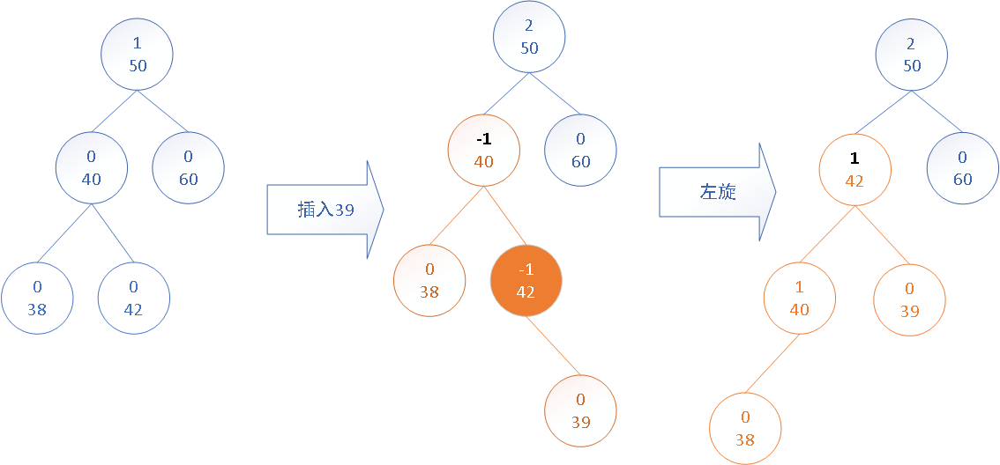

# 1. 二叉排序树（查找树，搜索树）

## 1.1 二叉查找树的定义

什么是二叉查找树呢？它是具有以下性质的二叉树（关于二叉树请看我关于[二叉树定义](%E6%A0%91%2B%E5%9F%BA%E7%A1%80%E4%BA%8C%E5%8F%89%E6%A0%91%E8%AF%A6%E8%A7%A3.md)的内容）:

* 若它的左子树不为空，那么它的左子树上的所有结点的值都小于它的根结点的值
* 若它的右子树不为空，那么它的右子树上的所有结点的值都大于（现在实际索引的算法设计中是 >=）它的根结点的值
* 他的左右子树是二叉查找树
* 它属于一种**动态**查找表

注意：在实际运用中，这个值的比较的大小是看你怎么定义的，当然数值的大小是通用的（不排除你对其特殊的定义）

如图：


## 1.2 二叉查找树具有的一些特点

* 使用中序遍历得到的结果是排好序的，比如上图，使用中序遍历的结果一定是递增的顺序排列

* 一个结点的直接前驱（中序遍历后的结果序列中这个结点值的前面一个，比如上图，中序遍历结果`15,17,18,19,21,40,56,60,68,100`,21这个结点的直接前驱就是19这个结点。）

  * **如果这个结点在树中有左子树，先转左，然后找右到尽头，一定是它的前驱，如果转左之后没有右，那这个左就是他的前驱**

  * **如果该结点是一个左叶子结点，但是这个结点没有左子树，这时候如果他的parent是右子树那么该结点的parent的parent就是他的前驱，如果是parent是左子树，那么处理就很复杂了，需要在网parent的parent的parent一层层向上找，相当麻烦**,（这个比较好理解，因为该结点的parent肯定比它大，如果这时候它的patent是parent的parent的右子树，也就是parent,parent小于parent,那就刚好parent的parent是他的前驱）

  * **如果该结点是一个右叶子结点，但是这个结点没有左子树，那么他的parent结点就是他的前驱**

    例子：

    * 还是上图的例子21这个结点有左子树吧，转左到15，然后找右到尽头，18，19，最后就找到了19；

    * 在看18这个结点由左子树，我们转左找到17，但是由于没有右子树了，所以这个17就是18的直接前驱;
    * 56这个结点是一个右子树，没有左子树，那么他的前驱就是他的parent结点，也就是40

* 一个结点的直接后继：知道了直接前驱，那么直接后继就不需要过多说明了，和直接前驱的正好相反。

**介绍直接前驱后继这个特点主要是因为，删除这个操作的算法设计要用到这样一个特点**

## 1.3 二叉查找树的查找过程

**注意**：我们知道它是一种动态查找表，也就是说这个树中的结点是可以增改的。那么它的增删改的过程肯定也是会查找这个动作。

**当一个二叉查找树不为空的时候，如有一个给定值A和根结点的关键字作比较，若想等那么查找成功，否则根据A与当前根结点关键字的大小关系决定去左子树还是右子树进行查找。**

**通常我们使用二叉链表来作为二叉搜索树的存储结构**

## 1.4 优缺点

* 优点：

  * 从他的一个定义以及查找过程，能很容易的看出来，它也是一种二分搜索的实现，不过相比于顺序查找表，的结构以及访问方式它的优势就很大了，就算顺序表使用了二分查找，斐波那契查找，插值查找，也是比不了二分搜索树的查找效率的，但是这里不是说它就是最好的查找表，当然顺着发展，我们有了更多更好用，更加符合我们当前需求的查找结构，但是这个是基础，他可以帮助我们理解后面的发展出来的更好的用于查找的数据结构。
  * **二叉查找树使用中序遍历，是可以拿到一个排序好的的序列的。红黑树也有这样的性质（但是他对基础的这个二叉排序树的设计做了进一步改进），左子树比根结点小，右子树比根结点大。相信从这里你能看出，java中TreeMap是怎么排序的了**

* 缺点：这里有一个国外的数据结构的学习，了解网站，[Binary Search Tree](https://www.cs.usfca.edu/~galles/visualization/BST.html) 我在上面做了一下模拟，基于上文中的二叉排序树的图的内容，按照不同顺序插入：

  * `40,15,21,19,18，17`：进行到这我就没有在进行下去了，原因呢看图：

    

    我们在看我们原来的图深度是5，这里你会说，深度代表什么，那么我们用一个直观的例子来说 : 在原来的图的二叉搜索树中我们要查找17这个值，我们只需要经过5次判断，就可以确定这个值存在；在现在这个结构中呢，需要6次；这样我们就能只管的看出，二叉排序树的缺点了吧，**表中数据动态变化不可控，相同的数据按照不同的顺序传入，得到的结果大不相同，在现在的存储系统中大量用到索引，如果选择这样的结构的，绝对会成为检索的性能瓶颈**；

    比如同样的数据：2,3,5,6,7,8，会因为插入顺序的不同得到的结果，很明显同样的数据由于插入顺序不同导致了得到的树的深度完全不同，深度越深意味着我们的查询费的时间越多，因为这样的问题，所以出现了平衡二叉树，也就是在插入数据的时候去做平衡，得到深度最优的二叉树。

    * 6，3，2，5，7，8的顺序查询得到下面这样的一颗二叉查找树

      
  
    * 2，3，5，7，6，8 得到的是下面这颗树
    
      
    
    
  
  **总结**：针对二叉排序树这样的缺点，人们就想到了在构造他的时候要去做 **“平衡化”处理** ，这也就有了平衡二叉树的定义，在本文第2节，我会介绍平衡二叉树，以及对二叉排序树进行平衡化处理得到的**平衡二叉排序（查找，搜索）树**

## 1.5 二叉查找树的增删

增（insert）就不用说了吧，利用查找去做先查树中是否存在，存在就不插入，然后没有别的特别的东西

这里主要说一下删(delete),为什么要说这个呢，是因为需要介绍在删除之后，**要保持二叉排序树的中序遍历的结果中结点的前后顺序不变**（**这里就叫做稳定性了，后文中我都把它叫做稳点性**）。

分下面三种情况讨论：（P代表双亲结点，PL代表它的左子树，PR代表它的右子树）

* 若结点 P 为叶子结点，删除叶子结点不破坏整个树的结构

* 若结点 P 只有左子树PL或者只有右子树PR，只需要将P的双亲结点指向P的指针指向PL或PR。

* 若左右子树不为空为了保证 “ 稳定性 ”，可以有两种做法，为了更加直观我们用一个树来演示：

  

  **中序遍历的结果：`29,35,36,37,47,49,51,56,58,62,73,88,99`**

  **假设这里我们要删除47**

  **注意观察树的深度变化**

  * 第一种是将P的双亲结点指向P的指针指向PL，将PR作为P的直接前驱的PR，结果：

    

    

    **树的深度是6**

  * 第二种做法是，令该结点P的直接前驱（或直接后继）替代P的位置，（查找直接前驱和后记的方法在上文1.2节当中有介绍），然后用这个直接前驱（直接后继）的双亲结点序接这个直接前驱（直接后继）的左子树（右子树），下面我分别给出用 前驱或后继 得到的结果图

    * 使用前驱得到的结果图

      

    * 使用后继得到的结果图

    

    **使用前驱（后继）两种方法修改的后二叉树的深度要么不变，要么减少（都会达到这样的效果）,显而易见，我们在实现的使用应该选择前驱（后继）的方式实现算法**

## 1.6 java 实现的删除树中一个结点的算法

* 使用前驱的算法：

  ```java
  public static BinaryLinkedNode delete(BinaryLinkedNode node) {
      BinaryLinkedNode temp = node;
      if (node.right == null) {
          // 右子树为空，只需要接上左子树
          node = node.left;
      } else if (node.left == null) {
          // 左子树为空，只需要接上右子树
          node = node.right;
      } else {
          // 左右子树都不为空
          BinaryLinkedNode pre = node.left;// 左转
          while (pre.right != null) {
              // 找右刀到尽头
              temp = pre;//用来记录 pre 的双亲
              pre = pre.right;
          }
          // 替换数据
          node.value = pre.value;
          if( temp == node ){
              // 就是说 左转之后由于没有右子树，那么左转的结点就是node的前驱了，那么只需要接上 pre 的左子树（可能有，也可能没有）
              temp.left = pre.left;
          }else{
              // 就是说 找右边到尽头之后，这个 pre 肯定没有右子树了，至于左子树有没有不知道但是，按照有来做
              temp.right = pre.left;
          }
      }
  }
  ```


* 使用后继的算法：

  ```java
  public static BinaryLinkedNode delete(BinaryLinkedNode node) {
      BinaryLinkedNode temp = node;
      if (node.right == null) {
          // 右子树为空，只需要接上左子树
          node = node.left;
      } else if (node.left == null) {
          // 左子树为空，只需要接上右子树
          node = node.right;
      } else {
          // 左右子树都不为空
          BinaryLinkedNode pre = node.right;// 右转
          while (pre.left != null) {
              // 找左到尽头
              temp = pre;//用来记录 pre 的双亲
              pre = pre.left;
          }
          // 替换数据
          node.value = pre.value;
          if( temp == node ){
              // 就是说 右转之后由于没有左子树，那么右转的结点就是node的后继了，那么只需要接上 pre 的右子树（可能有，也可能没有）
              temp.right = pre.right;
          }else{
              // 就是说 找左到尽头之后，这个 pre 肯定没有左子树了，至于右子树有没有不知道但是，按照有来做
              temp.left = pre.right;
          }
      }
  }
  ```

# 2 平衡二叉查找（排序，搜索）树

## 2.1 平衡二叉树

平衡二叉树出现的原因，我在1.4节最后的总结里面做了介绍，这里不在重复说明。我们直接看平衡二叉树的定义：

* 它的左右子树都是平衡二叉树
* 左子树和右子树的深度之差的绝对值绝对值不超过1

## 2.2 平衡二叉树的平衡因子

* **一个结点的平衡因子 = 该结点左子树深度 - 该结点的右子树深度**
* **那么平衡二叉树的所有结点的平衡因子取值只能是（-1，0，1），不再这范围，那就说明该二叉树失衡**

## 2.3 利用平衡因子画出来的二叉树的树图

* 平衡二叉树的平衡因子树图：

  

  

* 非平衡二叉树的平衡因子树图：

  

## 2.4 平衡二叉查找树的插入过程

### 2.4.1 平衡过程

我这我先介绍他用于平衡的旋转过程，然后再用一个实际的例子加上，图，算法，来说明。

我们在平衡二叉查找树的插入过程中，基本的插入和二叉查找树的插入一样的，主要需要做的是” 平衡化“处理，如何在插入一个结点，导致一个树失衡的情况下进行”平衡化“，**首先我们知道，我们做这个平衡只需要针对失衡的子树就可以了**，在知道这个的前提下，我们怎么去平衡子树呢，**调整的规律可以归纳为下面两类四种情况。**

**针对插入到左子树的：**

#### 右旋

* **单向右旋平衡**：由于在结点 P 的左子树为根结点的左子树上插入结点，导致了结点P失衡，平衡因子变为了2，那么我们需要经过一次右旋来使得以P为root的二叉树恢复平衡。

  **右旋就是，将失衡的树的 root结点，以他的左子树为中心，顺时针旋转，作为他的左子树的右子树，同时这个原root结点的左子树 指向它原左子树的右子树。**

  那么我们现在用图来解释：

  

  

  **可以看到，这个最终平衡化之后的树的深度和没有插入35这个结点之前的树的深度是一样的**

#### 先左旋后右旋

* **双向旋转（先左后右）**：由于在结点 P 的左子树为根结点的右子树上插入结点，导致了结点P失衡，平衡因子变为了2，那么我们需要经过两次旋转（先左旋再右旋）来使得以P为root的二叉树恢复平衡。

  **将失衡的树的 root 结点，先将root的左子树进行左旋操作（不知道什么是左旋，那就先看下面的左旋操作，然后在回来看这部分），然后在对root为根结点的树进行右旋。**

  直接看图吧




**可以看到，这个最终平衡化之后的树的深度和没有插入39这个结点之前的树的深度是一样的**

**针对插入到右子树的：**

#### 左旋

* **单向左旋平衡**：由于在结点 P 的右子树为根结点的右子树上插入结点，导致了结点P失衡，平衡因子变为了-2，那么我们需要经过一次左旋来使得以P为root的二叉树恢复平衡。那么我们现在用图来解释

  **左旋就是，将失衡的树的 root 结点，以他的右子树为中心，逆时针旋转，作为他的右子树的左子树，同时这个原root结点的右子树 指向它原右子树的左子树。**

  那么我们现在用图来解释：

  

  **可以看到，这个最终平衡化之后的树的深度和没有插入68这个结点之前的树的深度是一样的**

#### 先右旋后左旋

* **双向旋转（先右后左）**：由于在结点 P 的右子树为根结点的左子树上插入结点，导致了结点P失衡，平衡因子变为了-2，那么我们需要经过两次旋转（先右旋再左旋）来使得以P为root的二叉树恢复平衡。

  **将失衡的树的 root 结点，先将root的右子树进行右旋操作，然后在对root为根结点的树进行左旋。**

  那么我们现在用图来解释：	

  

  

**可以看到，这个最终平衡化之后的树的深度和没有插入39这个结点之前的树的深度是一样的**

### 2.4.2 平衡二叉查找树的上插入元素的递归算法描述

平衡二叉树 叫做BBST (Balanced Binary Sort Tree ) 

1. 若BBST是空树，则插入一个元素为e的新结点作为BBST的根结点，树的深度为1

2. 数据结构这本书中定义的是，若e的关键字和BBST的中的根结点（这个根结点不要只是看作整棵树的跟结点，应该看作树内的结点）结点相同则不插入。**这里我们在实际过程中大多都不会这样做，`>=`的走向都是右，请看第四条**

3. 若e的关键字小于BBST的根结点（从根结点开始，所走路劲的一个个结点都算是根结点，由于这是一个递归的设计，所以这里称为根结点）的关键字。则将e插入在BBST的左子树上，并且插入之后左子树的深度增加（+1）时，需要分下面这几种情况：
   * BBST的根结点的平衡因子为 - 1 (右子树深度大于左子树深度1)，则只需要将根结点的平衡因子改为0，BBST深度不变

     如图：

     

   * BBST的根结点的平衡因子为 0 (右子树深度等于左子树深度)，则只需要将根结点的平衡因子改为1，BBST深度增加1.

     如图：

     

   * BBST的根结点的平衡因子为 1 (左子树深度等于右子树深度1)：

     * 若BBST 的根结点 P 的左子树的根结点PL 的平衡因子在插入结点后变为1，进行右旋处理，并将根结点P，和他的左子树PL 的平衡因子改为 0。树的深度不变

       如图

       

       **上图 中间 的 图 38 的平衡因子 就是“1”，因为在 递归算法中，他不会变成2，而是在平衡处理的时候直接修改为了0，后面的算法时间中，你们会看到**

     * 若BBST 的根结点的左子树的根结点的平衡因子在插入结点后变为-1，先左后右，如图

       	

       **实际算法中，平衡因子在旋转之前就修改好了**

   4.若e的关键字大于等于BBST的根结点（从根结点开始，所走路劲的一个个结点都算是根结点，由于这是一个递归的设计，所以这里称为根结点）的关键字。则将e插入在BBST的右子树上，并且插入之后右子树的深度增加（+1）时，需要分下面这几种情况：情况正好和上面的过程相反

   - BBST的根结点的平衡因子为 1 (左子树深度大于右子树深度1)，则只需要将根结点的平衡因子改为0，BBST深度不变

     如图：

     

   - BBST的根结点的平衡因子为 0 (右子树深度等于左子树深度)，则只需要将根结点的平衡因子改为1，BBST深度增加1.

     如图：
     
      

​			

   - BBST的根结点的平衡因子为 -1 (左子树深度等于右子树深度1)：

     - 若BBST 的根结点 P 的右子树的根结点PR的平衡因子在插入结点后变为-1，进行左旋处理，并将根结点P，和他的右子树PR 的平衡因子改为 0。树的深度不变

       如图

       

     - 若BBST 的根结点的右子树的根结点的平衡因子在插入结点后变为1，先右后做，如图

       

       

### 2.4.3 平衡二叉查找树，插入算法实现

树结点类定义：

```java
public class TreeNode<T> {
    private int height;
    T data;
    TreeNode<T> leftChind;
    TreeNode<T> rightChind;
    int balance_factor;// 平衡因子

    public TreeNode() {
    }

    public TreeNode(T data) {
        this.data = data;
    }

    public void incrementHeught(){
        this.height++;
    }
    public void decrementHeught(){
        this.height--;
    }

    public T getData() {
        return data;
    }

    public void setData(T data) {
        this.data = data;
    }

    public TreeNode<T> getLeftChind() {
        return leftChind;
    }

    public void setLeftChind(TreeNode<T> leftChind) {
        this.leftChind = leftChind;
    }

    public TreeNode<T> getRightChind() {
        return rightChind;
    }

    public void setRightChind(TreeNode<T> rightChind) {
        this.rightChind = rightChind;
    }

    public int getBalance_factor() {
        return balance_factor;
    }

    public void setBalance_factor(int balance_factor) {
        this.balance_factor = balance_factor;
    }
}
```

树的定义：

由于这里只是写一个算法逻辑，所以方法内存在一些if else 多层嵌套没有做处理，有兴趣的可以自己处理一下

```java
package com.stu.binarytree.BalancebinaryTree;

import com.stu.binarytree.BinaryLinkedNode;
import javafx.scene.transform.Rotate;
import org.apache.zookeeper.Op;

import java.util.LinkedList;

public class BalanceBinaryTree<T extends Comparable> {

    private TreeNode<T> root;
    private int size;// 树中的元素数量
    static int LH = 1;// 左边高
    static int EH = 0;// 等高
    static int RH = -1;// 右边高

    // 用于插入过程中标识树是否长高了
    private boolean taller = false;

    public void insert(T e) {
        size++;
        if (root == null) {
            root = new TreeNode<>(e);
            root.balance_factor = EH;
//            root.incrementHeught();//高度增加
        } else {
            insertAVL(root, e, null);
        }
    }

    /**
     * @param node 树的根结点
     * @param e    插入的元素
     * @return 插入是否成功
     */
    private boolean insertAVL(TreeNode<T> node, T e, TreeNode<T> parent) {

        if (node == null) {
            // 如果树为空 插入新结点
            node = new TreeNode<>(e);
            node.balance_factor = EH;
//            node.incrementHeught();//高度增加
            if (e.compareTo(parent.data) < 0) {
                parent.leftChind = node;
            } else {
                parent.rightChind = node;
            }
            taller = true;
        } else {
            if (e.compareTo(node.data) < 0) {
                // 针对左子树的操作
                if (!insertAVL(node.leftChind, e, node)) {
                    return false;
                }
                // 插入成功变高了
                if (taller) {
                    if (node.balance_factor == LH) {
                        node = LeftBalance(node);
                        if (parent != null) {
                            if (e.compareTo(parent.data) < 0) {
                                parent.leftChind = node;
                            } else {
                                parent.rightChind = node;
                            }
                        } else {
                            root = node;
                        }
                        taller = false;
                    } else if (node.balance_factor == EH) {
                        node.balance_factor = LH;
                        taller = true;
//                        node.incrementHeught();
                    } else {
                        node.balance_factor = EH;
                        taller = false;
                    }
                }

            } else {
                // 针对右子树的操作
                if (!insertAVL(node.rightChind, e, node)) {
                    return false;
                }
                // 插入成功变高了
                if (taller) {
                    if (node.balance_factor == LH) {
                        node.balance_factor = EH;
                        taller = false;
                    } else if (node.balance_factor == EH) {
                        node.balance_factor = RH;
                        taller = true;
//                        node.incrementHeught();
                    } else {
                        node = rightBalance(node);
                        if (parent != null) {
                            if (e.compareTo(parent.data) < 0) {
                                parent.leftChind = node;
                            } else {
                                parent.rightChind = node;
                            }
                        } else {
                            root = node;
                        }
                        taller = false;
                    }
                }
            }
        }
        return true;
    }


    /**
     * 右旋方法
     *
     * @param p 指向带旋树的根结点的引用
     */
    TreeNode r_roate(TreeNode p) {
//        p.decrementHeught();// 高度减少
        // 旋转中心,左子树的根结点
        TreeNode lc = p.leftChind;
        p.leftChind = lc.rightChind;
        lc.rightChind = p;
        return lc;
    }

    /**
     * 右旋方法
     *
     * @param p 带旋树的根结点
     */
    TreeNode l_roate(TreeNode p) {
//        p.decrementHeught();// 高度减少
        // 旋转中心,右子树的根结点
        TreeNode rc = p.rightChind;
        p.rightChind = rc.leftChind;
        rc.leftChind = p;
        return rc;
    }

    /**
     * 为t所指结点为根结点的二叉树，做左平衡处理
     */
    TreeNode LeftBalance(TreeNode<T> t) {
        // 检查左子树的平衡因子，根据条件做平衡处理
        TreeNode lc = t.leftChind;
        TreeNode p = t;
        if (lc.balance_factor == LH) {
            // 做右旋处理
            p = r_roate(t);
        } else if (lc.balance_factor == RH) {
            // 左旋
            t.leftChind = l_roate(t.leftChind);
            // 右旋
            p = r_roate(t);
        }
        // 设置 树的根结点 t 和 左子树的根结点 lc 平衡因子为0
        t.balance_factor = lc.balance_factor = EH;
        return p;
    }

    /**
     * 为t所指结点为根结点的二叉树，做右平衡处理
     *
     * @param t 待做左平衡处理的树的根结点的引用
     */
    TreeNode rightBalance(TreeNode t) {
        // 检查左子树的平衡因子，根据条件做平衡处理
        TreeNode rc = t.rightChind;
        TreeNode p = t;
        if (rc.balance_factor == RH) {
            // 做左旋处理
            p = l_roate(t);
        } else if (rc.balance_factor == LH) {
            // 右旋
            t.rightChind = r_roate(t.rightChind);
            // 左旋
            p = l_roate(t);
        }
        // 设置 树的根结点 t 和 左子树的根结点 lc 平衡因子为0
        t.balance_factor = rc.balance_factor = EH;
        return p;
    }

    /**
     * 层序遍历
     */
    public void levelOrderTraverse() {
        // 这里我们使用队列，存储需要输出的结点
        LinkedList<TreeNode> queue = new LinkedList<>();
        TreeNode<T> p = root;
        queue.add(p);// 第一层入队
        while (!queue.isEmpty()) {
            p = queue.remove();
            print(p);
            if (p.leftChind != null) {
                queue.add(p.leftChind);
            }
            if (p.rightChind != null) {
                queue.add(p.rightChind);
            }
        }
    }

    /**
     * 递归中序遍历
     */
    public void recursionInOrderTraverse() {
        recursionInOrderTraverse(root);
    }

    /**
     * 递归中序遍历
     */
    private void recursionInOrderTraverse(TreeNode root) {
        if (root != null) {
            recursionInOrderTraverse(root.leftChind);
            print(root);
            recursionInOrderTraverse(root.rightChind);
        }
    }

    private static void print(TreeNode v) {
        System.out.print(" " + v.data + " ");
    }
}
```

测试类

```java
public class Demo {
    public static void main(String[] args) {
        BalanceBinaryTree<Integer> integerBalanceBinaryTree = new BalanceBinaryTree<>();
        //生成树随机数
        Random random = new Random();
        for (int i = 0; i < 30; i++) {
            int num = random.nextInt(300);
            System.out.print(num+"  ");// 输出插入了那些数
            integerBalanceBinaryTree.insert(num);
        }
        System.out.println();

        System.out.println("层序遍历");
        integerBalanceBinaryTree.levelOrderTraverse();
        System.out.println();
        System.out.println("中序遍历");
        integerBalanceBinaryTree.recursionInOrderTraverse();
    }
}
```

## 2.5 总结

1. **平衡二叉树的性能优势**： 很显然，平衡二叉树的优势在于不会出现普通二叉查找树的最差情况。其查找的时间复杂度为O(logN)。 

2. **平衡二叉树的缺陷**：

   * 很遗憾的是，为了保证高度平衡，动态插入和删除的代价也随之增加。**红黑树**是对它的一个优化，通过相对平衡减少平衡的消耗，提供较高效的查找结构。

   * 在大数据量查找环境下(比如说系统磁盘里的文件目录，数据库中的记录查询 等)所有的二叉查找树结构(AVL、RBT)都不合适，问什么呢？首先我们需要知道下面的概念： 

     * 在文件系统中，我们的索引需要存储起来，最后肯定要在硬盘中存储，而对磁盘的访问是需要做 I/O 操作的，那么你想每一次对树的结点的访问，都是需要去磁盘上读取数据的
     * 我们知道所有二叉查找树结构的查找代价都与树高是紧密相关的,高度为h的树中我们去做查找，最坏情况需要h次访问

     知道了上面的概念之后，我们再来看我们的 AVL(BET)（平衡二叉排序树），和RBT（红黑树）：

     首先他们都是二叉树，他们的结点只能存放一个key,这就意味着，我们如果存放 2[10]-1的数据，就算是BST结构的树在最好的情况下也需要10层，也就是树的深度为10，检索的时候，最少要经过10个结点，也就是说要经过10次I/O，实际的文件系统需要存储的数据更是上G的，你想想树的深度会膨胀到什么层度。

     那我们怎减少这个I/O的次数呢（再次减少树的深度），这样就有了我们后来的**多路查找树（B-Tree,B+Tree,  ...）**的结构来做到这一点。 

   **当然在一些小数据量的时候还是可以使用RBT(红黑树的)，比如java中 TreeMap, HashMap,都有使用这样的结构。**

**上面提到的红黑树和多路查找树都是属于深度有界查找树（depth-bounded tree —DBT）** 

# 3. 红黑树

https://zhuanlan.zhihu.com/p/139907457

## 3.1 红黑树的定义

它是一种含有红黑结点并能自平衡的二叉查找树

1. 每个结点或者是黑色，或者是红色。 
2. 根结点是黑色。 
3. 每个叶子结点（NIL）是黑色。 [注意：这里叶子结点，是指为空的叶子结点！] 
4. 如果一个结点是红色的，则它的子结点必须是黑色的。 
5. 从一个结点到该结点的子孙结点的所有路径上包含相同数目的黑结点。 

从性质 5 可以推导出

   5.1 如果一个结点存在黑子结点，那么该结点肯定有两个子结点

图1就是一颗简单的红黑树。其中Nil为叶子结点，并且它是黑色的。(值得提醒注意的是，在Java中，叶子结点是为null的结点。)


红黑树并不是一个*完美*平衡二叉查找树，从图1可以看到，根结点P的左子树显然比右子树高（差距>1了），但左子树和右子树的黑结点的层数是相等的，也即任意一个结点到到每个叶子结点的路径都包含数量相同的黑结点(性质5)。所以我们叫红黑树这种平衡为**黑色完美平衡**。

介绍到此，为了后面讲解不至于混淆，我们还需要来约定下红黑树一些结点的叫法，如图2所示。


**前面讲到红黑树能自平衡，它靠的是什么？ 旋转以及变色** 

1. **[左旋](#左旋)** **左旋**只影响旋转结点(该结点是需要旋转的这个树的根结点，并不是旋转时候的中心结点)和其**右子树**的结构，把右子树的结点往左子树挪了。
2. **[右旋](#右旋)**:**右旋**只影响旋转结点(该结点是需要旋转的这个树的根结点，并不是旋转时候的中心结点)和其**左子树**的结构，把左子树的结点往右子树挪了。
3. **变色**: 结点的颜色由红变黑或由黑变红

**由于旋转存在结点挪动，那么为了保持红黑树的性质，就需要配合变色达到自平衡。**

#### 红黑树查找

因为红黑树是一颗二叉平衡树，并且查找不会破坏树的平衡，所以查找跟二叉平衡树的查找无异：

1. 从根结点开始查找，把根结点设置为当前结点；
2. 若当前结点为空，返回null；
3. 若当前结点不为空，用当前结点的key跟查找key作比较；
4. 若当前结点key等于查找key，那么该key就是查找目标，返回当前结点；
5. 若当前结点key大于查找key，把当前结点的左子结点设置为当前结点，重复步骤2；
6. 若当前结点key小于查找key，把当前结点的右子结点设置为当前结点，重复步骤2；

如图5所示。


​																		图5 二叉树查找流程图

非常简单，但简单不代表它效率不好。正由于红黑树总保持黑色完美平衡，所以它的查找最坏时间复杂度为O(2lgN)，也即整颗树刚好红黑相隔的时候。能有这么好的查找效率得益于红黑树自平衡的特性，而这背后的付出，红黑树的插入操作功不可没～

------

#### 红黑树插入

插入操作包括两部分工作：一查找插入的位置；二插入后自平衡。查找插入的父结点很简单，跟查找操作区别不大：

1. 从根结点开始查找；
2. 若根结点为空，那么插入结点作为根结点，结束。
3. 若根结点不为空，那么把根结点作为当前结点；
4. 若当前结点为null，返回当前结点的父结点，结束。
5. 若当前结点key等于查找key，那么该key所在结点就是插入结点，更新结点的值，结束。
6. 若当前结点key大于查找key，把当前结点的左子结点设置为当前结点，重复步骤4；
7. 若当前结点key小于查找key，把当前结点的右子结点设置为当前结点，重复步骤4；

如图6所示。


​																图6 红黑树插入位置查找

ok，插入位置已经找到，把插入结点放到正确的位置就可以啦，但插入结点是应该是什么颜色呢？答案是**红色**。理由很简单，红色在父结点（如果存在）为黑色结点时，红黑树的黑色平衡没被破坏，不需要做自平衡操作。但如果插入结点是黑色，那么插入位置所在的子树黑色结点总是多1，必须做自平衡。

所有插入情景如图7所示。


​																			图7 红黑树插入情景

嗯，插入情景很多呢，8种插入情景！但情景1、2和3的处理很简单，而情景4.2和情景4.3只是方向反转而已，懂得了一种情景就能推出另外一种情景，所以总体来看，并不复杂，后续我们将一个一个情景来看，把它彻底搞懂。

另外，根据二叉树的性质，**除了情景2，所有插入操作都是在叶子结点进行的**。这点应该不难理解，因为查找插入位置时，我们就是在找子结点为空的父结点的。

在开始每个情景的讲解前，我们还是先来约定下，如图8所示。


​																		图8 插入操作结点的叫法约定

图8的字母并不代表结点Key的大小。I表示插入结点，P表示插入结点的父结点，S表示插入结点的叔叔结点，PP表示插入结点的祖父结点。

好了，下面让我们一个一个来分析每个插入的情景以其处理。

##### 插入情景1：红黑树为空树

最简单的一种情景，直接把插入结点作为根结点就行，但注意，根据红黑树性质2：根结点是黑色。还需要把插入结点设为黑色。

**处理：把插入结点作为根结点，并把结点设置为黑色**。

##### 插入情景2：插入结点的Key已存在

插入结点的Key已存在，既然红黑树总保持平衡，在插入前红黑树已经是平衡的，那么把插入结点设置为将要替代结点的颜色，再把结点的值更新就完成插入。

**处理：**

- **把I设为当前结点的颜色**
- **更新当前结点的值为插入结点的值**

##### 插入情景3：插入结点的父结点为黑结点

由于插入的结点是红色的，当插入结点的黑色时，并不会影响红黑树的平衡，直接插入即可，无需做自平衡。

**处理：直接插入**。

##### 插入情景4：插入结点的父结点为红结点

再次回想下红黑树的性质2：根结点是黑色。**如果插入的父结点为红结点，那么该父结点不可能为根结点，所以插入结点总是存在祖父结点**。这点很重要，因为后续的旋转操作肯定需要祖父结点的参与。

情景4又分为很多子情景，下面将进入重点部分，各位看官请留神了。

**插入情景4.1：叔叔结点存在并且为红结点**
 从红黑树性质4可以，祖父结点肯定为黑结点，因为不可以同时存在两个相连的红结点。那么此时该插入子树的红黑层数的情况是：黑红红。显然最简单的处理方式是把其改为：红黑红。如图9和图10所示。

**处理：**

- **将P和S设置为黑色**
- **将PP设置为红色**
- **把PP设置为当前插入结点**


​																					图9 插入情景4.1_1


​																					图10 插入情景4.1_2

可以看到，我们把PP结点设为红色了，如果PP的父结点是黑色，那么无需再做任何处理；但如果PP的父结点是红色，根据性质4，此时红黑树已不平衡了，所以还需要把PP当作新的插入结点，继续做插入操作自平衡处理，直到平衡为止。

试想下PP刚好为根结点时，那么根据性质2，我们必须把PP重新设为黑色，那么树的红黑结构变为：黑黑红。换句话说，从根结点到叶子结点的路径中，黑色结点增加了。**这也是唯一一种会增加红黑树黑色结点层数的插入情景**。

我们还可以总结出另外一个经验：**红黑树的生长是自底向上的**。这点不同于普通的二叉查找树，普通的二叉查找树的生长是自顶向下的。

**插入情景4.2：叔叔结点不存在或为黑结点，并且插入结点的父亲结点是祖父结点的左子结点**
 单纯从插入前来看，也即不算情景4.1自底向上处理时的情况，叔叔结点非红即为叶子结点(Nil)。因为如果叔叔结点为黑结点，而父结点为红结点，那么叔叔结点所在的子树的黑色结点就比父结点所在子树的多了，这不满足红黑树的性质5。后续情景同样如此，不再多做说明了。

前文说了，需要旋转操作时，肯定一边子树的结点多了或少了，需要租或借给另一边。插入显然是多的情况，那么把多的结点租给另一边子树就可以了。

**插入情景4.2.1：插入结点是其父结点的左子结点**
 **处理：**

- **将P设为黑色**
- **将PP设为红色**
- **对PP进行右旋**


​																						图11 插入情景4.2.1

由图11可得，左边两个红结点，右边不存在，那么一边一个刚刚好，并且因为为红色，肯定不会破坏树的平衡。

咦，可以把P设为红色，I和PP设为黑色吗？答案是可以！看过《算法：第4版》的同学可能知道，书中讲解的就是把P设为红色，I和PP设为黑色。但把P设为红色，显然又会出现情景4.1的情况，需要自底向上处理，做多了无谓的操作，既然能自己消化就不要麻烦祖辈们啦～

**插入情景4.2.2：插入结点是其父结点的右子结点**
 这种情景显然可以转换为情景4.2.1，如图12所示，不做过多说明了。

**处理：**

- **对P进行左旋**
- **把P设置为插入结点，得到情景4.2.1**
- **进行情景4.2.1的处理**


​																				图12 插入情景4.2.2

**插入情景4.3：叔叔结点不存在或为黑结点，并且插入结点的父亲结点是祖父结点的右子结点**
 该情景对应情景4.2，只是方向反转，不做过多说明了，直接看图。

**插入情景4.3.1：插入结点是其父结点的右子结点**
 **处理：**

- **将P设为黑色**
- **将PP设为红色**
- **对PP进行左旋**


​																			图13 插入情景4.3.1

**插入情景4.3.2：插入结点是其父结点的左子结点**
 **处理：**

- **对P进行右旋**
- **把P设置为插入结点，得到情景4.3.1**
- **进行情景4.3.1的处理**


​																			图14 插入情景4.3.2

好了，讲完插入的所有情景了。可能又同学会想：上面的情景举例的都是第一次插入而不包含自底向上处理的情况，那么上面所说的情景都适合自底向上的情况吗？答案是肯定的。理由很简单，但每棵子树都能自平衡，那么整棵树最终总是平衡的。好吧，在出个习题，请大家拿出笔和纸画下试试（请务必动手画下，加深印象）：

***习题1：请画出图15的插入自平衡处理过程。\***（答案见文末）


​																							图15 习题1

------

#### 红黑树删除

红黑树插入已经够复杂了，但删除更复杂，也是红黑树最复杂的操作了。但稳住，胜利的曙光就在前面了！

红黑树的删除操作也包括两部分工作：一查找目标结点；而删除后自平衡。查找目标结点显然可以复用查找操作，当不存在目标结点时，忽略本次操作；当存在目标结点时，删除后就得做自平衡处理了。删除了结点后我们还需要找结点来替代删除结点的位置，不然子树跟父辈结点断开了，除非删除结点刚好没子结点，那么就不需要替代。

二叉树删除结点找替代结点有3种情情景：

- 情景1：若删除结点无子结点，直接删除
- 情景2：若删除结点只有一个子结点，用子结点替换删除结点
- 情景3：若删除结点有两个子结点，用后继结点（大于删除结点的最小结点）替换删除结点

补充说明下，情景3的后继结点是大于删除结点的最小结点，也是删除结点的右子树种最左结点。那么可以拿前继结点（删除结点的左子树最右结点）替代吗？可以的。但习惯上大多都是拿后继结点来替代，后文的讲解也是用后继结点来替代。另外告诉大家一种找前继和后继结点的直观的方法（不知为何没人提过，大家都知道？）：**把二叉树所有结点投射在X轴上，所有结点都是从左到右排好序的，所有目标结点的前后结点就是对应前继和后继结点**。如图16所示。


图16 二叉树投射x轴后有序

接下来，讲一个重要的思路：**删除结点被替代后，在不考虑结点的键值的情况下，对于树来说，可以认为删除的是替代结点！**话很苍白，我们看图17。在不看键值对的情况下，图17的红黑树最终结果是删除了Q所在位置的结点！这种思路非常重要，大大简化了后文讲解红黑树删除的情景！


图17 删除结点换位思路

基于此，上面所说的3种二叉树的删除情景可以相互转换并且最终都是转换为情景1！

- 情景2：删除结点用其唯一的子结点替换，子结点替换为删除结点后，可以认为删除的是子结点，若子结点又有两个子结点，那么相当于转换为情景3，一直自顶向下转换，总是能转换为情景1。（对于红黑树来说，根据性质5.1，只存在一个子结点的结点肯定在树末了）
- 情景3：删除结点用后继结点（肯定不存在左结点），如果后继结点有右子结点，那么相当于转换为情景2，否则转为为情景1。

二叉树删除结点情景关系图如图18所示。


图18 二叉树删除情景转换

综上所述，**删除操作删除的结点可以看作删除替代结点，而替代结点最后总是在树末。**有了这结论，我们讨论的删除红黑树的情景就少了很多，因为我们只考虑删除树末结点的情景了。

同样的，我们也是先来总体看下删除操作的所有情景，如图19所示。


图19 红黑树删除情景

哈哈，是的，即使简化了还是有9种情景！但跟插入操作一样，存在左右对称的情景，只是方向变了，没有本质区别。同样的，我们还是来约定下，如图20所示。


图20 删除操作结点的叫法约定

图20的字母并不代表结点Key的大小。R表示替代结点，P表示替代结点的父结点，S表示替代结点的兄弟结点，SL表示兄弟结点的左子结点，SR表示兄弟结点的右子结点。灰色结点表示它可以是红色也可以是黑色。

值得特别提醒的是，**R是即将被替换到删除结点的位置的替代结点，在删除前，它还在原来所在位置参与树的子平衡，平衡后再替换到删除结点的位置，才算删除完成。**

万事具备，我们进入最后的也是最难的讲解。

##### 删除情景1：替换结点是红色结点

我们把替换结点换到了删除结点的位置时，由于替换结点时红色，删除也了不会影响红黑树的平衡，只要把替换结点的颜色设为删除的结点的颜色即可重新平衡。

**处理：颜色变为删除结点的颜色**

##### 删除情景2：替换结点是黑结点

当替换结点是黑色时，我们就不得不进行自平衡处理了。我们必须还得考虑替换结点是其父结点的左子结点还是右子结点，来做不同的旋转操作，使树重新平衡。

**删除情景2.1：替换结点是其父结点的左子结点**
 **删除情景2.1.1：替换结点的兄弟结点是红结点**
 若兄弟结点是红结点，那么根据性质4，兄弟结点的父结点和子结点肯定为黑色，不会有其他子情景，我们按图21处理，得到删除情景2.1.2.3（后续讲解，这里先记住，此时R仍然是替代结点，它的新的兄弟结点SL和兄弟结点的子结点都是黑色）。

**处理：**

- **将S设为黑色**
- **将P设为红色**
- **对P进行左旋，得到情景2.1.2.3**
- **进行情景2.1.2.3的处理**


图21 删除情景2.1.1

**删除情景2.1.2：替换结点的兄弟结点是黑结点**
 当兄弟结点为黑时，其父结点和子结点的具体颜色也无法确定（如果也不考虑自底向上的情况，子结点非红即为叶子结点Nil，Nil结点为黑结点），此时又得考虑多种子情景。

**删除情景2.1.2.1：替换结点的兄弟结点的右子结点是红结点，左子结点任意颜色**
 即将删除的左子树的一个黑色结点，显然左子树的黑色结点少1了，然而右子树又又红色结点，那么我们直接向右子树“借”个红结点来补充黑结点就好啦，此时肯定需要用旋转处理了。如图22所示。

**处理：**

- **将S的颜色设为P的颜色**
- **将P设为黑色**
- **将SR设为黑色**
- **对P进行左旋**


图22 删除情景2.1.2.1

平衡后的图怎么不满足红黑树的性质？前文提醒过，R是即将替换的，它还参与树的自平衡，平衡后再替换到删除结点的位置，所以R最终可以看作是删除的。另外图2.1.2.1是考虑到第一次替换和自底向上处理的情况，如果只考虑第一次替换的情况，根据红黑树性质，SL肯定是红色或为Nil，所以最终结果树是平衡的。如果是自底向上处理的情况，同样，每棵子树都保持平衡状态，最终整棵树肯定是平衡的。后续的情景同理，不做过多说明了。

**删除情景2.1.2.2：替换结点的兄弟结点的右子结点为黑结点，左子结点为红结点**
 兄弟结点所在的子树有红结点，我们总是可以向兄弟子树借个红结点过来，显然该情景可以转换为情景2.1.2.1。图如23所示。

**处理：**

- **将S设为红色**
- **将SL设为黑色**
- **对S进行右旋，得到情景2.1.2.1**
- **进行情景2.1.2.1的处理**


图23 删除情景2.1.2.2

**删除情景2.1.2.3：替换结点的兄弟结点的子结点都为黑结点**
 好了，此次兄弟子树都没红结点“借”了，兄弟帮忙不了，找父母呗，这种情景我们把兄弟结点设为红色，再把父结点当作替代结点，自底向上处理，去找父结点的兄弟结点去“借”。但为什么需要把兄弟结点设为红色呢？显然是为了在P所在的子树中保证平衡（R即将删除，少了一个黑色结点，子树也需要少一个），后续的平衡工作交给父辈们考虑了，还是那句，当每棵子树都保持平衡时，最终整棵总是平衡的。

**处理：**

- **将S设为红色**
- **把P作为新的替换结点**
- **重新进行删除结点情景处理**


图24 情景2.1.2.3

**删除情景2.2：替换结点是其父结点的右子结点**
 好啦，右边的操作也是方向相反，不做过多说明了，相信理解了删除情景2.1后，肯定可以理解2.2。

**删除情景2.2.1：替换结点的兄弟结点是红结点**
 处理：

- **将S设为黑色**
- **将P设为红色**
- **对P进行右旋，得到情景2.2.2.3**
- **进行情景2.2.2.3的处理**


图25 删除情景2.2.1

**删除情景2.2.2：替换结点的兄弟结点是黑结点**
 **删除情景2.2.2.1：替换结点的兄弟结点的左子结点是红结点，右子结点任意颜色**
 **处理：**

- **将S的颜色设为P的颜色**
- **将P设为黑色**
- **将SL设为黑色**
- **对P进行右旋**


图26 删除情景2.2.2.1

**删除情景2.2.2.2：替换结点的兄弟结点的左子结点为黑结点，右子结点为红结点**
 **处理：**

- **将S设为红色**
- **将SR设为黑色**
- **对S进行左旋，得到情景2.2.2.1**
- **进行情景2.2.2.1的处理**


图27 删除情景2.2.2.2

**删除情景2.2.2.3：替换结点的兄弟结点的子结点都为黑结点**
 **处理：**

- **将S设为红色**
- **把P作为新的替换结点**
- **重新进行删除结点情景处理**


图28 删除情景2.2.2.3

综上，红黑树删除后自平衡的处理可以总结为：

1. 自己能搞定的自消化（情景1）
2. 自己不能搞定的叫兄弟帮忙（除了情景1、情景2.1.2.3和情景2.2.2.3）
3. 兄弟都帮忙不了的，通过父母，找远方亲戚（情景2.1.2.3和情景2.2.2.3）

哈哈，是不是跟现实中很像，当我们有困难时，首先先自己解决，自己无力了总兄弟姐妹帮忙，如果连兄弟姐妹都帮不上，再去找远方的亲戚了。这里记忆应该会好记点～

最后再做个习题加深理解（请不熟悉的同学务必动手画下）：

***习题2：请画出图29的删除自平衡处理过程。


习题2

------

### 写在后面

耗时良久，终于写完了～自己加深了红黑树的理解的同时，也希望能帮助大家。如果你之前没学习过红黑树，看完这篇文章后可能还存在很多疑问，如果有疑问可以在评论区写出来，我会尽自己所能解答。另外给大家推荐一个支持红黑树在线生成的网站，来做各种情景梳理很有帮助：[在线生成红黑树](https://links.jianshu.com/go?to=https%3A%2F%2Fsandbox.runjs.cn%2Fshow%2F2nngvn8w)。（删除操作那个把替代结点看作删除结点思路就是我自己在用这个网站时自己顿悟的，我觉得这样讲解更容易理解。）

少了代码是不是觉得有点空虚？哈哈，后续我会写关于Java和HashMap和TreeMap的文章，里面都有红黑树相关的知识。相信看了这篇文章后，再去看Java和HashMap和TreeMap的源码绝对没难度！

最后来看下思考题和习题的答案吧。

------

#### 思考题和习题答案

***思考题1：黑结点可以同时包含一个红子结点和一个黑子结点吗？\***
 答：可以。如下图的F结点：


***习题1：请画出图15的插入自平衡处理过程。\***
 答：


***习题2：请画出图29的删除自平衡处理过程。\***


> 作者：安卓大叔
> 链接：https://www.jianshu.com/p/e136ec79235c
> 来源：简书
> 著作权归作者所有。商业转载请联系作者获得授权，非商业转载请注明出处。

# B树，B+树，B*树谈到R 树

B树，B+树还是看 《数据结构与算法C语言版》这本书，里面有定义，查找，插入，删除的详细讲解

## B树

### **B树的定义：**

一个m阶的B树，或位空树，或为满足以下条件的m叉树：

1. 树中的每个结点至多有m颗子树
2. 若根结点不是叶子结点，则根结点至少有2个子树
3. 除了根之外的所有非终端结点至少有 ceil(m/2) 颗子树，也就是至少有ceil(m/2)-1个关键字
4. 所有的非终端结点中包含下列信息数据

​	（n，A0,K1,A1,K2,A2,........Kn,An）其中Ki =（i = 1,....n）为关键字，且Ki<K(i+1) (i = 1,......n-1) ；

​	Ai（i=1......n）为指向子树根结点的指针，且指针A(i-1) 所指的子树中所有关键字军小雨Ki ,An的所指向的子树中所有结点关键字均大于Kn ( `ceil(m/2)-1 <= n <= m-1 `)

5. 所有叶子结点（null结点）均在同一层

**B数的深度计算（也是计算最坏情况的IO次数）**：一个m阶的B树

根据b树的定义：第一层至少有一个结点，第二层至少有2个结点，由于除了跟之外的非终端结点至少有ceil(m/2) ， 第三层至少有 2*ceil(m/2) 个结点，....... 依次类推，第 l+1 层 2*ceil (m/2)[^l-1] (从第三层开始 2+1层，每增加一层至少增加 ceil(m/e)个结点，第三层  =ceil(m/2) [^2+1 -2] = ceil(m/2)[^1]， 第四层 = ceil(m/2)[^2]

= ceil(m/2)[^3+1-2] ，可以推导出 l+1层（+1是因为去掉根结点） = 2*ceil (m/2)[^l-1] ）

如果一个 具有N个关键字的B树，在其中查到C, C 不属于 B. 那么查找不成功的可能是N+1, 

N+1>= 2*ceil (m/2)[^l-1]  => l <= log(m/2)[^(N+1)/2]+1

### **B树的插入方式：**

由于B树的结点中的关键字个数必须 ceil(m/2)-1 <= n , 所以每次插入是在最底层的非终端结点中添加关键字，然后再处理关键字超过 m-1 的情况是最好的，这时候只需要做”分裂操作“，如果非最下层非终端结点插入关键字处理逻辑会很复杂，所以插入流程是：

1. 通过查找（类似再树中查找结点），找到待插入关键字应该插入的最下层非终端结点

2. 如果插入的非终端结点 p 的关键字个数<m-1 , 那么直接插入即可

3. 如果结点p中已有m-1个结点，当插入关键字之后，由于不满足：除了根结点之外的结点的关键字个数ceil(m/2)<=n<=m-1 的条件，节点p要分裂为 p和p`1` 以及 K`ceil(m/2)`,

   p =  A`0`,K`0` ,.....,K`ceil(m/2)-1,` ,A`ceil(m/2)-1`  ( 0<= n <= ceil(m/2)-1  )

   p`1` = A`ceil(m/2)`,K`0` ,.....,K`ceil(m/2)-1,` ,A`ceil(m/2)-1` ( ceil(m/2)+1<= n <= m  )

   K`ceil(m/2)` (也就是节点中最中间的一个关键字)

   最后将 K`ceil(m/2)` 和 p 插入到它的双亲节点，如果双亲节点插入了新的关键字之后遇到了相同的问题，重新执行第三步中说的到流程

### B树的删除

在B树中删除一个关键字我们首先需要查到这个关键字所在结点；然后判断

* 若该结点是最下层的非终端节点，且其中的关键字大于ceil(m/2)，则直接删除否则需要做“合并操作”
* 如果要删除的关键在所在的结点不在最下层，它的结点是K`i`,那么我们可以在A`i` 指向的子树中，找到它前置结点（A`i`这个子树的中序遍历的第一个结点）将该结点的关键字和K`i`替换，然后就可以将删除问题转换为一个删除最下层非终端节点问题

合并操作：

如果被删除结点所在的结点中的关键字数量 = ceil(m/2)-1，意味着这个结点中删除一个关键字之后，该结点就不符合B树的定义了（结点最少有 ceil(m/2)+1 关键字）， 所以这时候需要向兄弟结点借关键字：这时候分为两种情况：

1. 兄弟结点的关键字够借：

   删除关键字后，这时候如果兄弟结点中的关键字大于 ceil(m/2)+1 ， 如果是向左兄弟借，那么要借左兄弟中最大的关键字k（如果不这样借的话 双亲结点中留下来的关键字就会不满足 Ki 大于A(i-1)的所有关键字，ki<ki+1 这样的条件）借到关键字k之后选择双亲中原关键字中小于k但是最解接近k的关键字，将该关键字移动到被删除关键字的结点中 。同理向右兄弟借：要选右兄弟最小的关键字；借到关键字之后，选择双亲中最大的关键字下移

2. 兄弟结点的关键字不够借：

   删除关键字后，如果它有右兄弟，则将使用它的右兄弟Ai，然后将他的双亲中的Ki放到Ai的结点中

   如果没有它没有右兄弟就找左兄弟，则将使用它的左兄弟Ai，然后将他的双亲中的Ki放到Ai的结点中

   如果双亲结点因为该操作导致不符合定义，则对它的双亲结点重复1，2步骤。

## B+树

结点和B树（B-树）对比：一颗m阶的B+树和m阶的B树相比

* 有n颗子树的结点含有n个关键字（**也就是结点最大的关键字的数量是m , 比B的m-1要大，意味着相同关键字数量的情况下，树的深度<= B树的树的深度**）
* 所有的叶子结点中包含了全部关键字信息，即指向含这些关键字记录的指针，且叶子结点本身按照关键字的大小从小到大顺序链接
* 所有非终端结点可以简单看成是索引，结点中之包含它的子树中的最大（最小）关键字
* 通常B+的非叶子结点只存关键字，不存储数据，所以他的非叶子非叶子结点能容纳更多的结点元素

B+ 通常有**两个头指针，一指向树的根，一个指向最小的叶子结点**，所以它也有两种查询方式

1. 一种是从最小的叶子结点进行的顺序查找
2. 一种是从根结点开始的查询

B+的查找和B树类似的，区别是B+树丛根结点的查询，在非终端结点上如果查询到了给定关键字，并不终止而是继续向下直到叶子结点，因此B+不管查找成功与否都会走一条丛根到叶子的路径；

**结合上面的两点：也引出了B和B+的一个应用区别，如果不需要进行一些范围查询，使用B会更好他不会不断向下查找到叶子结点，所以它的IO次数平局时间复杂度会稍微好一些，但是如果涉及到连续的数据查找B+就有优势了，因为它的叶子结点数据是有顺序的，可以直接利用叶子结点的特性完成该操作，而B需要使用中序遍历完成该功能**

*  **总结就是B+查找更稳定(并不慢)，B平均时间会优于B+，对于范围查找B+只需要最后通过叶子结点就能够很快的查询完成，而B则是需要使用中序遍历**

**叶子结点能够存储的关键字以及数据大小是有限的，超过之后需要分配新的结点，如果查用递增的关键字插入的话只需要在叶子结点后续空间中追加即可，结点内存快不够的时候，新开结点即可。这样每个结点在磁盘存储的数据都是连续的，可以很好的利用到 操作系统的Page cache 功能，但是如果插入的关键字过于随机，就会造成叶（叶子节点）频繁分裂的问题，而且在插入是时候由于过于随机很可能会涉及到一个不在内存（page cache ）中的叶子结点，这时候又会涉及到磁盘io操作，因为顺序插入的话新插入的数据一般都是活跃的数据它更可能在page cache 中已经存在，并且顺序插入降低了叶分裂的频率，性能会提升很多**

*  **总结就是使用b+的时候数据最好是按照关键字递增做插入性能会更好，这也是为什么mysql 的主键索引建议使用递增的id了**

**Mysql的 InnoDB 会使用B+来存储数据，它的主键索引（聚簇索引）还是二级索引最终都会使用 B+ 树来存储数据，其中前者在表中会以 <id, row> 的方式存储，而后者会以 <index, id> 的方式进行存储，后者根据主键找到id后再查找一次,即回表。**

**B*树**

https://zhuanlan.zhihu.com/p/98021010

**是B+树的变体，在B+树的非根和非叶子结点再增加指向兄弟的指针；**


**B*树定义了非叶子结点关键字个数至少为(2/3)*M，即块的最低使用率为2/3**

（代替B+树的1/2）；

**B+树的分裂：**当一个结点满时，分配一个新的结点，并将原结点中1/2的数据

复制到新结点，最后在父结点中增加新结点的指针；B+树的分裂只影响原结点和父

结点，而不会影响兄弟结点，所以它不需要指向兄弟的指针；

**B*树的分裂：**当一个结点满时，如果它的下一个兄弟结点未满，那么将一部分

数据移到兄弟结点中，再在原结点插入关键字，最后修改父结点中兄弟结点的关键字

（因为兄弟结点的关键字范围改变了）；如果兄弟也满了，则在原结点与兄弟结点之

间增加新结点，并各复制1/3的数据到新结点，最后在父结点增加新结点的指针；

**所以，B*树分配新结点的概率比B+树要低，空间使用率更高；**


## B-树,B+树,B*树 总结对比

首先注意：B树就是B-树，"-"是个连字符号，不是减号。
B-树是一种**平衡**的多路**查找(又称排序)**树，在文件系统中有所应用。主要用作文件的索引。**其中的B就表示平衡(Balance)**

**B+树有一个最大的好处，方便扫库，B树必须用中序遍历的方法按序扫库**，而B+树直接从叶子结点挨个扫一遍就完了。

**B+树支持range-query(区间查询)非常方便，而B树不支持**。这是数据库选用B+树的最主要原因。

比如要查 5-10之间的，B+树一把到5这个标记，再一把到10，然后串起来就行了，B树就非常麻烦。B树的好处，就是成功查询特别有利，因为树的高度总体要比B+树矮。不成功的情况下，B树也比B+树稍稍占一点点便宜。

B树的优势是当你要查找的值恰好处在一个非叶子结点时，查找到该结点就会成功并结束查询，而B+树由于非叶结点只是索引部分，这些结点中只含有其子树中的最大(或最小)关键字，当非终端结点上的关键字等于给点值时，查找并不终止，而是继续向下直到叶子结点。因此在B+树中，无论查找成功与否，都是走了一条从根到叶子结点的路径。


有很多基于频率的搜索是选用B树，越频繁query的结点越往根上走，前提是需要对query做统计，而且要对key做一些变化。
**另外B树也好B+树也好，根或者上面几层因为被反复query，所以这几块基本都在内存中，不会出现读磁盘IO，一般已启动的时候，就会主动存入内存。 mysql底层存储是用B+树实现的，因为内存中B+树是没有优势的，但是一到磁盘，B+树的威力就出来了。**


**R树**

https://zhuanlan.zhihu.com/p/62639268

https://www.csdn.net/tags/MtTaEg0sMTA1NjgtYmxvZwO0O0OO0O0O.html
