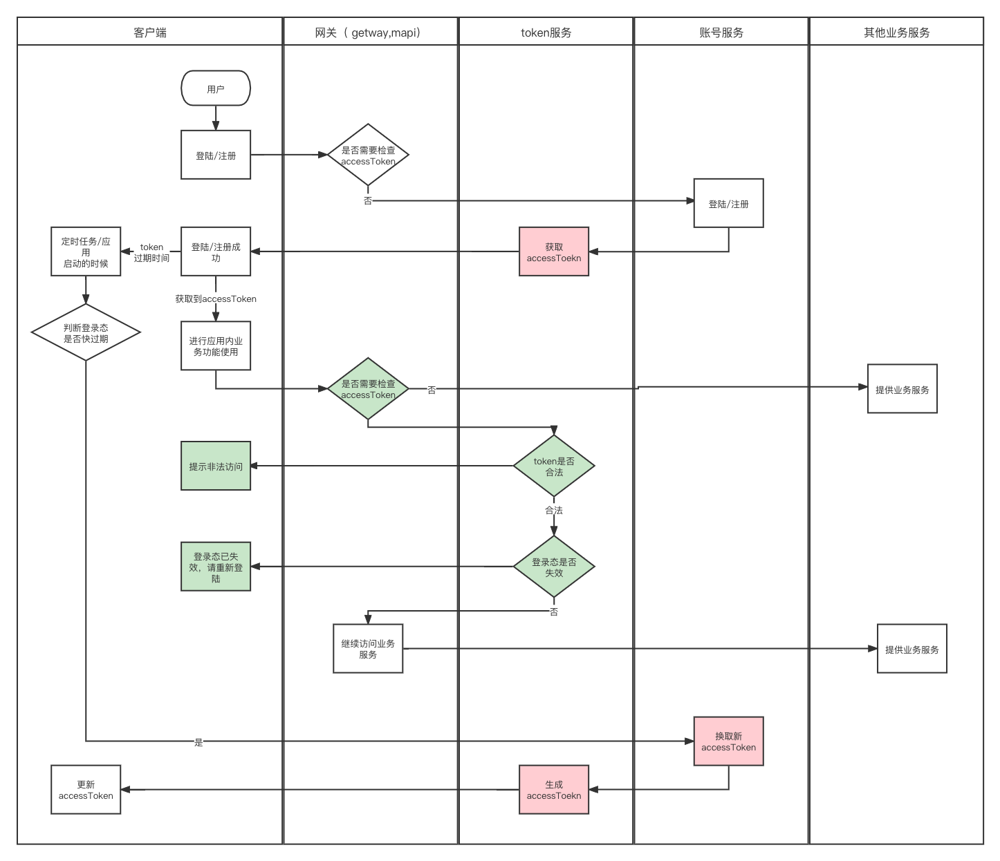
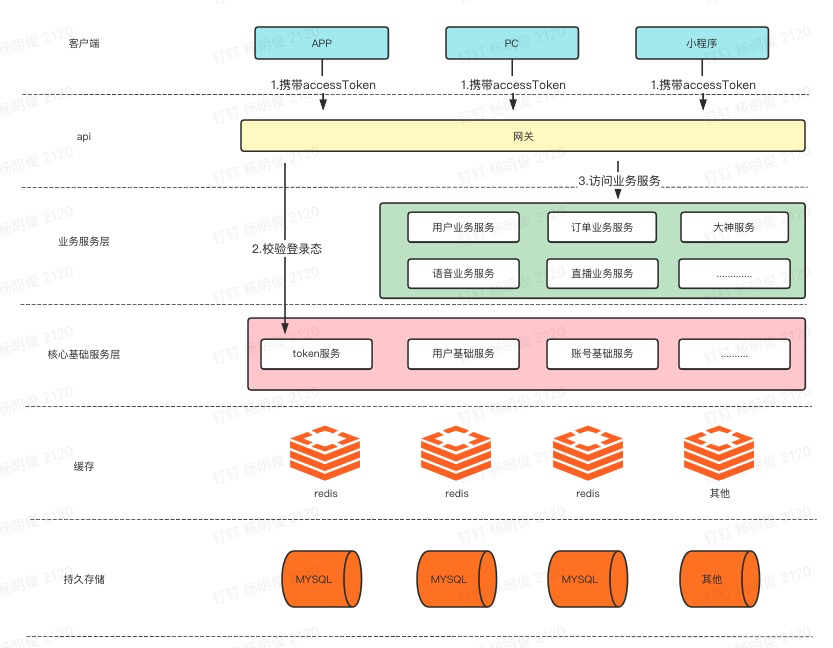
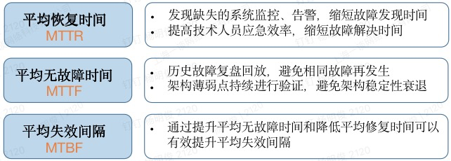

# 账号服务高可用建设实践--登录态服务

## 1. 业务介绍

比心登录态管理服务，也叫做token服务，主要为公司的应用：比心，语音，直播，糖果，电竞，电商，社区..... 提供我们系统内用户的登录态管理能力，其中核心主要是发放登录态，校验登录态。

## 2. 服务面临的挑战

1. 安全性：因为登录态可以访问我们的所有接口，如果被伪造就可能给用户的信息安全，应用内的资产安全带来隐患。
2. 可用性：
   1. 公司内部所有应用的c端接口请求都会进行登录态校验：请求量巨大，可用性要求非常高
   2. 所有的应用的内部分核心功能都是要求登陆/注册获取到登录态才能访问，所以我们登录态的发放也是有非常高的可用性要求的

## 3. 安全性这方面怎么处理的

安全性这一块我们做了两层防控：

1. 对生成的token做了加密（对称加密），在请求过来的时候对token做反解析检查，确认是否是系统加密的token,因为密钥在服务内部管控，一般是不会泄漏的 

   并且加密串中携带了我们的uid,appid 等信息，这也是后续会说到的可用性中的降级逻辑的基础

2. 以及token在系统中做了存储，请求在经过第一层的校验之后，我们还会判断token是否是系统发放出去的（系统发放的会在系统的存储(DB,缓存....)中查询到该token）,为什么要多这一步呢，因为害怕密钥由内部人员泄漏到外部，如果密钥泄漏了，外部就算使用密钥生成了一个token来发起请求，但是系统会检查是否是系统发放的登录态,这样安全性就又了更大的保障

## 4. 可用性方面怎么处理的（重点）

针对可用性这快是基于 FMEA（Failure mode and effects analysis）分析法来做的，主要是分了几步

1. 对业务功能对应的整个链路以及链路中的依赖进行分析，得到一个直观的图

2. 然后将链路中可能发生故障的点进行列举，并且将故障影响以及严重程度进行标注，

3. 针对这些故障点设计解决方案

   根据不同的故障的特性设计不同的熔断降级/其他处理逻辑

4. 针对引发故障点放生的灾难设计演练方案并进行演练

   目的是验证故障发生时候我们的处理方案是否有效

5. 成整理演练结果报告

   如果不符合预期，需要找到问题增/改解决方案，再次进行演练

### 4.1. 列举业务功能点

1. 登录态发放（登陆流程）下图中红色部分
2. 登录态校验（所有业务访问流程）下图中绿色部分

业务流程图：

### 4.2. 梳理核心业务的整体链路图&分析列举故障点

#### 4.2.1. 登录态校验功能

如图，登录态校验这块可用性主要是图中标记的第2步，以及token服务内部处理流程；其中第3步是登陆态校验成功之后去访问业务的流程和登录态校验这里的可用性无关；第1步是C端访问我们系统的http接口相关的流程，这块主要由我们的运维和中间件同学去保证可用性

**开始分析故障点：**

在进行第2不登录态校验的时候，如果这里出现了异常（不管是token服务故障,注册中心问题，网络问题，服务CPU资源负载过高，服务内存使用过高....），那么后续的的第4步就会被阻断，所以它就是一个很明显的故障点，我把他这个故障点称为：**登录态检查接口调用失败故障**

再往下看我们的token服务内部它依赖了：缓存 redis , 持久层存储 ，他们都属于token服务内部需要发起远程调用的才能完成功能的依赖。无论是redis还是mysql调用失败都会给登录态校验业务带来影响（因为我们登录态的存储依赖了DB和redis, 原因内在上文的安全性一节有说道为什么需要引入存储，除此之外呢还有就是我们有一个登录态踢出业务，他需要依赖DB的关系存储能力，才能做到提出用户的对应平台的登录态）。这里我们又能得出几个故障点：

1. **redis调用失败故障**
   1. **redis超时** (登录态校验业务从发起调用到返回允许的时间是在20ms以内，并且如果redis查询不到还要去查询db,性能上对redis就有更高的要求，目前是6ms)
   2. **redis调用异常**
   3. **并且由于逻辑上是缓存查询不到会去查询DB, 如果这个时间段出现这个问题，那么大量请求会给到DB，就会给DB造成问题**
2. **DB调用失败故障**
   1. **DB超时**(登录态业务允许的时间在20ms以内,redis调用消耗了一部分，所以我们对DB的要求是9ms)
   2. **DB调用异常**

#### 4.2.2. 登录态发放

登录态发放这块主要是图中标记的第3步，以及token服务内部处理流程；其中第2步是账号相关的服务可用性范畴，在这里先不做讨论；第1步是C端访问我们系统的http的登陆/注册/其他获取登录态的接口相关的调用，这块主要由我们的运维和中间件同学去保证可用性

**开始分析故障点：**

第3步是账号服务，向token服务获取该账号的登录态，如果这里出现了异常（不管是token服务故障,注册中心问题，网络问题，服务CPU资源负载过高，服务内存使用过高....），用户后续可体验的业务都是被阻断了的，这也是一个很明显的故障点，我把他这个故障点称为：**登录态获取失败故障**

再往下看我们的token服务它依赖了：缓存层 redis , 依赖了持久层存储 ，和上文一样，无论是redis还是mysql调用失败都会给登录态发放业务带来影响（因为我们登录态的存储依赖了DB和redis, 原因内在上文的安全性一节有说道，除此之外呢还有就是我们有一个登录态踢出业务，他需要依赖DB的关系存储能力，才能做到提出用户的对应平台的登录态）。这里我们又能得出故障点：

1. **redis调用失败故障**
   1. **redis超时:** 账号服务调用token服务获取登录态的超时时间是2s,如果redis,set超时会造成获取失败
   2. **redis调用异常：** 因为缓存层不阻碍业务逻辑。所以这主要会在登录态校验的时候容易造成缓存穿透问题
2. **DB调用失败故障**
   1. **DB超时**：账号服务调用token服务获取登录态的超时时间是2s,如果超时会造成获取失
   2. **DB调用异常**: 会直接导师登录态获取失败

### 4.3. 针对故障点设计解决方案

还是从业务来进行分析处理，下文中在最后详细说明了降级逻辑

#### 4.3.1 登录态发放

针对当前业务，为了简化实现，统一将 redis,db 相关异常也划归 **登录态获取失败故障** ，然后在发生该故障的时候，我们会生成一个对token服务来说无状态的一个有效期为三天的加密的accessToken, 也就是说在这种场景下，我们在安全性上面做了一定的牺牲，同时该登录态由于没有DB记录，登录态踢出业务对其无效，但是保证额登录态发放这一核心业务继续可用，同时生成的是一个有效期比我们现有有效期60天短得多的一个三天有效期登录态，这样在一定程度上降低了一些安全风险。（基于后续我们的登录态续时方案，不会对正常用户的正常使用体验造成影响），同时在登录态校验的时候会针对这类降级逻辑生成的登录态做特殊校验（只检查登录态是否是由token服务密钥加密生成）

#### 4.3.2 登录态校验

在登录态校验这块核心业务上，我们分得更加细致一些

1. **登录态检查接口调用失败的情况下** ， 我们在网关层做了降级逻辑，值检查登录态是否是token服务的密钥加密生成的检查，同时我们直接使用解密出来的uid,appI,product,creatTime,expireTime等用户信息数据，保证业务继续可用

2. **Redis 异常/超时的时候**： 这时候我们使用sentinel的熔断降级功能，在其故障的时候走降级逻辑，在其达到熔断条件的时候，在后续时间长窗口内直接走降级逻辑不访问redis；因为我们是一个读多写很少的业务场景，这样做的好处是如果redis的问题是由于压力带来的那么在这时候降低redis的读压力有助于其恢复正常；

   同时降级逻辑也是采取，反解析登录态来获取uid,appI,product,creatTime,expireTime等信息，不在继续访问DB（为了在redis故障的时候不会给DB带来压力造成DB故障）

   熔断策略：

   ​	RT： 6ms, 时间窗口 5s ， 上文中我们有说到 对redis的查询时间的要求是6ms,所以这里的RT也是6ms

   ​	异常数： 10 ，时间窗口 5s

3. DB查询异常/超时: 在这一块和redis一项也是使用sentinel的熔断降级功能，但是同时还增加了限流降级策略，当达到条件的时候，统一走反解析登录态来获取uid,appI,product,creatTime,expireTime等信息的降级逻辑

   熔断策略：

   ​	RT: 9ms ，时间窗口 5s

   ​	异常数 10 ， 时间窗口 5s

   限流策略：

   ​	单机 qps : 这块待定，在测试当前的DB的性能

#### 4.3.3 降级逻辑详解

在上文我们说到了我们降级的时候可以使用登录态反解析获取uid,appI,product,creatTime,expireTime等信息，很明显我们在生成登录态的时候就是将这些信息加密进去了的，那么拿到这些信息之后，我们就可以根据 expireTime （登录态的过期时间戳 单位ms，当前时间>expireTime那么登录态也就过期了） 来判断登录态是否过期了，也就实现了业务继续可用

### 4.4. 针对引发故障点放生的灾难设计演练方案并进行演练

关于这一项我主要想要介绍的是我们进行容灾演练的原则以及价值

**演练原则：**

- 安全第一
  - 演练过程需严格控制对正常业务的负面影响，尽量不影响当前生产系统正常运行
  - 完善风险控制，将演练对生产业务负面影响降至最低
- 务实高效
  - 对核心业务开展系统恢复及业务验证，如：账号系统、用户系统
  - 实际检验运维、研发、DBA、测试团队的执行效果、协调能力、操作技能、确保演练取得实效
- 统一指挥
  - 由设计计划的负责人统一组织，基于钉钉群、远程会议等沟通协作平台，进行指挥、协调灾难恢复工作，提升灾备效率
- 业务仿真验证
  - 基于生产业务安全风险考量，采用符合真实业务场景的uat环境进行恢复后的数据验证

**灾演的价值：**

1. 如何鉴定一次灾演是成功的呢，可以从以下几个角度分别验证

- 验证容灾方案的有效性
- 是否检测到潜在的故障节点
- 是否检测到监控盲点
- 是否检测到应用代码漏洞
- 是否检测到上下游依赖关系盲点

2. 如何鉴定灾演对业务带来了效益

定期高频的灾演，复盘，优化，改进。可以帮助扫除应用、系统、db的监控盲点。缩短我们的MTTR，延长 MTTF，以及降低我们的故障次数

**演练计划（举例）**

这里我们用上文中的Redis异常/超时场景设计我们的演练方案，然后验证 4.3 节中针对登录态发放以及登录态校验业务的降级逻辑是否生效，业务是否正常作为例子

**目的：**

验证在redis出现异常的场景，token服务的降级逻辑是否能正常处理，并不对业务造成影响，同时不给DB造成压力

**演练场景&演练方案：**

**场景：**redis超时/异常

**演练方案：**

1. 通过AHAS平台（这个是阿里云的一个混沌演练平台） 给redis访问注入超时/异常
2. 开发人员确认业务指标是否正常，监控告警是否正常，AHAS注入逻辑结束后，异常是否恢复

**演练风险：**该演练可能造成服务登录态相关业务出现问题，如果下游依赖方降级逻辑未正常生效，下游依赖方功能将不可用（如果在test,uat演练中发现了问题，那么不能在生产环境演练）

**演练成功条件：**

1. **服务方系统在redis异常情况下，业务正常处理**
   1. 能正常生成accessToken（登陆注册流程不会阻断）
   2. 校验accessToken功能正常 （非游客接口能正常调用，不会因为登录态校验问题导致请求失败）

**演练步骤&内容**

**服务信息：**

| 服务名 | user-access-service |
| ------ | ------------------- |
| 业务线 | XXXXX               |
| 负责人 | XXXXXXX             |

**演练步骤：**

| 步序 | 角色         | 操作过程                                                     | 操作时长(min) |
| ---- | ------------ | ------------------------------------------------------------ | ------------- |
| 1    | 服务负责人   | 将 cache.local.open 配置 设置为false (关闭本地缓存)确认 query.access.token.mock.redis.rate 的比例是 0% (保证数据没有从redis层往DB层切流量)通过[AHAS平台](https://ahas.console.aliyun.com/chaos/workspace/detail?ns=test&region=cn-hangzhou&workspaceId=1343443716288585730) 给redis访问注入超时/其他异常 |               |
| 2    | 服务负责人   | 观察 user-access-service 的业务监控指标是否上升token.redis.get.block.count，token.redis.get.fallback.count同时我们将会为他们配置监控告警，只要一分钟内数值大于1就告警，需要监控该告警是否生效确认走到降级逻辑之后的业务是否正常 |               |
| 3    | 业务测试同学 | 测试登陆注册相关业务，以及应用内其他业务场景，确认是否正常   |               |
| 4    | 服务负责人   | AHAS演练手动推动恢复，观察异常是否恢复将 cache.local.open 配置 设置为true (恢复本地缓存) |               |
| 5    | 服务负责人   | 整理演练结果，输出报告                                       |               |

### 4.5. 整理演练结果报告

最后一步整理演练报告也是相当重要的，因为它是我们总结演练过程的必要步骤，可以将演练中发生的问题记录，并且帮助我们根据记录排查问题，并在排查中找到出问题的节点，确定相关的负责人，然后协同配合去进行问题修复

