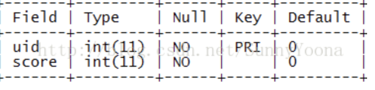

# 海量用户积分排名算法探讨

参考：https://blog.csdn.net/SunnyYoona/article/details/84587930

补充；首先需要明确几个问题

1. 相同积分的用户的排名相同吗？
2. 分数是否有上限


**海量用户我们假设有一个亿的用户，假设积分无上限，积分相同按照先后顺序排序**

这个需求的数据变化有这样一个特点：

* 他的分数是从0开始增加的
* 排名靠前的用户的排名变化对后面的用户不会造成影响，同理积分在高分段的用户的积分增长比他积分低的用户的排名不会造成影响

首先我们肯定有一个存储用户积分的表



那么计算排名就有一个很简单的实现方式，使用一个简单的sql

```sql
select 1 + count(t2.uid) as rank
from user_score t1, user_score t2
where t1.uid = @uid and t2.score > t1.score
```

缺点：需要对user_score表进行全表扫描，还需要考虑到查询的同时若有积分更新会对表造成锁定，在海量数据规模和高并发的应用中，性能是无法接受的。

当然数据量小的场景这个实现是最简单的，也不会引入其他数据，不过在当前场景该方案就直接被pass掉的


进一步我们可能会想到分治算法：将用户的积分分段或排名分段

* **如果按照排名分段**：排名1-10000 是一个区间，那么就会有 10000区间，区间从高到低顺序排列，

  当一个用户分数变化的时候只需要从索引为1的区间开始，对比区间内的最高分数和最低分数，然后找到对应的区间，然后在区间内做排序即可，但是这样设计存在很多问题：

  1. 当找到对应区间的时候区间内增加了一个人那么区间内最小的一个人就要往后面的区间移动，这样就会一直向后传递，性能可想而知
  2. 如果大家一开始都是0分那么按照账号创建顺序排序这个很简单，然后当用户积分逐渐增加1，那么会有很多人的积分都是1，再来一个用户的积分增长为1的时候，你会发现从前往后喝多区间里面的积分都是1，你只能不断的往后面的区间移动

* **如果按照积分分段**：积分从0-10000为一段，10000 - 20000 ...... 这样就能分成很多短只需要记录该区间的用户总数，然后去见算一个用户的排名即可，但是这样会有一个问题，一个区间内用户数量是不定的，有的多有的少，甚至开始的时候会有千万上亿的用户都在一个分段内，那么你又怎么去计算排位呢？

  难道就没方法了吗？

  这时候我们可以想象出了线性表这样的结构我们还有什么结构，数，堆....

  但是由于我们的积分实惠不断增张的我们不能简单的使用一棵树来完成这个操作，我们还是需要结合线性表来完成，这样讲树分为多短，避免由于积分增长导致树（积分会不断增多）的重建，

  这样我们将 [0-100000),[100000,200000)..... 这样去分段，随着积分的增多，逐渐增加分段的数量，这样就算积分有1亿的积分也就100段，这里我们叫做线性区间，然后每一段 我们将它处理成一个平很二叉树

  root = [0-100000) ,第二层 = [0-50000) , [50000-100000) , 第三层= [0-25000) , [25000-50000) , [50000-75000) ,[75000-100000)  ， 以此类推最终我们会得到100000个叶子结点[0,1), [1,2) … [99999, 100000) 树的深度大致是 log2 [^100000]的一个对数 == 17 这样子，每个节点我们都要记录该区间内的人数，非叶子结点的count 总是等于他的结点的count的和

  这样一个用户拿着他的分数3过来查询排名的时候首先查询落在线性区间的什么位置，然后加上其后面的区间的count总和，然后再在树中查询，如果落在左子树就将他的右兄弟结点的count累加上，最后就能很快找到自己所在的[3,4) 的区间，这时候判断如果是叶子，那么在加上当亲叶子结点的coout，就是自己的排名了，别忘了没次经过的结点的count+1

  并且这个接口可以很好是使用nosql 来存储，只需要依赖binlog来保证最终一致性即可

  优点是时间复杂度= O(log[^n])

  缺点：实现复杂

**海量用户我们假设有一个亿的用户，假设积分上限100000000，积分相同排名相同**

* 他的分数是从0开始增加的
* 用户的积分从s变成s+n, 那么排名被影响的用户是s到s+n-1的积分的用户的排名，他们的排名都需要+1

有一个简单的方案：初始化一个大小为100000000的数组rank[s]，数组的value记录排名即可，占用的内存会比较多一些一个long 64bit , 1m = 1024kb = 1024 * 1024 B =  1024 * 1024 * 8 bit

1m =  1024 * 1024 * 8 bit / 64 =131072 也就是可以存131072 long  100000000 需要 1000m ，也就是需要差不多1G的连续内存空间来初始化这个数组

# 排名系统设计

