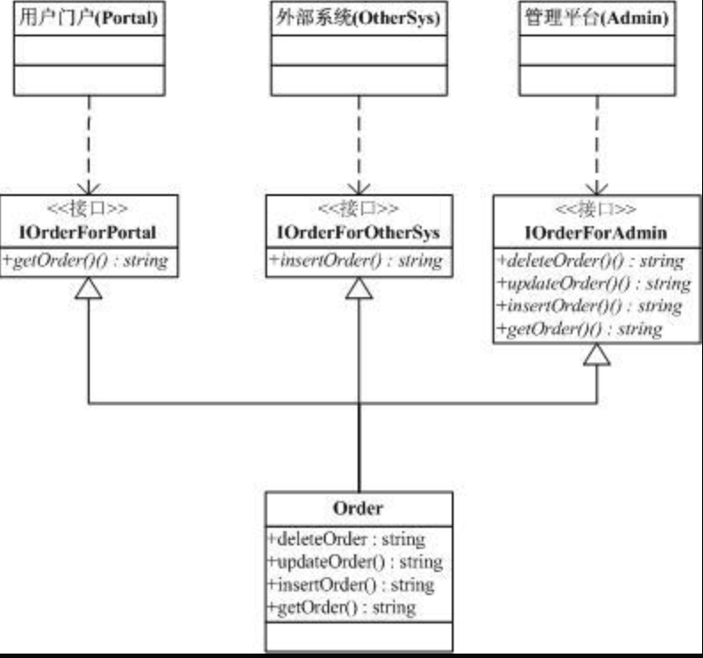
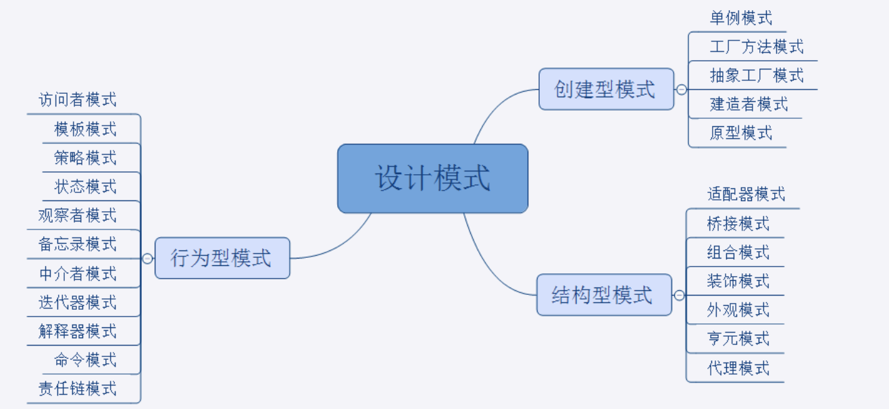
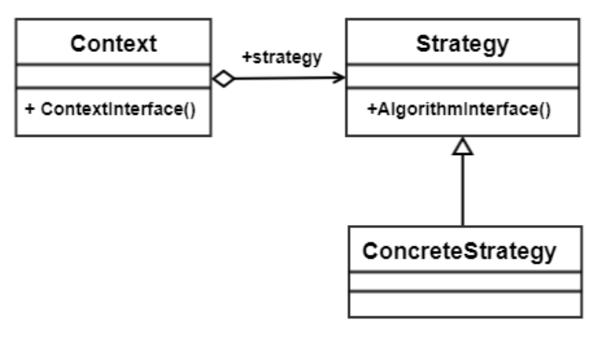

# UML基础

https://baijiahao.baidu.com/s?id=1719410317740261286&wfr=spider&for=pc

# 设计模式的目标

管理变化，提高复用性，扩展性

# 设计模式遵循的原则

## [依赖倒置原则](https://www.baike.com/wikiid/4246163173631132035?prd=home_search&search_id=5uoavzd4d8w000&view_id=2zzhtz1u4g8000)：

依赖倒置原则（Dependence Inversion Principle）是**程序要依赖于抽象**接口，**不要依赖于具体实现**。简单的说就是要求对抽象进行编程，不要对实现进行编程，这样就降低了客户与实现模块间的[耦合](https://www.baike.com/wikiid/8509261272649066389?from=wiki_content&prd=innerlink)。

目的：

[面向过程](https://www.baike.com/wikiid/3832382415511471062?from=wiki_content&prd=innerlink)的开发，上层调用下层，上层依赖于下层，当下层剧烈变动时上层也要跟着变动，这就会导致模块的复用性降低而且大大提高了开发的成本。

[面向对象](https://www.baike.com/wikiid/2525120795296681076?from=wiki_content&prd=innerlink)的开发很好的解决了这个问题，一般情况下抽象的变化概率很小，让用户程序依赖于抽象，实现的细节也依赖于抽象。即使实现细节不断变动，只要抽象不变，客户程序就不需要变化。**这大大降低了客户程序与实现细节的[耦合度](https://www.baike.com/wikiid/4987896560402309248?from=wiki_content&prd=innerlink)。**

## [单一职责原则](https://www.baike.com/wikiid/7108895490323975196?prd=result_list&view_id=8272zwrmqxg00)：

如果一个类承担的职责过多，就等于把这些职责耦合在一起了。一个职责的变化可能会削弱或者抑制这个类完成其他职责的能力。这种耦合会导致脆弱的设计，当发生变化时，设计会遭受到意想不到的破坏。而如果想要避免这种现象的发生，就要尽可能的遵守单一职责原则。**此原则的核心就是[解耦](https://www.baike.com/wikiid/6795456817226039888?from=wiki_content&prd=innerlink)和*增强内聚性*。**

**之所以会出现单一职责原则就是因为在软件设计时会出现以下类似场景：**

​	T负责两个不同的职责：职责P1，职责P2。当由于职责P1需求发生改变而需要修改类T时，有可能会导致原本运行正常的职责P2功能发生故障。也就是说职责P1和P2被耦合在了一起。

​	没有任何的程序设计人员不清楚应该写出高内聚低耦合的程序，但是很多耦合常常发生在不经意之间，其原因就是：职责扩散：因为某种原因，某一职责被分化为颗粒度更细的多个职责了。

遵守单一职责原则，将不同的职责封装到不同的类或模块中。这样就能解决这个问题

## [Liskov替换原则](https://www.baike.com/wikiid/6365677004709655798?prd=result_list&view_id=51mwo66aovg000)：

里氏替换原则中说，任何[基类](https://www.baike.com/wikiid/4451009721289405764?from=wiki_content&prd=innerlink)可以出现的地方，子类一定可以出现。 LSP是继承复用的基石，只有当衍生类可以替换掉基类，软件单位的功能不受到影响时，基类才能真正被复用，而衍生类也能够在基类的基础上增加新的行为。

**如此，问题产生了：“我们如何去度量继承关系的质量？”**

Liskov于1987年提出了一个关于继承的原则“Inheritance should ensure that any property proved about supertype objects also holds for subtype objects.”——“继承必须确保超类所拥有的性质在子类中仍然成立。”也就是说，当一个子类的实例应该能够替换任何其超类的实例时，它们之间才具有[is-A](https://www.baike.com/wikiid/6465470635938150151?from=wiki_content&prd=innerlink)关系。

该原则称为Liskov Substitution Principle——里氏替换原则。

## [接口隔离原则](https://www.baike.com/wikiid/1768682114254631631?prd=home_search&search_id=4pege0fw3be000&view_id=1i0una6usrk000):

客户端不应该依赖它不需要的接口；一个类对另一个类的依赖应该建立在最小的接口上。

使用多个专门的接口比使用单一的总接口要好。

一个类对另外一个类的依赖性应当是建立在最小的接口上的。

一个接口代表一个角色，不应当将不同的角色都交给一个接口。没有关系的接口合并在一起，形成一个臃肿的大接口，这是对角色和接口的污染。

“不应该强迫客户依赖于它们不用的方法。接口属于客户，不属于它所在的类层次结构。”这个说得很明白了，再通俗点说，不要强迫客户使用它们不用的方法，如果强迫用户使用它们不使用的方法，那么这些客户就会面临由于这些不使用的方法的改变所带来的改变。

**举例：**

使用场合，提供调用者需要的方法，屏蔽不需要的方法。满足接口隔离原则。比如说电子商务的系统，有订单这个类，有三个地方会使用到：

* 一个是门户，只能有查询方法

* 一个是外部系统，有添加订单的方法

* 一个是管理后台，添加删除修改查询都要用到

根据接口隔离原则(ISP),一个类对另外一个类的依赖性应当是建立在最小的接口上.

也就是说，对于门户，它只能依赖有一个查询方法的接口. UML 结构如下：

这儿不用[接口继承](https://www.baike.com/wikiid/2690150537016556074?from=wiki_content&prd=innerlink),因为可能出现修改了父接口影响了子接口 

这样就能很好的满足接口隔离原则了，[调用](https://www.baike.com/wikiid/6470982241640683514?from=wiki_content&prd=innerlink)者只能访问它自己的方法，不能访问到不应该访问的方法.

## [开闭原则](https://www.baike.com/wikiid/3098134975221767621?prd=home_search&search_id=4kvsvoarxag000&view_id=qqrul2zdrww00)（OCP）

在面向对象编程领域中，开闭原则规定“软件中的对象（类，模块，[函数](https://www.baike.com/wikiid/5186529207004555233?from=wiki_content&prd=innerlink)等等）应该对于扩展是开放的，但是对于修改是封闭的”，**这意味着一个实体是允许在不改变它的原代码的前提下变更它的行为（扩展的方式来改变），这样做在做扩展的时候就不会对原来的方法做出改变，也就避免了对原来的逻辑的回归测试，降低时间成本**

**总结：他的目标是：降低系统迭代带来的新风险**

## [迪米特原则](https://www.baike.com/wikiid/6601467003346685194?prd=result_list&view_id=4aul2evs2ty000)：

也叫最少知识原则。迪米特法则的定义是只与你的直接朋友交谈，不与"陌生人"说话。如果两个软件实体无须直接通信，那么就不应当发生直接的相互调用，可以通过第三方转发该应用。

**迪米特法则的初衷在于降低类之间的[耦合](https://www.baike.com/wikiid/8509261272649066389?from=wiki_content&prd=innerlink)。由于每个类尽量减少对其他类的依赖，因此，很容易使得系统的功能模块功能独立，相互之间不存在（或很少有）依赖关系。**

迪米特法则中的朋友是指：当前对象本身、当前对象的成员对象、当前对象所创建的对象、当前对象的方法参数等，这些对象存在关联、聚合或组合关系，可以直接访问这些对象的方法。		

**狭义的迪米特法则的缺点：**

在系统里造出大量的小方法，这些方法仅仅是传递间接的调用，与系统的业务逻辑无关。

遵循类之间的迪米特法则会是一个系统的局部设计简化，因为每一个局部都不会和远距离的对象有直接的关联。但是，这也会造成系统的不同模块之间的通信效率降低，也会使系统的不同模块之间不容易协调。

**门面模式和调停者模式（中介者模式）实际上就是迪米特法则的应用。**

**门面模式降低的是对依赖的实现细节的耦合**

## 合成复用原则：

尽量多使用组合/聚合，而不是使用继承（为什么不推荐使用继承 https://blog.csdn.net/u010711495/article/details/117395482 ）

## 总结

| 设计原则     | 一句话归纳                                                   | 目的                                                         |
| ------------ | ------------------------------------------------------------ | ------------------------------------------------------------ |
| 开闭原则     | 对扩展开放，对修改关闭                                       | 降低系统迭代带来的新风险                                     |
| 依赖倒置原则 | 高层不应该依赖低层，要面向接口编程                           | 更利于系统的升级扩展                                         |
| 单一职责原则 | 一个类只干一件事，实现类要单一                               | 便于理解，提高代码的可读性，**此原则的核心就是[解耦](https://www.baike.com/wikiid/6795456817226039888?from=wiki_content&prd=innerlink)和*增强内聚性*。** |
| 接口隔离原则 | 一个接口只干一件事，接口要精简单一                           | 功能解耦，高聚合、低耦合                                     |
| 迪米特法则   | 不该知道的不要知道，一个类应该保持对其它对象最少的了解，降低耦合度 | 只和朋友交流，不和陌生人说话，减少代码臃肿                   |
| 里氏替换原则 | 保护继承体系，子类重写方法功能发生改变，不应该影响父类方法的含义 | 防止继承泛滥                                                 |
| 合成复用原则 | 尽量使用组合或者聚合关系实现代码复用，少使用继承             | 降低代码耦合设计原则，继承的方式耦合性较高                   |

# 什么时候不使用设计模式

- 项目工期很紧
- 需求理解还很浅时
- 不是系统的关键依赖点
- 项目没有复用价值时
- 代码可读性很差时

# 经验

- 不要为了模式而模式
- 关注抽象类和接口
- 理清变化点与稳定点
- 审视依赖关系
- 要有Framework和Application的区隔思维
- 良好的设计是演化的结果
- **忘掉模式，只有原则**（这个是最重要的）

# 设计模式分类

* 创建型模式
* 结构型模式
* 行为型模式

https://www.runoob.com/design-pattern/design-pattern-tutorial.html

http://c.biancheng.net/design_pattern/

### 装饰者和代理的区别

**代理模式**：将你并不关心的事情交给别人做

**装饰者模式**：拓展自己的能力能做更多的事

1. 首先回答了什么是装饰者模式和代理模式。

 2、说明代理模式和装饰者模式的区别–代理模式偏向于增强行为动作，装饰者模式偏向于增强类的能力

 3、然后说明代理模式的使用场景Spring AOP就是用代理模式实现的，装饰者模式的使用场景InputStream的增强装饰类就是FileInputStream。dubbo 中的那些 Wrapper就是装饰器的应用

总结：代理模式是行为的扩展，装饰者模式是类的扩展

## 创建型

### 单例模式

* 饿汉: 指全局的单例实例在类装载时构建

  构造方法 private  ，静态字段直接初始化实例

* 懒汉

  * 线程上下文`单例，这样不需要共享给所有线程，但是多的话会创建很是实例，不推荐
  * DCL 双重检查锁+volatile **推荐**
  * 静态内部类方式实现线程安全的单例 **推荐**
  * 枚举

### 简单工厂

一个工厂只负责创建一种产品

### 工厂方法

### 抽象工厂

创建简单工厂的工厂，可以实现内部通过匹配到不同的简单工厂创建多种产品

### 建造者(生成器 builder)

## 结构型

### 代理模式

https://juejin.im/post/5c1ca8df6fb9a049b347f55c

### 适配器

### 装饰者

### 组合模式

### 外观模式(门面模式)

### 享元模式

### 桥接模式

## 行为型

### 模版方法模式

它封装了不变的部分，开放了可变（可扩展）的部分交给子类去实现，可以很好的满足开闭原则

### 责任链模式

### 迭代器模式

### 观察者模式

### 策略模式

https://www.runoob.com/w3cnote/state-vs-strategy.html

策略模式定义了算法族，分别封装起来，让他们之间可以互相替换，此模式让算法的变化独立于使用算法的客户。

缺点如下。

1. 客户端必须理解所有策略算法的区别，以便适时选择恰当的算法类。
2. 策略模式造成很多的策略类，增加维护难度。

### 状态模式

https://www.runoob.com/w3cnote/state-vs-strategy.html

### 命令模式

### 中介者模式

### 访问者模式

### 解释器模式

### 备忘录模式

