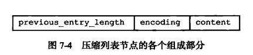

# list介绍

这篇文章主要介绍，redis的涉及于实现

**文中内容主要来自 《redis涉及与实现-第二版》 ， 还有从网络上找到的博客**

后续的文章中为了简单我会把一些术语用简单的方式表达

* C语言原生字符串 ： C 串

# 底层数据结构

## redis 为什么不适用 二叉查找树（红黑树），选择了跳跃表

redis 作为一个面向`内存`构建的 缓存数据库系统，需要处理大量并发请求，要办证查询性能，并且数据量巨大。

我们知道我们的二叉查找树要维持结构的平衡特性，在多次插入删除之后，为了维持平衡就需要做 rebalance（重平衡） 操作，这个操作执行时，树的节点越多，可能被波及到的节点也越多，完成平衡花费的代价就越大，相对来说跳跃表的维持平衡的局部波及的代价来说就小了很多。在redis这种大数据量，高性能的数据库场景就不是太适用。

## 简单动态字符串 sds

`sds` 取代了 `C串`(以空字符结尾的字符串) ， 这个数据类型作为 `redis` 存储字符串数据时候的唯一类型，`C串`不适用于redis,至于原因，我们先看 `sds`的定义

**注意空字符不是空白字符，空字符是：'\0'，空白字符是：' ' **


`sds` 遵循`C串`以空字符串结尾的惯例，但是保存空字符的空间不计算在 `len`的长度中， 这样做的原因是可以复用一部分 `C串`的函数库中的部分方法。

### sds 的设计相比于原生字符串类型的优点

1. **常数时间复杂度获取字符串长度**

   `redis `命令

   ```
   strlen [key]
   ```

   * `C串`

   原生字符串类型的在获取`length` 的时候 我们需要遍历这个字符串的字符数组，直到空白字符结尾位置得到长度，时间复杂度 `O(N)`

   * `sds`

   我们再来看 sds, 使用了`len`来记录当前的 `sds` 实体的字符串的长度，获取`length` 的时候 时间复杂度是 `O(1) `

4. **空间预分配策略**

   当通过SDS的API对一个SDS进行修改的时候，如果需要对SDS进行扩展，程序不仅会为SDS分配修改所必须的空间，还会分配额外的未使用空间 `free空间`，`free空间`的数量由一下公式决定：
   
   * 先计算修改SDS后的`len`值，如果这时候的`len`小于1MB,那么程序分配和`len`大小一样的`free空间`
   * 如果`len`的值大于1MB,那么程序会分配1MB的`free空间`
   
   **通过该策略redis可以减少连续执行字符串增长操作所需的内存分配次数，从而减小性能开销（不过带来的是，额外的空间占用）**
   
3. **惰性空间释放策略**

   用于优化SDS的字符串缩短操作，当SDS的API需要缩短SDS的时候，程序并不会立即使用内存重分配来缩小SDS,而是先使用`free`来将这些字节记录下来，并等待将来的使用

   * **优点：如果在之后还会有使用的话，就不需要再分配内存了**
   * **由于SDS提供了真正释放空间的API，可以在有需要的时候调用，所以不用担心内存浪费问题**

4. **良好的设计避免了字符数组的缓冲区溢出**

   * `C串`

     `C串`的字符数组长度是定下来的，我们在执行一些追加字符的操作的时候，**如果忘记判断数组长度是否够用的话**，就会造成缓冲区溢出，比如如果执行了strcat(s1," Cluster"); 但是忘记了在执行前给是是s1分配组口的空间，就会发生像下面这样的情况，数据溢出到说s2的内存区域了，导致s2的数据被意外的修改掉了

   

   

   * `sds`

     `sds` 不同在于，他的**空间分配策略**杜绝了这样的情况发生，当`sds`类型数据在执行追加这样的操作的时候，`sds`的`api`实现中，会先对`sds.buf`数组空间长度做检查，也就是**对`free`(剩余空间)做检查，如果不足的话，`sds`会先扩展空间，然后在执行追加操作**

5. **空间分配策略，惰性空间释放策略，减少了字符串在修改的时候带来的内存重分配次数，从而减少了其带来的性能开销，提高了redis的性能。**

### 二进制安全

在说`sds`的二进制安全之前我们要先了解一下 `C串`的情况：

* `C串`中的字符必须符合某种编码（比如ASCⅡ） 
* 除了字符串末尾之外任何地方不能包含空字符‘\0’ , 否则的话先被读取到的这个字符会被认为是字符串结尾

这些限制使得`C串`只能保存文本数据，而不能保存图片，音频，视频，压缩文件.....的二进制数据

redis为了确保可以适用于各种场景，`sds`的`api`都是二进制安全的，所有`sds api`都会**以处理二进制数据的方式来处理`sds`存放在`buf`数组中的数据**，**程序不会对其做限制，过滤，假设什么的，数据写入是什么样子的，读取也是什么样的。**所以`sds.buf`叫做字节数组

**通过使用`sds`让`redis`可以保存任意格式的二进制数据**

### 兼容部分`C串`函数

为了让sds能兼容部分`C串`函数，`sds.api`在设计的时候总会将`sds`保存的数据的末尾设置一个空字符（这也就意味着数组在进行空间分配的时候总会多分配1个字节空间）

### 总结


## 双端链表

### 链表节点 ListNode

```c
typedef struct listNode{
    // 前置节点
    struct listNode *prev;
    // 后置节点
    struct listNode *next;
    // 节点的值
    void *value;
}listNode;
```

虽然多个listNode姐可以组成链表了，如下图


但是使用 list 来组装链表的话操作起来更方便

```c
typedef struct list{
    // 表头指针
    listNode *head;
    // 表尾指针
    listNode *tail;
    // 链表中节点的数量
    unsigned long len;
    // 复制节点保存的值
    void *(*dup) (void *ptr);
    // 释放节点保存的值
    void (*free) (void *ptr);
    // 用于对比链表节点所保存的值和另一个输入的值是否相等
    void 0(*match) (void *ptr,void *key);
}list;
```


双向无环链表，但是由于还有一层 list结构数据的字段head,tail来记录对应的链表头，和链表尾，其实他是具有环状结构功能的，环状链表在某些查询情况下，效率会比较快，比如链表长度是10，从第十个节点查找第二个节点，是从第十个节点往前找要经过 8次快呢，还是直接往后找只需要2次就能找到快呢？答案显而易见

### 重点回顾


## 字典

### 结构

redis的字典结构其实和java1.7的hashMap结构是一样的

#### dictht定义

```c
typedef struct dictht{
    // hase 表数组(dictEntry数组)
    dictEntry **table;
    // 记录hase表大小 size大小总是等于2的n次方，也就是数组的大小
    unsigned long size;
    // size-1 用于计算索引值，作用和java的hash Map类似
    unsigned long sizemask;
    // 已有节点数量
    unsigned long used;
}dictht;
```

#### dictEntry定义

```c
typedef struct dictEntry{
    // 键
    void *key;
    // 值
    union{
        void *val;
        uint64_tu64;
        int64_ts64;
    }
    // 指向下一个dictEntry的指针，用于形成链表
    struct dicEntry *next;
}dictEntry;
```
#### dict定义

```c
typedef struct dict{
    // 指向 dicType 结构的指针，每一个dicType保存了一簇用于操作特定类型键值对的函数，redis为各种用处不同的字典设置了不同类型的函数
    dicType *type;
    // 保存了需要传给 dicType 中特定函数的可选参数
    void *privdata;
    // 哈希表 为什么是大小为2的数组呢？后面会有介绍
    dictht ht[2];
    // rehash 索引,目前没有在rehash或者说是rehash完成了那么他的值为-1
    int rehashidx;
}dict;
```

* **`type`,`privdata`属性是针对不同类型的键值对，为创建多态字典而设置的**，
* **`dict` 的`ht`属性是一个包含两个项的数组，数组中的每个项都是一个`dictht`哈希表，一般情况下使用`ht[0]`,在rehash得时候，我们会用到`ht[1`**
* **`rehashidx` 记录得是我们得rehash目前得进度，目前没有在rehash或者说是rehash完成了那么他的值为-1**

#### dictType定义

```c
typedef struct dictType{
    // 计算hash值的函数
    unsigned int (*hashFunction)(const void *key);
    // 复制键的函数
    ...
    // 复制值得函数
    ...
    // 对比键得函数
    ...
    // 销毁键得函数
    ...
    // 销毁值得函数
    ...
    
}dictType;
```

#### 结构图


### hash算法

和 java 中的 hashMap 的算放算法基本相同(**但是rehash扩容和java的hashmap不太一样，hashmap通常是直接扩大一倍，redis不同，详细的在[rehash](#rehash)会有介绍**)，不过没有使用到java8的红黑树，只是 数组+链表（链地址法解决hash冲突），个人认为他不使用 红黑树是有自己的权衡的[关于redis中为什么不使用红黑树的个人理解](#关于redis中为什么不使用红黑树的个人理解)

比较特殊的是，redis这里使用了`MurmurHash`算法，该算法最早是由 Austin Appleby 在2008年发明的，这种算法的有点在于即使你输入的key是有规律的，该算法任然能有一个很好的随机分布性，并且该算法计算速度也非常的快.

`MurmurHash`蒜贩目前的版本是`MurmurHash3`，而redis使用的是`MurmurHash2`

### 解决hash冲突

上面已经提到过了，这里使**用了链地址法来解决hash冲突**，也就是当发生hash冲突的时候，会以链的方式，形成链表。（这里的形成链的过程有一些特别的设计） 为了速度考虑，总是将产生冲突的最新的节点插入到链表的头部，也就是说最新的数据放在前面，因为这样的数据相对最容易被访问到

### rehash 

扩容的时候操作和hashMap 的扩容基本一样，不过 redis没有树结构，而且有一点很特别的是，redis这里使用的是 [渐进式rehash](#渐进式rehash)

### rehash扩容&缩容


**[copy-on-write](..\写时复制技术.md)**

### 渐进式rehash

其中的rehash过程和java8的ConcurrenthashMap有点点类似,java8的ConcurrenthashMap也会在`添加`,`删除`,`更新`的时候利用当前的线程取帮助rehash


### 总结


### 字典在redis中的应用

* redis本身就是一个大的字典
* 其次redis里卖弄的hash类型，也是字典
* 

### 美团针对Redis ReHash机制的探索和实践

https://tech.meituan.com/2018/07/27/redis-rehash-practice-optimization.html

### 关于redis中为什么不使用红黑树的个人理解

首先使用红黑树的话在我们对数据做修改的时候比如，插入，修改，删除，红黑树由于需要做旋转以达到红黑树的平衡，会给系统带来很大的开销，而链表就不同了，简单直接。对一个像是redis 这样一个定位作为一个cache，使用的是机器的内存这个硬件部分的 DB系统来说，很明显直接使用链表是性价比最高且最优化的选择。在数据修改的操作上的性能，相比来说肯定比红黑树高很多，在给系统减负的操作上，redis还有比如说 渐进式rehash这样的操作

有人会说，这样做的话查询的性能必然不能做到最好，说到这里的话，redis的设计开发者们也想到了，他们在插入数据的时候，会把最新插入的数据插入到链表的头部，这样的数据也会是在插入之后最容易访问到的数据，当然这只是一点，还有就是 rehash 的策略了，


上面有两个命令 `BGSAVE +`  `BGREWRITEAOF`  都是涉及到了将缓存数据写到磁盘的操作，也就是只有在这样系统在执行这种任务的情况下，redis,的rehash操作需要 ht[0].uesd / ht[0].size >=5 才执行 rehash, 别的情况下 只需要你的  ht[0].uesd / ht[0].size >=1 就会rehash 了， 这也是 redisd 提高查询性能的保证（这里的used指的是 hash表中的实际节点量，size指的是 hash表的数组的长度）

## 跳跃表

### 跳跃表在redis中的应用

* 有序集合 sorted sets
* 集群节点中用作内部数据结构

### 数据结构图


## 整数集合

整数集合是集合键的底层实现之一，**当一个集合只包含整数值元素**，并且**这个集合的元素数量不多时**，**redis就会使用整数集合作为合键的底层实现。**

例如：我们只创建一个包含5个元素的集合键，并且集合中所有元素都是整数，那么这个集合 Set就是一个整数集合

### 整数集合(inset)的实现

`intset`是redis用来保存整数值的集合抽象数据结构，它可以保存类型为`int16_t`, `int32_t`, `int64_t`的整数值并且保证集合中不会存在重复元素。

#### intset定义

```c
typedef struct intset{
    // 编码方式
    uint32_t encoding;
    // 集合包含的元素数量，contents的长度
    uint32_t length;
    // 保存元素的数组，数组中整数元素从小到大有序地排列，并且数组中不包含任何重复项
    // 虽然contents定义为int8_t类型的值，但是它的真正类型取决于encoding的值
    int8_t contents[];
}intset;
```

`encoding`的值,决定了`contents`中元素的类型：

* INTSET_ENC_INT16: 那么`contents`就是一个int16_t类型的数组（-32 768 ---- 32 767）
* INTSET_ENC_INT32:那么`contents`就是一个int32_t类型的数组（-2 147 483 648 ---- 2 147 483 647）
* INTSET_ENC_INT64:那么`contents`就是一个int64_t类型的数组（-9 223 372 036 854 775 808 ---- 9 223 372 036 854 775 807）

​	

​	

### 升级

### 升级的好处

### 不支持降级

## 压缩列表

当一个列表键包含很少的列表项，且列表项都是小整数值或比较短的字符串的时候，那么redis就会使用压缩列表来做键值对的值的底层实现。


**entry** 的结构:



API : 


# redisd对象（上层数据结构）

## 对象的底层结构定义

redis中每隔对象都有 redisObject结构表示的：

```c
typedef struct redisObject{
    // 类型
	unsigned type;
    // 使用的底层数据结构（redis 定义的协议编码）
    unsigned encoding;
    // 指向底层实现数据结构的指针
    void  *ptr
    .......
}redisObject;
```

**type** 主要有五种: **字符串（strings）**，**列表（lists）**，**哈希表/散列(hashes)**，**集合（sets）**，**有序集合（sorted sets）**

**encoding** ：

| 编码常量                  | 所对应的底层数据结构                               |
| ------------------------- | -------------------------------------------------- |
| REDIS_ENCODING_INT        | long 型整数                                        |
| REDIS_ENCODING_EMBSTR     | embstr 类型的[简单动态字符串](#简单动态字符串 sds) |
| REDIS_ENCODING_RAW        | [简单动态字符串](#简单动态字符串 sds)              |
| REDIS_ENCODING_HT         | [字典](#字典)                                      |
| REDIS_ENCODING_LINKEDLIST | [双端链表](#双端链表)                              |
| REDIS_ENCODING_ZIPLIST    | [压缩链表](#压缩链表)                              |
| REDIS_ENCODING_INTSET     | [整数集合](#整数集合)                              |
| REDIS_ENCODING_SKIPLIST   | [跳跃表](#跳跃表)                                  |

## redis中主要的五种对象的

### 字符串（strings）

二进制安全的字符串，会使用下面三种结构作为实现（**字符串对象是唯一会在别的对象结构中被使用的**）

- 整数值实现的字符串对象（整数的时候）：简单的 long 型存储

  

- embstr 实现的[简单动态字符串](#简单动态字符串 sds)对象 ( 如果是一个字符串，字符串长度小于等于32字节 ) ： 

  

  相对非 embstr的来说，由于内存分配适合 redisObject陪配在一起的连续**内存，所以只需要分配一次**；**释放自然也是只需要一次操作了**；**保存在一块连续内存中意味着我们查找会更快一些**

- [简单动态字符串](#简单动态字符串 sds)对象 ： redis 自定义的动态字符串结构 存储

  

**部分命令的底层实现**：


### 列表（lists）

按插入顺序排序的字符串元素的集合。他们基本上就是*链表（linked lists）*。  

- **[压缩列表](#压缩列表)**

  

  > 

-   [双端链表](#双端链表)

### 集合（sets）

不重复且无序的字符串元素的集合。

- 使用**[整数集合](#整数集合)**结构
- 使用**[字典](#字典)**结构（数据量到一定级别）

### 有序集合（sorted sets）

类似Sets,但是每个字符串元素都关联到一个叫*score*浮动数值（floating number value）。里面的元素总是通过score进行排序，它可以检索的一系列元素。（例如你可能会问：给我前面10个或者后面10个元素）。

- 使用**[压缩列表](#压缩列表)**实现的有序集合
- 使用**[跳跃表](#跳跃表)**和**[字典](#字典)**实现的有序集合（数据量到一定级别）

### 哈希表/散列(hashes)

由field和关联的value组成的map。field和value都是字符串的。这和Ruby、Python的hashes很像。

- 数据量小的时候**使用[压缩列表](#压缩列表)实现**

  - 这时候的压缩列表的节点会是：[key1,value1,key2,value2....] 这样存储，也就是key,value分别作为一个entry 存放到数组中，key后面就是value,紧紧挨在一起
  - 这时候数据在这个数组空间的位置是按照先后顺序存储的

  

- **使用[字典](#字典)实现**（再数量达到一个阈值的时候会从压缩列表转为字典结构）

