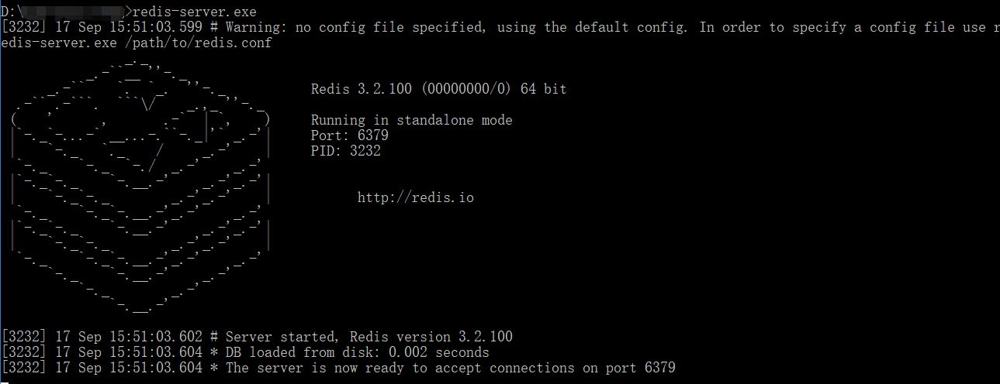
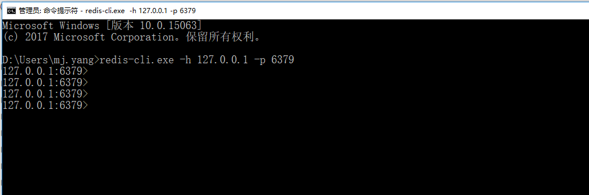

# 介绍(introduction)

这篇文章主要介绍的是关于使用方面的东西

本篇很多内容都来自：

* http://redisdoc.com/string/incrbyfloat （redis 命令(commands )参考）
* https://redis.io/commands# （redis官网）

# 下载安装(down-install)

https://www.runoob.com/redis/redis-install.html

# 使用(usage)

windows 配置好环境变量之后，打开 cmd 命令行控制器，输入

```
redis-server.exe
```



redis 启动成功后的端口号（port）= 6379

然后再打开一个  cmd 命令行控制器 ， 输入

```
redis-cli.exe -h 127.0.0.1 -p 6379
```

-h 指的是 host

-p 指的是 port

链接成功 就是下图的样子了



然后就可以 在这里用redis ,命令玩起来了

# 数据结构(data-structure)

你也许已经知道Redis并不是简单的key-value存储，实际上他是一个数据结构服务器，支持不同类型的值。也就是说，你不必仅仅把字符串当作键所指向的值。它的建/值都是一个个的对象，键都是字符串对象，总共有下面五种对象类型（这五种类型都可以作为值对象）：

- [strings](#字符串（strings）):二进制安全的字符串 

  会使用下面三种结构作为实现

  - 整数值实现的字符串对象（整数的时候）	：简单的 long 型存储
  - embstr 实现的简单字符串对象 ： 
  - 简单动态字符串对象 ： sds ，redis 自定义的动态字符串结构 存储

- [Lists](#列表（lists）): 按插入顺序排序的字符串元素的集合。他们基本上就是*链表（linked lists）*。  

  - 数据量小的时候使用**压缩列表**实现
  - 使用**双端链表**实现（数据量到一定级别）

- [Sets](#集合（sets）): 不重复且无序的字符串元素的集合。

  - 使用**整数集合**结构
  - 使用**字典**结构（数据量到一定级别）

- [Sorted sets](#有序集合（sorted sets）),类似Sets,但是每个字符串元素都关联到一个叫*score*浮动数值（floating number value）。里面的元素总是通过score进行着排序，它可以检索的一系列元素。（例如你可能会问：给我前面10个或者后面10个元素）。

  - 使用**压缩列表**实现的有序集合
  - 使用**跳跃表**和**字典**实现的有序集合（数据量到一定级别）

- [Hashes](#哈希表/散列(hashes)):由field和关联的value组成的map。field和value都是字符串的。这和Ruby、Python的hashes很像。

  - 数据量小的时候**使用压缩列表实现**
  - **使用字典（map）实现**（再数量达到一个阈值的时候会从压缩列表转为字典结构）

还有两种

- Bit arrays (或者说 simply bitmaps): 通过特殊的命令，你可以将 String 值当作一系列 bits 处理：可以设置和清除单独的 bits，数出所有设为 1 的 bits 的数量，找到最前的被设为 1 或 0 的 bit，等等。
- HyperLogLogs: 这是被用于估计一个 set 中元素数量的概率性的数据结构。别害怕，它比看起来的样子要简单…参见本教程的 HyperLogLog 部分。

## keys

Redis key值是二进制安全的，这意味着可以用任何二进制序列作为key值，从形如”foo”的简单字符串到一个JPEG文件的内容都可以。**空字符串也是有效key值。**

[DEL](#DEL)

[DUMP](#DUMP)

[EXISTS](#EXISTS)

[EXPIRE](#EXPIRE)

[EXPIREAT](#EXPIREAT)

[KEYS](#KEYS)

[MIGRATE](#MIGRATE)

[MOVE](#MOVE)

[PBKECT](#OBJECT)

[PERSIST](#PERSIST)

[PEXPIRE](#PEXPIRE)

[PEXPIREAT](#PEXPIREAT)

[PTTL](#PTTL)

[RANDOMKEY](#RANDOMKEY)

[RENAME](#RENAME)

[RENAMENX](#RENAMENX)

[RESTORE](#RESTORE)

[SORT](#SORT)

[TTL](#TTL)

[TYPE](#TYPE)

[WAIT](#WAIT)

[SCAN](#SCAN)

--------

### DEL

pattern：`del key [key....] `

> **起始版本：1.0.0**
>
> **时间复杂度：**O(N) 将要被删除的key的数量，当删除string类型的key时时间复杂度是O(1)，当删除string以外的类型的时候，是O(M),M是这些类型（list,hash,set...）的元素数量

### DUMP

### EXISTS

### EXPIRE

### EXPIREAT

### KEYS

### MIGRATE

### MOVE

### PBKECT

### PERSIST

### PEXPIRE

### PEXPIREAT

### PTTL

### RANDOMKEY

### RENAME

### RENAMENX

### RESTORE

### SORT

### TTL

### TYPE

### WAIT

### SCAN


## 字符串（strings）

因为`Redis` 字符串（二进制数据）的大小被限制在 512 MB(megabytes)以内， 所以用户能够使用的最大偏移量为 2^29-1(536870911) ， 如果你需要使用比这更大的空间， 请使用多个 `key` 。

* [SET](#SET)
* [SETNX](#SETNX)
* [SETEX](#SETEX)
* [PSETEX](#PSETEX)
* [GET](#GET)
* [GETSET](#GETSET)
* [STRLEN](#STRLEN )
* [APPEND](#APPEND)
* [SETRANGE](#SETRANGE)
* [GETRANGE](#GETRANGE)
* [INCR](#INCR)
* [INCRBY](#INCRBY)
* [INCRBYFLOAT](#INCRBYFLOAT)
* [DECR](#DECR)
* [DECRBY](#DECRBY)
* [MSET](#MSET)
* [MSETNX](#MSETNX)
* [MGET](#MGET)

### SET

**pattern** : ` set key value [EX seconds] [PX milliseconds] [NX|XX]`

> redis version  >=1.0.0
>
> 时间复杂读：O(1)

set command :

* 如果 `key` 持有了`value`,  那么那么会覆盖掉旧的值，**无视类型**
* 如果`key`带有生存时间（TTL），那么原有的 TTL 将会被清楚

**未设置生存时间的key会在redis的数据淘汰机制中清理，这个机制可配置**

#### 可选参数（options）

从 `Redis 2.6.12 `版本开始， `SET` 命令的行为可以通过一系列参数来修改

* EX seconds：设置`key`的生存时间为`seconds` 秒, 也就是说执行 

  `set key value ex seconds ` = `setex key seconds value `

  **ex =  expire（到期时间）**

* PX milliseconds：设置`key`的生存时间为`milliseconds`毫秒 , 也就是说执行 

  `set key value px milliseconds ` = `psetex key milliseconds value `

* NX：当且仅当`key`不存在时，才能设置成功，也就是说执行 `set key value nx` = `setnx key value ` 

  **maybe nx = not already exist = no exist**

* XX：当且仅当`key`存在时，才能设置成功

#### 返回值

从` Redis 2.6.12` 版本开始， `SET` 命令只在设置操作成功完成时才返回 `OK` ； 如果命令使用了 `NX`或者 `XX` 选项， 但是因为条件没达到而造成设置操作未执行， 那么命令将返回空批量回复（NULL Bulk Reply）。

**注意**(官方提示的):` Redis 2.6.12` 后 set 通过可选参数可以支持 `SETNX` `SETEX` `PSETEX`的功能，所以在将来的版本中，redis可能会不推荐使用并且最终废弃这几个指令

### SETNX

pattern : `setnx key  value `

> 可用版本： >= 1.0.0
>
> 时间复杂度： O(1)

和 `set key value nx `  一样的功能

### SETEX

pattern : `setex key seconds value `

> 可用版本： >= 2.0.0
>
> 时间复杂度： O(1)

和 `set key value ex seconds `  一样的功能

### PSETEX

> 可用版本： >= 2.6.0
>
> 时间复杂度： O(1)

pattern : `psetex key milliseconds value `

和 `set key value px milliseconds `  一样的功能

### GET

pattern : `get key`

> 可用版本： >= 1.0.0
>
> 时间复杂度： O(1)

返回与key相关联的值

#### 返回值

如果键 `key` 不存在， 那么返回特殊值 `nil` ； 否则， 返回键 `key` 的值。

如果键 `key` 的值并非字符串类型， 那么返回一个错误， 因为 `GET` 命令只能用于字符串值。

### GETSET 

pattern : `getset key value`

> 可用版本： >= 1.0.0
>
> 时间复杂度： O(1)

将键 `key` 的值设为 `value` ， 并返回键 `key` 在被设置之前的旧值。

#### 返回值

如果键 `key` 不存在， 那么返回特殊值 `nil` ； 否则， 返回键 `key` 的值。

如果键 `key` 的值并非字符串类型， 那么返回一个错误， 因为 `GET` 命令只能用于字符串值。

### APPEND 

pattern : `append key value`

> 可用版本： >= 2.0.0
>
> 时间复杂度： 平摊O(1)

如果键 `key` 已经存在并且它的值是一个字符串， `APPEND` 命令将把 `value` 追加到键 `key` 现有值的末尾。

如果 `key` 不存在， `APPEND` 就简单地将键 `key` 的值设为 `value` ， 就像执行 `SET key value` 一样。

#### 返回值

追加 `value` 之后， 键 `key` 的值的长度。

### STRLEN 

pattern : `strlen key`

> 可用版本： >= 2.2.0
>
> 复杂度： O(1)

返回键 `key` 储存的字符串值的长度。

#### 返回值

`STRLEN` 命令返回字符串值的长度。

当键 `key` 不存在时， 命令返回 `0` 。

当 `key` 储存的不是字符串值时， 返回一个错误。

### SETRANGE 

pattern : `setrange key offset value`

> 可用版本： >= 2.2.0
>
> 时间复杂度：对于长度较短的字符串，命令的平摊复杂度O(1)；对于长度较大的字符串，命令的复杂度为 O(M) ，其中 M 为 `value` 的长度。

从偏移量 `offset` 开始， 用 `value` 参数覆写(overwrite)键 `key` 储存的字符串值。

不存在的键 `key` 当作空白字符串处理。

`SETRANGE` 命令会确保字符串足够长以便将 `value` 设置到指定的偏移量上， 如果键 `key` 原来储存的字符串长度比偏移量小(比如字符串只有 `5` 个字符长，但你设置的 `offset` 是 `10` )， 那么原字符和偏移量之间的空白将用零字节(zerobytes, `"\x00"` )进行填充。

**因为`Redis` 字符串(二进制数据)的大小被限制在 512 MB(megabytes)以内， 所以用户能够使用的最大偏移量为 2^29-1(536870911) ， 如果你需要使用比这更大的空间， 请使用多个 `key` 。**

:warning:**注意**

> **当生成一个很长的字符串时， Redis 需要分配内存空间， 该操作有时候可能会造成服务器阻塞(block)。 在2010年出产的Macbook Pro上， 设置偏移量为 536870911(512MB 内存分配)将耗费约 300 毫秒， 设置偏移量为 134217728(128MB 内存分配)将耗费约 80 毫秒， 设置偏移量 33554432(32MB 内存分配)将耗费约 30 毫秒， 设置偏移量为 8388608(8MB 内存分配)将耗费约 8 毫秒。**

#### 返回值

`SETRANGE` 命令会返回被修改之后， 字符串值的长度。

#### 代码示例

```
127.0.0.1:6379> get name
"evnn"
127.0.0.1:6379> setrange name 5 sss
(integer) 8
127.0.0.1:6379> get name
"evnn\x00sss"
```

### GETRANGE

pattern：`getrange key start end`

> 可用版本： >= 2.4.0
>
> 时间复杂度： O(N)，其中 N 为被返回的字符串的长度。

返回键 `key` 储存的字符串值的指定部分， 字符串的截取范围由 `start` 和 `end` 两个偏移量决定 (包括 `start` 和 `end` 在内)。

负数偏移量表示从字符串的末尾开始计数， `-1` 表示最后一个字符， `-2` 表示倒数第二个字符， 以此类推。

:notebook:`GETRANGE` 通过保证子字符串的值域(range)不超过实际字符串的值域来处理超出范围的值域请求。

:notebook:`GETRANGE` 命令在 Redis 2.0 之前的版本里面被称为 `SUBSTR` 命令。

#### 返回值

`GETRANGE` 命令会返回字符串值的指定部分。超出部分返回 “”，

### INCR

pattern：`INCR key`

> 可用版本： >= 1.0.0
>
> 时间复杂度： O(1)

为键 `key` 储存的数字值加上一。

如果键 `key` 不存在， 那么它的值会先被初始化为 `0` ， 然后再执行 `INCR` 命令。

**如果键 `key` 储存的值不能被解释为数字， 那么 `INCR` 命令将返回一个错误。**

本操作的值限制在 64 位(bit)有符号数字表示之内。

**incr  = increment**

:notebook: `INCR` 命令是一个针对字符串的操作。 因为 Redis 并没有专用的整数类型， 所以键 `key` 储存的值在执行 `INCR` 命令时会被解释为十进制 64 位有符号整数。

#### 返回值

`INCR` 命令会返回键 `key` 在执行加一操作之后的值。

### INCRBY

pattern：`incrby key increment`

> 可用版本： >= 1.0.0
>
> 时间复杂度： O(1)

为键 `key` 储存的数字值加上增量 `increment` 。

如果键 `key` 不存在， 那么键 `key` 的值会先被初始化为 `0` ， 然后再执行 `INCRBY` 命令。

**如果键 `key` 储存的值不能被解释为数字， 那么 `INCRBY` 命令将返回一个错误。**

本操作的值限制在 64 位(bit)有符号数字表示之内。

#### 返回值

在加上增量 `increment` 之后， 键 `key` 当前的值。

### INCRBYFLOAT

pattern：`incrbyfloat key increment`

> 可用版本： >= 2.6.0
>
> 时间复杂度： O(1)

为键 `key` 储存的值加上浮点数增量 `increment` 。

如果键 `key` 不存在， 那么 `INCRBYFLOAT` 会先将键 `key` 的值设为 `0` ， 然后再执行加法操作。

如果命令执行成功， 那么键 `key` 的值会被更新为执行加法计算之后的新值， 并且新值会以字符串的形式返回给调用者。

无论是键 `key` 的值还是增量 `increment` ， 都可以使用像 `2.0e7` 、 `3e5` 、 `90e-2` 那样的指数符号(exponential notation)来表示， 但是， **执行 INCRBYFLOAT 命令之后的值**总是以同样的形式储存， 也即是， 它们总是由一个数字， 一个（可选的）小数点和一个任意长度的小数部分组成（比如 `3.14` 、 `69.768` ，诸如此类)， 小数部分尾随的 `0` 会被移除， 如果可能的话， 命令还会将浮点数转换为整数（比如 `3.0` 会被保存成 `3` ）。

此外， 无论加法计算所得的浮点数的实际精度有多长， `INCRBYFLOAT` 命令的计算结果最多只保留小数点的后十七位。

当以下任意一个条件发生时， 命令返回一个错误：

- 键 `key` 的值不是字符串类型(因为 Redis 中的数字和浮点数都以字符串的形式保存，所以它们都属于字符串类型）；
- 键 `key` 当前的值或者给定的增量 `increment` 不能被解释(parse)为双精度浮点数。

#### 返回值

在加上增量 `increment` 之后， 键 `key` 的值。

### DECR

pattern：`decr key `

> 可用版本： >= 1.0.0
>
> 时间复杂度： O(1)

为键 `key` 储存的数字值减去一。

如果键 `key` 不存在， 那么键 `key` 的值会先被初始化为 `0` ， 然后再执行 `DECR` 操作。

**如果键 `key` 储存的值不能被解释为数字， 那么 `DECR` 命令将返回一个错误。**

本操作的值限制在 64 位(bit)有符号数字表示之内。

#### 返回值

`DECR` 命令会返回键 `key` 在执行减一操作之后的值。

### DECRBY

pattern：`decrby key decrement` 

> 可用版本： >= 1.0.0
>
> 时间复杂度： O(1)

将键 `key` 储存的整数值减去减量 `decrement` 。

如果键 `key` 不存在， 那么键 `key` 的值会先被初始化为 `0` ， 然后再执行 `DECRBY` 命令。

如果键 `key` 储存的值不能被解释为数字， 那么 `DECRBY` 命令将返回一个错误。

本操作的值限制在 64 位(bit)有符号数字表示之内。

#### 返回值

`DECRBY` 命令会返回键在执行减法操作之后的值。

### MSET 

pattern：`mset key value [key value ....]`

> 可用版本： >= 1.0.1
>
> 时间复杂度： O(N)，其中 N 为被设置的键数量。

同时为多个键设置值。

如果某个给定键已经存在， 那么 `MSET` 将使用新值去覆盖旧值， 如果这不是你所希望的效果， 请考虑使用 `MSETNX` 命令， 这个命令只会在所有给定键都不存在的情况下进行设置。

**`MSET` 是一个原子性(atomic)操作， 所有给定键都会在同一时间内被设置， 不会出现某些键被设置了但是另一些键没有被设置的情况。**

#### 返回值

`MSET` 命令总是返回 `OK` 。

### MSETNX 

pattern：`msetnx key value [key value ....]`

> 可用版本： >= 1.0.1
>
> 时间复杂度： O(N)， 其中 N 为被设置的键数量。

当且仅当所有给定键都不存在时， 为所有给定键设置值。

即使只有一个给定键已经存在， `MSETNX` 命令也会拒绝执行对所有键的设置操作。

`MSETNX` 是一个原子性(atomic)操作， 所有给定键要么就全部都被设置， 要么就全部都不设置， 不可能出现第三种状态。

#### 返回值

当所有给定键都设置成功时， 命令返回 `1` ； 如果因为某个给定键已经存在而导致设置未能成功执行， 那么命令返回 `0` 。

### MGET 

pattern：`mget key [key....]`

> 可用版本： >= 1.0.0
>
> 时间复杂度： O(N) ，其中 N 为给定键的数量。

返回给定的一个或多个字符串键的值。

如果给定的字符串键里面， 有某个键不存在， 那么这个键的值将以特殊值 `nil` 表示。

#### 返回值

`MGET` 命令将返回一个列表， 列表中包含了所有给定键的值。

#### 代码示例

```
127.0.0.1:6379> mset a 123 b 456 c 789
OK
127.0.0.1:6379> mget a b c d
1) "123"
2) "456"
3) "789"
4) (nil)
```

### SETBIT

### GETBIT

### BITOP

### BITPOS

### BITCOUNT

### BITFIELD


## 哈希表/散列(hashes)

- [HSET](#HSET)
- [HSETNX](#HSETNX)
- [HGET](#HGET)
- [HEXISTS](#HEXISTS)
- [HDEL](#HDEL)
- [HLEN](#HLEN)
- [HSTRLEN](#HSTRLEN)
- [HINCRBY](#HINCRBY)
- [HINCRBYFLOAT](#HINCRBYFLOAT)
- [HMSET](#HMSET)
- [HMGET](#HMGET)
- [HKEYS](#HKEYS)
- [HVALS](#HVALS)
- [HGETALL](#HGETALL)
- [HSCAN](#HSCAN)

### HSET

pattern：` hset key field value`

> 可用版本： >= 2.0.0
>
> 时间复杂度： O(1)

将哈希表 `key` 中 `field` 的值设置为 `value` 。

如果给定的哈希表并不存在， 那么一个新的哈希表将被创建并执行 `HSET` 操作。

如果 `field` 已经存在于哈希表中， 那么它的旧值将被新值 `value` 覆盖。

#### 返回值

当 `HSET` 命令在哈希表中新创建 `field` 并成功为它设置值时， 命令返回 `1` ； 

如果 `field` 已经存在于哈希表， 并且 `HSET` 命令成功使用新值覆盖了它的旧值， 那么命令返回 `0` 。

### HSETNX

pattern：`hsetnx key field value`

> 可用版本： >= 2.0.0
>
> 时间复杂度： O(1)

当且仅当 `field` 尚未存在于哈希表的情况下， 将它的值设置为 `value` 。

如果给定`field`已经存在于哈希表当中， 那么命令将放弃执行设置操作。

如果哈希表 `hash` 不存在， 那么一个新的哈希表将被创建并执行 `HSETNX` 命令。

#### 返回值

`HSETNX` 命令在设置成功时返回 `1` ， 在给定`field`已经存在而放弃执行设置操作时返回 `0` 。

### HGET

pattern：`hget key field `

> 可用版本： >= 2.0.0
>
> 时间复杂度： O(1)

返回哈希表中给定`field`的值。

#### 返回值

`HGET` 命令在默认情况下返回给定`field`的值。

如果给定`field`不存在于哈希表中， 又或者给定的哈希表并不存在， 那么命令返回 `nil` 。

### HEXISTS

pattern： `hexists key field `

> 可用版本： >= 2.0.0
>
> 时间复杂度： O(1)

检查给定 `field` 是否存在于哈希表 `hash` 当中。

#### 返回值

`HEXISTS` 命令在给定`field`存在时返回 `1` ， 在给定`field`不存在时返回 `0` 。

### HDEL

pattern： `HDEL key field [field …]`

> 可用版本：= 2.0.0
>
> 时间复杂度:O(N)， `N` 为要删除的域的数量。

删除哈希表 `key` 中的一个或多个指定`field`，不存在的`field`将被忽略。

#### **返回值:**

被成功移除的`field`的数量，不包括被忽略的`field`。

### HLEN

pattern：`hlen key`

> 起始版本：2.0.0
>
> 时间复杂度：O(1)

返回 `key` 指定的哈希集包含的`field`的数量。

#### **返回值**

哈希表中`field`的数量。

当 `key` 不存在时，返回 `0` 。

### HSTRLEN

pattern：`hstrlen key field`

> 可用版本：\>= 3.2.0
>
> 时间复杂度：O(1)

返回哈希表 `key` 中， 与给定 `field` 相关联的值的字符串长度（string length）。

如果给定的键或者域不存在， 那么命令返回 `0` 。

### HINCRBY

pattern：`hincrby key field increment`

> 可用版本：>= 2.0.0
>
> 时间复杂度：O(1)

为哈希表 `key` 中的 `field` 的值加上增量 `increment` 。**如果域 `field` 不存在，那么在执行命令前，域的值被初始化为 `0` 。**如果 `key` 不存在，一个新的哈希表被创建并执行 `HINCRBY` 命令。**增量也可以为负数，相当于对给定域进行减法操作。**

**对一个储存字符串值的域 `field` 执行`HINCRBY`命令将造成一个错误。**

本操作的值被限制在 64 位(bit)有符号数字表示之内。

#### **返回值：**

执行 `HINCRBY`命令之后，哈希表 `key` 中域 `field` 的值。

### HINCRBYFLOAT

pattren：`hincrbyfloat key field increment`

> 起始版本：2.6.0
>
> 时间复杂度：O(1)

为指定`key`的hash的`field`字段值执行float类型的`increment`加。如果`field`不存在，则在执行该操作前设置为0.如果出现下列情况之一，则返回错误：

- `field`的值包含的类型错误(不是字符串)。
- 当前`field`或者`increment`不能解析为一个float类型。

此命令的确切行为与[INCRBYFLOAT](#INCRBYFLOAT)命令相同，请参阅[INCRBYFLOAT](#INCRBYFLOAT)命令获取更多信息。

#### 返回值

`field`执行`increment`加后的值

### HMSET

pattern:`hmset ke field value [field value....]`

> 起始版本：2.0.0
>
> 时间复杂度：O(N) `N` 为 `field-value` 对的数量。

同时将多个 `field-value` 设置到哈希表 `key` 中。

此命令会覆盖哈希表中已存在的`field`。

如果 `key` 不存在，一个空哈希表被创建并执行 `HMSET`操作。

#### 返回值

如果命令执行成功，返回 `OK` 。

当 `key` 不是哈希表(hash)类型时，返回一个错误。

### HMGET

pattern：`hmget key filed [field....] `

> **起始版本：2.0.0**
>
> **时间复杂度：**O(N)  `N` 为 `field-value` 对的数量。

返回哈希表 `key` 中，一个或多个给定域的值。

如果给定的域不存在于哈希表，那么返回一个 `nil` 值。

对一个不存在的 `key` 执行 `HMGET`**将返回一个只含有 `nil` 值的列表**

```
127.0.0.1:6379> hmget fruit a b
1) (nil)
2) (nil)
```

#### 返回值

含有给定字段及其值的列表，并保持与请求相同的顺序。

```
127.0.0.1:6379> hmget names aaa bbb ccc ymj
1) "1.33"
2) "3"
3) (nil)
4) "yangmingjun"
```

### HKEYS

pattern：`hkeys key`

> 起始版本：2.0.0
>
> 时间复杂度：O(N) N为hash表大小

返回 key 指定的哈希集中所有字段的名字。

#### 返回值

哈希集中的字段列表，当 key 指定的哈希集不存在时返回空列表。

```
127.0.0.1:6379> hkeys names
1) "ymj"
2) "aaa"
3) "bbb"
127.0.0.1:6379> hkeys name
(empty list or set)
```

### HVALS

pattern：`hvals key `

> 起始版本：2.0.0
>
> 时间复杂度：O(N) N为hash表大小

返回 key 指定的哈希集中所有字段的值。

#### 返回值

哈希集中的值的列表，当 key 指定的哈希集不存在时返回空列表。

```
127.0.0.1:6379> hvals names
1) "yangmingjun"
2) "1.33"
3) "3"
127.0.0.1:6379> hvals name
(empty list or set)
```

### HGETALL

pattern：`hgetall key`

> **起始版本：2.0.0**
>
> **时间复杂度：**O(N) N为hash表大小

返回 key 指定的哈希集中所有的字段和值。返回值中，每个字段名的下一个是它的值，所以返回值的长度是哈希集大小的两倍

#### 返回值

哈希集中字段和值的列表。当 key 指定的哈希集不存在时返回空列表。

```
127.0.0.1:6379> hgetall names
1) "ymj"
2) "yangmingjun"
3) "aaa"
4) "1.33"
5) "bbb"
6) "3"
127.0.0.1:6379> hgetall name
(empty list or set)
```

### HSCAN

请参考 [SCAN](http://www.redis.cn/commands/scan.html)命令， `HSCAN`与之类似 。

## 列表（lists）

- [LPUSH](#LPUSH)

* [LPUSHX ](#LPUSHX )
* [RPUSH](#RPUSH)
* [RPUSHX](#RPUSHX)
* [LPOP](#LPOP )
* [RPOP](#RPOP )
* [RPOPLPUSH](#RPOPLPUSH)
* [LREM](#LREM)
* [LLEN](#LLEN)
* [LINDEX](#LINDEX)
* [LINSERT](#LINSERT)
* [LSET](#LSET)
* [LRANGE](#LRANGE)
* [LTRIM](#LTRIM)
* [BLPOP](#BLPOP)
* [BRPOP](#brpop)
* [BRPOPLPUSH](#brpoplpush)

### LPUSH

pattern：`lpush key value [value …]`

> 可用版本： >= 1.0.0
>
> 时间复杂度： O(1)

将一个或多个值 `value` 插入到列表 `key` 的**表头(最左边)**

如果有多个 `value` 值，那么各个 `value` 值按从左到右的顺序依次插入到表头： 比如说，对空列表 `mylist` 执行命令 `LPUSH mylist a b c` ，列表的值将是 `c b a` ，**这等同于原子性地执行** `LPUSH mylist a` 、 `LPUSH mylist b` 和 `LPUSH mylist c` **三个命令**。

如果 `key` 不存在，一个空列表会被创建并执行 `LPUSH` 操作。

当 `key` 存在但不是列表类型时，返回一个错误。

**其实就是 `left push`,后面还会有`right push`->[RPUSH](#rpush)**

:warning:**在Redis 2.4版本以前的 [LPUSH](#lpush) 命令，都只接受单个 `value` 值。**

#### 返回值

执行 [LPUSH](http://redisdoc.com/list/lpush.html#lpush) 命令后，列表的长度。

### LPUSHX 

pattern：`lpushx key value`

> 可用版本： >= 2.2.0
>
> 时间复杂度： O(1)

将值 `value` 插入到列表 `key` 的表头，**当且仅当 `key` 存在并且是一个列表。**

#### 返回值

[LPUSHX](#lpushx) 命令执行之后，表的长度。

### RPUSH

pattern：`rpush key value [value...]`

> 可用版本： >= 1.0.0
>
> 时间复杂度： O(1)

将一个或多个值 `value` 插入到列表 `key` 的表尾(最右边)。

如果有多个 `value` 值，那么各个 `value` 值按从左到右的顺序依次插入到表尾：比如对一个空列表 `mylist` 执行 `RPUSH mylist a b c` ，得出的结果列表为 `a b c` ，等同于执行命令 `RPUSH mylist a` 、 `RPUSH mylist b` 、 `RPUSH mylist c` 。

如果 `key` 不存在，一个空列表会被创建并执行 [RPUSH](#rpush) 操作。

当 `key` 存在但不是列表类型时，返回一个错误。

:warning:**在Redis 2.4版本以前的 [RPUSH](#rpush) 命令，都只接受单个 `value` 值。**

#### 返回值

执行 [RPUSH](#rpush) 操作后，表的长度。

### RPUSHX

> 可用版本： >= 2.2.0
>
> 时间复杂度： O(1)

将值 `value` 插入到列表 `key` 的表尾，当且仅当 `key` 存在并且是一个列表。

#### 返回值

[RPUSHX](#rpushx) 命令执行之后，表的长度。

### LPOP 

pattern：`lpop key`

> 可用版本： >= 1.0.0
>
> 时间复杂度： O(1)

移除并返回列表 `key` 的头元素。

#### 返回值

列表的头元素。 当 `key` 不存在时，返回 `nil` 。

### RPOP

pattern：`rpop `

> 可用版本： >= 1.0.0
>
> 时间复杂度： O(1)

移除并返回列表 `key` 的尾元素。

#### 返回值

列表的尾元素。 当 `key` 不存在时，返回 `nil` 。

### RPOPLPUSH 

pattern：`rpoplpush source destination`

> 可用版本： >= 1.2.0
>
> 时间复杂度： O(1)

命令 [RPOPLPUSH](#rpoplpush) 在一个原子时间内，执行以下两个动作：

- 将列表 `source` 中的最后一个元素(尾元素)弹出，并返回给客户端。
- 将 `source` 弹出的元素插入到列表 `destination` ，作为 `destination` 列表的的头元素。

举个例子，你有两个列表 `source` 和 `destination` ， `source` 列表有元素 `a, b, c` ， `destination` 列表有元素 `x, y, z` ，执行 `RPOPLPUSH source destination` 之后， `source` 列表包含元素 `a, b` ， `destination` 列表包含元素 `c, x, y, z` ，并且元素 `c` 会被返回给客户端。

**如果 `source` 不存在，值 `nil` 被返回，并且不执行其他动作。**

**如果 `source` 和 `destination` 相同，则列表中的表尾元素被移动到表头，并返回该元素，可以把这种特殊情况视作列表的旋转(rotation)操作。**

#### 返回值

被弹出的元素。

### LREM

pattern：`lrem key count value`

> 可用版本： >= 1.0.0
>
> 时间复杂度： O(N)， `N` 为列表的长度。

根据参数 `count` 的值，移除列表中与参数 `value` 相等的元素。

`count` 的值可以是以下几种：

- `count > 0` : 从表头开始向表尾搜索，移除与 `value` 相等的元素，数量为 `count` 。
- `count < 0` : 从表尾开始向表头搜索，移除与 `value` 相等的元素，数量为 `count` 的绝对值。
- `count = 0` : 移除表中所有与 `value` 相等的值。

#### 返回值

被移除元素的数量。 因为不存在的 `key` 被视作空表(empty list)，所以当 `key` 不存在时， [LREM](#lrem)命令总是返回 `0` 。

### LLEN

pattern：`llen key`

> 可用版本： >= 1.0.0
>
> 时间复杂度： O(1)

返回列表 `key` 的长度。

如果 `key` 不存在，则 `key` 被解释为一个空列表，返回 `0` .

**如果 `key` 不是列表类型，返回一个错误。**

#### 返回值

列表 `key` 的长度。

### LINDEX

pattern：`lindex key index`

> 可用版本： >= 1.0.0
>
> 时间复杂度：O(N)， `N` 为到达下标 `index` 过程中经过的元素数量。因此，对列表的头元素和尾元素执行 [LINDEX](#lindex) 命令，复杂度为O(1)。

返回列表 `key` 中，下标为 `index` 的元素。

**下标(index)参数** `start` 和 `stop` 都以 `0` 为底，也就是说，以 `0` 表示列表的第一个元素，以 `1`表示列表的第二个元素，以此类推。

你也可以使用负数下标，以 `-1` 表示列表的最后一个元素， `-2` 表示列表的倒数第二个元素，以此类推。

**如果 `key` 不是列表类型，返回一个错误。**

#### 返回值

列表中下标为 `index` 的元素。 如果 `index` 参数的值不在列表的区间范围内(out of range)，返回 `nil` 。

### LINSERT

pattern：`LINSERT key BEFORE|AFTER pivot value`

> 可用版本： >= 2.2.0
>
> 时间复杂度: O(N)， `N` 为寻找 `pivot` 过程中经过的元素数量。

将值 `value` 插入到列表 `key` 当中，位于值 `pivot` 之前或之后。

当 `pivot` 不存在于列表 `key` 时，不执行任何操作。

当 `key` 不存在时， `key` 被视为空列表，不执行任何操作。

如果 `key` 不是列表类型，返回一个错误。

#### 返回值

如果命令执行成功，返回插入操作完成之后，列表的长度。 如果没有找到 `pivot` ，返回 `-1` 。 如果 `key` 不存在或为空列表，返回 `0` 。

### LSET

pattern：`LSET key index value`

> 可用版本： >= 1.0.0
>
> 时间复杂度：对头元素或尾元素进行 [LSET](http://redisdoc.com/list/lset.html#lset) 操作，复杂度为 O(1)。其他情况下，为 O(N)， `N` 为列表的长度。

将列表 `key` 下标为 `index` 的元素的值设置为 `value` 。

当 `index` 参数超出范围，或对一个空列表( `key` 不存在)进行 [LSET](#lset) 时，返回一个错误。

关于列表下标的更多信息，请参考 [LINDEX](#lindex) 命令 index 相关描述。

### LRANGE

pattern：`LRANGE key start stop`

> 可用版本： >= 1.0.0
>
> 时间复杂度: O(S+N)， `S` 为偏移量 `start` ， `N` 为指定区间内元素的数量。

返回列表 `key` 中指定区间内的元素，区间以偏移量 `start` 和 `stop` 指定。

下标(index)参数 `start` 和 `stop` 都以 `0` 为底，也就是说，以 `0` 表示列表的第一个元素，以 `1`表示列表的第二个元素，以此类推。

你也可以使用负数下标，以 `-1` 表示列表的最后一个元素， `-2` 表示列表的倒数第二个元素，以此类推。

#### 注意LRANGE命令和编程语言区间函数的区别

假如你有一个包含一百个元素的列表，对该列表执行 `LRANGE list 0 10` ，结果是一个包含11个元素的列表，这表明 `stop` 下标也在 [LRANGE](#lrange) 命令的取值范围之内(闭区间)，这和某些语言的区间函数可能不一致，比如Python的 `range()` 函数。

#### 超出范围的下标

超出范围的下标值不会引起错误。

如果 `start` 下标比列表的最大下标 `end` ( `LLEN list` 减去 `1` )还要大，那么 [LRANGE](#lrange) 返回一个空列表。

如果 `stop` 下标比 `end` 下标还要大，Redis将 `stop` 的值设置为 `end` 。

#### 返回值

一个列表，包含指定区间内的元素。

### LTRIM

pattern：`LTRIM key start stop`

> 可用版本： >= 1.0.0
>
> 时间复杂度: O(N)， `N` 为被移除的元素的数量。

对一个列表进行修剪(trim)，就是说，让列表只保留指定区间内的元素，不在指定区间之内的元素都将被删除。

举个例子，执行命令 `LTRIM list 0 2` ，表示只保留列表 `list` 的前三个元素，其余元素全部删除。

下标(index)参数 `start` 和 `stop` 都以 `0` 为底，也就是说，以 `0` 表示列表的第一个元素，以 `1`表示列表的第二个元素，以此类推。

你也可以使用负数下标，以 `-1` 表示列表的最后一个元素， `-2` 表示列表的倒数第二个元素，以此类推。

**当 `key` 不是列表类型时，返回一个错误。**

[LTRIM](#ltrim) 命令通常和 [LPUSH key value [value …]](#lpush) 命令或 [RPUSH key value [value …]](#rpush) 命令配合使用，举个例子：

```
LPUSH log newest_log
LTRIM log 0 99
```

这个例子模拟了一个日志程序，每次将最新日志 `newest_log` 放到 `log` 列表中，并且只保留最新的 `100` 项。注意当这样使用 `LTRIM` 命令时，时间复杂度是O(1)，因为平均情况下，每次只有一个元素被移除。

**需要注意LTRIM命令和编程语言区间函数的区别**

#### 超出范围的下标

超出范围的下标值不会引起错误。

如果 `start` 下标比列表的最大下标 `end` ( `LLEN list` 减去 `1` )还要大，或者 `start > stop` ， [LTRIM](http://redisdoc.com/list/ltrim.html#ltrim) 返回一个空列表(因为 [LTRIM](http://redisdoc.com/list/ltrim.html#ltrim) 已经将整个列表清空)。

如果 `stop` 下标比 `end` 下标还要大，Redis将 `stop` 的值设置为 `end` 。

#### 返回值

命令执行成功时，返回 `ok` 。

### BLPOP

pattern：`BLPOP key [key ...] timeout`

> **起始版本：2.0.0**
>
> **时间复杂度：**O(1)

BLPOP是 是阻塞式列表的pop操作

它是命令 [LPOP](#lpop) 的阻塞版本，这是因为当给定列表内没有任何元素可供弹出的时候， 连接将被 [BLPOP](#blpop) 命令阻塞。 当给定多个 key 参数时，按参数 key 的先后顺序依次检查各个列表，**弹出第一个非空列表的头元素。**

#### 非阻塞行为

当 [BLPOP](#blpop) 被调用时，如果给定 key 内至少有一个非空列表，那么**pop遇到的第一个非空列表的头元素**，并和被弹出元素所属的列表的名字 key 一起，组成结果返回给调用者。

当存在多个给定 key 时， BLPOP 按给定 key 参数排列的先后顺序，依次检查各个列表。 我们假设 key list1 不存在，而 list2 和 list3 都是非空列表。考虑以下的命令：

```
BLPOP list1 list2 list3 0
```

BLPOP 保证返回一个存在于 list2 里的元素（因为它是从 list1 –> list2 –> list3 这个顺序查起的第一个非空列表）。

#### 阻塞行为

如果所有给定 key 都不存在或包含空列表，那么 [BLPOP](#blpop) 命令将阻塞连接， 直到有另一个客户端对给定的这些 key 的任意一个执行 [LPUSH](#lpush) 或 [RPUSH](#rpush) 命令为止。

一旦有新的数据出现在其中一个列表里，那么这个命令会解除阻塞状态，并且返回 key 和弹出的元素值。

当 [BLPOP](#blpop) 命令引起客户端阻塞并且设置了一个**非零的超时参数 timeout 的时候**， 若经过了指定的 timeout 仍没有出现一个针对某一特定 key 的 push 操作，则客户端会解除阻塞状态并且返回一个 nil 的多组合值(multi-bulk value)。

**timeout 参数表示的是一个指定阻塞的最大秒数的整型值。**当 timeout 为 0 是表示阻塞时间无限制。

```
127.0.0.1:6379> lrange names 0 -1
(empty list or set)
127.0.0.1:6379> blpop names 2
(nil)
(2.10s)
```

### BRPOP

### BRPOPLPUSH


## 集合（sets）

- [SADD](#sadd)
- [SISMEMBER](#sismember)
- [SPOP](#spop)
- [SRANDMEMBER](#srandmember)
- [SREM](#srem)
- [SMOVE](#smove)
- [SCARD](#scard)
- [SMEMBERS](#smembers)
- [SSCAN](#sscan)
- [SINTER](#sinter)
- [SINTERSTORE](#sinterstore)
- [SUNION](#sunion)
- [SUNIONSTORE](#sunionstore)
- [SDIFF](#sdiff)
- [SDIFFSTORE](#sdiffstore)

### SADD 

pattern：`SADD key member [member]...`

> 可用版本： >= 1.0.0
>
> 时间复杂度: O(N)， `N` 是被添加的元素的数量。

将一个或多个 `member` 元素加入到集合 `key` 当中，已经存在于集合的 `member` 元素将被忽略(set 不存放重复元素)。

假如 `key` 不存在，则创建一个只包含 `member` 元素作成员的集合。

当 `key` 不是集合类型时，返回一个错误。

:warning:**在Redis2.4版本以前， [SADD](#sadd) 只接受单个 `member` 值。**

#### 返回值

被新添加到集合中的新元素的数量，不包括被忽略的元素。

### SISMEMBER 

sismember : set - is member

pattern：`SISMEMBER  key menber`

> 可用版本： >= 1.0.0
>
> 时间复杂度: O(1)

判断 `member` 元素是否集合 `key` 的成员。

#### 返回值

如果 `member` 元素是集合的成员，返回 `1` 。 如果 `member` 元素不是集合的成员，或 `key` 不存在，返回 `0` 。

### SPOP 

pattern：`SPOP key`

> 可用版本： >= 1.0.0
>
> 时间复杂度: O(1)

移除并返回集合中的一个随机元素。

如果只想获取一个随机元素，但不想该元素从集合中被移除的话，可以使用 [SRANDMEMBER key [count\]](http://redisdoc.com/set/srandmember.html#srandmember) 命令。

#### 返回值

被移除的随机元素。 当 `key` 不存在或 `key` 是空集时，返回 `nil` 。

### SRANDMEMBER 

SRANDMEMBER : set - rand member

pattern：`SRANDMEMBER  key [count]`

> 可用版本： >= 1.0.0
>
> 时间复杂度: 只提供 `key` 参数时为 O(1) 。如果提供了 `count` 参数，那么为 O(N) ，N 为返回数组的元素个数。

如果命令执行时，只提供了 `key` 参数，那么返回集合中的一个随机元素。

从 Redis 2.6 版本开始， [SRANDMEMBER](#srandmember) 命令接受可选的 `count` 参数：

- 如果 `count` 为正数，且小于集合基数，那么命令返回一个包含 `count` 个元素的数组，数组中的元素**各不相同**。如果 `count` 大于等于集合基数，那么返回整个集合。
- 如果 `count` 为负数，那么命令返回一个数组，数组中的元素**可能会重复出现多次**，而数组的长度为 `count` 的绝对值。

#### 返回值

只提供 `key` 参数时，返回一个元素；如果集合为空，返回 `nil` 。 如果提供了 `count` 参数，那么返回一个数组；如果集合为空，返回空数组。

### SREM 


## 有序集合（sorted sets）

- [ZADD](#ZADD)
- [ZCARD](#ZCARD)
- [ZCOUNT](#ZCOUT)
- ...